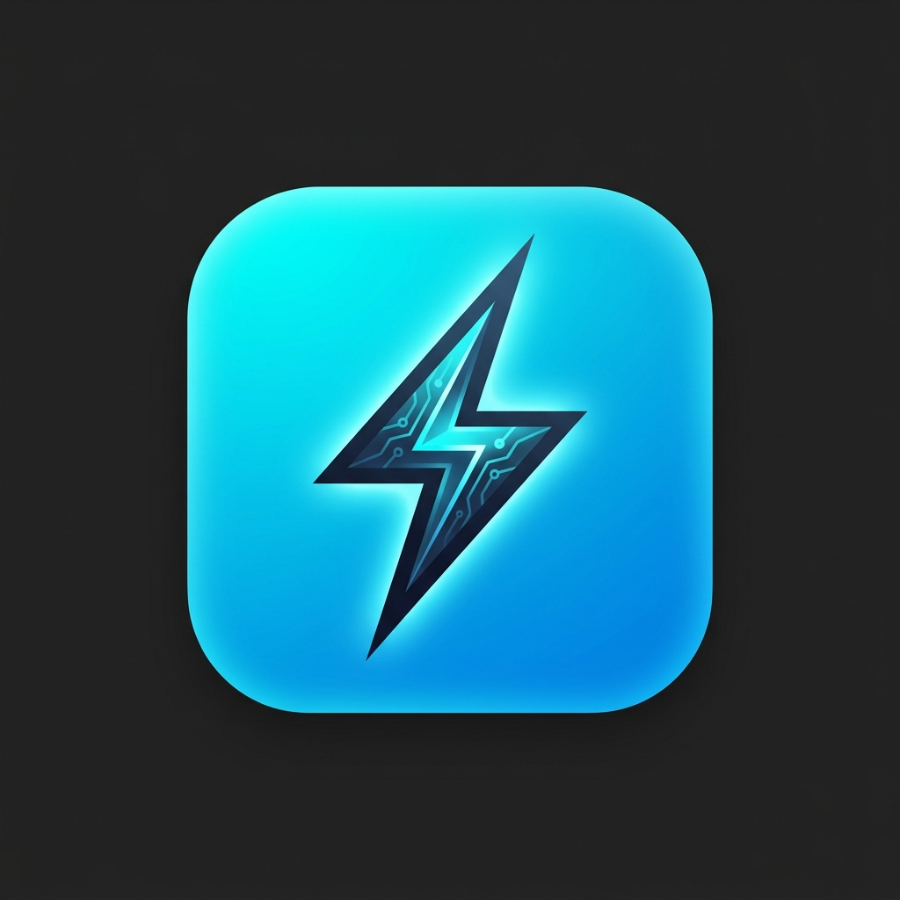
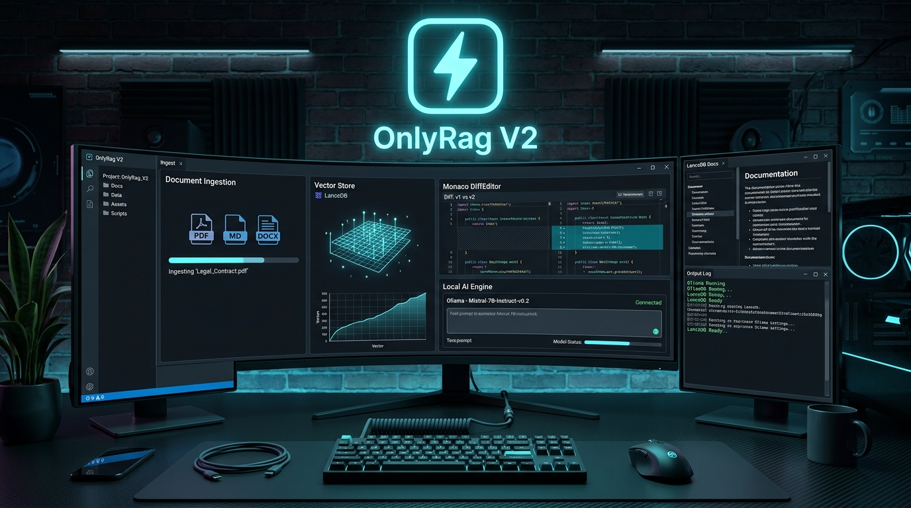
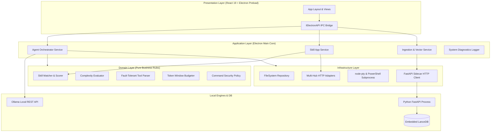

<div align="center">



# OnlyRag V2
### The Privacy-First, 100% Local AI Workspace & Autonomous Coding Agent

[](https://electronjs.org)
[](https://react.dev)
[](https://typescriptlang.org)
[](https://tailwindcss.com)
[](https://lancedb.com)
[](https://ollama.com)
[](https://vitest.dev)

<br />



<br />

**OnlyRag V2** is an enterprise-grade, privacy-first desktop application for Windows that brings state-of-the-art local AI capabilities directly to your hardware with **zero cloud dependencies**. From embedded vector database search (**LanceDB**) to document layout parsing (**PyMuPDF & Vision OCR**), document translation (**Monaco DiffEditor**), and an autonomous **Local AI Coding Agent Engine** with dynamic skill routing and auto-healing diagnostics.

</div>

---

## 🌟 Core Pillars

```
┌─────────────────────────────────────────────────────────────────────────────────────────┐
│                                     ONLYRAG V2 CORE                                     │
├───────────────────┬───────────────────┬───────────────────┬─────────────────────────────┤
│ 📚 INGESTION & OCR│ 💬 RAG & CHAT     │ 🌐 TRANSLATION    │ 🤖 AI CODING AGENT          │
│ • PyMuPDF Parsing │ • LanceDB Hybrid  │ • Monaco DiffView │ • Autonomous Tool Loop      │
│ • Vision LLM OCR  │ • Vector Sim + FTS│ • Real-time Stream│ • Search & Replace Multi    │
│ • Dual-Pane Monaco│ • Citation Scores │ • Lang Swap & Copy│ • Subprocess & Safe Terminal│
│ • Export PDF & MD │ • Context Guard   │ • Export PDF/DOCX │ • Auto-Healing Diagnostics  │
└───────────────────┴───────────────────┴───────────────────┴─────────────────────────────┘
```

---

## ✨ Features at a Glance

### 1. 📚 Document Ingestion, Layout Extraction & Vision OCR
- **High-Speed Extraction**: Parses PDF, DOCX, TXT, MD, CSV, JSON and images (PNG, JPG, WebP) natively.
- **Hybrid OCR Pipeline**: Combines PyMuPDF layout parsing with Vision OCR (`llama3.2-vision`) for high-fidelity text extraction from scans and diagrams.
- **Dual-Pane Synchronized Viewer**: Monaco Markdown editor alongside original source pages with synchronized scrolling, page jumps, zoom controls, and export to PDF/Markdown.
- **Live Search & Filter**: Real-time document filtering and instant status badge synchronization with LanceDB.

### 2. 💬 Local RAG & Contextual Chat
- **Embedded LanceDB Store**: Fast, serverless vector database operating locally from your AppData directory.
- **Hybrid Search**: Fuses dense vector embeddings (`nomic-embed-text`) with BM25/keyword Full-Text Search (FTS) for maximum retrieval accuracy.
- **Transparent Citations**: Every generated response includes verifiable LanceDB citation cards with relevance scores and 1-click clipboard copy.
- **Safety First**: Confirmation popovers prevent accidental loss of chat context.

### 3. 🌐 Structured Document Translation
- **Side-by-Side Diff Comparison**: Monaco `DiffEditor` mode renders source and translated text with real-time token streaming.
- **Bidirectional Language Swap**: Invert source and destination languages with a single click.
- **Multi-Format Export**: Export translated content into formatted PDF, Word (`.docx`), or clean Markdown (`.md`).

### 4. 🤖 Autonomous Local AI Coding Agent
- **Agentic Multi-Step Tool Loop**:
  - `read_file` (with line slicing), `list_dir`, `grep_search`.
  - `replace_file_content`, `multi_replace_file_content` (CRLF/LF resilient non-contiguous refactoring), `write_file`, `delete_file`.
  - `run_command` (PowerShell process execution with process tree kill guardrails), `inspect_os_env`.
- **Real-time Task Complexity Evaluator**: Dynamically gauges prompt complexity (`Low`, `Medium`, `High`, `Ultra`) and recommends the optimal local coding model (`qwen2.5-coder:1.5b` vs `7b` vs `14b`).
- **Operational Policy Modes**:
  - **Plan Mode**: Generates structured technical implementation blueprints.
  - **Ask Mode**: Read-only research runs autonomously; destructive actions require explicit user approval.
  - **Agent Mode**: Full multi-turn autonomous loop with auto-healing feedback on build/test errors.
- **Integrated PowerShell Session**: Dedicated terminal tab with output copying, log clearing, and live execution status.

### 5. 🧩 Skill Hub & Automated Skill Router
- **Multi-Marketplace Ecosystem**: Native interoperability with:
  - 🌐 **Skills.sh**: Open Agent Skill Directory (`skills.sh`).
  - 🧠 **Anthropic Agent Skills**: Open standard (`agentskills.io` / `github.com/anthropics/skills`).
  - 📦 **LobeHub Marketplace**: Plugin & tool registry (`chat-plugins.lobehub.com`).
  - ⚙️ **Custom Hubs**: Any remote JSON catalog or GitHub raw repository.
- **Contextual Skill Router (`skillMatcher.ts`)**: Evaluates user prompts against installed active skills, computing weighted relevance scores and injecting expert guidelines into the LLM context within token budgets.
- **SHA-256 Provenance Tracking**: Tracks modification integrity with distinct visual badges (🟢 *Hub Originale*, 🟠 *Modificata*, 🔵 *Locale Personalizzata*) and 1-click restore.

### 6. 🚀 Hardware Wizard & Diagnostics
- **Auto-Detection**: Scans NVIDIA GPUs, CUDA VRAM availability, and system memory to configure optimal concurrency and context limits.
- **Global Accessible Toast System**: Instant visual feedback for file operations, clipboard transfers, indexing, and background tasks.

---

## 🏗️ Layered Architecture

OnlyRag V2 follows strict **Clean Architecture / Layered Architecture** standards:



---

## ⚡ Quick Start

### Prerequisites
- **OS**: Windows 10/11 (64-bit)
- **Node.js**: v18.0.0 or later
- **Python**: 3.10 or later
- **Ollama**: Installed and running on `http://127.0.0.1:11434`

### Installation & Setup

```powershell
# 1. Clone the repository
git clone https://github.com/your-username/OnlyRagV2.git
cd OnlyRagV2

# 2. Install Node.js dependencies
npm install

# 3. Install Python Sidecar dependencies
pip install -r sidecar/requirements.txt

# 4. Start in development mode (Vite + Electron)
npm run dev
```

---

## 📜 Available Scripts

| Command | Description |
|---|---|
| `npm run dev` | Starts Vite Dev Server and launches Electron with live reload |
| `npm run typecheck` | Validates TypeScript types across the entire codebase (`tsc --noEmit`) |
| `npm run test` | Executes Vitest test suite sequentially (`113+ tests`) |
| `npm run test:fast` | Runs Vitest in agent fast mode with summarized dot reporter |
| `npm run test:unit-only` | Runs core domain and application unit tests exclusively |
| `npm run test:sidecar` | Executes Python Pytest suite against FastAPI sidecar endpoints |
| `npm run lint` | Runs TypeScript and Python linters with fail-fast PowerShell script |
| `npm run build` | Builds frontend bundle, compiles Electron main/preload, and packages NSIS installer |
| `npm run clean` | Cleans build artifacts and repository cache (`scripts/clean_workspace.ps1`) |
| `npm run clean:full` | Full reset: cleans repo cache and user LanceDB storage in AppData |
| `npm run package:win` | Packages Windows NSIS installer setup binary (`scripts/build_package.ps1`) |

---

## 📂 Repository Structure

```text
OnlyRagV2/
├── assets/                    # Brand assets, logo, and showcase banners
├── electron/                  # Electron Main Process (Clean Layered Architecture)
│   ├── core/
│   │   ├── application/       # Orchestrator, SkillAppService, ToolExecutor
│   │   ├── domain/            # SkillMatcher, ToolParser, ComplexityEvaluator
│   │   ├── infrastructure/    # FileSystemRepo, WebClient, Hub Adapters
│   │   └── presentation/      # IPC Handlers and Typed Channels
│   ├── main.ts                # App Lifecycle & Sidecar Process Supervisor
│   └── preload.ts             # Context Isolation & Typed Bridge (IElectronAPI)
├── sidecar/                   # FastAPI Python Sidecar & Vector Engine
│   ├── main.py                # Ingestion, Vision OCR, LanceDB & Export Endpoints
│   ├── requirements.txt       # PyMuPDF, LanceDB, FastAPI, Uvicorn dependencies
│   └── tests/                 # Sidecar Health & API Pytest suite
├── src/                       # React 19 Frontend Application
│   ├── components/
│   │   ├── chat/              # RAG Chat View & Citation Cards
│   │   ├── coding/            # AI Coding Agent, Monaco Editor & Terminal
│   │   ├── common/            # Toast System, Error Boundary, Hardware Wizard
│   │   ├── diagnostics/       # Logs Drawer & Hardware Telemetry
│   │   ├── ingestion/         # Document List, Page Preview, Vector Search
│   │   ├── layout/            # Sidebar Navigation & App Shell
│   │   ├── settings/          # Model Assignments & Concurrency Config
│   │   └── translation/       # Monaco DiffEditor & Multi-Format Export
│   ├── hooks/                 # Custom React Hooks (useCodingAgent, useIngestion, etc.)
│   ├── lib/                   # Diagnostic Logger & UI utilities
│   ├── types/                 # Strict TypeScript Type Definitions
│   └── index.css              # Design System Tokens & Tailwind CSS v4 setup
├── scripts/                   # PowerShell Fail-Fast Automation Scripts
├── skills/                    # Project Skills & Agent Guidelines (SKILL.md)
├── AGENTS.md                  # Project Governance, Serial Execution & Rules
└── PROJECT_STATUS.json        # Active Task Scheduler
```

---

## 🔒 Security & Privacy Guarantees

- **100% Offline Capable**: Zero telemetry, zero external tracking, zero data transmission outside your machine.
- **Local Data Confinement**: Vector embeddings, document chunks, and models remain stored on local disk (`%LOCALAPPDATA%/OnlyRagV2`).
- **Sandboxed Agent Operations**: Command execution is subject to safety guardrails, blocking destructive actions (`git reset --hard`, `git clean`, raw disk operations) and containing filesystem actions inside workspace boundaries.

---

## 📄 License

This project is open source and available under the **MIT License**.
