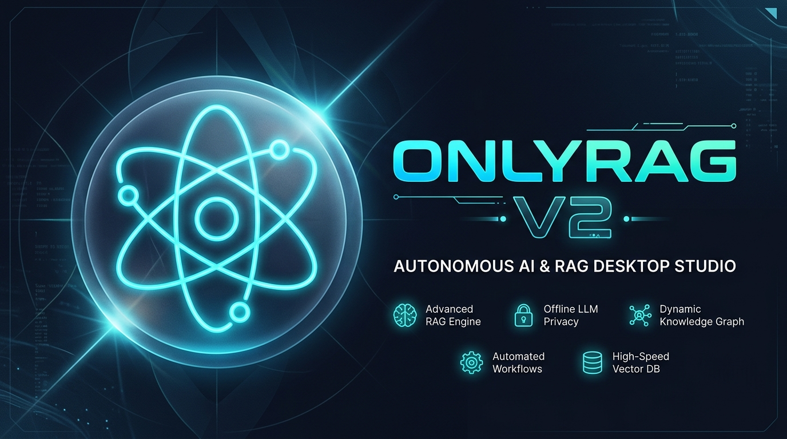

<div align="center">


# OnlyRag V2
### The Privacy-First, 100% Local AI Workspace & Autonomous Coding Studio

[](https://electronjs.org)
[](https://react.dev)
[](https://typescriptlang.org)
[](https://tailwindcss.com)
[](https://lancedb.com)
[](https://ollama.com)
[](https://vitest.dev)
[](LICENSE)

<br />



<br />

**OnlyRag V2** is an enterprise-grade desktop application for Windows that delivers cutting-edge local AI capabilities to your machine with **zero cloud dependencies** and **100% local privacy**. Powered by embedded vector search (**LanceDB**), document parsing (**PyMuPDF & Vision OCR**), document translation (**Monaco DiffEditor**), and an autonomous **Local AI Coding Agent Engine** with dynamic skill routing, loop prevention, and auto-healing diagnostics.

</div>

---

## 📚 Official Documentation (Single Source of Truth)

All architectural, operational, API and setup specifications reside in the canonical **[`documentation index`](./docs/README.md)**, which maps each topic to one authoritative page:

- 🏛️ **Architecture, modules, APIs, setup, live QA, observability and dependency references:** see [`docs/README.md`](./docs/README.md).

---

## 🌟 Core Modules

```text
┌────────────────────────────────────────────────────────────────────────────────────────┐
│                                    ONLYRAG V2 SUITE                                    │
├──────────────────┬──────────────────┬──────────────────┬───────────────────────────────┤
│ 📚 INGESTION/OCR │ 💬 RAG & CHAT    │ 🌐 TRANSLATION   │ 🤖 AI CODING AGENT            │
│ • PyMuPDF Engine │ • LanceDB Hybrid │ • Monaco DiffView│ • Autonomous Tool Loop        │
│ • Vision LLM OCR │ • Vector Sim+FTS │ • Realtime Stream│ • Non-Contiguous File Patching│
│ • Dual-Pane View │ • Citation Cards │ • Lang Inversion │ • Process Guard & Safe Shell  │
│ • PDF/MD Export  │ • Context Guard  │ • Multi-Format   │ • Auto-Healing Diagnostics    │
└──────────────────┴──────────────────┴──────────────────┴───────────────────────────────┘
```

---

## ✨ Features

### 1. 📚 Document Ingestion & Vision OCR
* **Universal Parsing**: Ingests PDF, DOCX, TXT, MD, CSV, JSON and images (PNG, JPG, WebP) natively.
* **Hybrid OCR Pipeline**: Combines high-speed PyMuPDF text extraction with local Vision LLM OCR (`llama3.2-vision`) for scans, charts, and complex page layouts.
* **Dual-Pane Synchronized Review**: Side-by-side Monaco Markdown editor and original document page viewer with synchronized scrolling, zoom controls, and export to PDF/Markdown.

### 2. 💬 Local RAG & Contextual Chat
* **Embedded LanceDB Engine**: Zero-configuration, serverless vector database operating locally from your AppData directory.
* **Hybrid Retrieval**: Fuses dense vector embeddings (`nomic-embed-text`) with keyword Full-Text Search (FTS) for optimal retrieval precision.
* **Verifiable Citation Cards**: Every AI answer includes source snippet references with relevance scores and 1-click clipboard copying.

### 3. 🌐 Structured Document Translation
* **Side-by-Side Diff View**: Monaco `DiffEditor` mode renders source and translated text with real-time streaming tokens.
* **1-Click Language Swap**: Instantly invert source and target languages.
* **Multi-Format Compilation**: Export translated documents directly into formatted PDF, Word (`.docx`), or Markdown (`.md`).

### 4. 🤖 Autonomous AI Coding Agent Studio
* **Multi-Step Tool Execution**: Autonomous inspection (`read_file`, `list_dir`, `grep_search`), precise multi-chunk modification (`replace_file_content`, `multi_replace_file_content`), and sandboxed PowerShell execution (`run_command`).
* **Dynamic Policy Modes**:
  * **Plan Mode**: Generates technical implementation blueprints before executing changes.
  * **Ask Mode**: Read-only research runs autonomously; destructive actions require explicit user approval.
  * **Agent Mode**: Fully autonomous multi-turn development loop with auto-healing feedback on test/build errors.
* **Single Configured Model**: Every module, coding included, runs on one model chosen in Settings, with exact installed Ollama tag resolution and an optional fallback used only on OOM or crash.

### 5. 🧩 Multi-Marketplace Skill Hub
* **Open Standard Interoperability**: Seamless integration with **Skills.sh**, **Anthropic Agent Skills** (`agentskills.io`), and **LobeHub Marketplace**.
* **Contextual Skill Router (`skillMatcher.ts`)**: Evaluates user prompts against installed skills and injects expert guidelines into the LLM context within token budgets.
* **SHA-256 Provenance Tracking**: Validates skill integrity with visual status badges (🟢 *Hub Original*, 🟠 *Modified*, 🔵 *Custom Local*) and 1-click restore.

### 6. 🌐 Multilingual (i18n) Architecture
* Built-in support for **Italian 🇮🇹** and **English 🇬🇧** with instant UI switching and persistence.

---

## 🏗️ Architecture

OnlyRag V2 is built with strict **Clean Layered Architecture**:

```mermaid
graph TD
    subgraph Presentation_Layer["Presentation Layer (React 19 + Electron Preload)"]
        UI[App Layout & Views]
        Bridge[IElectronAPI IPC Bridge]
    end

    subgraph Application_Layer["Application Layer (Electron Main Core)"]
        Orchestrator[Agent Orchestrator Service]
        SkillService[Skill App Service]
        IngestionService[Ingestion & Vector Service]
        DiagnosticsService[System Diagnostics Logger]
    end

    subgraph Domain_Layer["Domain Layer (Pure Business Rules)"]
        SkillMatcher[Skill Matcher & Scorer]
        Complexity[Complexity Evaluator]
        ToolParser[Fault-Tolerant Tool Parser]
        Budget[Token Window Budgeter]
        Security[Command Security Policy]
    end

    subgraph Infrastructure_Layer["Infrastructure Layer"]
        FS[FileSystem Repository]
        HubAdapters[Multi-Hub HTTP Adapters]
        Terminal[node-pty & PowerShell Subprocess]
        SidecarClient[FastAPI Sidecar HTTP Client]
    end

    subgraph Local_Engines["Local Engines & DB"]
        Sidecar[Python FastAPI Process]
        LanceDB[(Embedded LanceDB)]
        Ollama[Ollama Local REST API]
    end

    UI --> Bridge
    Bridge --> Orchestrator
    Bridge --> SkillService
    Bridge --> IngestionService
    Orchestrator --> Domain_Layer
    SkillService --> SkillMatcher
    Orchestrator --> Infrastructure_Layer
    SkillService --> HubAdapters
    IngestionService --> SidecarClient
    SidecarClient --> Sidecar
    Sidecar --> LanceDB
    Orchestrator --> Ollama
```



---

## ⚡ Quick Start

### Prerequisites
* **OS**: Windows 10 / 11 (64-bit)
* **Node.js**: 24.19.x LTS, within the range declared in `package.json`
* **Python**: 3.12.10
* **Ollama**: Installed and running locally (`http://127.0.0.1:11434`)

### Installation & Run

```powershell
# 1. Clone the repository
git clone https://github.com/dennidalpos/OnlyRagV2.git
cd OnlyRagV2

# 2. Prepare the Node.js and Python development environments
npm run setup:dev

# 4. Start in development mode (Vite + Electron)
npm run dev
```

---

## 📜 Available Scripts

| Script | Description |
|---|---|
| `npm run dev` | Starts Vite Dev Server and launches Electron with hot module replacement |
| `npm run setup:dev` | Checks Node.js/Python versions, installs npm dependencies, and prepares `.venv` from the repository root |
| `npm run typecheck` | Validates TypeScript types across the codebase (`tsc --noEmit`) |
| `npm run test` | Executes full Vitest unit and integration test suite |
| `npm run test:fast` | Runs Vitest in summarized fast mode with dot reporter |
| `npm run test:sidecar` | Runs Python Pytest suite against FastAPI sidecar endpoints |
| `npm run lint` | Runs the serial repository gate: JSON, TypeScript, Python syntax, Vitest, and bundle smoke test |
| `npm run clean` | Removes only regenerable build artifacts and repository caches (`scripts/clean_repo.ps1`); tracked files, dependencies, logs and user data are preserved |
| `npm run clean:logs` | Removes application logs; use `-StopAppProcesses` only when the local app must be stopped first |
| `npm run clean:full` | Full reset: cleans repo cache and user LanceDB storage in AppData |
| `npm run package:win` | Packages Windows NSIS installer setup binary (`scripts/build_package.ps1`) |

---

## 📂 Repository Structure

```text
OnlyRagV2/
├── assets/                    # Brand identity, vector icons, and showcase graphics
├── docs/                      # Single Source of Truth Documentation (Architecture, Modules, API, Setup)
├── electron/                  # Electron Main Process (Clean Layered Architecture)
│   ├── core/
│   │   ├── application/       # Orchestrator, SkillAppService, ToolExecutor
│   │   ├── domain/            # SkillMatcher, ToolParser, PromptAssembler
│   │   ├── infrastructure/    # FileSystemRepo, WebClient, Hub Adapters
│   │   └── presentation/      # IPC Handlers and Typed Channels
│   ├── main.ts                # App Lifecycle & Sidecar Process Supervisor
│   └── preload.ts             # Context Isolation & Typed Bridge (IElectronAPI)
├── public/                    # Static assets bundle (favicon, logos, icons)
├── sidecar/                   # FastAPI Python Sidecar & Vector Engine
│   ├── main.py                # Ingestion, Vision OCR, LanceDB & Export Endpoints
│   ├── requirements.txt       # PyMuPDF, LanceDB, FastAPI, Uvicorn dependencies
│   └── tests/                 # Sidecar Health & API Pytest suite
├── src/                       # React 19 Frontend Application
│   ├── components/
│   │   ├── chat/              # RAG Chat View & Citation Cards
│   │   ├── coding/            # AI Coding Agent, Monaco Editor & Terminal
│   │   ├── common/            # OnlyRagLogo, AboutModal, Toast, Hardware Wizard
│   │   ├── diagnostics/       # Logs Drawer & Hardware Telemetry
│   │   ├── ingestion/         # Document List, Page Preview, Vector Search
│   │   ├── layout/            # Sidebar Navigation & App Shell
│   │   ├── settings/          # Model Assignments & Concurrency Config
│   │   └── translation/       # Monaco DiffEditor & Multi-Format Export
│   ├── hooks/                 # Custom React Hooks (useCodingAgent, useIngestion, etc.)
│   ├── i18n/                  # Typed Internationalization (Italian & English)
│   ├── lib/                   # Diagnostic Logger & UI utilities
│   ├── types/                 # Strict TypeScript Type Definitions
│   └── index.css              # Design System Tokens & Tailwind CSS v4
├── scripts/                   # PowerShell Automation Scripts
├── skills/                    # Domain Expert Skills & Agent Guidelines (SKILL.md)
├── AGENTS.md                  # Project Governance, Serial Execution & Rules
└── PROJECT_STATUS.json        # Active Task Scheduler
```

---

## 👤 Author & Credits

* **Author**: Danny Perondi
* **GitHub**: [@dennidalpos](https://github.com/dennidalpos)
* **Repository**: [https://github.com/dennidalpos/OnlyRagV2](https://github.com/dennidalpos/OnlyRagV2)

---

## 📄 License

This project is open-source and licensed under the MIT license.
