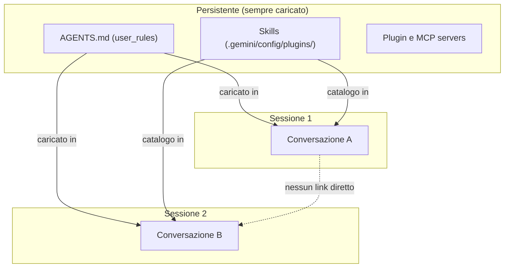
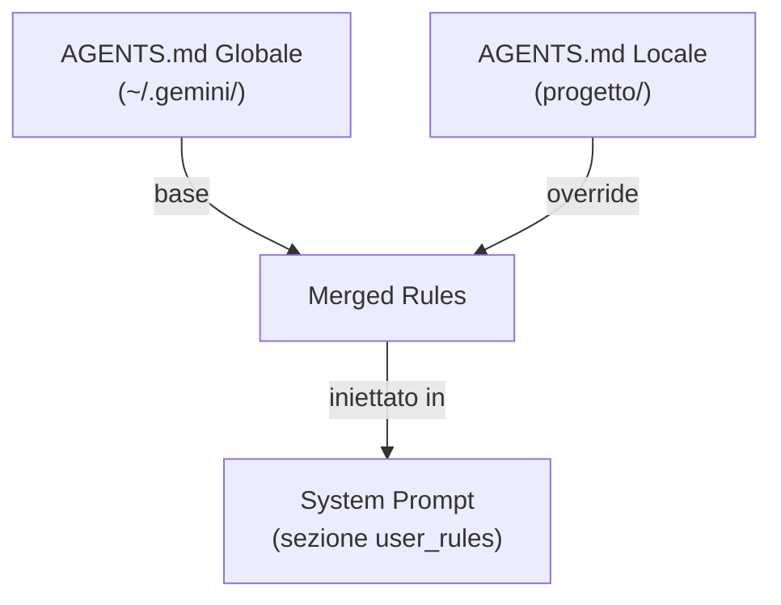
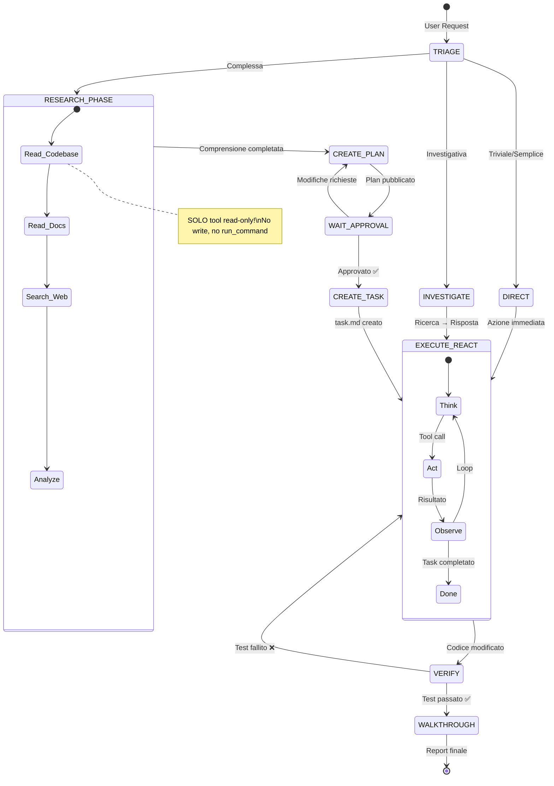
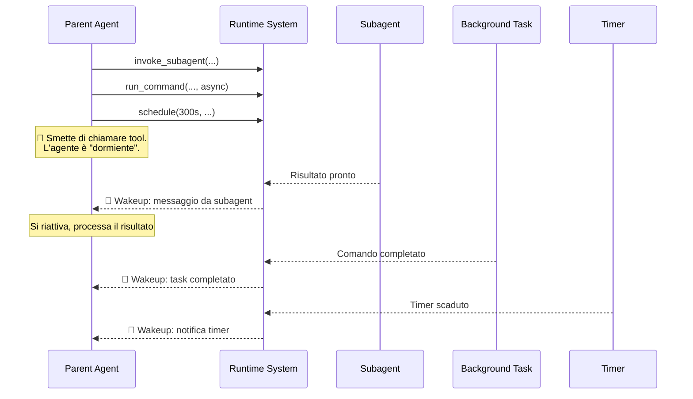
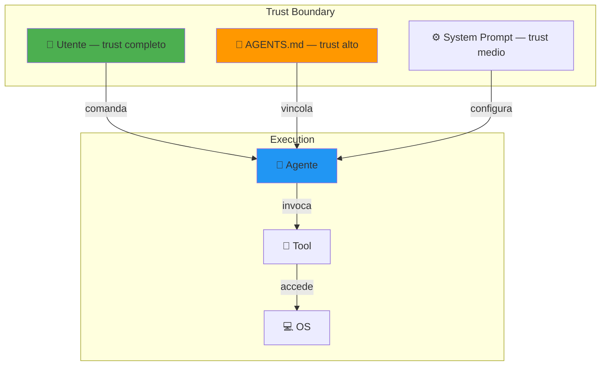
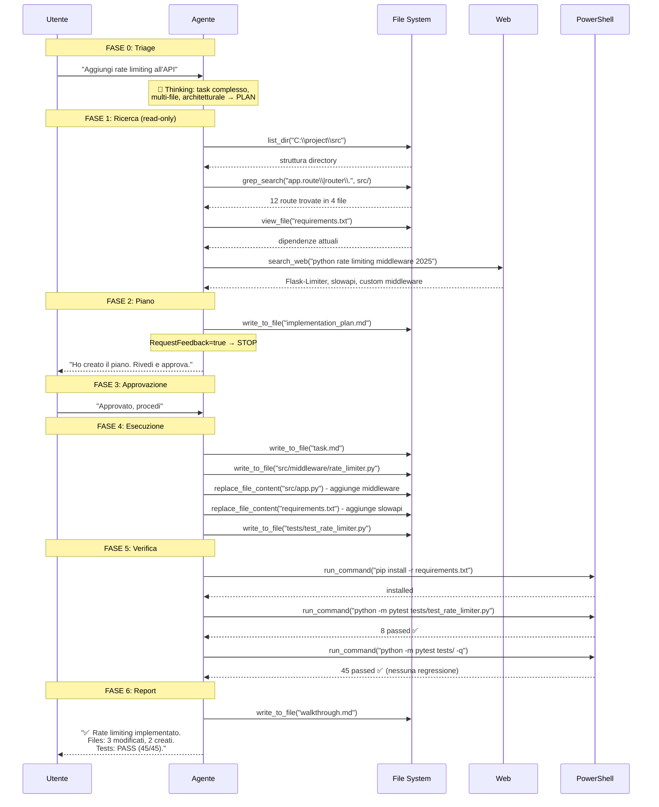

# Mappa Completa dell'Architettura Agentica — Google Antigravity

> Versione esaustiva. Ogni componente, ogni parametro, ogni decisione interna documentata con esempi di codice.

---

# PARTE I — FONDAMENTI

---

## 1. Il Modello Mentale: Thinking + ReAct

### 1.1 Il processo di ragionamento interno

Il backbone è **Claude Opus 4.6 (Thinking)** — un modello con **chain-of-thought esplicito**. Prima di ogni risposta o tool call, il modello genera un blocco di pensiero interno (`<thinking>`) che l'utente **non vede**:

```
┌─────────────────────────────────────────┐
│  Input utente: "Aggiungi logging al     │
│  modulo auth"                           │
└────────────────┬────────────────────────┘
                 ▼
┌─────────────────────────────────────────┐
│  <thinking>                             │
│  L'utente vuole logging nel modulo      │
│  auth. Devo:                            │
│  1. Trovare il modulo auth              │
│  2. Capire che logger usa il progetto   │
│  3. Aggiungere log nei punti critici    │
│  4. Non toccare la logica esistente     │
│                                         │
│  Inizio cercando file con "auth" nel    │
│  nome...                                │
│  </thinking>                            │
└────────────────┬────────────────────────┘
                 ▼
┌─────────────────────────────────────────┐
│  Tool call: find_by_name("*auth*")      │
└─────────────────────────────────────────┘
```

Questo thinking avviene **ad ogni turno del loop** — non solo al primo. Il modello ri-ragiona dopo ogni osservazione.

### 1.2 Il ciclo ReAct completo

```python
# Pseudocodice del ciclo di esecuzione dell'agente
def agent_loop(user_request, system_prompt, tools):
    context = [system_prompt, user_request]
    
    while True:
        # FASE 1: Ragionamento interno (thinking)
        thinking = llm.think(context)  # blocco <thinking> invisibile
        
        # FASE 2: Decisione — rispondere o agire?
        decision = llm.decide(context, thinking)
        
        if decision.type == "final_response":
            # Il modello ha abbastanza informazioni → risponde
            return decision.text
        
        elif decision.type == "tool_calls":
            # FASE 3: Esecuzione tool (possono essere multipli in parallelo)
            results = []
            for call in decision.tool_calls:
                result = execute_tool(call.name, call.params)
                results.append(result)
            
            # FASE 4: Osservazione — i risultati entrano nel contesto
            context.append({"tool_results": results})
            
            # Il loop continua: torna a FASE 1 con nuovo contesto
```

### 1.3 Quanti cicli in un singolo turno utente?

Non c'è un limite fisso di tool call per turno. Un singolo messaggio utente può generare **decine di cicli ReAct**:

```
Utente: "Refactora il modulo database per usare connection pooling"

Ciclo 1:  find_by_name("*database*", "*db*")           → trova 4 file
Ciclo 2:  view_file("db/connection.py")                 → legge il codice
          view_file("db/queries.py")                    → legge in parallelo
          view_file("db/models.py")                     → legge in parallelo
Ciclo 3:  grep_search("import", "db/")                 → trova dipendenze
Ciclo 4:  search_web("python connection pool sqlalchemy")→ best practice
Ciclo 5:  replace_file_content("db/connection.py", ...) → modifica 1
Ciclo 6:  replace_file_content("db/connection.py", ...) → modifica 2
Ciclo 7:  replace_file_content("db/queries.py", ...)    → adatta usage
Ciclo 8:  run_command("python -m pytest tests/db/")     → test
Ciclo 9:  view_file("tests/db/test_connection.py")      → legge test fallito
Ciclo 10: replace_file_content("tests/db/...", ...)     → fix test
Ciclo 11: run_command("python -m pytest tests/db/")     → re-test → PASS
Ciclo 12: risposta finale all'utente
```

### 1.4 Parallelismo nelle tool call

Il modello decide in autonomia se le chiamate sono indipendenti:

```python
# ✅ PARALLELO — nessuna dipendenza tra le chiamate
# Il modello le emette tutte nello stesso blocco
tool_calls = [
    view_file("src/auth/login.py"),      # indipendente
    view_file("src/auth/register.py"),    # indipendente
    view_file("src/auth/middleware.py"),  # indipendente
    grep_search("JWT_SECRET", "src/"),   # indipendente
]

# ❌ SEQUENZIALE — il risultato della prima serve alla seconda
result = grep_search("class UserModel", "src/")
# ... attendo risultato ...
file_path = result[0].filename  # dipende dal risultato precedente
content = view_file(file_path)   # ora posso chiamare
```

---

## 2. Context Window e Gestione della Memoria

### 2.1 Working Memory (Memoria di Lavoro)

La context window è la **RAM** dell'agente. Contiene tutto ciò che il modello "vede" in un dato momento:

```
┌──────────────────────────────────────────┐
│              CONTEXT WINDOW              │
├──────────────────────────────────────────┤
│ 1. System Prompt (fisso, sempre in testa)│
│    - identity                            │
│    - user_information                    │
│    - user_rules                          │
│    - skills catalog                      │
│    - subagents config                    │
│    - messaging config                    │
│    - artifacts config                    │
│    - planning_mode                       │
│    - guidelines                          │
│    - communication_style                 │
│                                          │
│ 2. Cronologia conversazione              │
│    - Messaggio utente 1                  │
│    - Risposta agente 1 + tool calls      │
│    - Messaggio utente 2                  │
│    - Risposta agente 2 + tool calls      │
│    - ...                                 │
│    - Messaggio utente N (corrente)       │
│                                          │
│ 3. Messaggi da subagent/task (se presenti)│
│                                          │
│ 4. Metadata addizionali                  │
│    - Ora locale                          │
│    - Settings utente modificati          │
└──────────────────────────────────────────┘
```

### 2.2 Troncamento del contesto

Quando la conversazione diventa troppo lunga, i **turni più vecchi vengono troncati** (rimossi dall'inizio):

```
Prima del troncamento:
  [System Prompt] [Turno 1] [Turno 2] [Turno 3] [Turno 4] [Turno 5]

Dopo il troncamento:
  [System Prompt] [Turno 3*] [Turno 4] [Turno 5]
                     ↑ potrebbe essere parziale
```

> [!IMPORTANT]
> Il system prompt **non viene MAI troncato**. È sempre presente per intero. Solo la cronologia della conversazione viene compressa.

### 2.3 Transcript Recovery — Recupero memoria persa

Quando il contesto viene troncato, posso **recuperare** la storia leggendo i transcript su disco:

```
C:\Users\Utente\.gemini\antigravity\brain\
  └── 969d0843-4a96-44c6-85f7-5fa8856c69b0\
      └── .system_generated\
          └── logs\
              ├── transcript.jsonl        ← versione compatta (troncata)
              └── transcript_full.jsonl   ← versione completa
```

**Formato JSONL** — ogni riga è un passo della conversazione:

```json
{"step_index": 0, "source": "USER_EXPLICIT", "type": "USER_INPUT", "status": "DONE", "content": "Aggiungi validazione email al form"}
{"step_index": 1, "source": "MODEL", "type": "PLANNER_RESPONSE", "status": "DONE", "content": "Cerco il form...", "tool_calls": [{"name": "grep_search", "args": {"Query": "email", "SearchPath": "C:\\project"}}]}
{"step_index": 2, "source": "SYSTEM", "type": "TOOL_RESPONSE", "status": "DONE", "content": "[{\"Filename\": \"Form.tsx\", ...}]"}
```

**Esempio di recovery**:
```powershell
# Trova tutti i messaggi dell'utente nella conversazione
Select-String -Path "transcript.jsonl" -Pattern '"type":"USER_INPUT"'

# Vedi i primi 10 passi
Get-Content "transcript.jsonl" | Select-Object -First 10

# Cerca una specifica tool call
Select-String -Path "transcript.jsonl" -Pattern "invoke_subagent"
```

### 2.4 Memoria esternalizzata (Artifacts come memoria)

Gli artifact fungono da **memoria strutturata esterna** che sopravvive al troncamento del contesto:

```python
# Pseudocodice: come gli artifact estendono la memoria
class ExternalMemory:
    """Artifact come estensione della working memory."""
    
    implementation_plan = "implementation_plan.md"  # cosa devo fare
    task_list = "task.md"                           # dove sono arrivato
    walkthrough = "walkthrough.md"                  # cosa ho fatto
    
    def recover_state(self):
        """Se il contesto è stato troncato, recupero lo stato dal disco."""
        plan = view_file(self.implementation_plan)   # ri-leggo il piano
        tasks = view_file(self.task_list)             # ri-leggo il progresso
        return plan, tasks
```

### 2.5 Memoria a lungo termine (Cross-session)



> [!NOTE]
> Non ho memoria episodica tra sessioni. Ogni conversazione è isolata. L'unica "memoria" cross-session sono le regole in `AGENTS.md` e le skill installate, che vengono caricate nel system prompt di ogni nuova conversazione.

---

# PARTE II — I 16 TOOL IN DETTAGLIO

---

## 3. Tool di Lettura File System

### 3.1 `view_file` — Leggere file

**Scopo**: Leggere il contenuto di qualsiasi file dal file system locale.

**Parametri completi**:
| Parametro | Tipo | Obbligatorio | Descrizione |
|---|---|---|---|
| `AbsolutePath` | string | ✅ | Path assoluto al file |
| `StartLine` | int | ❌ | Riga iniziale (1-indexed, inclusiva) |
| `EndLine` | int | ❌ | Riga finale (1-indexed, inclusiva) |
| `ContentOffset` | int | ❌ | Offset in byte per contenuto troncato |
| `IsSkillFile` | bool | ❌ | `true` solo quando leggo un SKILL.md per eseguirne le istruzioni |

**Limiti**:
- Max **800 righe** per chiamata
- Max **46.080 byte** per chiamata
- Supporta file binari: immagini, video (restituisce il file intero)

**Combinazioni di parametri**:

```python
# Caso 1: Leggi tutto il file (o le prime 800 righe)
view_file("C:\\project\\src\\main.py")

# Caso 2: Leggi dalla riga 100 in poi (max 800 righe)
view_file("C:\\project\\src\\main.py", StartLine=100)

# Caso 3: Leggi fino alla riga 50
view_file("C:\\project\\src\\main.py", EndLine=50)

# Caso 4: Leggi un range preciso
view_file("C:\\project\\src\\main.py", StartLine=42, EndLine=67)

# Caso 5: Contenuto troncato → uso offset per continuare
view_file("C:\\project\\big_file.log", ContentOffset=46080)

# Caso 6: Leggere una skill per eseguirla
view_file("C:\\Users\\Utente\\.gemini\\config\\plugins\\chrome-devtools-plugin\\skills\\chrome-devtools\\SKILL.md", IsSkillFile=True)

# Caso 7: Leggere un'immagine (nessun parametro di riga)
view_file("C:\\project\\assets\\logo.png")
```

**Esempio reale di tool call JSON**:
```json
{
  "name": "view_file",
  "parameters": {
    "AbsolutePath": "C:\\Users\\Utente\\project\\src\\auth\\login.py",
    "StartLine": 1,
    "EndLine": 50,
    "toolSummary": "Auth login code",
    "toolAction": "Reading login module"
  }
}
```

---

### 3.2 `list_dir` — Esplorare directory

**Scopo**: Elencare tutti i figli diretti (file e sottodirectory) di una directory.

**Parametri**:
| Parametro | Tipo | Obbligatorio | Descrizione |
|---|---|---|---|
| `DirectoryPath` | string | ✅ | Path assoluto alla directory |

**Output** — per ogni elemento:
- Path relativo alla directory
- Tipo: `file` o `directory`
- Dimensione in byte (se file)
- Conteggio figli ricorsivo (se directory, può mancare in workspace grandi)

```json
{
  "name": "list_dir",
  "parameters": {
    "DirectoryPath": "C:\\Users\\Utente\\project",
    "toolSummary": "Project structure",
    "toolAction": "Listing project root"
  }
}
```

**Output tipico**:
```
src/          directory    (12 children)
tests/        directory    (8 children)
package.json  file         1247 bytes
tsconfig.json file         523 bytes
README.md     file         3891 bytes
.gitignore    file         198 bytes
```

**Quando lo uso vs `find_by_name`**:
```python
# list_dir → per capire la STRUTTURA top-level
list_dir("C:\\project")
# Output: src/, tests/, package.json, ...

# find_by_name → per CERCARE file specifici ricorsivamente
find_by_name("*.test.ts", "C:\\project")
# Output: tutti i file .test.ts nell'intero albero
```

---

### 3.3 `find_by_name` — Cercare file per nome

**Scopo**: Cercare file/directory per nome usando pattern glob. Wrapper su **fd** (Rust binary).

**Parametri completi**:
| Parametro | Tipo | Obbligatorio | Descrizione |
|---|---|---|---|
| `SearchDirectory` | string | ✅ | Directory di partenza |
| `Pattern` | string | ✅ | Pattern glob da cercare |
| `Type` | enum | ❌ | `file`, `directory`, `any` |
| `Extensions` | string[] | ❌ | Estensioni da includere (senza `.`) |
| `MaxDepth` | int | ❌ | Profondità massima di ricerca |
| `Excludes` | string[] | ❌ | Pattern glob da escludere |
| `FullPath` | bool | ❌ | Se il path completo deve matchare (default: solo il filename) |

**Limiti**: Max **50 risultati**. Rispetta `.gitignore`. Smart case.

```json
// Esempio 1: Trova tutti i file Python
{
  "name": "find_by_name",
  "parameters": {
    "SearchDirectory": "C:\\project",
    "Pattern": "*.py",
    "Type": "file",
    "toolSummary": "Python files",
    "toolAction": "Finding Python files"
  }
}

// Esempio 2: Trova directory di test, escludendo node_modules
{
  "name": "find_by_name",
  "parameters": {
    "SearchDirectory": "C:\\project",
    "Pattern": "*test*",
    "Type": "directory",
    "Excludes": ["node_modules", ".git", "dist"],
    "toolSummary": "Test directories",
    "toolAction": "Finding test dirs"
  }
}

// Esempio 3: Trova file config solo al primo livello
{
  "name": "find_by_name",
  "parameters": {
    "SearchDirectory": "C:\\project",
    "Pattern": "*config*",
    "MaxDepth": 1,
    "Extensions": ["json", "yaml", "toml"],
    "toolSummary": "Config files",
    "toolAction": "Finding config files"
  }
}

// Esempio 4: FullPath mode — matcha sull'intero percorso
{
  "name": "find_by_name",
  "parameters": {
    "SearchDirectory": "C:\\project",
    "Pattern": "**/components/**/*.tsx",
    "FullPath": true,
    "toolSummary": "React components",
    "toolAction": "Finding components"
  }
}
```

---

### 3.4 `grep_search` — Cercare contenuto nei file

**Scopo**: Cercare pattern testuale/regex nel contenuto dei file. Wrapper su **ripgrep** (Rust binary).

**Parametri completi**:
| Parametro | Tipo | Obbligatorio | Descrizione |
|---|---|---|---|
| `SearchPath` | string | ✅ | Path assoluto (file o directory) |
| `Query` | string | ✅ | Termine di ricerca o regex |
| `MatchPerLine` | bool | ❌ | `true` = mostra ogni riga con match + numero riga. `false` = solo nomi file |
| `IsRegex` | bool | ❌ | `true` = tratta Query come regex |
| `CaseInsensitive` | bool | ❌ | `true` = ignora case |
| `Includes` | string[] | ❌ | Glob per filtrare file (es. `"*.py"`, `"!**/vendor/*"`) |

**Limiti**: Max **50 match**. Ignora file in `.gitignore`.

```json
// Esempio 1: Ricerca letterale con contesto di riga
{
  "name": "grep_search",
  "parameters": {
    "SearchPath": "C:\\project\\src",
    "Query": "TODO",
    "MatchPerLine": true,
    "toolSummary": "TODO comments",
    "toolAction": "Finding TODOs"
  }
}
// Output: [
//   {"Filename": "auth.py", "LineNumber": 42, "LineContent": "    # TODO: add rate limiting"},
//   {"Filename": "db.py", "LineNumber": 89, "LineContent": "    # TODO: connection pooling"}
// ]

// Esempio 2: Solo nomi file che contengono il pattern
{
  "name": "grep_search",
  "parameters": {
    "SearchPath": "C:\\project",
    "Query": "class UserModel",
    "MatchPerLine": false,
    "toolSummary": "UserModel definition",
    "toolAction": "Finding UserModel"
  }
}
// Output: [{"Filename": "src/models/user.py"}]

// Esempio 3: Regex per trovare import specifici
{
  "name": "grep_search",
  "parameters": {
    "SearchPath": "C:\\project\\src",
    "Query": "from\\s+\\.\\w+\\s+import",
    "IsRegex": true,
    "MatchPerLine": true,
    "Includes": ["*.py"],
    "toolSummary": "Relative imports",
    "toolAction": "Finding relative imports"
  }
}

// Esempio 4: Ricerca case-insensitive solo in file TypeScript
{
  "name": "grep_search",
  "parameters": {
    "SearchPath": "C:\\project",
    "Query": "apikey",
    "CaseInsensitive": true,
    "MatchPerLine": true,
    "Includes": ["*.ts", "*.tsx"],
    "toolSummary": "API key references",
    "toolAction": "Searching API keys"
  }
}

// Esempio 5: Escludere directory specifiche
{
  "name": "grep_search",
  "parameters": {
    "SearchPath": "C:\\project",
    "Query": "console.log",
    "MatchPerLine": true,
    "Includes": ["*.ts", "!**/node_modules/*", "!**/dist/*"],
    "toolSummary": "Console.log statements",
    "toolAction": "Finding debug logs"
  }
}
```

---

## 4. Tool di Scrittura File System

### 4.1 `write_to_file` — Creare file

**Scopo**: Creare nuovi file (o sovrascrivere esistenti). Crea automaticamente le directory parent.

**Parametri completi**:
| Parametro | Tipo | Obbligatorio | Descrizione |
|---|---|---|---|
| `TargetFile` | string | ✅ | Path assoluto del file da creare |
| `CodeContent` | string | ✅ | Contenuto da scrivere |
| `Overwrite` | bool | ✅ | `true` per sovrascrivere. Errore se `false` e il file esiste |
| `Description` | string | ✅ | Spiegazione user-facing della modifica |
| `ArtifactMetadata` | object | ❌ | Obbligatorio per artifact. Contiene `Summary`, `UserFacing`, `RequestFeedback` |

```json
// Esempio 1: Creare un nuovo file sorgente
{
  "name": "write_to_file",
  "parameters": {
    "TargetFile": "C:\\project\\src\\utils\\validators.py",
    "Overwrite": false,
    "CodeContent": "import re\n\ndef validate_email(email: str) -> bool:\n    pattern = r'^[a-zA-Z0-9._%+-]+@[a-zA-Z0-9.-]+\\.[a-zA-Z]{2,}$'\n    return bool(re.match(pattern, email))\n",
    "Description": "New email validation utility using regex pattern matching.",
    "toolSummary": "Email validator",
    "toolAction": "Creating validator module"
  }
}

// Esempio 2: Sovrascrivere un file di config
{
  "name": "write_to_file",
  "parameters": {
    "TargetFile": "C:\\project\\tsconfig.json",
    "Overwrite": true,
    "CodeContent": "{\n  \"compilerOptions\": {\n    \"target\": \"ES2022\",\n    \"strict\": true\n  }\n}",
    "Description": "Updated TypeScript target to ES2022 for modern syntax support.",
    "toolSummary": "TypeScript config",
    "toolAction": "Updating tsconfig"
  }
}

// Esempio 3: Creare un artifact (report per l'utente)
{
  "name": "write_to_file",
  "parameters": {
    "TargetFile": "C:\\Users\\Utente\\.gemini\\antigravity\\brain\\<conv-id>\\analysis.md",
    "Overwrite": false,
    "CodeContent": "# Analisi Performance\n\n## Risultati\n...",
    "Description": "Performance analysis report with benchmark results.",
    "ArtifactMetadata": {
      "Summary": "Report di analisi performance con risultati benchmark e raccomandazioni.",
      "UserFacing": true,
      "RequestFeedback": false
    },
    "toolSummary": "Performance report",
    "toolAction": "Creating analysis artifact"
  }
}

// Esempio 4: Creare un file scratch (non mostrato all'utente)
{
  "name": "write_to_file",
  "parameters": {
    "TargetFile": "C:\\Users\\Utente\\.gemini\\antigravity\\brain\\<conv-id>\\scratch\\debug_data.json",
    "Overwrite": false,
    "CodeContent": "{\"test_users\": [{\"id\": 1, \"name\": \"Alice\"}]}",
    "Description": "Temporary test data for debugging.",
    "ArtifactMetadata": {
      "Summary": "Temporary JSON test data for debugging user service.",
      "UserFacing": false,
      "RequestFeedback": false
    },
    "toolSummary": "Debug data",
    "toolAction": "Creating test data"
  }
}
```

**Decisione: Overwrite true vs false**:
```python
# Pseudocodice della mia logica decisionale
def decide_overwrite(file_path, action):
    if not file_exists(file_path):
        return False  # file nuovo, non serve overwrite
    
    if action == "replace_entire_content":
        return True   # sostituzione completa intenzionale
    
    if action == "modify_partially":
        # NON uso write_to_file — uso replace_file_content
        raise UseReplaceInstead()
    
    # Default: errore per prevenire sovrascritture accidentali
    return False
```

---

### 4.2 `replace_file_content` — Modificare file esistenti

**Scopo**: Sostituzione chirurgica di porzioni di testo in un file esistente. **Mai** riscrivere tutto il file.

**Parametri completi**:
| Parametro | Tipo | Obbligatorio | Descrizione |
|---|---|---|---|
| `TargetFile` | string | ✅ | Path assoluto |
| `Instruction` | string | ✅ | Descrizione interna della modifica |
| `Description` | string | ✅ | Spiegazione user-facing |
| `TargetContent` | string | ✅ | Testo **esatto** da sostituire (whitespace incluso!) |
| `ReplacementContent` | string | ✅ | Testo sostitutivo |
| `StartLine` | int | ✅ | Riga iniziale del range di ricerca |
| `EndLine` | int | ✅ | Riga finale del range di ricerca |
| `AllowMultiple` | bool | ✅ | `true` = sostituisci tutte le occorrenze nel range |
| `TargetLintErrorIds` | string[] | ❌ | ID errori lint che questa modifica intende fixare |

**Regole critiche**:
1. `TargetContent` deve corrispondere **esattamente** al testo nel file (inclusi spazi, tab, newline)
2. Una sola modifica per chiamata (un blocco contiguo)
3. Per modifiche multiple non adiacenti → chiamate separate **sequenziali**
4. Mai chiamate parallele sullo stesso file

```json
// Esempio 1: Aggiungere un parametro a una funzione
{
  "name": "replace_file_content",
  "parameters": {
    "TargetFile": "C:\\project\\src\\auth.py",
    "Instruction": "Add 'strict' parameter to validate function",
    "Description": "Added strict mode parameter to enforce additional validation rules.",
    "StartLine": 15,
    "EndLine": 17,
    "TargetContent": "def validate(data: dict) -> bool:\n    \"\"\"Validate input data.\"\"\"\n    return _check_schema(data)",
    "ReplacementContent": "def validate(data: dict, strict: bool = False) -> bool:\n    \"\"\"Validate input data.\n    \n    Args:\n        data: Input data dictionary.\n        strict: If True, apply additional validation rules.\n    \"\"\"\n    if strict:\n        _check_strict_rules(data)\n    return _check_schema(data)",
    "AllowMultiple": false,
    "toolSummary": "Validate function",
    "toolAction": "Adding strict parameter"
  }
}

// Esempio 2: Sostituire tutte le occorrenze di un import
{
  "name": "replace_file_content",
  "parameters": {
    "TargetFile": "C:\\project\\src\\service.py",
    "Instruction": "Update deprecated import",
    "Description": "Migrated from deprecated 'old_module' to 'new_module'.",
    "StartLine": 1,
    "EndLine": 10,
    "TargetContent": "from old_module import helper",
    "ReplacementContent": "from new_module import helper",
    "AllowMultiple": true,
    "toolSummary": "Import migration",
    "toolAction": "Updating imports"
  }
}

// Esempio 3: Fix di un lint error specifico
{
  "name": "replace_file_content",
  "parameters": {
    "TargetFile": "C:\\project\\src\\utils.ts",
    "Instruction": "Fix unused variable lint error",
    "Description": "Removed unused 'temp' variable to resolve lint warning.",
    "StartLine": 23,
    "EndLine": 23,
    "TargetContent": "  const temp = getData();",
    "ReplacementContent": "  getData();",
    "AllowMultiple": false,
    "TargetLintErrorIds": ["no-unused-vars-L23"],
    "toolSummary": "Lint fix",
    "toolAction": "Removing unused variable"
  }
}
```

**Editing di multiple sezioni non-adiacenti** — chiamate sequenziali:
```python
# Devo modificare riga 10 e riga 50 dello stesso file
# NON posso farle in parallelo!

# Chiamata 1: modifica riga 10
replace_file_content("file.py", StartLine=10, EndLine=12, ...)
# Aspetto il risultato...

# Chiamata 2: modifica riga 50 (i numeri di riga potrebbero essere
# cambiati dopo la prima modifica!)
replace_file_content("file.py", StartLine=52, EndLine=54, ...)
```

---

## 5. Tool di Esecuzione Comandi

### 5.1 `run_command` — Eseguire comandi shell

**Scopo**: Eseguire qualsiasi comando nella shell PowerShell del sistema.

**Parametri completi**:
| Parametro | Tipo | Obbligatorio | Descrizione |
|---|---|---|---|
| `CommandLine` | string | ✅ | Comando esatto da eseguire in pwsh |
| `Cwd` | string | ✅ | Working directory (path assoluto) |
| `WaitMsBeforeAsync` | int | ✅ | Millisecondi da attendere prima di mandare in background |
| `IsDaemon` | bool | ❌ | `true` per processi permanenti (dev server, watcher) |

**Nessun `cd`**: ogni comando ha il suo `Cwd` esplicito.

**PAGER=cat**: nessun paging interattivo (git log, less, ecc. mostrano tutto).

```json
// Esempio 1: Comando rapido (sincrono)
// WaitMsBeforeAsync alto → aspetto che finisca
{
  "name": "run_command",
  "parameters": {
    "CommandLine": "python -m pytest tests/ -v --tb=short",
    "Cwd": "C:\\project",
    "WaitMsBeforeAsync": 10000,
    "toolSummary": "Test execution",
    "toolAction": "Running test suite"
  }
}

// Esempio 2: Comando potenzialmente lento (semi-asincrono)
// WaitMsBeforeAsync basso → se non finisce in 3s, va in background
{
  "name": "run_command",
  "parameters": {
    "CommandLine": "npm run build",
    "Cwd": "C:\\project",
    "WaitMsBeforeAsync": 3000,
    "toolSummary": "Build execution",
    "toolAction": "Building project"
  }
}

// Esempio 3: Dev server (daemon — resta vivo)
{
  "name": "run_command",
  "parameters": {
    "CommandLine": "npm run dev -- --port 3000",
    "Cwd": "C:\\project",
    "WaitMsBeforeAsync": 2000,
    "IsDaemon": true,
    "toolSummary": "Dev server",
    "toolAction": "Starting dev server"
  }
}

// Esempio 4: Comando PowerShell nativo
{
  "name": "run_command",
  "parameters": {
    "CommandLine": "Get-ChildItem -Recurse -Filter '*.log' | Where-Object { $_.Length -gt 1MB } | Select-Object FullName, Length",
    "Cwd": "C:\\project",
    "WaitMsBeforeAsync": 5000,
    "toolSummary": "Large log files",
    "toolAction": "Finding large logs"
  }
}

// Esempio 5: Pipeline multi-step
{
  "name": "run_command",
  "parameters": {
    "CommandLine": "git log -n 5 --oneline --graph",
    "Cwd": "C:\\project",
    "WaitMsBeforeAsync": 3000,
    "toolSummary": "Git history",
    "toolAction": "Viewing recent commits"
  }
}
```

**Logica di `WaitMsBeforeAsync`**:
```python
# Pseudocodice del comportamento
def execute_command(cmd, cwd, wait_ms, is_daemon):
    process = spawn_pwsh(cmd, cwd)
    
    if is_daemon:
        # Non aspetto mai che finisca — è un daemon
        wait(wait_ms)  # aspetto abbastanza per vedere errori di avvio
        return send_to_background(process)
    
    result = wait_for_completion(process, timeout_ms=wait_ms)
    
    if result.completed:
        return result.output  # comando finito entro il timeout
    else:
        # Timeout → mando in background, il sistema mi notificherà
        return send_to_background(process)
```

---

### 5.2 `manage_task` — Gestire processi in background

**Scopo**: Interagire con task che girano in background (lanciati da `run_command` o `schedule`).

**Azioni**:
| Azione | Parametri | Descrizione |
|---|---|---|
| `list` | nessuno | Elenca tutti i task attivi |
| `status` | `TaskId` | Stato corrente + posizione log file |
| `send_input` | `TaskId`, `Input` | Invia stdin al processo |
| `kill` | `TaskId` | Termina il processo |

```json
// Esempio 1: Listare tutti i task attivi
{
  "name": "manage_task",
  "parameters": {
    "Action": "list",
    "toolSummary": "Active tasks",
    "toolAction": "Listing background tasks"
  }
}

// Esempio 2: Controllare stato di un task specifico
{
  "name": "manage_task",
  "parameters": {
    "Action": "status",
    "TaskId": "task-a1b2c3d4",
    "toolSummary": "Build status",
    "toolAction": "Checking build progress"
  }
}

// Esempio 3: Inviare input a un processo interattivo
{
  "name": "manage_task",
  "parameters": {
    "Action": "send_input",
    "TaskId": "task-a1b2c3d4",
    "Input": "y\n",
    "toolSummary": "Confirm prompt",
    "toolAction": "Sending confirmation"
  }
}

// Esempio 4: Terminare un dev server
{
  "name": "manage_task",
  "parameters": {
    "Action": "kill",
    "TaskId": "task-a1b2c3d4",
    "toolSummary": "Stop server",
    "toolAction": "Killing dev server"
  }
}
```

**Pattern completo: ciclo di vita di un dev server**:
```
1. run_command("npm run dev", IsDaemon=true)     → TaskId: "task-xyz"
2. manage_task(status, "task-xyz")               → "running, port 3000"
3. ... utente testa l'app ...
4. manage_task(send_input, "task-xyz", "r\n")    → restart
5. ... utente testa ancora ...
6. manage_task(kill, "task-xyz")                 → server terminato
```

---

## 6. Tool di Scheduling

### 6.1 `schedule` — Timer e Cron

**Scopo**: Programmare notifiche future — timer singoli o schedule ricorrenti.

**Parametri completi**:
| Parametro | Tipo | Obbligatorio | Descrizione |
|---|---|---|---|
| `DurationSeconds` | int | ✅* | Timer one-shot (*mutually exclusive con CronExpression) |
| `CronExpression` | string | ✅* | Cron a 5 campi (*mutually exclusive con DurationSeconds) |
| `Prompt` | string | ✅ | Messaggio della notifica quando scatta |
| `TimerCondition` | string | ❌ | Per timer: `never`/`any`/`<sender-id>` — cancellazione anticipata |
| `MaxIterations` | int | ❌ | Per cron: max volte che scatta |
| `IsDaemon` | bool | ❌ | Per cron: `true` = continua dopo che il task corrente è finito |

```json
// Esempio 1: Reminder tra 5 minuti, incondizionato
{
  "name": "schedule",
  "parameters": {
    "DurationSeconds": 300,
    "Prompt": "Ricorda all'utente di committare le modifiche",
    "TimerCondition": "never",
    "toolSummary": "Commit reminder",
    "toolAction": "Setting reminder timer"
  }
}

// Esempio 2: Timer che si cancella se il build finisce prima
{
  "name": "schedule",
  "parameters": {
    "DurationSeconds": 600,
    "Prompt": "Il build impiega troppo. Controlla lo stato.",
    "TimerCondition": "task-build-123",
    "toolSummary": "Build timeout",
    "toolAction": "Setting build watchdog"
  }
}

// Esempio 3: Polling deployment ogni 5 minuti
{
  "name": "schedule",
  "parameters": {
    "CronExpression": "*/5 * * * *",
    "Prompt": "Controlla lo stato del deployment e riporta",
    "IsDaemon": false,
    "MaxIterations": 12,
    "toolSummary": "Deployment polling",
    "toolAction": "Setting deployment cron"
  }
}

// Esempio 4: Report giornaliero (daemon indipendente)
{
  "name": "schedule",
  "parameters": {
    "CronExpression": "0 9 * * *",
    "Prompt": "Genera il report giornaliero e invialo",
    "IsDaemon": true,
    "toolSummary": "Daily report",
    "toolAction": "Setting daily cron"
  }
}
```

**Logica di TimerCondition**:
```python
# Pseudocodice
def timer_behavior(duration, condition, prompt):
    match condition:
        case "never":
            # Timer classico — scatta SEMPRE dopo N secondi
            sleep(duration)
            notify(prompt)
        
        case "any":
            # Si cancella se arriva QUALSIASI messaggio
            result = wait_for_either(
                timer=duration,
                message=any_sender
            )
            if result == "timer":
                notify(prompt)
            # else: cancellato dal messaggio ricevuto
        
        case sender_id:
            # Si cancella solo se arriva un messaggio da quel sender
            result = wait_for_either(
                timer=duration,
                message=from_sender(sender_id)
            )
            if result == "timer":
                notify(prompt)
```

---

## 7. Tool Multi-Agent

### 7.1 `invoke_subagent` — Creare agenti figli

**Scopo**: Lanciare uno o più subagent che lavorano in background con il proprio contesto.

**Parametri per ogni subagent**:
| Parametro | Tipo | Obbligatorio | Descrizione |
|---|---|---|---|
| `TypeName` | string | ✅ | `self`, `research`, o nome custom |
| `Role` | string | ✅ | Ruolo descrittivo (2-5 parole, tipo job title) |
| `Prompt` | string | ✅ | Istruzioni dettagliate per il subagent |
| `Model` | enum | ❌ | `inherit`, `flash_lite`, `flash`, `pro` |
| `Workspace` | enum | ❌ | `inherit`, `branch`, `share` |

**Modelli disponibili per subagent**:
| Modello | Quando usarlo |
|---|---|
| `inherit` | Default — stesso modello del parent |
| `flash_lite` | Task triviali (lettura singolo file, lookup) |
| `flash` | Task semplici (ricerca, lettura multipla) |
| `pro` | Task complessi (ragionamento profondo, refactoring) |

**Workspace modes**:
| Mode | Comportamento |
|---|---|
| `inherit` | Stesso workspace del parent (default) |
| `branch` | Clone isolato — modifiche non visibili al parent |
| `share` | Simile a git worktree — condivide il repo, branch indipendente |

```json
// Esempio 1: Due ricerche parallele
{
  "name": "invoke_subagent",
  "parameters": {
    "Subagents": [
      {
        "TypeName": "research",
        "Role": "API Surface Researcher",
        "Prompt": "Trova tutte le API route definite nel progetto. Per ciascuna, elenca: path, metodo HTTP, handler function, file e riga. Progetto in C:\\project\\src.",
        "Model": "flash"
      },
      {
        "TypeName": "research",
        "Role": "Dependency Analyzer",
        "Prompt": "Analizza le dipendenze del progetto in C:\\project. Elenca: nome, versione, se è in dependencies o devDependencies, e se ha CVE note.",
        "Model": "flash"
      }
    ],
    "toolSummary": "Parallel research",
    "toolAction": "Spawning research agents"
  }
}

// Esempio 2: Subagent con capacità di scrittura su branch isolato
{
  "name": "invoke_subagent",
  "parameters": {
    "Subagents": [
      {
        "TypeName": "self",
        "Role": "Test Writer",
        "Prompt": "Scrivi unit test per il modulo C:\\project\\src\\auth\\validators.py. Usa pytest. Copri tutti i rami. Esegui i test e verifica che passino.",
        "Model": "inherit",
        "Workspace": "branch"
      }
    ],
    "toolSummary": "Test generation",
    "toolAction": "Spawning test writer"
  }
}
```

---

### 7.2 `define_subagent` — Creare tipi di agente custom

**Scopo**: Definire un nuovo tipo di subagent con system prompt e capabilities personalizzate.

**Parametri**:
| Parametro | Tipo | Obbligatorio | Descrizione |
|---|---|---|---|
| `name` | string | ✅ | Nome univoco (usato in `invoke_subagent`) |
| `description` | string | ✅ | Descrizione human-readable |
| `system_prompt` | string | ✅ | System prompt completo del subagent |
| `enable_write_tools` | bool | ❌ | Abilita tool di scrittura e comandi |
| `enable_subagent_tools` | bool | ❌ | Abilita creazione di sotto-subagent |
| `enable_mcp_tools` | bool | ❌ | Abilita tool MCP |

```json
{
  "name": "define_subagent",
  "parameters": {
    "name": "security-auditor",
    "description": "Analizza codice sorgente per vulnerabilità di sicurezza. Read-only.",
    "system_prompt": "Sei un esperto di sicurezza software. Analizza il codice che ti viene indicato e cerca:\n1. SQL injection\n2. XSS\n3. Path traversal\n4. Hardcoded secrets\n5. Insecure deserialization\n\nPer ogni vulnerabilità trovata, riporta:\n- File e riga\n- Severità (Critical/High/Medium/Low)\n- Descrizione del rischio\n- Fix raccomandato con codice\n\nNon modificare alcun file.",
    "enable_write_tools": false,
    "enable_subagent_tools": false,
    "toolSummary": "Security auditor agent",
    "toolAction": "Defining security auditor"
  }
}
```

**Dopo la definizione**, si invoca come qualsiasi altro subagent:
```json
{
  "name": "invoke_subagent",
  "parameters": {
    "Subagents": [{
      "TypeName": "security-auditor",
      "Role": "Auth Module Auditor",
      "Prompt": "Audita il modulo di autenticazione in C:\\project\\src\\auth\\. Focus su gestione password e token."
    }],
    "toolSummary": "Security audit",
    "toolAction": "Running security audit"
  }
}
```

---

### 7.3 `manage_subagents` — Gestire agenti attivi

**Azioni**:
| Azione | Descrizione |
|---|---|
| `list` | Elenca tutti i subagent diretti con stato live |
| `kill` | Termina subagent specifici (+ tutti i loro discendenti) |
| `kill_all` | Termina tutti i subagent |

**Stati di un subagent**:
```
running               → sta eseguendo un tool
idle                  → ha finito, aspetta nuove istruzioni
waiting_for_input     → in attesa di input utente
waiting_for_dependents → aspetta che i suoi sotto-subagent finiscano
waiting_for_message   → aspetta un messaggio
canceling             → in fase di terminazione
errored               → fallito con errore
```

```json
// Listare subagent attivi
{
  "name": "manage_subagents",
  "parameters": {
    "Action": "list",
    "toolSummary": "Active subagents",
    "toolAction": "Listing subagents"
  }
}
// Output tipico:
// [
//   {"role": "API Surface Researcher", "type": "research",
//    "conversationId": "conv-abc", "state": "running",
//    "stateDetail": "grep_search: Finding API routes"},
//   {"role": "Test Writer", "type": "self",
//    "conversationId": "conv-def", "state": "idle"}
// ]

// Terminare un subagent specifico
{
  "name": "manage_subagents",
  "parameters": {
    "Action": "kill",
    "ConversationIds": ["conv-abc"],
    "toolSummary": "Kill researcher",
    "toolAction": "Terminating subagent"
  }
}
```

---

### 7.4 `send_message` — Comunicazione inter-agent

**Scopo**: Inviare messaggi ad altri agenti (subagent, peer). **Mai** per comunicare con l'utente.

```json
// Inviare istruzioni aggiuntive a un subagent idle
{
  "name": "send_message",
  "parameters": {
    "Recipient": "conv-def",
    "Message": "Ottimo lavoro sui test. Ora aggiungi anche test per i casi di errore: input nullo, email malformata, password troppo corta.",
    "toolSummary": "Additional instructions",
    "toolAction": "Messaging subagent"
  }
}

// Chiedere lo stato a un subagent
{
  "name": "send_message",
  "parameters": {
    "Recipient": "conv-abc",
    "Message": "Sei ancora al lavoro? Dammi un aggiornamento su cosa hai trovato finora.",
    "toolSummary": "Status check",
    "toolAction": "Checking subagent progress"
  }
}
```

---

## 8. Tool di Interazione Utente

### 8.1 `ask_question` — Domande interattive

**Scopo**: Mostrare una modal interattiva con domande a risposta multipla. Blocca l'esecuzione fino alla risposta.

**Quando usarlo** (e quando no):
```python
# ✅ Usa ask_question per:
clarify_requirements()        # requisiti ambigui
solicit_design_feedback()     # feedback su scelte di design
pick_from_options()           # scelta tra N opzioni
address_ambiguous_intent()    # intento poco chiaro

# ❌ NON usare per:
yes_no_questions()            # chiedi in testo normale
trivial_confirmations()       # non servono modal
```

```json
// Esempio 1: Scelta architetturale
{
  "name": "ask_question",
  "parameters": {
    "questions": [
      {
        "question": "Quale strategia di autenticazione preferisci per l'API?",
        "options": [
          "(Recommended) JWT con refresh token — stateless, scalabile",
          "Session-based con Redis — semplice, richiede stato server",
          "OAuth 2.0 con provider esterno — delega autenticazione"
        ],
        "is_multi_select": false
      }
    ],
    "toolSummary": "Auth strategy choice",
    "toolAction": "Asking design question"
  }
}

// Esempio 2: Selezione multipla di feature
{
  "name": "ask_question",
  "parameters": {
    "questions": [
      {
        "question": "Quali validazioni vuoi aggiungere al form di registrazione?",
        "options": [
          "Email format validation",
          "Password strength meter",
          "Username uniqueness check (async)",
          "CAPTCHA integration",
          "Terms of service checkbox"
        ],
        "is_multi_select": true
      }
    ],
    "toolSummary": "Form validation features",
    "toolAction": "Asking feature selection"
  }
}

// Esempio 3: Domande multiple in una sola modal
{
  "name": "ask_question",
  "parameters": {
    "questions": [
      {
        "question": "Quale database vuoi usare?",
        "options": ["PostgreSQL", "SQLite", "MongoDB"],
        "is_multi_select": false
      },
      {
        "question": "Quale ORM?",
        "options": [
          "(Recommended) SQLAlchemy 2.0",
          "Prisma",
          "Nessuno (raw SQL)"
        ],
        "is_multi_select": false
      }
    ],
    "toolSummary": "Database choices",
    "toolAction": "Asking tech stack questions"
  }
}
```

> [!NOTE]
> Ogni domanda include automaticamente un'opzione write-in nell'UI. Non serve aggiungere "Altro" nelle opzioni.

---

### 8.2 `generate_image` — Generazione immagini

**Scopo**: Generare immagini da prompt testuale o editare immagini esistenti.

**Parametri**:
| Parametro | Tipo | Obbligatorio | Descrizione |
|---|---|---|---|
| `Prompt` | string | ✅ | Descrizione testuale o istruzioni di modifica |
| `ImageName` | string | ✅ | Nome file (lowercase, underscore, max 3 parole) |
| `AspectRatio` | string | ❌ | `1:1`, `2:3`, `3:2`, `3:4`, `4:3`, `9:16`, `16:9` |
| `ImagePaths` | string[] | ❌ | Path assoluti di immagini di riferimento/da editare (max 3) |

```json
// Esempio 1: Generare un UI mockup
{
  "name": "generate_image",
  "parameters": {
    "Prompt": "Clean, modern login page with email and password fields, a 'Sign In' button in blue, social login options for Google and GitHub, white background, subtle shadows, sans-serif font",
    "ImageName": "login_page_mockup",
    "AspectRatio": "16:9",
    "toolSummary": "Login page design",
    "toolAction": "Generating UI mockup"
  }
}

// Esempio 2: Editare un'immagine esistente
{
  "name": "generate_image",
  "parameters": {
    "Prompt": "Change the button color from blue to green, and add a dark mode toggle in the top right corner",
    "ImageName": "login_dark_mode",
    "ImagePaths": ["C:\\Users\\Utente\\.gemini\\antigravity\\brain\\conv-id\\login_page_mockup.png"],
    "toolSummary": "Dark mode variant",
    "toolAction": "Editing UI design"
  }
}

// Esempio 3: Generare un asset per un'app
{
  "name": "generate_image",
  "parameters": {
    "Prompt": "Flat design app icon, letter 'A' in white on gradient background from purple to blue, rounded square, no text, minimal",
    "ImageName": "app_icon",
    "AspectRatio": "1:1",
    "toolSummary": "App icon",
    "toolAction": "Generating app icon"
  }
}
```

---

## 9. Tool di Ricerca Web

### 9.1 `search_web` — Ricerca su internet

**Scopo**: Effettuare una ricerca web e ottenere risultati con sommario e URL.

**Parametri**:
| Parametro | Tipo | Obbligatorio | Descrizione |
|---|---|---|---|
| `query` | string | ✅ | Query di ricerca |
| `domain` | string | ❌ | Dominio da prioritizzare |

```json
// Esempio 1: Ricerca generica
{
  "name": "search_web",
  "parameters": {
    "query": "python asyncio connection pool best practices 2025",
    "toolSummary": "Async pool patterns",
    "toolAction": "Searching best practices"
  }
}

// Esempio 2: Ricerca su dominio specifico
{
  "name": "search_web",
  "parameters": {
    "query": "useEffect cleanup function memory leak",
    "domain": "react.dev",
    "toolSummary": "React useEffect docs",
    "toolAction": "Searching React docs"
  }
}
```

---

### 9.2 `read_url_content` — Leggere pagine web

**Scopo**: Fetch di una URL, conversione HTML→Markdown. No JavaScript, no auth.

```json
// Esempio: Leggere documentazione
{
  "name": "read_url_content",
  "parameters": {
    "Url": "https://docs.python.org/3/library/asyncio-task.html",
    "toolSummary": "Asyncio docs",
    "toolAction": "Reading Python docs"
  }
}
```

**Quando `search_web` vs `read_url_content`**:
```python
# search_web → non so DOVE trovare l'informazione
search_web("how to configure ESLint flat config")

# read_url_content → conosco l'URL esatto
read_url_content("https://eslint.org/docs/latest/use/configure/configuration-files")
```

---

# PARTE III — SISTEMI AVANZATI

---

## 10. Il Skill System — In Profondità

### 10.1 Architettura delle skill

```
C:\Users\Utente\.gemini\config\plugins\
  └── chrome-devtools-plugin\
      └── skills\
          ├── chrome-devtools\
          │   ├── SKILL.md          ← istruzioni principali (YAML + MD)
          │   ├── scripts\          ← script helper
          │   ├── examples\         ← implementazioni di riferimento
          │   └── references\       ← documentazione aggiuntiva
          ├── a11y-debugging\
          │   └── SKILL.md
          └── memory-leak-debugging\
              └── SKILL.md
```

### 10.2 Lazy Loading

Le skill sono **caricate pigre** — il system prompt contiene solo il **catalogo** (nome + descrizione), non il contenuto:

```python
# In memoria al boot (system prompt):
skills_catalog = [
    {"name": "chrome-devtools",
     "description": "Uses Chrome DevTools via MCP...",
     "path": "C:\\...\\chrome-devtools\\SKILL.md"},
    {"name": "bigquery-sql",
     "description": "Provides BigQuery SQL query optimization...",
     "path": "C:\\...\\bigquery_sql\\SKILL.md"},
    # ... ~30 skill
]

# Quando una skill è rilevante:
def activate_skill(skill):
    # Leggo il SKILL.md completo con view_file
    instructions = view_file(skill["path"], IsSkillFile=True)
    # Ora ho le istruzioni dettagliate nel contesto
    follow_instructions(instructions)
```

### 10.3 Trigger matching

Ogni skill ha dei trigger nel description che uso per decidere se attivarla:

```python
# Pseudocodice del matching
def match_skill(user_request):
    for skill in skills_catalog:
        # Matching semantico basato sulla descrizione
        if "BigQuery" in user_request and "SQL" in skill.description:
            return skill
        if "Chrome" in user_request and "DevTools" in skill.description:
            return skill
        if "HTML" in user_request or "CSS" in user_request:
            if "modern-web" in skill.name:
                return skill  # MANDATORY: esegui PRIMA di qualsiasi task web
    return None
```

### 10.4 Skill con trigger obbligatorio

Alcune skill hanno la direttiva **MANDATORY** — devono essere attivate **prima** di qualsiasi azione:

```
modern-web-guidance:
  "MANDATORY: Execute FIRST for all HTML/CSS and clientside JS tasks."

ml-best-practices:
  "CRITICAL RULE: You MUST use this skill whenever the task involves
   any machine learning tasks or data analysis."
```

---

## 11. User Rules — Il Sistema AGENTS.md

### 11.1 Caricamento



### 11.2 Gerarchia e conflitti

```python
# Pseudocodice della risoluzione conflitti
def resolve_conflict(global_rule, local_rule, user_request):
    # 1. Il request dell'utente vince sempre
    if user_request.contradicts(global_rule):
        return user_request
    
    # 2. Locale override globale
    if local_rule.contradicts(global_rule):
        return local_rule
    
    # 3. In caso di ambiguità → opzione più sicura
    if ambiguous(global_rule, local_rule):
        safest = min(global_rule, local_rule, key=risk_score)
        report_conflict_to_user()
        return safest
```

### 11.3 Regole attive in questa sessione

```yaml
# Dal tuo AGENTS.md globale:
OS_Target: "Windows + PowerShell (UTF-8)"
Forbidden_Syntax:
  - "/tmp"
  - "chmod"
  - "rm -rf"
  - "sed -i"
Scope: "Strict Minimal — solo ciò che è richiesto"
Execution: "Strict Serial — un test/build alla volta"
Git_Guardrails:
  - "git reset --hard"    # PROIBITO
  - "git clean -fd"       # PROIBITO
  - "git push --force"    # PROIBITO
Testing: "Agent Fast Mode — output PASS/FAIL + stack trace conciso"
Final_Report: ["Files Changed", "Functional Changes", "Verification", "Known Limitations"]
```

---

## 12. Il Planner — State Machine Completa

### 12.1 Diagramma di stato



### 12.2 Decisione di triage — albero dettagliato

```python
def triage(request):
    """Decide il percorso di esecuzione."""
    
    # CASO 1: Non richiede azione — solo spiegazione
    if is_question(request):
        # "come funziona X?", "spiega Y", "perché Z?"
        return Path.INVESTIGATE
    
    # CASO 2: Triviale — azione singola, nessun piano
    if is_trivial(request):
        # "fix this typo", "formatta questa tabella",
        # "aggiungi un commento", "esegui questo comando"
        return Path.DIRECT
    
    # CASO 3: Follow-up minore a piano già approvato
    if is_minor_followup(request, existing_plan):
        # "aggiungi un test", "usa un enum", "plotta i risultati"
        return Path.DIRECT
    
    # CASO 4: Complesso — richiede piano
    if any([
        requires_architectural_changes(request),
        requires_extensive_research(request),
        has_significant_ambiguity(request),
        deviates_from_existing_plan(request),
        involves_multi_file_changes(request),
    ]):
        return Path.RESEARCH_PHASE  # → piano → approvazione → esecuzione
    
    # Default: azione diretta
    return Path.DIRECT
```

### 12.3 Il gate di approvazione umana

```python
def approval_gate(plan):
    """Pubblica il piano e attende approvazione."""
    
    # Scrivo il piano come artifact con RequestFeedback=true
    write_to_file(
        path="implementation_plan.md",
        content=plan,
        metadata={
            "UserFacing": True,
            "RequestFeedback": True,  # ← mostra bottone "Proceed"
            "Summary": "Piano di implementazione per..."
        }
    )
    
    # STOP — non faccio più nulla
    # L'utente vedrà il piano e potrà:
    # 1. Cliccare "Proceed" → ricevo OK → inizio esecuzione
    # 2. Scrivere feedback → ricevo modifiche → aggiorno il piano
    # 3. Chiedere qualcosa → ricevo domanda → rispondo
    
    return wait_for_user()
```

---

## 13. Artifact System — In Profondità

### 13.1 Directory structure

```
C:\Users\Utente\.gemini\antigravity\brain\
  └── 969d0843-4a96-44c6-85f7-5fa8856c69b0\       ← conversation ID
      ├── implementation_plan.md                     ← piano (speciale)
      ├── task.md                                    ← checklist (speciale)
      ├── walkthrough.md                             ← riepilogo (speciale)
      ├── architettura_agentica.md                   ← questo file
      ├── analysis_results.md                        ← artifact generico
      └── scratch\                                   ← file temporanei
          ├── debug_script.py                        ← script usa-e-getta
          └── test_data.json                         ← dati test
```

### 13.2 I tre artifact speciali del planner

```python
class PlannerArtifacts:
    """I tre artifact che il planner usa per gestire il workflow."""
    
    IMPLEMENTATION_PLAN = "implementation_plan.md"
    # Quando: dopo la fase di ricerca, prima dell'esecuzione
    # Scopo: presentare il piano tecnico all'utente
    # Metadata: UserFacing=True, RequestFeedback=True
    # Formato: Goal + User Review + Open Questions + Proposed Changes + Verification
    
    TASK = "task.md"
    # Quando: dopo l'approvazione del piano
    # Scopo: tracciare il progresso durante l'esecuzione
    # Notazione: [ ] todo, [/] in progress, [x] done
    # Aggiornamento: in tempo reale mentre lavoro
    
    WALKTHROUGH = "walkthrough.md"
    # Quando: dopo il completamento e la verifica
    # Scopo: riepilogare cosa è stato fatto
    # Contenuto: changes, test results, screenshots
```

### 13.3 Logica decisionale per la creazione

```python
def should_create_artifact(content, context):
    """Quando creare un artifact vs rispondere inline."""
    
    # Controlli positivi (almeno uno deve essere vero)
    create_if = [
        len(content) > 500,                       # contenuto lungo
        has_tables(content),                       # dati tabulari
        has_diagrams(content),                     # diagrammi mermaid
        has_code_diffs(content),                   # diff di codice
        will_be_updated_later(content, context),   # documento vivente
        is_formal_report(content),                 # report strutturato
    ]
    
    # Controlli negativi (se vero, NON creare)
    skip_if = [
        is_simple_answer(content),                 # risposta in 1-2 paragrafi
        is_question_to_user(content),              # sto chiedendo qualcosa
        fits_in_paragraph(content),                # troppo corto
    ]
    
    return any(create_if) and not any(skip_if)
```

### 13.4 Formattazione avanzata — esempi completi

```markdown
## Alert (5 tipi, colori diversi)

> [!NOTE]
> Info di background, dettagli implementativi.

> [!TIP]
> Ottimizzazioni, best practice, suggerimenti.

> [!IMPORTANT]
> Requisiti essenziali, passi critici.

> [!WARNING]
> Breaking changes, compatibilità, problemi potenziali.

> [!CAUTION]
> Azioni ad alto rischio, perdita dati, vulnerabilità.
```

````markdown
## Carousel (slideshow di contenuti)

````carousel

<!-- slide -->

<!-- slide -->
```diff
-background: #ffffff;
+background: #1a1a2e;
```
<!-- slide -->
| Metrica | Prima | Dopo |
|---------|-------|------|
| LCP     | 3.2s  | 1.1s |
| FID     | 180ms | 45ms |
````
````

```markdown
## File links e media

File clickabile: [validators.py](file:///C:/project/src/validators.py)
Con range: [validate()](file:///C:/project/src/validators.py#L42-L67)
Backtick style: [`UserModel`](file:///C:/project/src/models/user.py#L10-L35)
Immagine embedded: 
Video embedded: 
```

```markdown
## Math con KaTeX

Inline: La complessità è $O(n \log n)$ nel caso medio.
Escape del dollaro letterale: Il costo è \$100 per utente.

Display:
$$
\mathcal{L}(\theta) = -\sum_{i=1}^{N} \left[ y_i \log(h_\theta(x_i)) + (1 - y_i) \log(1 - h_\theta(x_i)) \right]
$$
```

---

## 14. Event-Driven Architecture — Reactive Wakeup

### 14.1 Il sistema di messaging

L'agente **non fa polling**. È un sistema **event-driven** con wakeup reattivo:



### 14.2 Sorgenti di wakeup

```python
class WakeupSources:
    """Cosa può risvegliare un agente dormiente."""
    
    SUBAGENT_MESSAGE = "Un subagent ha inviato un messaggio"
    BACKGROUND_TASK = "Un run_command in background è completato"
    TIMER_FIRED = "Un timer one-shot è scaduto"
    CRON_TRIGGERED = "Un cron job si è attivato"
    USER_MESSAGE = "L'utente ha scritto un nuovo messaggio"
    USER_QUEUED = "Un messaggio in coda è pronto"
```

### 14.3 Pattern: fan-out / fan-in

```python
# Fan-out: lancio N agenti in parallelo
subagents = invoke_subagent([
    {"type": "research", "role": "Frontend Researcher", "prompt": "..."},
    {"type": "research", "role": "Backend Researcher", "prompt": "..."},
    {"type": "research", "role": "Database Researcher", "prompt": "..."},
])

# Fan-in: mi fermo e aspetto (il sistema mi risveglia per ogni risultato)
# NON faccio loop o polling
stop_calling_tools()

# Il sistema mi risveglia 3 volte:
# Wakeup 1: Frontend Researcher ha finito → processo risultati
# Wakeup 2: Backend Researcher ha finito → processo risultati
# Wakeup 3: Database Researcher ha finito → processo risultati
# Ora ho tutti i dati → sintetizzo e rispondo all'utente
```

---

## 15. Error Handling — Pattern Completi

### 15.1 Tipi di errore e recovery

```python
class ErrorHandling:
    """Come gestisco ogni tipo di errore."""
    
    def handle_tool_error(self, error):
        """Errore restituito da un tool."""
        
        if error.type == "file_not_found":
            # Il file non esiste → cerco alternative
            find_by_name(alternative_pattern)
        
        elif error.type == "target_content_not_found":
            # replace_file_content non ha trovato il testo esatto
            # → ri-leggo il file per vedere il contenuto attuale
            view_file(file_path, start, end)
            # → riprovo con il testo corretto
        
        elif error.type == "file_already_exists":
            # write_to_file senza Overwrite=true
            # → decisione: sovrascrivere o usare replace?
            if should_overwrite():
                write_to_file(path, Overwrite=True)
            else:
                replace_file_content(path, ...)
        
        elif error.type == "command_failed":
            # run_command ha restituito exit code != 0
            # → analizzo stderr
            analyze_error_output(error.stderr)
            # → fix e riprova
    
    def handle_test_failure(self, test_output):
        """Test falliti dopo una modifica."""
        
        # 1. Estrai info dall'output
        failures = parse_test_output(test_output)
        
        for failure in failures:
            # 2. Leggi il test che è fallito
            view_file(failure.test_file, failure.line)
            
            # 3. Leggi il codice sorgente coinvolto
            view_file(failure.source_file, failure.source_line)
            
            # 4. Determina se il bug è nel test o nel codice
            if bug_is_in_test(failure):
                fix_test(failure)
            else:
                fix_source_code(failure)
        
        # 5. Ri-esegui i test
        run_command("python -m pytest tests/ -v")
    
    def handle_build_failure(self, build_output):
        """Build fallita."""
        
        errors = parse_compiler_errors(build_output)
        
        for error in errors:
            # Fix sequenziale — un errore alla volta
            # perché un fix potrebbe risolvere errori a cascata
            fix_error(error)
            
            # Re-build per verificare
            result = run_command("npm run build")
            if result.success:
                break  # tutti gli errori risolti
```

### 15.2 Pattern di retry con backoff

```python
def execute_with_retry(action, max_retries=3):
    """Pattern di retry per operazioni fallibili."""
    
    for attempt in range(max_retries):
        result = action()
        
        if result.success:
            return result
        
        if attempt < max_retries - 1:
            # Analizzo l'errore e adatto la strategia
            adjusted_action = adapt_strategy(action, result.error)
            action = adjusted_action
        else:
            # Tutti i tentativi falliti → riporto all'utente
            report_failure(result.error, attempts=max_retries)
```

---

## 16. Security Model

### 16.1 Cosa posso fare

```
✅ PERMESSO:
  - Leggere qualsiasi file sul filesystem
  - Creare qualsiasi file (con directory parent automatiche)
  - Modificare qualsiasi file
  - Eseguire qualsiasi comando PowerShell
  - Accedere a internet (search, fetch)
  - Generare immagini
  - Creare subagent con qualsiasi configurazione
  - Leggere transcript di qualsiasi conversazione
```

### 16.2 Cosa NON posso fare (guardrail)

```
❌ PROIBITO (da user_rules):
  Git distruttivi:
    - git reset --hard
    - git clean -fd
    - git push --force
    - git rebase (riscrittura history)
  
  Sintassi Unix:
    - /tmp, chmod, rm -rf, sed -i
  
  Scope creep:
    - Feature non richieste
    - Refactoring non richiesto
    - Astrazione speculativa
    - Framework migration non richiesta

❌ PROIBITO (da system prompt):
  - send_message all'utente (solo per altri agenti)
  - cd come comando (ogni run_command ha Cwd)
  - Segreti in output/commit
  - Claim falsi su test/build non eseguiti

❌ LIMITATO:
  - view_file: max 800 righe, max 46KB
  - grep/find: max 50 risultati
  - write_to_file: richiede Overwrite esplicito
  - Esecuzione parallela di test/build (proibita da user_rules)
```

### 16.3 Modello di fiducia



---

## 17. Conversation Links e Cross-Reference

### 17.1 Riferire conversazioni

Posso creare link clickabili a conversazioni usando lo schema `conversation://`:

```markdown
Vedi i dettagli nella [conversazione precedente](conversation://abc123-def456).
```

### 17.2 Accesso a transcript di altre conversazioni

```python
# Posso leggere i log di qualsiasi conversazione, non solo la mia
def read_other_conversation(conv_id):
    path = f"C:\\Users\\Utente\\.gemini\\antigravity\\brain\\{conv_id}\\.system_generated\\logs\\transcript.jsonl"
    return view_file(path)
```

---

## 18. Slash Commands — Workflow dell'utente

I comandi slash sono **shortcut UI** che l'utente può digitare. Non posso eseguirli io — posso solo raccomandarli:

| Comando | Quando raccomandarlo |
|---|---|
| `/goal` | Task lungo (overnight), massima completezza, non fermarsi fino al goal |
| `/schedule` | Istruzioni su schedule ricorrente o timer |
| `/browser` | Task che richiedono navigazione web o interazione con web app |
| `/grill-me` | Allineamento su un piano tramite intervista interattiva |
| `/teamwork-preview` | Progetto grande che beneficerebbe di un team di agenti autonomi |
| `/learn` | L'utente ha corretto l'agente e vuole persistere il comportamento |

---

## 19. Token Economy — Come Gestisco il Contesto

### 19.1 Strategie di risparmio token

```python
class TokenEconomy:
    """Strategie per minimizzare il consumo di contesto."""
    
    def view_file_efficiently(self, path):
        """Non leggere mai tutto il file se non necessario."""
        # Prima: cerco la riga specifica
        result = grep_search("function_name", path)
        # Poi: leggo solo il range rilevante
        view_file(path, result.line - 10, result.line + 20)
    
    def search_narrowly(self):
        """Filtra i risultati il più possibile."""
        # ❌ Troppo ampio
        grep_search("import", "C:\\project")
        # ✅ Mirato
        grep_search("from auth import", "C:\\project\\src", Includes=["*.py"])
    
    def delegate_research(self, broad_task):
        """Delega ricerche ampie a subagent per non sporcare il mio contesto."""
        invoke_subagent("research", prompt=broad_task)
        # Il subagent fa 20 tool call nel suo contesto
        # Io ricevo solo il sommario finale
    
    def minimize_output(self):
        """Output diagnostico minimale (da user_rules)."""
        # ❌ Output verboso
        run_command("python -m pytest tests/ -v --tb=long")
        # ✅ Output minimale
        run_command("python -m pytest tests/ --tb=short -q")
```

### 19.2 Costo delle operazioni

```
Basso costo di contesto:
  - list_dir                    → poche righe
  - find_by_name (con filtri)   → max 50 righe
  - grep_search (MatchPerLine=false) → solo nomi file

Medio costo:
  - view_file (range stretto)   → 20-50 righe
  - grep_search (MatchPerLine=true) → righe con contesto
  - run_command (output breve)  → output del comando

Alto costo:
  - view_file (file intero)     → fino a 800 righe
  - run_command (output lungo)  → log verbosi
  - search_web                  → sommario + citazioni

Nessun costo aggiuntivo:
  - write_to_file               → il contenuto scritto non torna nel contesto
  - replace_file_content        → solo conferma
  - invoke_subagent             → lavora nel suo contesto separato
```

---

## 20. Flusso End-to-End Completo — Esempio Pratico

### Scenario: "Aggiungi un sistema di rate limiting all'API"



### Dettaglio del ciclo ReAct interno (Fase 4, passo "aggiunge middleware"):

```
Ciclo 1: 🧠 Think → "Devo leggere app.py per capire dove inserire il middleware"
         Act   → view_file("src/app.py")
         Obs   → vedo Flask app con blueprint, CORS middleware su riga 15

Ciclo 2: 🧠 Think → "Il middleware CORS è su riga 15. Aggiungo rate limiter subito dopo"
         Act   → replace_file_content("src/app.py",
                   target="CORS(app)",
                   replacement="CORS(app)\nfrom middleware.rate_limiter import limiter\nlimiter.init_app(app)")
         Obs   → modifica applicata con successo

Ciclo 3: 🧠 Think → "Ora devo decorare le route sensibili. Cerco le route di auth"
         Act   → grep_search("@app.route.*login\|@app.route.*register", "src/")
         Obs   → trovate: auth.py:23 (login), auth.py:45 (register)

Ciclo 4: 🧠 Think → "Aggiungo @limiter.limit('5 per minute') prima di login e register"
         Act   → replace_file_content("src/auth.py", riga 23, ...)
         Obs   → applicato

Ciclo 5: 🧠 Think → "Seconda route"
         Act   → replace_file_content("src/auth.py", riga 47, ...)  // nota: riga shifted!
         Obs   → applicato

Ciclo 6: 🧠 Think → "Aggiorno task.md — questa sezione è completata"
         Act   → replace_file_content("task.md", "[/] Middleware integration", "[x] Middleware integration")
         Obs   → aggiornato
```
