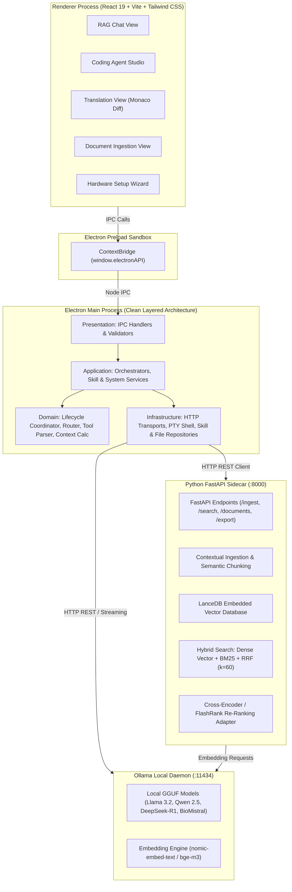
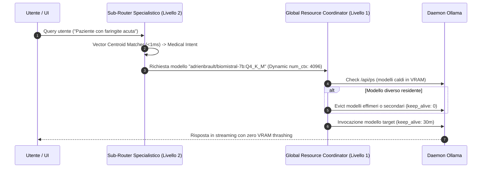
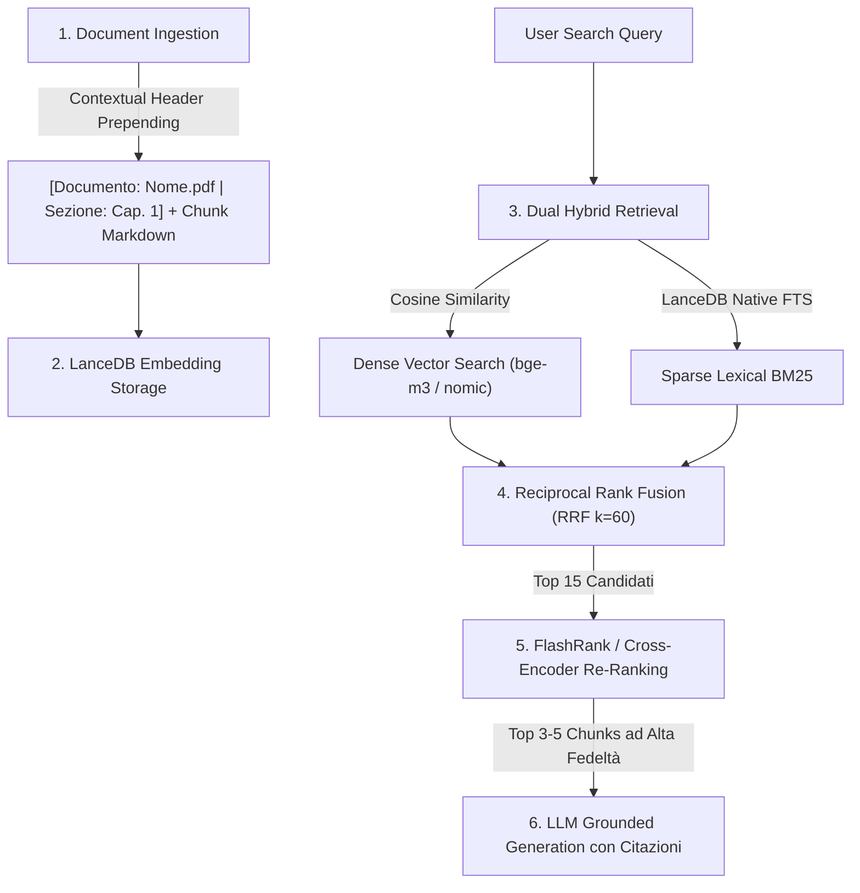

# Architettura di Sistema & Flussi Dati — OnlyRag V2

OnlyRag V2 adotta un'architettura **Multi-Process Locale Disaccoppiata e Sovrana** basata su **Electron**, **React 19**, **FastAPI Sidecar**, **LanceDB Embedded Vector DB** e il runtime locale **Ollama**.

---

## 1. Topologia di Sistema e Diagramma dei Componenti



---

## 2. Layered Clean Architecture (Electron Main Process)

Il processo principale di Electron rispetta rigorosamente il modello **Layered Architecture a 4 Livelli**:

```
Presentation Layer (IPC / UI Routing)
       │
       ▼
Application Layer (Use Cases & Orchestration)
       │
       ▼
Domain Layer (Pure Business Rules, Entities & Algorithms)
       │
       ▼
Infrastructure Layer (File System, PTY, HTTP Clients, Database)
```

| Livello | Directory | Responsabilità Principale | Dipendenze Consentite |
| :--- | :--- | :--- | :--- |
| **Presentation** | `electron/core/presentation/` | Registrazione dei canali `ipcMain.handle`, validazione input IPC e serializzazione risposte. | Application Layer |
| **Application** | `electron/core/application/` | Orchestrazione dei casi d'uso (Agent Tool Loop, Lifecycle dei modelli, gestione skill e workspace). | Domain, Infrastructure |
| **Domain** | `electron/core/domain/` | Logica pura di business: `lifecycleCoordinator`, `toolParser`, `contextWindowCalculator`, `complexityEvaluator`, `hardwareProfileResolver`. Zero dipendenze da I/O o framework. | Nessuna (Puro TS) |
| **Infrastructure** | `electron/core/infrastructure/` | Interazione con I/O: `ollamaHttpClient`, `agentStreamTransport`, `fileSystemRepository`, `skillRepository`, `ptySessionManager`. | Standard APIs, Node.js libs |

---

## 3. Router Gerarchico a 2 Livelli (Zero VRAM Thrashing)

OnlyRag V2 previene la saturazione della VRAM e il thrashing dei modelli attraverso un router a due stadi:



### Livello 1: Global Resource & Lifecycle Coordinator
- **Model Pinning**: Mantiene residente in memoria il modello di lavoro primario (`keep_alive: '30m'`).
- **Ephemeral Eviction**: I modelli di supporto (traduzione rapida o OCR) vengono scaricati immediatamente dopo l'esecuzione (`keep_alive: 0m`).
- **Dynamic Context Window Throttling**: Calcola e assegna `num_ctx` in bucket ottimali ($2048 \rightarrow 65536$) basandosi sulla dimensione effettiva del prompt e della cronologia.

### Livello 2: Sub-Router Specialistici di Modulo
- **Coding Studio Sub-Router**: Valutazione della complessità (Fast Tier $\le 3\text{B}$, Standard Tier $7-8\text{B}$, Deep Reasoning Tier $14\text{B}/\text{R1}$, Escalated su errore di test/build). Il tier (`ComplexityTier`, esteso a `ModelTier` con l'aggiunta di `heavy` — unica fonte di verità condivisa con `hardwareRecommendationEngine.ts` e `resilientModelDispatcher.ts`) determina anche quale dei 3 prompt di sistema **family-agnostic** viene compilato (`PromptCompiler.compileCodingPrompt`): stessa struttura di tool e direttive per ogni modello Ollama compatibile, con verbosità/dettaglio di guida che scala per tier invece che per famiglia di modello (sostituendo il precedente sistema a ~17 varianti per famiglia).
- **RAG Chat Domain Sub-Router**: Classificazione semantica tramite **Vector Centroid Semantic Matching** ($<1\text{ms}$) tra Medical (`adrienbrault/biomistral-7b:Q4_K_M`), Legal (`saul-instruct:7b`) e General (`llama3.1` / `llama3.2`).
- **Chit-Chat Direct Bypass**: Identificazione di saluti o domande convenzionali per escludere il retrieval vettoriale riducendo la latenza a $<100\text{ms}$.

---

## 4. Pipeline RAG Ibrida & Multi-Stage Retrieval



1. **Contextual Retrieval (Anthropic Standard)**: Durante l'ingestione semantica, ogni chunk viene arricchito con un header contestuale che include il documento e la gerarchia delle sezioni.
2. **Dual Hybrid Search**: Combina ricerca vettoriale densa e ricerca lessicale full-text BM25 in LanceDB.
3. **Reciprocal Rank Fusion (RRF)**: Fusione normalizzata dei punteggi dei due ranking:
   $$\text{RRF}(d) = \sum_{m \in \{\text{dense}, \text{sparse}\}} \frac{1}{60 + r_m(d)}$$
4. **In-Process Re-Ranking Adapter**: Re-ranking cross-encoder ultra-veloce tramite `flashrank` su CPU o motore semantico di prossimità termica $(<20\text{ms})$.

---

## 5. Agent Studio: Tool Loop, Resilienza & Transazionalità

- **Autonomous Tool Calling Loop**:
  - **Ispezione & Navigazione**: `read_file` (con line slicing), `list_dir`, `grep_search`, `extract_code_symbols` (estrazione AST dei simboli esportati).
  - **Modifica & Patching**: `replace_file_content` (fuzzy matching con tolleranza Levenshtein $\ge 82\%$ e AST pre-commit validation via `FuzzyPatchEngineWithASTValidator`), `multi_replace_file_content`, `write_file` (con validazione AST sintattica in-flight), `delete_file`.
  - **Esecuzione & Diagnostica**: `run_command` (PowerShell non-interattivo supervised da `NonInteractiveStreamSessionGuard` con cattura prompt interattivi ed enviroment CI=true), `run_tests` (rileva ed esegue il test runner del workspace — script `test:fast`/`test` in package.json o pytest — e ritorna un esito pass/fail strutturato via `testResultParser.ts` invece di testo grezzo), `inspect_os_env`, `finish`.
  - **Web & Risorse**: `web_search`, `fetch_web_content`, `download_file`.
  - **Interazione Utente**: `ask` (alias `ask_question`) per chiarimenti diretti.
- **Native Tool-Calling Routing (`ollamaToolCallingCapability.ts` & `ollamaToolSchemaCatalog.ts`)**:
  - Per ogni turno, rileva se il modello target supporta il tool-calling nativo di Ollama: segnale primario il campo `capabilities` di `/api/tags` (autoritativo se presente), fallback su allow-list di famiglie note (`llama3.1+`, `qwen2.5+`, `qwen3`, `mistral-nemo`, `command-r`, ...).
  - Quando disponibile, instrada su `POST /api/chat` con il catalogo strutturato dei 23 tool invece del solo prompt-engineering. La risposta (`message.tool_calls` oppure, per modelli come la famiglia Qwen che spesso restituiscono la chiamata come testo JSON in `message.content`, il testo grezzo) viene normalizzata nello stesso formato testuale già compreso da `toolParser.ts`, così la pipeline di parsing ed esecuzione tool resta identica indipendentemente dal percorso di dispacciamento usato.
- **Action Loop Fingerprinting & Multi-State Oscillation Prevention (`AgentActionLoopDetector`, incorpora internamente `CycleOscillationDetectorAndReproOracle`)**:
  - Ogni invocazione di tool viene tracciata tramite hash crittografico deterministico SHA-256 (`tool:parameters`) da un'unica istanza per sessione.
  - Rilevamento avanzato di cicli alternati di oscillazione a $k$-Stati ($k \in [2, 4]$, es. $A \rightarrow B \rightarrow A \rightarrow B$). Se l'agente instaura un ciclo alternato o ripete la stessa azione $\ge 2$ volte, il runtime inietta una direttiva correttiva forzata (`[CRITICAL LOOP INTERVENTION]`) ed uno script di riproduzione TDD.
- **AST-Aware Compact Repo Mapper (`CompactSemanticRepoMapper`)**:
  - Scansione ad alta densità sintattica della struttura del repository con estrazione dell'albero dei simboli esportati (`class`, `function`, `interface`, `type`) per la generazione di una Repo Map ottimizzata per il budget del contesto.
- **Optimizations per Hardware Minimo (Previeni Runaway Loops >300 Step)**:
  - **`ASTAwareStackTraceExtractor`**: Estrazione deterministica dei blocchi di errore e numeri di riga dai log di terminale per una diagnostica ad alta precisione.
  - **`StagnationCircuitBreaker`**: Interruttore automatico di blocco sulle streak di inattività o errori ripetuti per prevenire loop infiniti runaway.
- **Resilient Multi-Tier Model Dispatching (`ResilientModelDispatcher`)**:
  - Se il modello primario ad alta intensità incontra timeout, disconnessioni socket o esaurimento VRAM (OOM), l'orchestratore degrada automaticamente verso il modello di fallback su 4 tier (Primary → Intermediate → Fallback → Heavy Escalation), applicando l'evizione VRAM esplicita prima di attivare il tier HEAVY.
- **Transactional Workspace Journal (`AtomicWorkspaceJournal`)**:
  - Prima di qualsiasi operazione di scrittura, patch o cancellazione file, viene salvato uno snapshot preventivo in memoria.
  - In caso di annullamento da parte dell'utente o fallimento non sanabile, viene eseguito il `rollbackAll()` ripristinando istantaneamente il filesystem allo stato pre-task. A task concluso con successo, le modifiche vengono consolidate (`commit()`).
- **Auto-Healing Loop**: Se l'esecuzione di un comando fallisce (exit code non nullo o presenza di errori nello stack trace), l'output viene formattato come blocco diagnostico e rinviato al modello per l'auto-correzione autonoma.
- **Project Workspaces & Nested Sessions**:
  - Ogni progetto memorizza la radice del workspace e una collezione isolata di sessioni di lavoro nidificate (`CodingSession`).
  - Passaggio istantaneo tra conversazioni parallele nello stesso progetto con persistenza dello storico delle modifiche.
- **Cronologia Sessioni su Filesystem (`sessionHistoryRepository`)**:
  - Unica fonte di verita' della cronologia: `<workspace>/.onlyrag/session_history.json` (fallback `~/.onlyrag_v2/sessions/session_history.json` per le sessioni standalone), esposta al renderer dai canali CRUD `sessions:*`. Il renderer non persiste piu' sessioni in `localStorage`; le sessioni legacy (`onlyrag_coding_sessions_v2`) vengono importate una tantum al primo avvio.
  - Ogni sessione contiene i suoi `ExecutedPrompt` (prompt, timestamp ISO 8601, modalita', esito, step totali, file toccati, righe +/-) e i suoi `AgentPlan` (versioni di piano con milestone canonici), da cui la UI deriva titolo, metriche e storico piani. Eliminare una sessione elimina prompt e piani con essa, senza record orfani. Lo stato runtime dell'agente (`.onlyrag/.agent_state_*.json`) resta limitato a cio' che serve per riprendere il loop (episodi, milestone, step), senza duplicare i dati di cronologia.
- **Session State Checkpointing (`persistCurrentState`)**:
  - Lo stato di sessione (`.onlyrag/.agent_state_*.json`: milestone, episodi, step) viene persistito ogni N step (default 5) e immediatamente dopo ogni mutazione file riuscita, invece che ad ogni singolo step, riducendo il churn I/O senza sacrificare la ripristinabilità.
  - Tutti i percorsi di uscita della sessione (finish, cancel, errore LLM, timeout, circuit-breaker di stagnazione, modalità PLAN) persistono incondizionatamente prima di terminare, garantendo che lo stato osservabile da disco non sia mai più vecchio dell'ultima azione osservabile dall'utente.

### 5.1. Plan Approval System (`GoalDecompositionPlanner` come Unica Fonte di Verità)

- **Backend Planner Canonico (`GoalDecompositionPlanner`, `electron/core/domain/agent/planAndSolveGraph.ts`)**: Unica fonte di verità per lo stato di completamento del piano (`PlanMilestone[]`, stati `pending`/`in_progress`/`verified`/`failed`), persistito da `agentOrchestratorAppService.persistCurrentState()` e riletto ad ogni riavvio di sessione (`goalPlanner.loadMilestones(savedState.planMilestones)`).
- **Generazione Piano Instradata (`planGenerationAppService.ts`)**: Il drafting del piano (hook `usePlanApproval.ts`) non usa più un `fetch()` diretto e non gestito verso Ollama dal renderer, ma il canale IPC `agent:plan-generate`, che instrada la richiesta attraverso le opzioni runtime del profilo hardware (`HardwareProfileResolver`) e restituisce sia il testo del piano sia i milestone già parsati.
- **Parser Unico Condiviso**: Sia la generazione (`agent:plan-generate`) sia la ri-elaborazione di testo modificato manualmente (`agent:plan-parse-text`) sia l'estrazione automatica dal primo turno del modello nel loop agentico usano lo stesso parser canonico (`GoalDecompositionPlanner.parsePlanFromText`), eliminando i 3-4 parser indipendenti precedentemente duplicati tra `planManager.ts`, `planAndSolveGraph.ts` e `PlanPanel.tsx`.
- **Seeding del Piano Approvato (`agent:plan-seed`)**: All'approvazione, i milestone vengono iniettati nello stato di sessione persistito (`agentSessionStateRepository.seedPlanMilestones`) prima dell'avvio dell'esecuzione, così il loop agentico li carica come stato iniziale invece di affidarsi alla sola auto-rilevazione da un possibile piano diverso generato dal modello al primo turno.
- **Esposizione dello Stato via IPC (`agent:get-plan-state`)**: Il frontend può leggere in ogni momento lo stato di completamento reale (verified/in_progress/failed) persistito dal backend, invece di stimare il progresso da un'euristica basata sul conteggio degli step.
- **Disaccoppiamento Invio/Generazione**: L'invio di un prompt esegue sempre direttamente il task (`c.handleAgentExecute()`); la generazione del piano è un'azione esplicita separata (icona dedicata "Genera piano" nel composer, disponibile in ogni `agentMode`), non più agganciata automaticamente ad ogni invio quando `requirePlanApproval` è attivo.
- **Consolidamento Automatico del Residuo**: Alla generazione di un nuovo piano, i milestone non verificati del piano approvato precedente vengono inclusi come contesto di riconciliazione nella richiesta al modello, così il nuovo piano assorbe lo stato pregresso invece di ripartire da zero.
