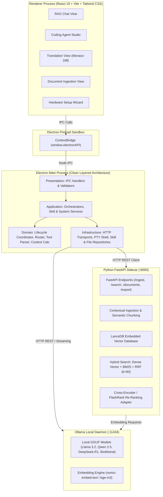
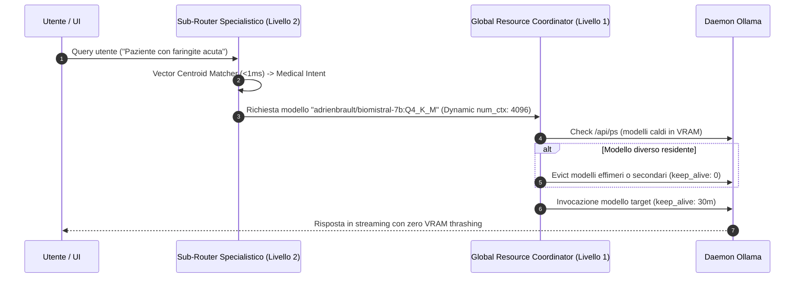
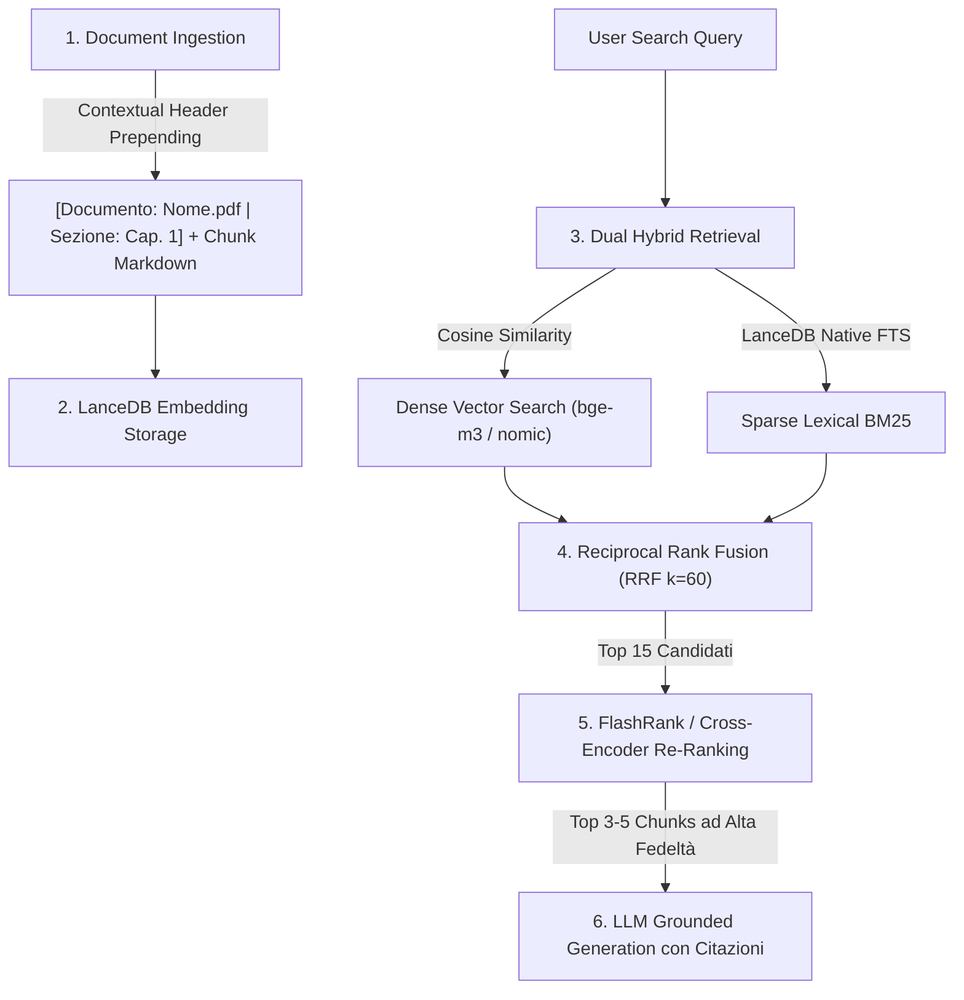

# Architettura di Sistema & Flussi Dati — OnlyRag V2

OnlyRag V2 adotta un'architettura **Multi-Process Locale Disaccoppiata e Sovrana** basata su **Electron**, **React 19**, **FastAPI Sidecar**, **LanceDB Embedded Vector DB** e il runtime locale **Ollama**.

---

## 1. Topologia di Sistema e Diagramma dei Componenti



---

## 2. Layered Clean Architecture (Electron Main Process)

Il processo principale di Electron rispetta rigorosamente il modello **Layered Architecture a 4 Livelli**:

```
Presentation Layer (IPC / UI Routing)
       │
       ▼
Application Layer (Use Cases & Orchestration)
       │
       ▼
Domain Layer (Pure Business Rules, Entities & Algorithms)
       │
       ▼
Infrastructure Layer (File System, PTY, HTTP Clients, Database)
```

| Livello | Directory | Responsabilità Principale | Dipendenze Consentite |
| :--- | :--- | :--- | :--- |
| **Presentation** | `electron/core/presentation/` | Registrazione dei canali `ipcMain.handle`, validazione input IPC e serializzazione risposte. | Application Layer |
| **Application** | `electron/core/application/` | Orchestrazione dei casi d'uso (Agent Tool Loop, Lifecycle dei modelli, gestione skill e workspace). | Domain, Infrastructure |
| **Domain** | `electron/core/domain/` | Logica pura di business: `lifecycleCoordinator`, `toolParser`, `contextWindowCalculator`, `agentPromptAssembler`, `hardwareProfileResolver`. Zero dipendenze da I/O o framework. | Nessuna (Puro TS) |
| **Infrastructure** | `electron/core/infrastructure/` | Interazione con I/O: `ollamaHttpClient`, `agentStreamTransport`, `fileSystemRepository`, `skillRepository`, `ptySessionManager`. | Standard APIs, Node.js libs |

---

## 3. Router Gerarchico a 2 Livelli (Zero VRAM Thrashing)

OnlyRag V2 previene la saturazione della VRAM e il thrashing dei modelli attraverso un router a due stadi:



### Livello 1: Global Resource & Lifecycle Coordinator
- **Model Pinning**: Mantiene residente in memoria il modello di lavoro primario (`keep_alive: '30m'`).
- **Ephemeral Eviction**: I modelli di supporto (traduzione rapida o OCR) vengono scaricati immediatamente dopo l'esecuzione (`keep_alive: 0m`).
- **Dynamic Context Window Throttling**: Calcola e assegna `num_ctx` in bucket ottimali ($2048 \rightarrow 65536$) basandosi sulla dimensione effettiva del prompt e della cronologia.

- **Coding Studio Primary Workhorse Model**: Architettura basata su **Modello di Lavoro Fisso (Workhorse Model)** impostato dall'utente (`codingModel`, es. `qwen2.5-coder:7b`). Il modello rimane stabilmente allocato in memoria per tutta la sessione garantendo il riutilizzo della KV-cache (zero VRAM thrashing e zero latenza di reload). L'esecuzione avviene direttamente tramite streaming HTTP su daemon locale o server Ollama remoto.
- **RAG Chat Domain Sub-Router**: Classificazione semantica tramite **Vector Centroid Semantic Matching** ($<1\text{ms}$) tra Medical, Legal e General. Il modello per dominio è risolto da `settings.medicalModel`/`settings.legalModel` (configurabili in AppSettings, selezionabili dal Setup Wizard o al volo tramite `QuickModelSelector`) con fallback sul `defaultModel` generale se non impostati. Entrambi i domini hanno un catalogo dedicato e completo su tutti i 5 tier hardware (`MEDICAL_TIER_CATALOG`/`LEGAL_TIER_CATALOG` in `hardwareModelCatalog.ts`): fallback agnostico `llama3.2:3b` su legacy/entry/midrange, modelli specializzati (`adrienbrault/biomistral-7b:Q4_K_M` per Medical, `llama3.1:8b`/`mistral-small3.2:24b` per Legal) su highend/extreme.
- **Chit-Chat Direct Bypass**: Identificazione di saluti o domande convenzionali per escludere il retrieval vettoriale riducendo la latenza a $<100\text{ms}$.
- **Proprieta' del Sidecar all'Avvio (`orphanPortReclaim.ts` + `SidecarProcessManager.reclaimOrphanSidecarPort`)**: All'avvio, se l'endpoint `/health` risponde ma il riferimento `sidecarProcess` del processo Electron corrente è nullo, il sistema identifica il processo in ascolto su `:8000` (`netstat -ano`), ne verifica l'immagine eseguibile (`tasklist`) e lo termina solo se appartiene alla lista chiusa di binari autorizzati (`sidecar.exe`, interpreti Python). Questo garantisce che la nuova sessione Electron possieda e controlli direttamente il ciclo di vita del sidecar e che esegua sempre la versione aggiornata dei binari senza conflitti.

---

## 4. Pipeline RAG Ibrida & Multi-Stage Retrieval



1. **Contextual Retrieval (Anthropic Standard)**: Durante l'ingestione semantica, ogni chunk viene arricchito con un header contestuale che include il documento e la gerarchia delle sezioni.
2. **Dual Hybrid Search**: Combina ricerca vettoriale densa e ricerca lessicale full-text BM25 in LanceDB.
3. **Reciprocal Rank Fusion (RRF)**: Fusione normalizzata dei punteggi dei due ranking:
   $$\text{RRF}(d) = \sum_{m \in \{\text{dense}, \text{sparse}\}} \frac{1}{60 + r_m(d)}$$
4. **In-Process Re-Ranking Adapter**: Re-ranking cross-encoder ultra-veloce tramite `flashrank` su CPU o motore semantico di prossimità termica $(<20\text{ms})$.

---

## 5. Agent Studio: Tool Loop, Resilienza & Transazionalità

> Per l'analisi approfondita dei gap, la progettazione del flusso end-to-end e il piano di evoluzione modulare, consultare [**`coding-agent-studio-blueprint.md`**](./coding-agent-studio-blueprint.md).

- **Autonomous Tool Calling Loop**:
  - **Ispezione & Navigazione**: `read_file` (con line slicing), `list_dir`, `grep_search`, `extract_code_symbols` (estrazione AST tramite TypeScript Compiler API per file TS/JS/TSX/JSX e tokenizer poliglotto per altri linguaggi).
  - **Modifica & Patching**: `replace_file_content` (fuzzy matching con tolleranza Levenshtein calcolata via `fast-levenshtein` e AST pre-commit validation via `fuzzyPatchEngine.ts`), `multi_replace_file_content`, `write_file` (con validazione AST sintattica in-flight), `delete_file`.
  - **Esecuzione & Diagnostica**: `run_command` (shell persistente PowerShell non-interattiva — `persistentPowerShellSession.ts` — con environment CI=true ed early-abort su prompt interattivi rilevati via `shellStreamGuard.ts`), `run_tests` (rileva ed esegue il test runner del workspace con pass/fail strutturato), `inspect_os_env` (report di sistema e inventario toolchain: node, npm, pnpm, git, python, ollama), `ensure_tool` (installazione non-interattiva 1-click via winget per i tool mancanti), `finish`.
  - **Web & Risorse**: `web_search` (query DuckDuckGo con parsing DOM via `cheerio`), `fetch_web_content` (conversione HTML in Markdown ad alta fedeltà con `turndown` e mitigazione SSRF), `download_file`.
  - **Interazione Utente**: `ask` (alias `ask_question`) per chiarimenti diretti.
- **Strict Serial Concurrency Queue (`TaskQueueAppService` & `PQueue`)**:
  - Tutti i task agentici sono gestiti tramite istanza atomica `PQueue({ concurrency: 1 })`, garantendo la totale assenza di race conditions e rispettando le direttive globali di serializzazione atomica del workspace.
- **Native Tool-Calling Routing (`ollamaToolCallingCapability.ts` & `ollamaToolSchemaCatalog.ts`)**:
  - Per ogni turno, rileva se il modello target supporta il tool-calling nativo di Ollama: segnale primario il campo `capabilities` di `/api/tags` (autoritativo se presente), fallback su allow-list di famiglie note (`llama3.1+`, `qwen2.5+`, `qwen3`, `mistral-nemo`, `command-r`, ...).
  - Quando disponibile, instrada su `POST /api/chat` con il catalogo strutturato dei 27 tool invece del solo prompt-engineering. La risposta (`message.tool_calls` oppure, per modelli come la famiglia Qwen che spesso restituiscono la chiamata come testo JSON in `message.content`, il testo grezzo) viene normalizzata nello stesso formato testuale già compreso da `toolParser.ts`, così la pipeline di parsing ed esecuzione tool resta identica indipendentemente dal percorso di dispacciamento usato.
- **Action Loop Fingerprinting & Multi-State Oscillation Prevention (`AgentActionLoopDetector`, incorpora internamente `CycleOscillationDetectorAndReproOracle`)**:
  - Ogni invocazione di tool viene tracciata tramite hash crittografico deterministico SHA-256 (`tool:parameters`) da un'unica istanza per sessione.
  - Rilevamento avanzato di cicli alternati di oscillazione a $k$-Stati ($k \in [2, 4]$, es. $A \rightarrow B \rightarrow A \rightarrow B$). Se l'agente instaura un ciclo alternato o ripete la stessa azione $\ge 2$ volte, il runtime inietta una direttiva correttiva forzata (`[CRITICAL LOOP INTERVENTION]`) ed uno script di riproduzione TDD.
- **Distinzione fra Ripetizione Riuscita e Ripetizione Fallita (`recordOutcome` / `classifyRepeatOutcome` + `resolveRedundantSuccessAction`)**:
  - `AgentActionLoopDetector` traccia l'esito reale dell'esecuzione di ogni tool (`recordOutcome(parsedTool, !isToolFailure)`), chiudendo il ciclo di feedback tra intenzione ed esecuzione effettiva.
  - La classificazione usa l'esito più recente per fingerprint e per target di file: una tool call ripetuta con esito positivo (`succeeding`) riceve una direttiva informativa specifica (`[REDUNDANT ACTION: ... ALREADY SUCCEEDED N TIME(S)]`) senza incrementare `stagnationStreak` e senza forzare fallimenti su milestone completate con successo.
  - Dopo `REDUNDANT_SUCCESS_ADVISORY_ATTEMPTS` (3) tentativi consecutivi ridondanti, la ripetizione rientra nella scala di stagnazione ordinaria per garantire la terminazione del loop.
  - La memoria degli esiti sopravvive a `resetTarget` e viene cancellata solo da `reset()`.
  - Gli esiti sono indicizzati sia per fingerprint sia per target (gestendo scenari di riscritture con lievi variazioni). Le letture ripetute non producono mutazioni e sono soggette a escalation ordinaria.
- **Escape Strutturale dal Loop (`loopEscapePolicy.ts` + `forceMilestoneAdvance`)**:
  - La policy scala su tre livelli in base allo streak di blocchi consecutivi (`stagnationStreak`, azzerato da qualsiasi tool eseguito con successo): `advise` (direttiva testuale) $\rightarrow$ `force_milestone_advance` (marcatura `failed` della milestone bloccata e passaggio al microtask successivo) $\rightarrow$ `abort`.
  - Su `force_milestone_advance` la milestone attiva viene marcata `failed` (mai `verified`) e il focus passa alla successiva, azzerando la memoria sul target bloccato per consentire un tentativo pulito.
  - Quando non rimangono microtask operativi, `compileProgressPrompt` emette il blocco `[NO OPERATIONAL MILESTONES REMAIN]`, evitando contraddizioni con le direttive di Definition of Done e consentendo la conclusione ordinata con report chiaro.
- **AST-Aware Compact Repo Mapper (`compactSemanticRepoMapper.ts` → `generateCompactRepoMap()`)**:
  - Scansione ad alta densità sintattica della struttura del repository con estrazione dell'albero dei simboli esportati (`class`, `function`, `interface`, `type`) per la generazione di una Repo Map ottimizzata per il budget del contesto.
- **Optimizations per Hardware Minimo (Prevenzione Runaway Loops)**:
  - **`DiagnosticOutputReducer` (`extractErrorDiagnostics()`)**: Estrazione deterministica dei blocchi di errore e numeri di riga dai log di terminale per una diagnostica ad alta precisione.
  - **`StagnationCircuitBreaker`**: Interruttore automatico di blocco sulle streak di inattività o errori ripetuti per prevenire loop infiniti.
  - **Cap Deterministico del Piano (`planMilestoneCapper.ts`)**: Il piano è limitato a `MAX_PLAN_MILESTONES` (15); le milestone in eccesso vengono raggruppate in bucket uniformi preservando tutti i requisiti.
  - **Piano Falsificabile (`planFalsifiabilityNormalizer.ts`)**: Requisiti e criteri di accettazione generici privi di percorsi o comandi vengono ripiegati come criteri sulle milestone pertinenti.
  - **Pipeline Unica del Piano (`planCompilation.ts`)**: Sequenza deterministica e unificata `parse` $\rightarrow$ `normalizza` $\rightarrow$ `cap` applicata a tutti i punti di ingresso del piano.
- **Audit Log Strutturato dell'Agente (`codingAgentLogger.ts`)**:
  - **Prompt in delta**: Compressione dell'audit log elidendo il prefisso immutabile condiviso con il turno precedente.
  - **Transizioni di stato**: Registrazione puntuale degli eventi di transizione `[MILESTONE m-N: DA -> A]` emessi da `GoalDecompositionPlanner.onMilestoneTransition`.
  - **Copertura totale delle uscite**: Tracciamento esplicito dell'esito finale su tutti i percorsi di terminazione (completamento, abort per stagnazione, interruzione manuale o circuit breaker).
  - **`SESSION_TRACKER.md`**: Le voci completate riportano la motivazione e lo stato di chiusura.
- **Guardia sugli Scaffolder (`commandTouchedFilesScanner.createdTopLevelDirs`)**: Rilevamento automatico di sottocartelle create erroneamente da tool di scaffolding (es. `create-react-app`, `npm create`) rispetto alla root del workspace, con segnalazione correttiva immediata all'agente.
- **Direct Stream Transport & Remote Ollama Support (`AgentStreamTransport`)**:
  - Esecuzione trasparente e diretta sul modello configurato per lo sviluppo (`codingModel`), con supporto a streaming SSE continuo su endpoint locale (`http://127.0.0.1:11434`) o server Ollama remoto.
- **Transactional Workspace Journal (`AtomicWorkspaceJournal`)**:
  - Prima di qualsiasi operazione di scrittura, patch o cancellazione file, viene salvato uno snapshot preventivo in memoria.
  - In caso di annullamento o fallimento non sanabile, viene eseguito il `rollbackAll()` ripristinando istantaneamente il filesystem allo stato pre-task. A task concluso con successo, le modifiche vengono consolidate (`commit()`).
- **Auto-Healing Loop**: Se l'esecuzione di un comando fallisce (exit code non nullo o presenza di errori nello stack trace), l'output viene formattato come blocco diagnostico e rinviato al modello per l'auto-correzione autonoma.
- **Project Workspaces & Nested Sessions**:
  - Ogni progetto memorizza la radice del workspace e una collezione isolata di sessioni di lavoro nidificate (`CodingSession`).
  - Passaggio istantaneo tra conversazioni nello stesso progetto con persistenza dello storico delle modifiche.
- **Cronologia Sessioni su Filesystem (`sessionHistoryRepository`)**:
  - Unica fonte di verità della cronologia: `<workspace>/.onlyrag/sessions/session_history.json` (fallback `~/.onlyrag_v2/sessions/session_history.json` per sessioni standalone), esposta al renderer dai canali CRUD `sessions:*`.
  - Ogni sessione contiene i suoi `ExecutedPrompt` (prompt, timestamp ISO 8601, modalità, esito, step totali, file toccati, righe +/-) e i suoi `AgentPlan` (versioni di piano con milestone canonici). Lo stato runtime dell'agente (`.onlyrag/sessions/.agent_state_*.json`) resta limitato a quanto necessario per riprendere il loop, incluso `terminationReason` strutturato per le uscite terminali.
- **Session State Checkpointing (`persistCurrentState`)**:
  - Lo stato di sessione viene persistito ogni N step (default 5) e immediatamente dopo ogni mutazione file riuscita, garantendo persistenza incondizionata su ogni percorso di uscita (finish, cancel, errore LLM, timeout, circuit breaker).

### 5.1. Plan Approval System (`GoalDecompositionPlanner` come Unica Fonte di Verità)

- **Backend Planner Canonico (`GoalDecompositionPlanner`, `electron/core/domain/agent/planAndSolveGraph.ts`)**: Unica fonte di verità per lo stato di completamento del piano (`PlanMilestone[]`, stati `pending`/`in_progress`/`verified`/`failed`), persistito da `agentOrchestratorAppService.persistCurrentState()` e riletto ad ogni riavvio di sessione.
- **Chiusura Milestone Solo su Evidenza Reale (`milestoneDeliverableResolver.ts` + `workspaceDeliverableProbe.ts`)**: Una milestone si chiude automaticamente solo se il file scritto è tra quelli dichiarati (`isDeliverableOfMilestone`) e tutti i file nominati sono presenti su disco con contenuto reale non-segnaposto (`isPlaceholderContent` scarta i corpi con solo commenti o marker TODO/FIXME).
- **Freschezza della Build (`agentOrchestratorCircuitBreakerAndVerification.ts`)**: Il flag `hasVerifiedBuild` viene invalidato ad ogni nuova mutazione di file e ripristinato solo da una compilazione/test passata con successo sullo stato attuale del codice.
- **Un Prompt per Modulo, Adattato alle Capability (`promptPresets.ts`, `promptHierarchyRegistry.ts`, `promptCompiler.ts`)**: Architettura a template Mustache con sezioni condizionate sulle capability dichiarate da Ollama (`/api/tags`), eliminando matrici hardcoded di modelli o dizionari di brand e garantendo pieno rispetto dell'Anti-Hardcoding Rule.
- **Override dei Prompt a Chiave Singola (`appSettingsDomain.ts` + `AppLayout.tsx`)**: Configurazione a chiave singola per nodo editabile in `AppSettings.customPromptOverrides` con reset granulare per singolo nodo.
- **Direttive di Traduzione Inviate una Volta Sola (`useTranslation.ts`)**: La coppia di lingue passa come variabili del template Mustache eliminando duplicazioni di direttive nei chunk tradotti.
- **Un Solo Ramo nei Prompt di Chat (`promptPresets.ts` + `useChatEngine.ts`)**: Il prompt di chat riceve dinamicamente il blocco `[INDEXED DOCUMENT CONTEXT]` solo quando sono presenti allegati o `[ATTACHMENT CONTEXT STATUS]` in loro assenza, evitando conflitti di istruzioni.
- **Verifica Reale invece di Presenza su Disco (`projectVerificationResolver.ts`, `milestoneVerificationPromotion.ts`, `verificationGatePolicy.ts`, `agentOrchestratorVerificationRunner.ts`)**: La presenza fisica dei file porta la milestone a `in_progress`; la promozione a `verified` avviene solo al superamento di un comando di verifica reale (build, typecheck, test, lint) risolto dal manifest del progetto. Al `finish`, il gate esegue la verifica e, in caso di fallimento, restituisce l'errore al modello per l'auto-correzione (fino a 3 cicli). All'esaurimento del budget di step — l'unica altra uscita di sessione, e l'unica che non verificava nulla — `budgetExhaustionVerification.ts` decide se eseguire lo stesso controllo un'ultima volta, così che una corsa che ha consegnato i deliverable senza mai invocare `finish` non chiuda con il piano interamente non verificato.
- **Gestione Resiliente delle Risposte Non Parsabili (`agentOrchestratorResponseInterpreter.ts`)**: `sliceBalancedObject` isola il primo oggetto JSON bilanciato gestendo risposte multiple con fallback difensivo. In modalità AGENT, il fallimento prolungato di risposte strutturate chiude la sessione con `success: false` e resoconto diagnostico completo.
- **Autorità sugli Stati del Piano (`milestoneUpdateAuthority.ts`)**: Gli aggiornamenti tramite `update_plan` sono convalidati contro l'evidenza del filesystem: rigetto di aggiornamenti no-op, immutabilità delle milestone verificate e protezione delle milestone abbandonate dal loop guard (`isSystemAbandoned`).
- **Verifica Reale contro Anteprima (`browserPreviewVerification.ts`)**: `open_in_browser` costituisce prova di verifica valida solo per artefatti renderizzati (`.html`, `.svg`, `.pdf`, URL HTTP), mentre per codice sorgente il gate richiede una build o typecheck superato.
- **Tracciamento dei File Prodotti da Shell (`commandTouchedFilesScanner.ts`)**: Scansione del workspace post-esecuzione comandi CLI riusciti per registrare i file creati o modificati in `sessionChangedFiles`.
- **Generazione Piano Instradata (`planGenerationAppService.ts`)**: Il drafting del piano usa il canale IPC `agent:plan-generate`, instradato attraverso le opzioni del profilo hardware e parsato con il parser canonico.
- **Comandi di Verifica Dichiarati e Sicuri (`verificationCommandSafety.ts`)**: Il prompt riceve la lista dei comandi di verifica reali dal manifest. Vengono categoricamente respinti comandi MUTANTI (redirezioni `>`, comandi di scrittura `touch`, `cp`, `rm`, `sed`) e comandi VACUI (`echo`, `true`, `cd`), ammettendo solo comandi falsificabili.
- **Parser Unico Condiviso**: Generazione, ri-parsing manuale ed estrazione da loop utilizzano lo stesso parser canonico (`GoalDecompositionPlanner.parsePlanFromText`).
- **Seeding del Piano Approvato (`agent:plan-seed`)**: I milestone approvati vengono iniettati nello stato di sessione persistito prima dell'avvio dell'esecuzione.
- **Esposizione dello Stato via IPC (`agent:get-plan-state`)**: Lettura trasparente dello stato reale persistito (verified, in_progress, failed) dal backend.
- **Disaccoppiamento Invio/Generazione**: L'invio di un prompt esegue direttamente il task; la generazione del piano è un'azione esplicita e dedicata.
- **Consolidamento Automatico del Residuo**: Alla generazione di un nuovo piano, i milestone non verificati del piano approvato precedente vengono inclusi come contesto di riconciliazione nella richiesta al modello, così il nuovo piano assorbe lo stato pregresso invece di ripartire da zero.

---

## 6. SLM Log Diagnostics & Resilient Fallback Engine

OnlyRag V2 include un motore diagnostico avanzato di analisi anomalie nei log di sistema per identificare in tempo reale criticità di esecuzione (CUDA OOM, VRAM budget exceeded, JSON troncati, timeout Ollama, loop ricorsivi di tool, circuit breaker di stagnazione e permessi filesystem).

- **Architettura a Doppio Motore Resiliente**:
  1. **Primary Engine (Python FastAPI Sidecar — `/agent/logs/analyze`)**: Scansiona i log applicativi con finestre scorrevoli di rilevamento pattern e calcolo metriche.
  2. **Native Electron Node.js Fallback Engine (`SidecarSlmBridgeService.analyzeLogsNativeFallback`)**: Se il sidecar Python è offline o non raggiungibile, il processo Electron Main esegue una scansione diretta su disco dei log (`.onlyrag/logs`, `%APPDATA%/onlyrag-v2/logs`, `%LOCALAPPDATA%/OnlyRagV2/logs`, `temp`), garantendo **zero downtime e disponibilità al 100% della diagnostica**.
- **Dipendenze Escluse dal Bundle del Main Process (`vite.config.mts`, `rolldownOptions.external`)**: Le dipendenze che risolvono require dinamici a runtime (es. `depcheck`) sono marcate come esterne in `build.rolldownOptions` per essere impacchettate da electron-builder in `app.asar` e risolte correttamente.
- **Smoke Test Automatico del Bundle Electron (`scripts/test_bundle_smoke.ps1`, `ONLYRAG_SMOKE_TEST=1`)**: Verifica headless controllata post-build del processo Main (`dist-electron/main.js`) per prevenire a monte crash di avvio o problemi di bundling prima dell'impacchettamento finale.
- **Store Unificato delle Impostazioni su Filesystem (`appSettingsRepository.ts`, `settings.json`)**: Preferenze applicative gestite dal Main Process tramite `%APPDATA%/onlyrag-v2/settings.json` con scrittura atomica `tmp+rename` e canali IPC `settings:get` e `settings:save`, garantendo parità al 100% tra sviluppo e produzione.
- **Attribuzione della Sessione nei Log (`main.ts`)**: Registrazione deterministica del contesto di runtime (`Run context: PACKAGED|DEV | version | pid | exec | userData`) al bootstrap dell'applicazione.
- **Actionable Remediation**: Ogni anomalia rilevata include suggerimenti operativi di ripristino (`remediation`), visualizzabili nella modale di diagnostica (`SystemDiagnosticsModal.tsx`) e nel pannello dedicato del workspace (`SlmDiagnosticsPanel.tsx`), ricerca testuale rapida ed export report Markdown.
