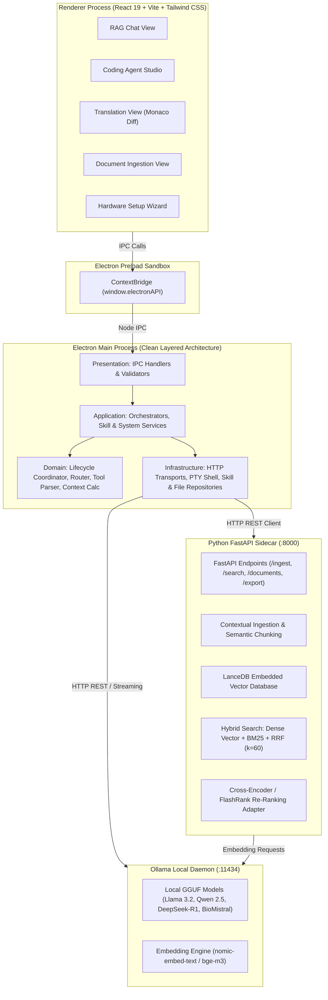
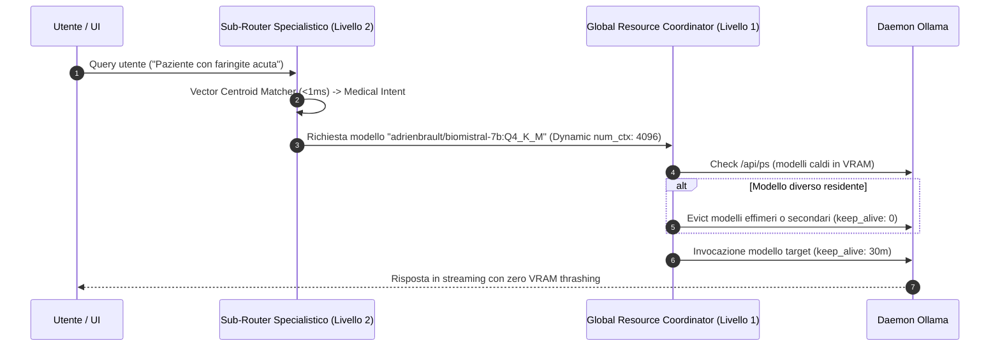
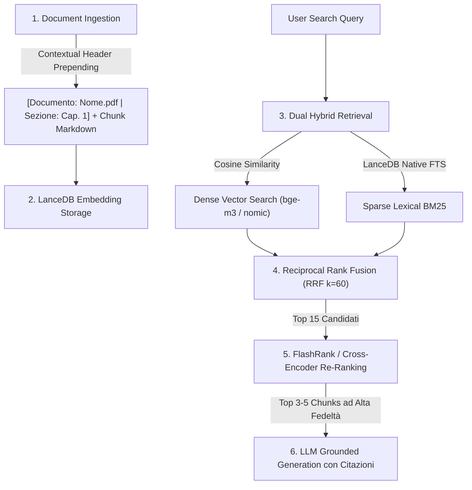

# Architettura di Sistema & Flussi Dati — OnlyRag V2

OnlyRag V2 adotta un'architettura **Multi-Process Locale Disaccoppiata e Sovrana** basata su **Electron**, **React 19**, **FastAPI Sidecar**, **LanceDB Embedded Vector DB** e il runtime locale **Ollama**.

---

## 1. Topologia di Sistema e Diagramma dei Componenti



---

## 2. Layered Clean Architecture (Electron Main Process)

Il processo principale di Electron rispetta rigorosamente il modello **Layered Architecture a 4 Livelli**:

```
Presentation Layer (IPC / UI Routing)
       │
       ▼
Application Layer (Use Cases & Orchestration)
       │
       ▼
Domain Layer (Pure Business Rules, Entities & Algorithms)
       │
       ▼
Infrastructure Layer (File System, PTY, HTTP Clients, Database)
```

| Livello | Directory | Responsabilità Principale | Dipendenze Consentite |
| :--- | :--- | :--- | :--- |
| **Presentation** | `electron/core/presentation/` | Registrazione dei canali `ipcMain.handle`, validazione input IPC e serializzazione risposte. | Application Layer |
| **Application** | `electron/core/application/` | Orchestrazione dei casi d'uso (Agent Tool Loop, Lifecycle dei modelli, gestione skill, sidecar e workspace). | Domain, Infrastructure |
| **Domain** | `electron/core/domain/` e `shared/domain/` | Logica pura di business: `modelUpdateChecker`, `toolParser`, `diffEngine`, `promptCompiler`, `modelContextPreference`, `planCompilation`. Zero dipendenze da I/O o framework. I domini condivisi risiedono in `shared/domain/` per isolamento dal Renderer. | Nessuna (Puro TS) |
| **Infrastructure** | `electron/core/infrastructure/` | Interazione con I/O: `ollamaHttpClient`, `sidecarHttpClient`, `agentStreamTransport`, `fileSystemRepository`, `compactSemanticRepoMapper`, `persistentPowerShellSession`. | Standard APIs, Node.js libs |

Stato audit: Isolamento totale dei confini di processo (0 import Renderer $\rightarrow$ Main). La logica pura condivisa risiede in `shared/domain/`. `sidecarAppService.ts` delega tutto l'I/O di rete a `sidecarHttpClient.ts` in Infrastructure e incorpora la diagnostica log. `ollamaHttpClient.ts` unifica le letture di `/api/tags` in un unico percorso dati condiviso. `systemIpc.ts` delega a `systemAppService.ts` e `taskAppService.ts`; `diagnosticsIpc.ts` delega a `diagnosticsAppService.ts`.

Per i dettagli approfonditi su ciascun ambito, consultare:
- [Autonomous Coding Agent](./agent.md)
- [Pipeline RAG & Sidecar](./rag-sidecar.md)
- [Electron Main Process](./electron-main.md)
- [Frontend React 19](./frontend.md)
- [Contratti IPC](./api-ipc.md) & [REST API](./api-rest.md)
- [Operazioni e Toolchain](./operations.md)
- [Razionali Ingegneristici ed Evidenze](./code-rationales.md)

---

## 3. Router Gerarchico a 2 Livelli (Zero VRAM Thrashing)

OnlyRag V2 previene la saturazione della VRAM e il thrashing dei modelli attraverso un router a due stadi:



### Livello 1: Global Resource & Lifecycle Coordinator
- **Model Pinning**: Mantiene residente in memoria il modello di lavoro primario (`keep_alive: '30m'`).
- **Ephemeral Eviction**: I modelli di supporto (traduzione rapida o OCR) vengono scaricati immediatamente dopo l'esecuzione (`keep_alive: 0m`).
- **Model Context Selection**: Risolve `num_ctx` dal default hardware, dalla preferenza per modello e dal `context_length` supportato; il budget del prompt viene compattato separatamente.
- **Coding Studio Primary Workhorse Model**: Architettura basata su **Modello di Lavoro Fisso (Workhorse Model)** impostato dall'utente (`codingModel`, es. `qwen2.5-coder:7b`). Il modello rimane stabilmente allocato in memoria per tutta la sessione garantendo il riutilizzo della KV-cache (zero VRAM thrashing e zero latenza di reload). L'esecuzione avviene direttamente tramite streaming HTTP su daemon locale o server Ollama remoto.
- **RAG Chat Domain Sub-Router**: Classificazione semantica tramite **Vector Centroid Semantic Matching** ($<1\text{ms}$) tra Medical, Legal e General.
- **Chit-Chat Direct Bypass**: Identificazione di saluti o domande convenzionali per escludere il retrieval vettoriale riducendo la latenza a $<100\text{ms}$.
- **Proprieta' del Sidecar all'Avvio (`orphanPortReclaim.ts` + `SidecarProcessManager.reclaimOrphanSidecarPort`)**: All'avvio, se l'endpoint `/health` risponde ma il riferimento `sidecarProcess` del processo Electron corrente è nullo, il sistema identifica il processo in ascolto su `:8000` (`netstat -ano`), ne verifica l'immagine eseguibile (`tasklist`) e lo termina solo se appartiene alla lista chiusa di binari autorizzati (`sidecar.exe`, interpreti Python).

---

## 4. Pipeline RAG Ibrida & Multi-Stage Retrieval



1. **Contextual Retrieval**: Durante l'ingestione semantica, ogni chunk viene arricchito con un header contestuale che include il documento e la gerarchia delle sezioni.
2. **Dual Hybrid Search**: Combina ricerca vettoriale densa e ricerca lessicale full-text BM25 in LanceDB.
3. **Reciprocal Rank Fusion (RRF)**: Fusione normalizzata dei punteggi dei due ranking:
   $$\text{RRF}(d) = \sum_{m \in \{\text{dense}, \text{sparse}\}} \frac{1}{60 + r_m(d)}$$
4. **In-Process Re-Ranking Adapter**: Re-ranking cross-encoder ultra-veloce tramite `flashrank` su CPU o motore semantico di prossimità termica $(<20\text{ms})$.

---

## 5. Agent Studio: Tool Loop & Resilienza

- **Autonomous Tool Calling Loop**: Ispezione (`read_file`, `list_dir`, `grep_search`), modifica (`replace_file_content`, `multi_replace_file_content`, `write_file`), esecuzione (`run_command` in sessione persistente PowerShell, `inspect_os_env`) e web research (`fetch_web_content`, `web_search`).
- **Strict Serial Concurrency Queue (`TaskQueueAppService` & `PQueue`)**: Tutti i task agentici sono serializzati atomicamente (`concurrency: 1`), azzerando le race condition.
- **Action Loop Fingerprinting & Multi-State Oscillation Prevention**: Rilevamento avanzato di loop ripetuti o alternati a $k$-stati con iniezione di direttive correttive forzate.
- **Transactional Workspace Journal (`AtomicWorkspaceJournal`)**: Snapshot preventivo del workspace prima di ogni mutazione, con rollback automatico in caso di errore o abort.
- **Plan Approval System**: Decomposizione in milestone falsificabili con avanzamento convalidato esclusivamente su evidenza reale su filesystem e test superati.
- **SLM Log Diagnostics**: Analisi anomalie a doppio motore (FastAPI Sidecar su `/agent/logs/analyze` e fallback nativo Node.js) con suggerimenti operativi di ripristino (*remediation*).
