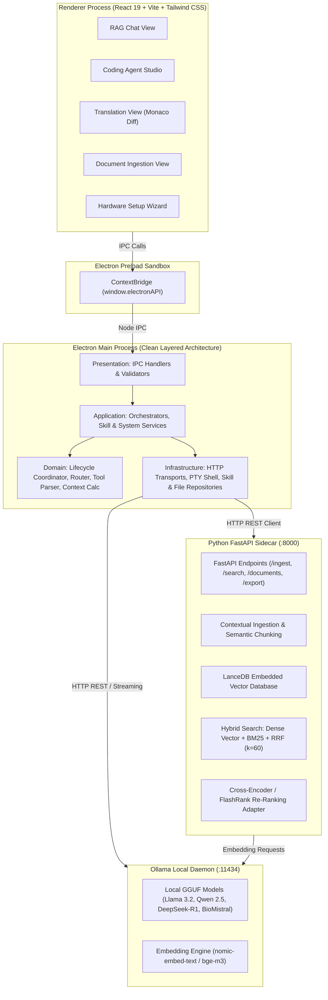
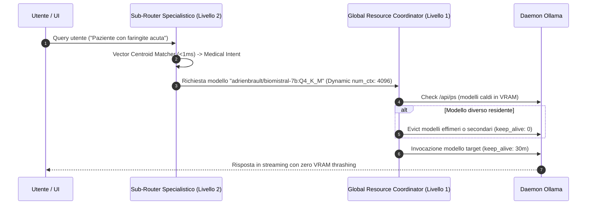
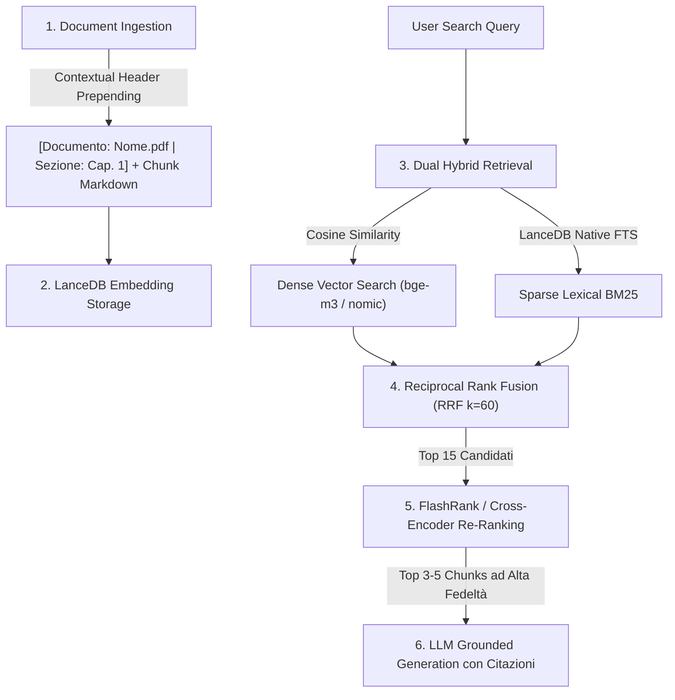

# Architettura di Sistema & Flussi Dati — OnlyRag V2

OnlyRag V2 adotta un'architettura **Multi-Process Locale Disaccoppiata e Sovrana** basata su **Electron**, **React 19**, **FastAPI Sidecar**, **LanceDB Embedded Vector DB** e il runtime locale **Ollama**.

---

## 1. Topologia di Sistema e Diagramma dei Componenti



---

## 2. Layered Clean Architecture (Electron Main Process)

Il processo principale di Electron rispetta rigorosamente il modello **Layered Architecture a 4 Livelli**:

```
Presentation Layer (IPC / UI Routing)
       │
       ▼
Application Layer (Use Cases & Orchestration)
       │
       ▼
Domain Layer (Pure Business Rules, Entities & Algorithms)
       │
       ▼
Infrastructure Layer (File System, PTY, HTTP Clients, Database)
```

| Livello | Directory | Responsabilità Principale | Dipendenze Consentite |
| :--- | :--- | :--- | :--- |
| **Presentation** | `electron/core/presentation/` | Registrazione dei canali `ipcMain.handle`, validazione input IPC e serializzazione risposte. | Application Layer |
| **Application** | `electron/core/application/` | Orchestrazione dei casi d'uso (Agent Tool Loop, Lifecycle dei modelli, gestione skill e workspace). | Domain, Infrastructure |
| **Domain** | `electron/core/domain/` | Logica pura di business: `lifecycleCoordinator`, `toolParser`, `contextWindowCalculator`, `agentPromptAssembler`, `hardwareProfileResolver`. Zero dipendenze da I/O o framework. | Nessuna (Puro TS) |
| **Infrastructure** | `electron/core/infrastructure/` | Interazione con I/O: `ollamaHttpClient`, `agentStreamTransport`, `fileSystemRepository`, `skillRepository`, `ptySessionManager`. | Standard APIs, Node.js libs |

---

## 3. Router Gerarchico a 2 Livelli (Zero VRAM Thrashing)

OnlyRag V2 previene la saturazione della VRAM e il thrashing dei modelli attraverso un router a due stadi:



### Livello 1: Global Resource & Lifecycle Coordinator
- **Model Pinning**: Mantiene residente in memoria il modello di lavoro primario (`keep_alive: '30m'`).
- **Ephemeral Eviction**: I modelli di supporto (traduzione rapida o OCR) vengono scaricati immediatamente dopo l'esecuzione (`keep_alive: 0m`).
- **Dynamic Context Window Throttling**: Calcola e assegna `num_ctx` in bucket ottimali ($2048 \rightarrow 65536$) basandosi sulla dimensione effettiva del prompt e della cronologia.

- **Coding Studio Primary Workhorse Model**: Architettura basata su **Modello di Lavoro Fisso (Workhorse Model)** impostato dall'utente (`codingModel`, es. `qwen2.5-coder:7b`). Il modello rimane stabilmente allocato in memoria per tutta la sessione garantendo il riutilizzo della KV-cache (zero VRAM thrashing e zero latenza di reload). L'esecuzione avviene direttamente tramite streaming HTTP su daemon locale o server Ollama remoto.
- **RAG Chat Domain Sub-Router**: Classificazione semantica tramite **Vector Centroid Semantic Matching** ($<1\text{ms}$) tra Medical, Legal e General. Il modello per dominio è risolto da `settings.medicalModel`/`settings.legalModel` (configurabili in AppSettings, selezionabili dal Setup Wizard o al volo tramite `QuickModelSelector`) con fallback sul `defaultModel` generale se non impostati. Entrambi i domini hanno un catalogo dedicato e completo su tutti i 5 tier hardware (`MEDICAL_TIER_CATALOG`/`LEGAL_TIER_CATALOG` in `hardwareModelCatalog.ts`): fallback agnostico `llama3.2:3b` su legacy/entry/midrange, modelli specializzati (`adrienbrault/biomistral-7b:Q4_K_M` per Medical, `llama3.1:8b`/`mistral-small3.2:24b` per Legal) su highend/extreme.
- **Chit-Chat Direct Bypass**: Identificazione di saluti o domande convenzionali per escludere il retrieval vettoriale riducendo la latenza a $<100\text{ms}$.
- **Proprieta' del Sidecar all'Avvio (`orphanPortReclaim.ts` + `SidecarProcessManager.reclaimOrphanSidecarPort`)**: `startPythonSidecar` adottava in silenzio qualsiasi processo che rispondesse su `/health`. Dopo la sessione utente delle 13:45-13:52 il sidecar Python (PID 13664) e' rimasto in ascolto su `:8000` con Electron gia' terminato e senza alcuna riga `before-quit` in `app.log`: al riavvio l'app riusava quel processo. L'adozione sembra innocua e non lo e' — l'orfano non e' figlio del processo Electron corrente, quindi `stopPythonSidecar` su di esso e' un no-op per sempre (l'orfano sopravvive anche a tutte le sessioni successive) e dopo un aggiornamento l'app servirebbe con il binario della build precedente. Se `/health` risponde ma `sidecarProcess` e' `null`, il processo in ascolto viene identificato (`netstat -ano`), la sua immagine letta (`tasklist`) e terminata solo se appartiene a una lista **chiusa** di eseguibili noti (`sidecar.exe`, gli interpreti Python): terminare un processo estraneo che per caso risponde su quella porta sarebbe peggio del lasciare un orfano. Il processo corrente e' sempre escluso. Se l'identificazione fallisce o l'immagine non e' riconosciuta, il comportamento resta quello precedente (riuso, con un WARN esplicito che la sessione non ne possiede il ciclo di vita). La rete e' all'**avvio** per costruzione: quando Electron viene terminato senza eseguire gli handler, nessun hook di chiusura puo' rimediare, quindi il punto di recupero deve stare nella sessione successiva. Parsing e policy vivono in un modulo puro, testato anche contro l'avviso localizzato di `tasklist` (su Windows italiano risponde "Informazioni: nessuna attivita'...", quindi il testo inglese `INFO:` non e' un discriminante affidabile: lo e' l'assenza di virgolette).

---

## 4. Pipeline RAG Ibrida & Multi-Stage Retrieval



1. **Contextual Retrieval (Anthropic Standard)**: Durante l'ingestione semantica, ogni chunk viene arricchito con un header contestuale che include il documento e la gerarchia delle sezioni.
2. **Dual Hybrid Search**: Combina ricerca vettoriale densa e ricerca lessicale full-text BM25 in LanceDB.
3. **Reciprocal Rank Fusion (RRF)**: Fusione normalizzata dei punteggi dei due ranking:
   $$\text{RRF}(d) = \sum_{m \in \{\text{dense}, \text{sparse}\}} \frac{1}{60 + r_m(d)}$$
4. **In-Process Re-Ranking Adapter**: Re-ranking cross-encoder ultra-veloce tramite `flashrank` su CPU o motore semantico di prossimità termica $(<20\text{ms})$.

---

## 5. Agent Studio: Tool Loop, Resilienza & Transazionalità

- **Autonomous Tool Calling Loop**:
  - **Ispezione & Navigazione**: `read_file` (con line slicing), `list_dir`, `grep_search`, `extract_code_symbols` (estrazione AST tramite TypeScript Compiler API per file TS/JS/TSX/JSX e tokenizer poliglotto per altri linguaggi).
  - **Modifica & Patching**: `replace_file_content` (fuzzy matching con tolleranza Levenshtein calcolata via `fast-levenshtein` e AST pre-commit validation via `fuzzyPatchEngine.ts`), `multi_replace_file_content`, `write_file` (con validazione AST sintattica in-flight), `delete_file`.
  - **Esecuzione & Diagnostica**: `run_command` (shell persistente PowerShell non-interattiva — `persistentPowerShellSession.ts` — con environment CI=true ed early-abort su prompt interattivi rilevati via `shellStreamGuard.ts`), `run_tests` (rileva ed esegue il test runner del workspace con pass/fail strutturato), `inspect_os_env` (report di sistema e inventario toolchain: node, npm, pnpm, git, python, ollama), `ensure_tool` (installazione non-interattiva 1-click via winget per i tool mancanti), `finish`.
  - **Web & Risorse**: `web_search` (query DuckDuckGo con parsing DOM via `cheerio`), `fetch_web_content` (conversione HTML in Markdown ad alta fedeltà con `turndown` e mitigazione SSRF), `download_file`.
  - **Interazione Utente**: `ask` (alias `ask_question`) per chiarimenti diretti.
- **Strict Serial Concurrency Queue (`TaskQueueAppService` & `PQueue`)**:
  - Tutti i task agentici sono gestiti tramite istanza atomica `PQueue({ concurrency: 1 })`, garantendo la totale assenza di race conditions e rispettando le direttive globali di serializzazione atomica del workspace.
- **Native Tool-Calling Routing (`ollamaToolCallingCapability.ts` & `ollamaToolSchemaCatalog.ts`)**:
  - Per ogni turno, rileva se il modello target supporta il tool-calling nativo di Ollama: segnale primario il campo `capabilities` di `/api/tags` (autoritativo se presente), fallback su allow-list di famiglie note (`llama3.1+`, `qwen2.5+`, `qwen3`, `mistral-nemo`, `command-r`, ...).
  - Quando disponibile, instrada su `POST /api/chat` con il catalogo strutturato dei 27 tool invece del solo prompt-engineering. La risposta (`message.tool_calls` oppure, per modelli come la famiglia Qwen che spesso restituiscono la chiamata come testo JSON in `message.content`, il testo grezzo) viene normalizzata nello stesso formato testuale già compreso da `toolParser.ts`, così la pipeline di parsing ed esecuzione tool resta identica indipendentemente dal percorso di dispacciamento usato.
- **Action Loop Fingerprinting & Multi-State Oscillation Prevention (`AgentActionLoopDetector`, incorpora internamente `CycleOscillationDetectorAndReproOracle`)**:
  - Ogni invocazione di tool viene tracciata tramite hash crittografico deterministico SHA-256 (`tool:parameters`) da un'unica istanza per sessione.
  - Rilevamento avanzato di cicli alternati di oscillazione a $k$-Stati ($k \in [2, 4]$, es. $A \rightarrow B \rightarrow A \rightarrow B$). Se l'agente instaura un ciclo alternato o ripete la stessa azione $\ge 2$ volte, il runtime inietta una direttiva correttiva forzata (`[CRITICAL LOOP INTERVENTION]`) ed uno script di riproduzione TDD.
- **Distinzione fra Ripetizione Riuscita e Ripetizione Fallita (`recordOutcome` / `classifyRepeatOutcome` + `resolveRedundantSuccessAction`)**:
  - Il detector registrava solo l'*intenzione* (la tool call, prima dell'esecuzione), quindi ogni ripetizione veniva letta come fallimento. Nella sessione di audit o3tx `npm install` era riuscito agli step 12 e 13, la terza chiamata identica e' stata bloccata e la milestone m-12 e' finita `failed` fra le abbandonate del report finale: lavoro effettivamente completato, riportato come non svolto.
  - `agentOrchestratorToolResultProcessor` richiama ora `loopDetector.recordOutcome(parsedTool, !isToolFailure)` dopo ogni esecuzione, chiudendo il ciclo di feedback. La classificazione usa l'esito **piu' recente** per fingerprint: un comando riuscito due volte e poi rotto torna a essere una ripetizione fallita.
  - Una ripetizione `succeeding` riceve una direttiva opposta (`[REDUNDANT ACTION: ... ALREADY SUCCEEDED N TIME(S)]`, che ordina di avanzare al passo successivo invece di cercare un errore inesistente), **non** incrementa `stagnationStreak` e non innesca `forceMilestoneAdvance`: nessuna milestone viene piu' marcata `failed` per lavoro andato a buon fine.
  - L'esenzione e' limitata, non incondizionata: la scala di escalation e' l'unica cosa che termina una sessione che non esce mai dal loop. Dopo `REDUNDANT_SUCCESS_ADVISORY_ATTEMPTS` (3) blocchi consecutivi, contati in `redundantSuccessStreak`, la ripetizione rientra nel percorso di stagnazione ordinario — la garanzia di terminazione e' rinviata, mai rimossa.
  - La memoria degli esiti sopravvive a `resetTarget` (il fatto che quel comando sia riuscito resta vero anche dopo che il piano avanza) e viene cancellata solo da `reset()`.
- **Escape Strutturale dal Loop (`loopEscapePolicy.ts` + `forceMilestoneAdvance`)**:
  - La sola direttiva testuale non basta: un modello che non sa agire su di essa riemette la stessa tool call, e il guard rinvia lo stesso identico stato di piano. La policy scala quindi su tre livelli in base allo streak di blocchi consecutivi (`stagnationStreak`, azzerato da qualsiasi tool eseguito con successo): `advise` (solo testo) -> `force_milestone_advance` -> `abort`.
  - Su `force_milestone_advance` la milestone attiva viene marcata `failed` (mai `verified`: il lavoro non e' stato svolto e progresso, tracker e gate DoD devono continuare a dirlo) e il focus passa alla successiva, cosi' il prompt del turno seguente chiede un deliverable diverso. La memoria del detector sul target bloccato viene azzerata, perche' la nuova milestone puo' legittimamente doverlo toccare.
  - L'escalation alterna: fra due escape strutturali resta sempre un turno di sola direttiva testuale, per dare al modello un tentativo pulito sulla nuova milestone.
  - Quando resta solo la milestone di chiusura, `compileProgressPrompt` emette il blocco `[NO OPERATIONAL MILESTONES REMAIN]` invece del normale focus block. Il ramo generico sarebbe contraddittorio in quel punto: mostrerebbe come milestone attiva "invoke finish" mentre la sua stessa direttiva 4 vieta di chiudere finche' tutto non e' verificato, condizione resa permanentemente falsa dalle milestone abbandonate. Senza mosse legali il modello chiedeva chiarimenti e la sessione moriva `STOPPED/FAILED`. Coerentemente, il gate Definition of Done non conta piu' le milestone `failed` fra il lavoro pendente: sono lavoro abbandonato, da riportare nel resoconto finale, non da verificare.
- **AST-Aware Compact Repo Mapper (`compactSemanticRepoMapper.ts` → `generateCompactRepoMap()`)**:
  - Scansione ad alta densità sintattica della struttura del repository con estrazione dell'albero dei simboli esportati (`class`, `function`, `interface`, `type`) per la generazione di una Repo Map ottimizzata per il budget del contesto.
- **Optimizations per Hardware Minimo (Previeni Runaway Loops >300 Step)**:
  - **`DiagnosticOutputReducer` (`extractErrorDiagnostics()`)**: Estrazione deterministica dei blocchi di errore e numeri di riga dai log di terminale per una diagnostica ad alta precisione.
  - **`StagnationCircuitBreaker`**: Interruttore automatico di blocco sulle streak di inattività o errori ripetuti per prevenire loop infiniti runaway.
  - **Cap Deterministico del Piano (`planMilestoneCapper.ts`)**: Il piano e' limitato a `MAX_PLAN_MILESTONES` (15) in tutti i punti di parsing (generazione, ri-parsing di testo modificato manualmente, auto-rilevazione e revisione `<plan>` nel loop). L'eccedenza non viene scartata ma fusa: milestone consecutive vengono raggruppate in bucket di dimensione uniforme (differenza massima di 1), cosi' ogni requisito emesso dal planner raggiunge comunque l'agente. Un'eventuale milestone finale di chiusura resta esclusa dalla fusione e viene riaccodata per ultima.
  - **Piano Falsificabile (`planFalsifiabilityNormalizer.ts`)**: i planner emettono abitualmente voci che non sono step ("Design the two-column layout for tablet", "Ensure buttons have a minimum touch target of 44x44 px"): non nominano artefatti, non portano comandi, nulla puo' mostrare che siano state fatte o meno. Sono criteri di accettazione di lavoro descritto altrove nel piano. Vengono ripiegati come criteri sulla milestone di cui qualificano il deliverable — quella precedente, o la prima successiva se compaiono in testa — cosi' nessun requisito va perso e l'agente li legge comunque, attaccati al file che vincolano. Una milestone e' falsificabile se nomina un percorso, contiene un token fra backtick (percorso o comando), porta un `verificationCommand`, oppure e' la milestone di chiusura.
  - **Pipeline Unica del Piano (`planCompilation.ts`)**: parsing, normalizzazione e cap venivano applicati ad hoc nei quattro punti di ingresso, che potevano quindi divergere su cosa fosse il piano. Ora sono una sola funzione, nell'ordine obbligatorio parse -> normalizza -> cap: i criteri ripiegati al passo 2 sono voci che il cap non deve piu' fondere, cosi' il budget del cap va sul lavoro reale. La soglia `>= 2` che decide se il modello ha davvero emesso una checklist si applica ai milestone PARSATI, non a quelli compilati: applicarla dopo faceva scartare interi piani di due voci di cui una era un criterio.
- **Audit Log dell'Agente (`codingAgentLogger.ts`)**:
  - **Prompt in delta**: ogni prompt di turno e' una testa stabile (istruzione utente, regole) seguita dalle parti che si muovono (stato del piano, traiettoria, output dei tool). Riscrivere la testa ad ogni step rendeva i prompt il 69% di un log da 734 KB per una sola sessione da 38 step. Viene ora eliso il prefisso condiviso con il prompt del passo PRECEDENTE (non con il primo: passi adiacenti condividono molto di piu', misurato -76% contro -50% su quella sessione), allineato al confine di riga e con riferimento esplicito al passo di ancoraggio. Un prompt che diverge presto viene scritto per intero.
  - **Transizioni invece di snapshot**: il dump completo del piano ad ogni step (14% del file) e' sostituito da un dump quando il piano viene creato o revisionato, piu' un record `[MILESTONE m-N: DA -> A]` per ogni cambio di stato con la causa che l'ha prodotto. `GoalDecompositionPlanner` espone `onMilestoneTransition` e resta privo di dipendenze dal logging: annuncia il cambio, il layer applicativo decide cosa farne.
  - **Copertura completa dei percorsi di chiusura**: l'abort per stagnazione e il circuit breaker non chiamavano `logSessionEnd`, quindi il log si interrompeva senza esito registrato (sessione nkn0: 38 step e nessun modo di sapere dal log se fosse finita, crashata o arresa).
  - **SESSION_TRACKER.md**: le voci completate riportano la causa della chiusura, non solo il fatto che siano chiuse.
- **Guardia sugli Scaffolder (`commandTouchedFilesScanner.createdTopLevelDirs`)**: la radice del workspace E' la radice del progetto, ma un generatore a cui viene passato un nome di progetto crea una sottocartella e ci mette dentro tutto. La regola esisteva solo nel prompt del planner, che l'agente esecutore non vede mai: nella sessione nkn0 lo step 1 ha eseguito `npx create-react-app project-dashboard-task`, creato `test_app/project-dashboard-task`, fallito a meta' installazione e ripulito solo in parte. Dopo ogni `run_command` le directory di primo livello create dal comando (per data di creazione, non di modifica: la mtime di una directory cambia ad ogni file scritto dentro) vengono rilevate e segnalate all'agente — con una direttiva diversa a seconda che il comando sia riuscito (progetto nel posto sbagliato) o fallito (residui da ripulire). Non vengono mai cancellate d'ufficio. I residui di un comando fallito non contano come mutazioni e non fanno avanzare alcuna milestone.
- **Direct Stream Transport & Remote Ollama Support (`AgentStreamTransport`)**:
  - Esecuzione trasparente e diretta sul modello configurato per lo sviluppo (`codingModel`), con supporto a streaming SSE continuo su endpoint locale (`http://127.0.0.1:11434`) o server Ollama remoto configurato in rete locale/remota.
- **Transactional Workspace Journal (`AtomicWorkspaceJournal`)**:
  - Prima di qualsiasi operazione di scrittura, patch o cancellazione file, viene salvato uno snapshot preventivo in memoria.
  - In caso di annullamento da parte dell'utente o fallimento non sanabile, viene eseguito il `rollbackAll()` ripristinando istantaneamente il filesystem allo stato pre-task. A task concluso con successo, le modifiche vengono consolidate (`commit()`).
- **Auto-Healing Loop**: Se l'esecuzione di un comando fallisce (exit code non nullo o presenza di errori nello stack trace), l'output viene formattato come blocco diagnostico e rinviato al modello per l'auto-correzione autonoma.
- **Project Workspaces & Nested Sessions**:
  - Ogni progetto memorizza la radice del workspace e una collezione isolata di sessioni di lavoro nidificate (`CodingSession`).
  - Passaggio istantaneo tra conversazioni parallele nello stesso progetto con persistenza dello storico delle modifiche.
- **Cronologia Sessioni su Filesystem (`sessionHistoryRepository`)**:
  - Unica fonte di verita' della cronologia: `<workspace>/.onlyrag/sessions/session_history.json` (fallback `~/.onlyrag_v2/sessions/session_history.json` per le sessioni standalone), esposta al renderer dai canali CRUD `sessions:*`. Il renderer non persiste piu' sessioni in `localStorage`; le sessioni legacy (`onlyrag_coding_sessions_v2`) vengono importate una tantum al primo avvio.
  - Ogni sessione contiene i suoi `ExecutedPrompt` (prompt, timestamp ISO 8601, modalita', esito, step totali, file toccati, righe +/-) e i suoi `AgentPlan` (versioni di piano con milestone canonici), da cui la UI deriva titolo, metriche e storico piani. Eliminare una sessione elimina prompt e piani con essa, senza record orfani. Lo stato runtime dell'agente (`.onlyrag/sessions/.agent_state_*.json`) resta limitato a cio' che serve per riprendere il loop (episodi, milestone, step), senza duplicare i dati di cronologia.
- **Session State Checkpointing (`persistCurrentState`)**:
  - Lo stato di sessione (`.onlyrag/sessions/.agent_state_*.json`: milestone, episodi, step) viene persistito ogni N step (default 5) e immediatamente dopo ogni mutazione file riuscita, invece che ad ogni singolo step, riducendo il churn I/O senza sacrificare la ripristinabilità.
  - Tutti i percorsi di uscita della sessione (finish, cancel, errore LLM, timeout, circuit-breaker di stagnazione, modalità PLAN) persistono incondizionatamente prima di terminare, garantendo che lo stato osservabile da disco non sia mai più vecchio dell'ultima azione osservabile dall'utente.

### 5.1. Plan Approval System (`GoalDecompositionPlanner` come Unica Fonte di Verità)

- **Backend Planner Canonico (`GoalDecompositionPlanner`, `electron/core/domain/agent/planAndSolveGraph.ts`)**: Unica fonte di verità per lo stato di completamento del piano (`PlanMilestone[]`, stati `pending`/`in_progress`/`verified`/`failed`), persistito da `agentOrchestratorAppService.persistCurrentState()` e riletto ad ogni riavvio di sessione (`goalPlanner.loadMilestones(savedState.planMilestones)`).
- **Chiusura Milestone Solo su Evidenza (`milestoneDeliverableResolver.ts` + `workspaceDeliverableProbe.ts`)**: una milestone si chiude automaticamente a una sola condizione: il file appena scritto e' fra quelli che la milestone stessa dichiara (`isDeliverableOfMilestone`) E tutti i file che nomina sono su disco con contenuto reale. "Con contenuto" era letteralmente dimensione maggiore di zero, quindi un file con dentro `// TODO: implement` chiudeva la sua milestone: `isPlaceholderContent` ora scarta i corpi segnaposto (solo commenti, sotto la soglia minima, oppure poche righe dominate da un marker di rinvio tipo TODO/FIXME/placeholder). Il probe legge il corpo solo sotto i 4 KB, perche' nessun segnaposto e' piu' lungo di cosi' e i file veri restano al costo di un solo `statSync`. Il controllo e' volutamente conservativo: un falso positivo lascia la milestone `unsatisfied`, che e' la direzione sicura. Servono entrambe le meta': senza la prima, una scrittura su `src/App.tsx` chiudeva qualunque milestone fosse attiva; senza la seconda, una milestone consegnata a meta' si chiudeva al primo file. Una milestone che non nomina alcun artefatto NON viene mai chiusa qui. Lo faceva, sul presupposto che nulla potesse falsificarla e quindi bloccarvisi fosse deadlock, ma questo fabbricava la verifica invece di concederla: nella sessione nkn0 il piano ha dichiarato "Run the application to ensure it is fully runnable" come verificata, a 13/15 complessivo, mentre il modello stava ancora scrivendo `src/App.tsx` e il progetto non aveva alcun entrypoint. Quelle milestone si chiudono ora solo con evidenza reale — un comando di verifica riuscito o un `update_plan` che il workspace non contraddice — e a impedire il deadlock e' l'escape strutturale del loop guard, non un pass fabbricato.
- **Freschezza della Build (`agentOrchestratorCircuitBreakerAndVerification.ts`)**: `hasVerifiedBuild` era monotono — alzato da una qualsiasi build/test/typecheck riuscita, non veniva mai piu' abbassato, quindi il gate Definition of Done accettava una build dello step 10 come prova per file scritti allo step 30. Ogni mutazione di file ora invalida il flag, legando il gate al codice che esiste davvero al momento della chiusura. Una build che scrive i propri artefatti (`dist/`) non invalida se stessa: `trackVerification` gira dopo `recordCommandTouchedFiles` e `recordMutationSideEffects` nello stesso tool result, quindi rialza il flag nello stesso step in cui lo ha azzerato.
- **Un Solo Ramo nei Prompt di Chat (`promptPresets.ts` + `useChatEngine.ts`)**: i preset di chat sono statici e finivano nel prompt di ogni turno, documento allegato o meno. Contenevano anche il copione del caso opposto ("When NO documents are selected ... invite them to select a document from the left sidebar or mention '@filename'"), e un modello piccolo non sceglie il ramo giusto: con llama3.2:3b e il PDF regolarmente allegato, 3 domande su 5 hanno restituito quel copione alla lettera mentre il pannello citazioni mostrava i due estratti recuperati. La direttiva dipendente dallo stato vive ora solo nel blocco assemblato per turno, l'unico punto che sa se c'e' davvero un allegato: `[INDEXED DOCUMENT CONTEXT]` quando c'e', `[ATTACHMENT CONTEXT STATUS]` quando non c'e'. Misurato sullo stesso documento e sulle stesse domande: 3/5 rifiuti prima, 0/5 dopo.
- **Verifica Reale invece di Presenza su Disco (`projectVerificationResolver.ts`, `milestoneVerificationPromotion.ts`, `verificationGatePolicy.ts`, `agentOrchestratorVerificationRunner.ts`)**: scrivere un file non chiude piu' la sua milestone. Nella sessione o3tx questo portava 11 milestone su 14 a `verified` in 48 secondi e il progresso al 73%, su un progetto senza entrypoint, con tre dipendenze importate e mai dichiarate e la UI costruita con Material UI mentre il task chiedeva Tailwind. Il deliverable su disco porta ora la milestone a `in_progress`; la promozione a `verified` avviene solo quando una verifica reale passa, e allora vale per tutte le milestone i cui deliverable sono presenti — una build verde attesta i file che ha compilato. Restano escluse le milestone che non nominano artefatti (nulla che la build ha compilato puo' parlare per loro), quelle gia' fallite e quella di chiusura. Il comando di verifica si ricava dal manifest del progetto, mai dal modello: gli script dichiarati (build, typecheck, test, lint) filtrati per quelli che terminano davvero — un dev server scelto come prova di build resterebbe appeso fino al timeout e un blocco e' indistinguibile da un successo. Le dipendenze si controllano con `depcheck` prima della build, perche' un import non dichiarato fa fallire la compilazione con un messaggio che un modello piccolo interpreta male, mentre nominare pacchetto e file lo rende correggibile. Al `finish` il gate non avvisa piu' una volta e poi cede: esegue la verifica, e se fallisce restituisce l'errore al modello per la correzione, fino a 3 giri. Esauriti i giri la sessione si chiude FAILED, mai COMPLETED come in o3tx.
- **Autorita' sugli Stati del Piano (`milestoneUpdateAuthority.ts`)**: `update_plan` era assoluto e qualsiasi stato dichiarato dal modello veniva scritto senza filtro. Un modello che si autodiagnostica male distruggeva il proprio piano (sessione o5fk: m-4 marcata `failed` con una nota copiata da un vecchio messaggio di loop intervention, m-5 riportata da `verified` a `in_progress` conservando la nota "Auto-verified" ormai falsa; quattro delle cinque milestone failed avevano i deliverable su disco). Vince l'evidenza su disco: un aggiornamento no-op viene respinto (costava un round-trip completo senza muovere nulla), una milestone `verified` non viene mai retrocessa (lo stato del piano non blocca alcun tool, quindi riaprirla non serve a rilavorare un file) e `failed` viene rifiutato finche' i deliverable citati nel titolo esistono con contenuto. Le note vengono sostituite, mai unite, perche' un cambio di stato invalida quanto il precedente diceva di se'.
- **Verifica Reale contro Anteprima (`browserPreviewVerification.ts`)**: `open_in_browser` soddisfaceva il gate Definition of Done qualunque fosse il target. Nella sessione o5fk l'agente ha aperto `src/pages/Dashboard.tsx` e questo da solo ha impostato `hasVerifiedBuild`, verificato la milestone "Validate the interface at 320px...1440px" e sbloccato la chiusura, certificando un progetto che non poteva partire (`index.html` puntava a un `src/main.tsx` mai scritto). Ora vale come verifica solo un artefatto realmente renderizzato (`.html`, `.svg`, `.pdf`, immagini, URL http/https); su un sorgente non conta e il gate pretende una build o un typecheck riuscito.
- **Tracciamento dei File Prodotti da Shell (`commandTouchedFilesScanner.ts`)**: `changeStats` e' emesso solo dai rami `write_file`/`replace`/`delete`, quindi i file scritti da un comando CLI (scaffolder, codegen, formatter) non entravano in `sessionChangedFiles` e `SESSION_TRACKER.md` riportava "Modified & Created Files: None" dopo uno scaffolding riuscito. Dopo ogni `run_command` andato a buon fine il workspace viene percorso una volta e i file con `mtime` successivo all'avvio del comando vengono registrati (chiavi in path assoluto, coerenti con `changeStats`; alberi ignorati e `.onlyrag` esclusi tramite `isIgnoredPath`).
- **Generazione Piano Instradata (`planGenerationAppService.ts`)**: Il drafting del piano (hook `usePlanApproval.ts`) non usa più un `fetch()` diretto e non gestito verso Ollama dal renderer, ma il canale IPC `agent:plan-generate`, che instrada la richiesta attraverso le opzioni runtime del profilo hardware (`HardwareProfileResolver`) e restituisce sia il testo del piano sia i milestone già parsati.
- **Prova Dichiarata in Fase di Pianificazione (`buildVerificationCommandsBlock` in `planGenerationAppService.ts` + `GoalDecompositionPlanner.extractVerificationDirective`)**: il prompt di pianificazione chiedeva milestone falsificabili ma non diceva *con cosa* verificarle, quindi il modello se le inventava — nella sessione o3tx tre milestone di verifica ("Run `npm run build`", "Run `tsc --noEmit`") su un progetto che non dichiarava nessuno dei due script. Il prompt riceve ora la lista **completa e chiusa** dei comandi che il workspace offre davvero, risolta da `projectVerificationResolver` sullo stesso manifest che il gate Definition of Done esegue al `finish`: cio' che la milestone dichiara come prova e cio' che il gate esegue sono la stessa stringa. Un workspace vuoto ne offre legittimamente zero, e allora il prompt lo dice esplicitamente (`VERIFICATION COMMANDS AVAILABLE IN THIS PROJECT: NONE.`) vietando di inventarne: le milestone che producono file sono provate dai path che scrivono, e solo uno script che il piano stesso dichiara in `package.json` puo' essere citato piu' avanti. Il `workspacePath` viaggia dal renderer (`usePlanApproval`) fino al servizio attraverso `agent:plan-generate`.
  - Lato parser, `verificationCommand` sopravviveva solo al ramo JSON: un piano scritto come checklist markdown — che e' esattamente il formato richiesto dal prompt e quello che l'utente modifica a mano — non aveva modo di esprimerlo, quindi `update_plan` tornava a fidarsi della parola del modello. `parsePlanFromText` legge ora una direttiva finale di riga nelle forme `— verify: \`cmd\``, `(verifica: \`cmd\`)` e `[verification: \`cmd\`]`, tollerando gli asterischi di enfasi con cui `compileProgressPrompt` rende la stessa direttiva (il modello ne imita il formato quando revisiona il piano). La direttiva viene rimossa dal titolo, e un match che svuoterebbe il titolo viene scartato invece che applicato. Conseguenza diretta: una milestone marcata `verified` con `update_plan` fa ora eseguire quel comando per davvero (`agentOrchestratorPlanTool.ts`), invece di accettare l'autodichiarazione.
- **Parser Unico Condiviso**: Sia la generazione (`agent:plan-generate`) sia la ri-elaborazione di testo modificato manualmente (`agent:plan-parse-text`) sia l'estrazione automatica dal primo turno del modello nel loop agentico usano lo stesso parser canonico (`GoalDecompositionPlanner.parsePlanFromText`), eliminando i parser indipendenti precedentemente duplicati.
- **Seeding del Piano Approvato (`agent:plan-seed`)**: All'approvazione, i milestone vengono iniettati nello stato di sessione persistito (`agentSessionStateRepository.seedPlanMilestones`) prima dell'avvio dell'esecuzione, così il loop agentico li carica come stato iniziale invece di affidarsi alla sola auto-rilevazione da un possibile piano diverso generato dal modello al primo turno.
- **Esposizione dello Stato via IPC (`agent:get-plan-state`)**: Il frontend può leggere in ogni momento lo stato di completamento reale (verified/in_progress/failed) persistito dal backend, invece di stimare il progresso da un'euristica basata sul conteggio degli step.
- **Disaccoppiamento Invio/Generazione**: L'invio di un prompt esegue sempre direttamente il task (`c.handleAgentExecute()`); la generazione del piano è un'azione esplicita separata (icona dedicata "Genera piano" nel composer, disponibile in ogni `agentMode`), non più agganciata automaticamente ad ogni invio quando `requirePlanApproval` è attivo.
- **Consolidamento Automatico del Residuo**: Alla generazione di un nuovo piano, i milestone non verificati del piano approvato precedente vengono inclusi come contesto di riconciliazione nella richiesta al modello, così il nuovo piano assorbe lo stato pregresso invece di ripartire da zero.

---

## 6. SLM Log Diagnostics & Resilient Fallback Engine

OnlyRag V2 include un motore diagnostico avanzato di analisi anomalie nei log di sistema per identificare in tempo reale criticità di esecuzione (CUDA OOM, VRAM budget exceeded, JSON troncati, timeout Ollama, loop ricorsivi di tool, circuit breaker di stagnazione e permessi filesystem).

- **Architettura a Doppio Motore Resiliente**:
  1. **Primary Engine (Python FastAPI Sidecar — `/agent/logs/analyze`)**: Scansiona in parallelo i log applicativi con finestre scorrevoli di rilevamento pattern e calcolo metriche.
  2. **Native Electron Node.js Fallback Engine (`SidecarSlmBridgeService.analyzeLogsNativeFallback`)**: Se il sidecar Python è offline, in fase di riavvio o non raggiungibile, il processo Electron Main esegue una scansione diretta su disco dei log (`.onlyrag/logs`, `%APPDATA%/onlyrag-v2/logs`, `%LOCALAPPDATA%/OnlyRagV2/logs`, `temp`), garantendo **zero downtime e disponibilità al 100% della diagnostica**.
- **Dipendenze Escluse dal Bundle del Main Process (`vite.config.mts`, `rolldownOptions.external`)**: `depcheck` risolve i suoi parser di linguaggio a runtime con `require('./parser/<nome>')`, costruito da una lista di nomi valutata **al momento dell'import**. Inlineato in `dist-electron/main.js` quella require diventa `dist-electron/parser/coffee`, che non esiste: l'app impacchettata moriva con "A JavaScript error occurred in the main process" dopo aver scritto una sola riga di log, quella di inizializzazione del logger. Lasciato esterno viene richiesto da `node_modules`, che electron-builder impacchetta comunque (`node_modules/depcheck/dist/parser/*.js` sono dentro `app.asar`) e le sue require relative si risolvono accanto a lui. Due dettagli non ovvi: la chiave e' `build.rolldownOptions`, non `rollupOptions`, perche' Vite 8 legge la prima e `vite-plugin-electron` risolve `rolldownOptions || rollupOptions` dopo aver unito i propri default — un blocco `rollupOptions` viene scartato in silenzio, e l'unico sintomo e' un bundle delle stesse identiche dimensioni; e la regola vale per qualunque dipendenza con require dinamici, non solo per questa.
- **Attribuzione della Sessione in `app.log` (`main.ts`, riga `Run context:`)**: dev e pacchetto installato risolvono `app.getPath('userData')` allo **stesso** percorso — `%APPDATA%/onlyrag-v2` — perche' `app.getName()` legge `name` dal package.json, non `productName`. Le due modalita' scrivono quindi nello stesso `app.log` senza nulla che le distingua, e l'unico indizio accidentale era se il percorso del sidecar puntasse al repo o a `resources/`. Ogni avvio registra ora `Run context: PACKAGED|DEV | version | pid | exec | userData` come prima riga dopo il ready, cosi' una sessione e' attribuibile a vista invece che per deduzione. Utile sapere anche che il grosso del volume di `app.log` e' lo **stdout del sidecar ritrasmesso**: esiste solo finche' l'app possiede quel processo, quindi un sidecar adottato (vedi il reclamo della porta all'avvio) rende il log quasi vuoto pur essendo il logger perfettamente funzionante.
- **Actionable Remediation**: Ogni record di anomalia rilevato include una guida di ripristino contestuale (`remediation`), visualizzabile sia nella modale di diagnostica di sistema (`SystemDiagnosticsModal.tsx`) sia nella scheda dedicata del workspace `Diagnostica Log` (`SlmDiagnosticsPanel.tsx`), con supporto a filtri per severità (`CRITICAL`, `ERROR`, `WARNING`), ricerca testuale rapida ed export report Markdown.
