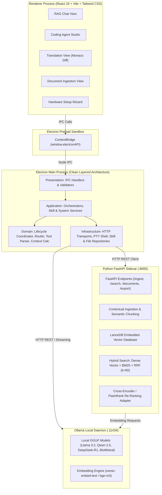
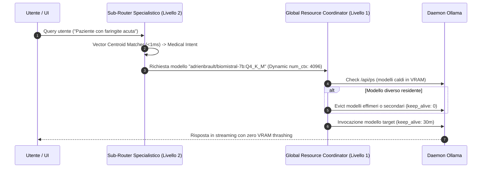
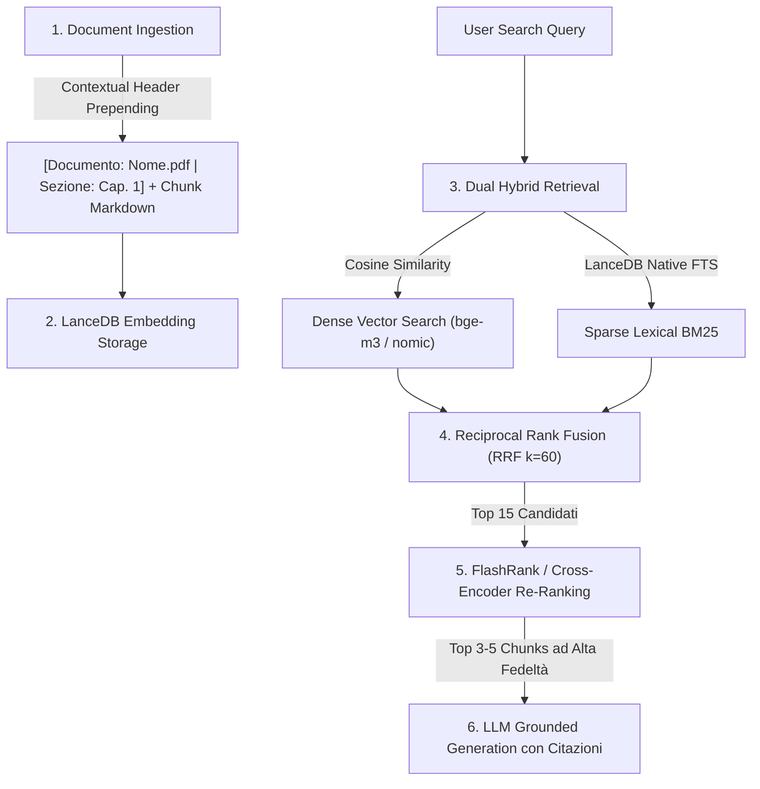

# Architettura di Sistema & Flussi Dati — OnlyRag V2

OnlyRag V2 adotta un'architettura **Multi-Process Locale Disaccoppiata e Sovrana** basata su **Electron**, **React 19**, **FastAPI Sidecar**, **LanceDB Embedded Vector DB** e il runtime locale **Ollama**.

---

## 1. Topologia di Sistema e Diagramma dei Componenti



---

## 2. Layered Clean Architecture (Electron Main Process)

Il processo principale di Electron rispetta rigorosamente il modello **Layered Architecture a 4 Livelli**:

```
Presentation Layer (IPC / UI Routing)
       │
       ▼
Application Layer (Use Cases & Orchestration)
       │
       ▼
Domain Layer (Pure Business Rules, Entities & Algorithms)
       │
       ▼
Infrastructure Layer (File System, PTY, HTTP Clients, Database)
```

| Livello | Directory | Responsabilità Principale | Dipendenze Consentite |
| :--- | :--- | :--- | :--- |
| **Presentation** | `electron/core/presentation/` | Registrazione dei canali `ipcMain.handle`, validazione input IPC e serializzazione risposte. | Application Layer |
| **Application** | `electron/core/application/` | Orchestrazione dei casi d'uso (Agent Tool Loop, Lifecycle dei modelli, gestione skill e workspace). | Domain, Infrastructure |
| **Domain** | `electron/core/domain/` | Logica pura di business: `lifecycleCoordinator`, `toolParser`, `contextWindowCalculator`, `agentPromptAssembler`, `hardwareProfileResolver`. Zero dipendenze da I/O o framework. | Nessuna (Puro TS) |
| **Infrastructure** | `electron/core/infrastructure/` | Interazione con I/O: `ollamaHttpClient`, `agentStreamTransport`, `fileSystemRepository`, `skillRepository`, `ptySessionManager`. | Standard APIs, Node.js libs |

---

## 3. Router Gerarchico a 2 Livelli (Zero VRAM Thrashing)

OnlyRag V2 previene la saturazione della VRAM e il thrashing dei modelli attraverso un router a due stadi:



### Livello 1: Global Resource & Lifecycle Coordinator
- **Model Pinning**: Mantiene residente in memoria il modello di lavoro primario (`keep_alive: '30m'`).
- **Ephemeral Eviction**: I modelli di supporto (traduzione rapida o OCR) vengono scaricati immediatamente dopo l'esecuzione (`keep_alive: 0m`).
- **Dynamic Context Window Throttling**: Calcola e assegna `num_ctx` in bucket ottimali ($2048 \rightarrow 65536$) basandosi sulla dimensione effettiva del prompt e della cronologia.

- **Coding Studio Primary Workhorse Model**: Architettura basata su **Modello di Lavoro Fisso (Workhorse Model)** impostato dall'utente (`codingModel`, es. `qwen2.5-coder:7b`). Il modello rimane stabilmente allocato in memoria per tutta la sessione garantendo il riutilizzo della KV-cache (zero VRAM thrashing e zero latenza di reload). L'esecuzione avviene direttamente tramite streaming HTTP su daemon locale o server Ollama remoto.
- **RAG Chat Domain Sub-Router**: Classificazione semantica tramite **Vector Centroid Semantic Matching** ($<1\text{ms}$) tra Medical, Legal e General. Il modello per dominio è risolto da `settings.medicalModel`/`settings.legalModel` (configurabili in AppSettings, selezionabili dal Setup Wizard o al volo tramite `QuickModelSelector`) con fallback sul `defaultModel` generale se non impostati. Entrambi i domini hanno un catalogo dedicato e completo su tutti i 5 tier hardware (`MEDICAL_TIER_CATALOG`/`LEGAL_TIER_CATALOG` in `hardwareModelCatalog.ts`): fallback agnostico `llama3.2:3b` su legacy/entry/midrange, modelli specializzati (`adrienbrault/biomistral-7b:Q4_K_M` per Medical, `llama3.1:8b`/`mistral-small3.2:24b` per Legal) su highend/extreme.
- **Chit-Chat Direct Bypass**: Identificazione di saluti o domande convenzionali per escludere il retrieval vettoriale riducendo la latenza a $<100\text{ms}$.

---

## 4. Pipeline RAG Ibrida & Multi-Stage Retrieval



1. **Contextual Retrieval (Anthropic Standard)**: Durante l'ingestione semantica, ogni chunk viene arricchito con un header contestuale che include il documento e la gerarchia delle sezioni.
2. **Dual Hybrid Search**: Combina ricerca vettoriale densa e ricerca lessicale full-text BM25 in LanceDB.
3. **Reciprocal Rank Fusion (RRF)**: Fusione normalizzata dei punteggi dei due ranking:
   $$\text{RRF}(d) = \sum_{m \in \{\text{dense}, \text{sparse}\}} \frac{1}{60 + r_m(d)}$$
4. **In-Process Re-Ranking Adapter**: Re-ranking cross-encoder ultra-veloce tramite `flashrank` su CPU o motore semantico di prossimità termica $(<20\text{ms})$.

---

## 5. Agent Studio: Tool Loop, Resilienza & Transazionalità

- **Autonomous Tool Calling Loop**:
  - **Ispezione & Navigazione**: `read_file` (con line slicing), `list_dir`, `grep_search`, `extract_code_symbols` (estrazione AST tramite TypeScript Compiler API per file TS/JS/TSX/JSX e tokenizer poliglotto per altri linguaggi).
  - **Modifica & Patching**: `replace_file_content` (fuzzy matching con tolleranza Levenshtein calcolata via `fast-levenshtein` e AST pre-commit validation via `fuzzyPatchEngine.ts`), `multi_replace_file_content`, `write_file` (con validazione AST sintattica in-flight), `delete_file`.
  - **Esecuzione & Diagnostica**: `run_command` (shell persistente PowerShell non-interattiva — `persistentPowerShellSession.ts` — con environment CI=true ed early-abort su prompt interattivi rilevati via `shellStreamGuard.ts`), `run_tests` (rileva ed esegue il test runner del workspace con pass/fail strutturato), `inspect_os_env` (report di sistema e inventario toolchain: node, npm, pnpm, git, python, ollama), `ensure_tool` (installazione non-interattiva 1-click via winget per i tool mancanti), `finish`.
  - **Web & Risorse**: `web_search` (query DuckDuckGo con parsing DOM via `cheerio`), `fetch_web_content` (conversione HTML in Markdown ad alta fedeltà con `turndown` e mitigazione SSRF), `download_file`.
  - **Interazione Utente**: `ask` (alias `ask_question`) per chiarimenti diretti.
- **Strict Serial Concurrency Queue (`TaskQueueAppService` & `PQueue`)**:
  - Tutti i task agentici sono gestiti tramite istanza atomica `PQueue({ concurrency: 1 })`, garantendo la totale assenza di race conditions e rispettando le direttive globali di serializzazione atomica del workspace.
- **Native Tool-Calling Routing (`ollamaToolCallingCapability.ts` & `ollamaToolSchemaCatalog.ts`)**:
  - Per ogni turno, rileva se il modello target supporta il tool-calling nativo di Ollama: segnale primario il campo `capabilities` di `/api/tags` (autoritativo se presente), fallback su allow-list di famiglie note (`llama3.1+`, `qwen2.5+`, `qwen3`, `mistral-nemo`, `command-r`, ...).
  - Quando disponibile, instrada su `POST /api/chat` con il catalogo strutturato dei 27 tool invece del solo prompt-engineering. La risposta (`message.tool_calls` oppure, per modelli come la famiglia Qwen che spesso restituiscono la chiamata come testo JSON in `message.content`, il testo grezzo) viene normalizzata nello stesso formato testuale già compreso da `toolParser.ts`, così la pipeline di parsing ed esecuzione tool resta identica indipendentemente dal percorso di dispacciamento usato.
- **Action Loop Fingerprinting & Multi-State Oscillation Prevention (`AgentActionLoopDetector`, incorpora internamente `CycleOscillationDetectorAndReproOracle`)**:
  - Ogni invocazione di tool viene tracciata tramite hash crittografico deterministico SHA-256 (`tool:parameters`) da un'unica istanza per sessione.
  - Rilevamento avanzato di cicli alternati di oscillazione a $k$-Stati ($k \in [2, 4]$, es. $A \rightarrow B \rightarrow A \rightarrow B$). Se l'agente instaura un ciclo alternato o ripete la stessa azione $\ge 2$ volte, il runtime inietta una direttiva correttiva forzata (`[CRITICAL LOOP INTERVENTION]`) ed uno script di riproduzione TDD.
- **Escape Strutturale dal Loop (`loopEscapePolicy.ts` + `forceMilestoneAdvance`)**:
  - La sola direttiva testuale non basta: un modello che non sa agire su di essa riemette la stessa tool call, e il guard rinvia lo stesso identico stato di piano. La policy scala quindi su tre livelli in base allo streak di blocchi consecutivi (`stagnationStreak`, azzerato da qualsiasi tool eseguito con successo): `advise` (solo testo) -> `force_milestone_advance` -> `abort`.
  - Su `force_milestone_advance` la milestone attiva viene marcata `failed` (mai `verified`: il lavoro non e' stato svolto e progresso, tracker e gate DoD devono continuare a dirlo) e il focus passa alla successiva, cosi' il prompt del turno seguente chiede un deliverable diverso. La memoria del detector sul target bloccato viene azzerata, perche' la nuova milestone puo' legittimamente doverlo toccare.
  - L'escalation alterna: fra due escape strutturali resta sempre un turno di sola direttiva testuale, per dare al modello un tentativo pulito sulla nuova milestone.
- **AST-Aware Compact Repo Mapper (`compactSemanticRepoMapper.ts` → `generateCompactRepoMap()`)**:
  - Scansione ad alta densità sintattica della struttura del repository con estrazione dell'albero dei simboli esportati (`class`, `function`, `interface`, `type`) per la generazione di una Repo Map ottimizzata per il budget del contesto.
- **Optimizations per Hardware Minimo (Previeni Runaway Loops >300 Step)**:
  - **`DiagnosticOutputReducer` (`extractErrorDiagnostics()`)**: Estrazione deterministica dei blocchi di errore e numeri di riga dai log di terminale per una diagnostica ad alta precisione.
  - **`StagnationCircuitBreaker`**: Interruttore automatico di blocco sulle streak di inattività o errori ripetuti per prevenire loop infiniti runaway.
  - **Cap Deterministico del Piano (`planMilestoneCapper.ts`)**: Il piano e' limitato a `MAX_PLAN_MILESTONES` (15) in tutti i punti di parsing (generazione, ri-parsing di testo modificato manualmente, auto-rilevazione e revisione `<plan>` nel loop). L'eccedenza non viene scartata ma fusa: milestone consecutive vengono raggruppate in bucket di dimensione uniforme (differenza massima di 1), cosi' ogni requisito emesso dal planner raggiunge comunque l'agente. Un'eventuale milestone finale di chiusura resta esclusa dalla fusione e viene riaccodata per ultima.
- **Direct Stream Transport & Remote Ollama Support (`AgentStreamTransport`)**:
  - Esecuzione trasparente e diretta sul modello configurato per lo sviluppo (`codingModel`), con supporto a streaming SSE continuo su endpoint locale (`http://127.0.0.1:11434`) o server Ollama remoto configurato in rete locale/remota.
- **Transactional Workspace Journal (`AtomicWorkspaceJournal`)**:
  - Prima di qualsiasi operazione di scrittura, patch o cancellazione file, viene salvato uno snapshot preventivo in memoria.
  - In caso di annullamento da parte dell'utente o fallimento non sanabile, viene eseguito il `rollbackAll()` ripristinando istantaneamente il filesystem allo stato pre-task. A task concluso con successo, le modifiche vengono consolidate (`commit()`).
- **Auto-Healing Loop**: Se l'esecuzione di un comando fallisce (exit code non nullo o presenza di errori nello stack trace), l'output viene formattato come blocco diagnostico e rinviato al modello per l'auto-correzione autonoma.
- **Project Workspaces & Nested Sessions**:
  - Ogni progetto memorizza la radice del workspace e una collezione isolata di sessioni di lavoro nidificate (`CodingSession`).
  - Passaggio istantaneo tra conversazioni parallele nello stesso progetto con persistenza dello storico delle modifiche.
- **Cronologia Sessioni su Filesystem (`sessionHistoryRepository`)**:
  - Unica fonte di verita' della cronologia: `<workspace>/.onlyrag/sessions/session_history.json` (fallback `~/.onlyrag_v2/sessions/session_history.json` per le sessioni standalone), esposta al renderer dai canali CRUD `sessions:*`. Il renderer non persiste piu' sessioni in `localStorage`; le sessioni legacy (`onlyrag_coding_sessions_v2`) vengono importate una tantum al primo avvio.
  - Ogni sessione contiene i suoi `ExecutedPrompt` (prompt, timestamp ISO 8601, modalita', esito, step totali, file toccati, righe +/-) e i suoi `AgentPlan` (versioni di piano con milestone canonici), da cui la UI deriva titolo, metriche e storico piani. Eliminare una sessione elimina prompt e piani con essa, senza record orfani. Lo stato runtime dell'agente (`.onlyrag/sessions/.agent_state_*.json`) resta limitato a cio' che serve per riprendere il loop (episodi, milestone, step), senza duplicare i dati di cronologia.
- **Session State Checkpointing (`persistCurrentState`)**:
  - Lo stato di sessione (`.onlyrag/sessions/.agent_state_*.json`: milestone, episodi, step) viene persistito ogni N step (default 5) e immediatamente dopo ogni mutazione file riuscita, invece che ad ogni singolo step, riducendo il churn I/O senza sacrificare la ripristinabilità.
  - Tutti i percorsi di uscita della sessione (finish, cancel, errore LLM, timeout, circuit-breaker di stagnazione, modalità PLAN) persistono incondizionatamente prima di terminare, garantendo che lo stato osservabile da disco non sia mai più vecchio dell'ultima azione osservabile dall'utente.

### 5.1. Plan Approval System (`GoalDecompositionPlanner` come Unica Fonte di Verità)

- **Backend Planner Canonico (`GoalDecompositionPlanner`, `electron/core/domain/agent/planAndSolveGraph.ts`)**: Unica fonte di verità per lo stato di completamento del piano (`PlanMilestone[]`, stati `pending`/`in_progress`/`verified`/`failed`), persistito da `agentOrchestratorAppService.persistCurrentState()` e riletto ad ogni riavvio di sessione (`goalPlanner.loadMilestones(savedState.planMilestones)`).
- **Avanzamento Milestone da Deliverable (`milestoneDeliverableResolver.ts` + `workspaceDeliverableProbe.ts`)**: `trackVerification` avanza solo su `run_tests`, `open_in_browser` o un comando di build; una milestone il cui deliverable e' un file non aveva quindi alcun percorso verso `verified` se non un `update_plan` emesso spontaneamente dal modello. I modelli che non lo emettono congelavano il piano sulla prima milestone, e il prompt la riproponeva ad ogni turno fino al circuit breaker. Dopo ogni mutazione file riuscita il resolver estrae dal titolo della milestone i percorsi che vi compaiono (riconoscimento puramente sintattico della forma di un path, indipendente da stack, linguaggio e modello) e li sonda su disco: se esistono tutti con contenuto, la milestone diventa `verified`. Una milestone che non nomina alcun artefatto e' per definizione non falsificabile e avanza sulla prima mutazione riuscita, invece di bloccare il piano per sempre. Il gate Definition of Done resta invariato: `handleFinishTool` continua a rifiutare la chiusura di una sessione priva di build verificata.
- **Tracciamento dei File Prodotti da Shell (`commandTouchedFilesScanner.ts`)**: `changeStats` e' emesso solo dai rami `write_file`/`replace`/`delete`, quindi i file scritti da un comando CLI (scaffolder, codegen, formatter) non entravano in `sessionChangedFiles` e `SESSION_TRACKER.md` riportava "Modified & Created Files: None" dopo uno scaffolding riuscito. Dopo ogni `run_command` andato a buon fine il workspace viene percorso una volta e i file con `mtime` successivo all'avvio del comando vengono registrati (chiavi in path assoluto, coerenti con `changeStats`; alberi ignorati e `.onlyrag` esclusi tramite `isIgnoredPath`).
- **Generazione Piano Instradata (`planGenerationAppService.ts`)**: Il drafting del piano (hook `usePlanApproval.ts`) non usa più un `fetch()` diretto e non gestito verso Ollama dal renderer, ma il canale IPC `agent:plan-generate`, che instrada la richiesta attraverso le opzioni runtime del profilo hardware (`HardwareProfileResolver`) e restituisce sia il testo del piano sia i milestone già parsati.
- **Parser Unico Condiviso**: Sia la generazione (`agent:plan-generate`) sia la ri-elaborazione di testo modificato manualmente (`agent:plan-parse-text`) sia l'estrazione automatica dal primo turno del modello nel loop agentico usano lo stesso parser canonico (`GoalDecompositionPlanner.parsePlanFromText`), eliminando i parser indipendenti precedentemente duplicati.
- **Seeding del Piano Approvato (`agent:plan-seed`)**: All'approvazione, i milestone vengono iniettati nello stato di sessione persistito (`agentSessionStateRepository.seedPlanMilestones`) prima dell'avvio dell'esecuzione, così il loop agentico li carica come stato iniziale invece di affidarsi alla sola auto-rilevazione da un possibile piano diverso generato dal modello al primo turno.
- **Esposizione dello Stato via IPC (`agent:get-plan-state`)**: Il frontend può leggere in ogni momento lo stato di completamento reale (verified/in_progress/failed) persistito dal backend, invece di stimare il progresso da un'euristica basata sul conteggio degli step.
- **Disaccoppiamento Invio/Generazione**: L'invio di un prompt esegue sempre direttamente il task (`c.handleAgentExecute()`); la generazione del piano è un'azione esplicita separata (icona dedicata "Genera piano" nel composer, disponibile in ogni `agentMode`), non più agganciata automaticamente ad ogni invio quando `requirePlanApproval` è attivo.
- **Consolidamento Automatico del Residuo**: Alla generazione di un nuovo piano, i milestone non verificati del piano approvato precedente vengono inclusi come contesto di riconciliazione nella richiesta al modello, così il nuovo piano assorbe lo stato pregresso invece di ripartire da zero.

---

## 6. SLM Log Diagnostics & Resilient Fallback Engine

OnlyRag V2 include un motore diagnostico avanzato di analisi anomalie nei log di sistema per identificare in tempo reale criticità di esecuzione (CUDA OOM, VRAM budget exceeded, JSON troncati, timeout Ollama, loop ricorsivi di tool, circuit breaker di stagnazione e permessi filesystem).

- **Architettura a Doppio Motore Resiliente**:
  1. **Primary Engine (Python FastAPI Sidecar — `/agent/logs/analyze`)**: Scansiona in parallelo i log applicativi con finestre scorrevoli di rilevamento pattern e calcolo metriche.
  2. **Native Electron Node.js Fallback Engine (`SidecarSlmBridgeService.analyzeLogsNativeFallback`)**: Se il sidecar Python è offline, in fase di riavvio o non raggiungibile, il processo Electron Main esegue una scansione diretta su disco dei log (`.onlyrag/logs`, `%APPDATA%/onlyrag-v2/logs`, `%LOCALAPPDATA%/OnlyRagV2/logs`, `temp`), garantendo **zero downtime e disponibilità al 100% della diagnostica**.
- **Actionable Remediation**: Ogni record di anomalia rilevato include una guida di ripristino contestuale (`remediation`), visualizzabile sia nella modale di diagnostica di sistema (`SystemDiagnosticsModal.tsx`) sia nella scheda dedicata del workspace `Diagnostica Log` (`SlmDiagnosticsPanel.tsx`), con supporto a filtri per severità (`CRITICAL`, `ERROR`, `WARNING`), ricerca testuale rapida ed export report Markdown.
