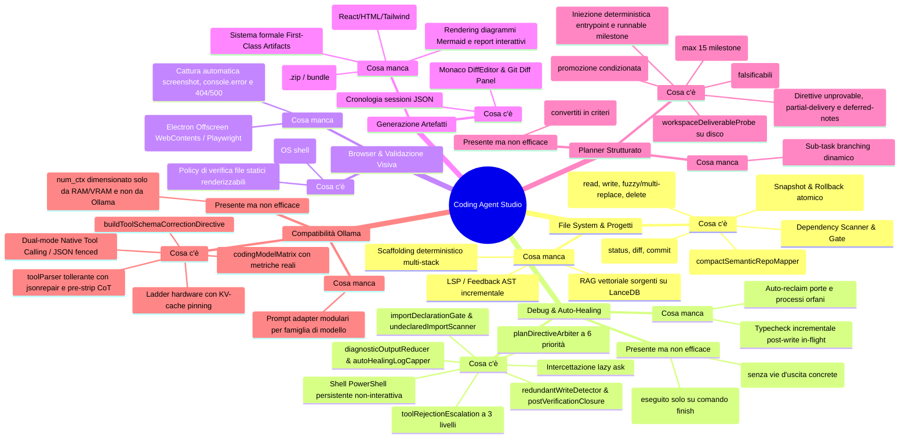
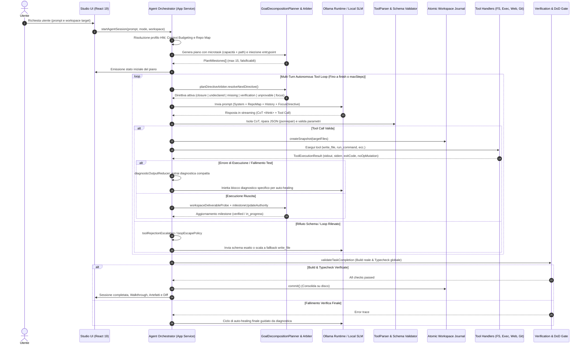

# Architettura & Blueprint Evolutivo: Coding Agent Studio — OnlyRag V2

Documento architetturale e operativo di riferimento per il sottosistema Coding Agent Studio. Descrive lo stato dei componenti, le policy anti-hardcoding, il flusso end-to-end, i meccanismi di auto-healing e le evidenze empiriche misurate con modelli locali Ollama.

> Per riprendere lo sviluppo da una nuova sessione, consultare [§6. Guida Operativa & Principi](#6-guida-operativa--principi). Il debito tecnico aperto è tracciato in `PROJECT_STATUS.json`.

---

## 1. Analisi di Sistema



### 1.1. File System & Progetto
* **Presente**: Toolchain atomica I/O ([`atomicWorkspaceJournal.ts`](../electron/core/infrastructure/filesystem/atomicWorkspaceJournal.ts) con `rollbackAll()`, fuzzy patch via `fast-levenshtein`, multi-replace, tree walk); [`compactSemanticRepoMapper.ts`](../electron/core/domain/agent/compactSemanticRepoMapper.ts); [`dependencyScanner.ts`](../electron/core/infrastructure/filesystem/dependencyScanner.ts) e [`dependencyIntegrityGate.ts`](../electron/core/domain/agent/dependencyIntegrityGate.ts); integrazione Git nativa.
* **Manca**: RAG vettoriale del codice su LanceDB (chunking per classe/funzione); scaffolding deterministico multi-stack non interattivo; refactoring programmatico AST (`ts-morph` / `@babel/parser`).

### 1.2. Debug & Auto-Healing
* **Presente**: PowerShell persistente supervisionata (`CI=true`, blocco comandi distruttivi in [`commandSecurity.ts`](../electron/core/domain/agent/commandSecurity.ts)); [`diagnosticOutputReducer.ts`](../electron/core/domain/agent/diagnosticOutputReducer.ts) e [`autoHealingLogCapper.ts`](../electron/core/domain/agent/autoHealingLogCapper.ts); [`agentOrchestratorAskAutoHealing.ts`](../electron/core/application/agentOrchestratorAskAutoHealing.ts) anti-stallo; [`loopDetector.ts`](../electron/core/domain/agent/loopDetector.ts) e [`loopEscapePolicy.ts`](../electron/core/domain/agent/loopEscapePolicy.ts).
* **Presente ma non efficace**: Il **Definition of Done Gate** ([`verificationGatePolicy.ts`](../electron/core/domain/agent/verificationGatePolicy.ts)) interviene solo alla chiamata di `finish`: se la sessione non raggiunge il finish, il gate non gira; il loop detector tradizionale impone divieti senza offrire un'azione risolutiva.
* **Manca**: Feedback LSP/typecheck istantaneo post-`write_file`; auto-reclaim dei processi orfani sulle porte di sviluppo.

### 1.3. Browser & Validazione Visiva
* **Presente**: `open_in_browser` su shell OS; [`browserPreviewVerification.ts`](../electron/core/domain/agent/browserPreviewVerification.ts) limitato a file statici (`.html`, `.svg`, `.pdf`).
* **Manca (gap critico)**: Headless runner (Electron Offscreen `WebContents` o `playwright-core`) per screenshot automatici, intercettazione `console.error` e log HTTP 404/500, fruibili anche da modelli Vision (`llama3.2-vision`, `qwen2.5-vl`).

### 1.4. Artefatti
* **Presente**: Monaco DiffEditor, Git Diff Panel, log JSON in `.onlyrag/sessions/session_history.json`.
* **Manca (gap critico)**: Modello formale First-Class Artifacts (UI Component, webapp interattiva, diagrammi Mermaid, walkthrough) con pannello Live Preview sandboxato ed export 1-click in archivio `.zip`.

### 1.5. Planner Strutturato
* **Presente**: [`planAndSolveGraph.ts`](../electron/core/domain/agent/planAndSolveGraph.ts) con normalizzazione falsificabilità; [`planMilestoneCapper.ts`](../electron/core/domain/agent/planMilestoneCapper.ts) (max 15); [`workspaceDeliverableProbe.ts`](../electron/core/infrastructure/filesystem/workspaceDeliverableProbe.ts) anti-placeholder; filtri di sicurezza comando in [`verificationCommandSafety.ts`](../electron/core/domain/agent/verificationCommandSafety.ts) (6 famiglie di rifiuto); [`milestoneUpdateAuthority.ts`](../electron/core/domain/agent/milestoneUpdateAuthority.ts) che subordina la promozione alla presenza effettiva dei deliverable.
* **Presente ma non efficace**: Le milestone che nominano cartelle nude (`src/services/`) non sono dimostrabili direttamente come deliverable e vengono normalizzate in criteri di milestone reali.
* **Manca**: Sub-task branching dinamico su errori complessi.

### 1.6. Compatibilità Universale Ollama
* **Presente**: [`toolParser.ts`](../electron/core/domain/agent/toolParser.ts) con pre-stripping CoT (`<think>`) e riparazione via `jsonrepair`; dual-mode Native Tool Calling (`POST /api/chat`) e JSON fenced; hardware ladder con pinning KV-cache; [`ollamaToolSchemaCatalog.ts`](../electron/core/domain/agent/ollamaToolSchemaCatalog.ts) per contratti schema e direttive di correzione; [`codingModelMatrix.ts`](../src/services/codingModelMatrix.ts).
* **Presente**: `num_ctx` clampato al `context_length` addestrato del modello letto da `/api/tags` ([`selectModelForTurn`](../electron/core/application/agentOrchestratorPromptAssembly.ts)), con `num_predict` e `maxContextChars` riderivati dalla finestra clampata.

> **Decisione architetturale — adattamento per capability, non per famiglia.**
> L'adattamento del prompt avviene esclusivamente sulle **capability** che Ollama stesso dichiara
> su `/api/tags` (`tools`, `vision`), risolte da
> [`ollamaToolCallingCapability.ts`](../electron/core/domain/agent/ollamaToolCallingCapability.ts) e
> applicate come partial condizionali in
> [`promptCompiler.ts`](../electron/core/domain/agent/promptCompiler.ts). **Non esiste, e non deve
> esistere, branching per famiglia di modello** (Qwen, Llama, DeepSeek, Mistral).
>
> Motivazione: l'app è usata con modelli aggiornati in modo indipendente tra loro. Un adapter per
> famiglia è manutenzione moltiplicata per il numero di famiglie e invecchia a ogni release,
> mentre una capability dichiarata dal runtime è vera il giorno in cui il modello viene
> installato. Un modello nuovo funziona senza che nessuno lo abbia mai misurato. È lo stesso
> principio di §6.2.1 applicato alla compatibilità: preferire un dato oggettivo del sistema a una
> tassonomia mantenuta a mano.
>
> Corollario sul badge di [`codingModelMatrix.ts`](../src/services/codingModelMatrix.ts):
> `compatible` si deriva dalle capability live, `verified` resta riservato ai modelli per cui una
> sonda live è stata realmente eseguita e letta (oggi solo `qwen2.5-coder:7b`).

* **Manca**: Handshake automatico nei primi turni che latchi il modo di tool calling osservato quando `/api/tags` non dichiara nulla (Ollama datati), oggi coperto dal solo allow-list di famiglia come fallback.

---

## 2. Direttiva Anti-Hardcoding: Librerie Universali

| Ambito | Libreria / Modulo | Stato | Funzione & Motivazione |
| :--- | :--- | :--- | :--- |
| **Parsing & Riparazione JSON** | `jsonrepair` | ✅ in uso | Ripara payload JSON corrotti o troncati generati da SLM locali. |
| **Validazione Schemi Runtime** | `ollamaToolSchemaCatalog.ts` | ✅ in uso | Fonte unica di verità per Native Tool Calling e direttive di correzione. |
| **Fuzzy Matching & Diffing** | `fast-levenshtein` + `diff` | ✅ in uso | Patching deterministico tollerante e calcolo diff. |
| **Validazione AST** | `typescript` | ✅ in uso (build/pre-commit) | Compiler API per validazione sintattica pre-commit e typecheck. |
| **Web Scraping & Markdown** | `cheerio` + `turndown` | ✅ in uso | Parsing DOM sicuro e conversione HTML→Markdown per tool web. |
| **Esecuzione Shell** | `node:child_process` | ✅ in uso | Sessione PowerShell persistente non-interattiva (`persistentPowerShellSession.ts`). |
| **Rendering Diff Visivi** | `diff2html` | ⬜ da adottare | Rendering visuale diff in sostituzione o affiancamento a Monaco. |
| **Parsing AST non-TS** | `@babel/parser` | ⬜ da adottare | Supporto per file JSX/JS/Vue/Svelte non tipizzati. |
| **File Globbing** | `fast-glob` + `pathe` | ⬜ da adottare | Scansione FS universale multipiattaforma. |
| **Validazione Visiva Headless** | Electron Offscreen `WebContents` | ⬜ da adottare | Validazione visiva e cattura errori DOM/console senza dipendenze esterne. |
| **Browser Headless alternativo** | `playwright-core` | ⬜ da adottare | Alternativa ad Offscreen WebContents (selezionare una sola soluzione). |
| **Process Runner ergonomico** | `execa` | ⬜ da adottare | Alternativa per comandi one-shot con timeout/cancellazione integrati. |

---

## 3. Flusso End-to-End



---

## 4. Architettura dei Tool Refattorizzata (SRP)

Scomposizione prevista del servizio monolitico [`agentToolExecutorService.ts`](../electron/core/application/agentToolExecutorService.ts) sotto `electron/core/domain/agent/tools/`:

```
tools/
├── fs/          readFileTool · writeFileTool (pre-validazione AST) · fuzzyPatchTool
│                fileExplorerTools (list_dir, list_files_recursive, glob) · codeSymbolExtractorTool
├── execution/   runCommandTool (PowerShell non-interattiva, timeout, CI) · runTestsTool (vitest/jest/pytest)
│                devToolchainTools (inspect_os_env, ensure_tool)
├── browser/     visualValidationTool (Offscreen/Playwright screenshot & DOM) · consoleLogsExtractorTool
├── artifacts/   artifactCreationTool (React, HTML, MD, SVG) · artifactExportTool (zip bundle, preview)
├── web/         webSearchTool (SSRF-safe) · fetchWebContentTool (cheerio + turndown)
├── git/         gitStatusTool · gitCommitDiffTools
└── diagnostics/ askClarificationTool · finishTaskTool (DoD Gate trigger)
```

---

## 5. Meccanismi Implementati, Validazione e Risultati Empirici

Tutte le ottimizzazioni sono state guidate da metriche e sonde reali (`scripts/live/fullTaskRun.live.ts`, `qwen2.5-coder:7b`).

### 5.1. Cicli di Feedback e Sicurezza Esecuzione
* **Composizione Output Diagnostico**: `DiagnosticOutputReducer.composeCommandOutput` unifica `stdout` e `stderr` senza scartare lo stderr in presenza di banner stdout (es. banner iniziale di `npm`).
* **Verifica Dipendenze su Disco**: `missingFromNodeModules` verifica l'effettiva presenza in `node_modules` oltre a `package.json`, evitando falsi positivi nei workspace generati.
* **Sicurezza Comandi di Verifica**: [`verificationCommandSafety.ts`](../electron/core/domain/agent/verificationCommandSafety.ts) rifiuta comandi *existence-only* (`cat`, `Test-Path`, `ls`) e *gui-mode* (`cypress open`, `--ui`), ammettendo solo test falsificabili.
* **Scope Reale Anti-Loop**: Le direttive anti-loop dichiarano la finestra reale di blocco (5 passi) e indicano la via d'uscita corretta (analizzare l'errore, modificare il codice, rieseguire).

### 5.2. Controlli Anticipati e Integrità
* **Intercettazione Import Non Dichiarati**: [`importDeclarationGate.ts`](../electron/core/domain/agent/importDeclarationGate.ts) valida i pacchetti importati contro `package.json` e `tsconfig.paths` al momento di `write_file`, restituendo l'elenco dei non dichiarati senza annullare la scrittura.
* **Autorità Aggiornamento Milestone**: [`milestoneUpdateAuthority.ts`](../electron/core/domain/agent/milestoneUpdateAuthority.ts) blocca la promozione a `verified` finché i deliverable del titolo non sono presenti e non vuoti su disco.
* **Prevenzione Directory come File**: `write_file` con trailing slash delega a `create_directory`.
* **Deduplicazione Fallimenti**: Collasso dei log falliti per coppia `tool + target` sull'intero buffer per evitare la saturazione della finestra contestuale.

### 5.3. Risoluzione Deterministica Conflitti Dipendenze
* **Risoluzione Automatica `npm ERESOLVE`**: [`npmResolutionConflict.ts`](../electron/core/domain/agent/npmResolutionConflict.ts) estrae le versioni in conflitto dal log npm e genera il comando esatto con range copiato **verbatim** (es. `npm install vite@^8.0.0`), senza delegare la scelta o usare `--force`.
* **Validazione Nome vs Versione**: Il guard riconosce comandi con versione esplicita (`pkg@version`) evitando blocchi errati di "già installato".
* **Validazione Nomi Tool**: `normalizeToolName` valida i comandi contro [`ollamaToolSchemaCatalog.ts`](../electron/core/domain/agent/ollamaToolSchemaCatalog.ts) rifiutando nomi allucinati (es. `npm_install`).
* **Rifiuto del Registro = Fallimento dell'Install (risolto 2026-08-25)**: il guard del registro in [`agentToolExecutorService.ts`](../electron/core/application/agentToolExecutorService.ts) rifiuta l'install di un pacchetto inesistente **senza eseguirlo**, restituendo il marcatore `[PACKAGE DOES NOT EXIST`. Quel marcatore non era in [`isFailureOutput`](../electron/core/application/agentOrchestratorToolResultProcessor.ts), quindi l'episodio veniva registrato `SUCCESS` — e `packagesWithFailedInstall` ([`installCommandParser.ts`](../electron/core/domain/agent/installCommandParser.ts)) usa un `SUCCESS` per **azzerare** il contatore dei fallimenti del pacchetto. La soglia `FAILURES_BEFORE_UNINSTALLABLE` diventava percio' irraggiungibile e l'arbitro non passava mai a `dependencies_uninstallable`, continuando a ordinare l'unico install che non poteva riuscire mentre il guard continuava a rifiutarlo.
  * **Sintomo misurato**: sessione `live-full-task` del 2026-08-25T11:03 (e identicamente quella delle 08:37) — `npm install @tailwindcss/react` ordinato agli step 9, 11, 18, 19, 25, 26, 32, 33, 39, 40, 46 e 48, con il loop detector a bloccare i turni intermedi, fino al tetto dei 50 step con **0 milestone verificate**. Due canali davano al modello istruzioni opposte nello stesso turno: il tool-result diceva "Do NOT run this install again", il plan-directive diceva "Your next tool call MUST be `npm install @tailwindcss/react`".
  * **Lezione**: la via d'uscita era gia' costruita e semplicemente non armata. Un marcatore assente da un elenco di classificazione non e' una lacuna cosmetica: e' un esito su cui l'intero loop ragiona al contrario. Vale anche per §1.2 ("loop detector solo restrittivo"): il detector non era il problema, bloccava correttamente una ripetizione inutile — mancava il segnale che avrebbe reso quella ripetizione non necessaria.
  * **Replay sugli episodi reali**: con la classificazione corretta la soglia e' raggiunta subito dopo lo step 11, cioe' l'escape sarebbe scattato allo step 12 anziche' mai.

### 5.4. Riduzione Churn e Criteri di Chiusura
* **Rilevamento Scritture a Vuoto (No-Op)**: [`redundantWriteDetector.ts`](../electron/core/domain/agent/redundantWriteDetector.ts) normalizza CRLF/LF e newline finale. Se il contenuto è identico, non tocca il file e imposta `noOpMutation: true`, preservando `flags.hasVerifiedBuild`.
* **Stato di Chiusura Dichiarabile**: [`postVerificationClosure.ts`](../electron/core/domain/agent/postVerificationClosure.ts) rileva quando la build è verificata e le sole milestone aperte sono non falsificabili (`not_applicable`), ordinando la chiusura della sessione.
* **Direttiva Milestone Indimostrabili**: [`unprovableMilestoneDirective.ts`](../electron/core/domain/agent/unprovableMilestoneDirective.ts) guida il modello a chiudere via `update_plan` compiti che non producono file o comandi (es. requisiti di accessibilità o stile diffuso).
* **Direttiva Consegna Parziale**: [`milestoneVerificationPromotion.ts`](../electron/core/domain/agent/milestoneVerificationPromotion.ts) nomina i file ancora mancanti di una milestone composita, vietando la riscrittura del file già accettato (risolto in 1 passo vs 9 passi precedenti).
* **Compattazione Output Recenti**: [`recentFullLogs`](../electron/core/domain/agent/diagnosticOutputReducer.ts) collassa i fallimenti ripetuti per `tool + target`, liberando oltre il 46% di spazio utile nel prompt.
* **Verifica Terminale a Budget Esaurito (risolto 2026-08-25)**: la sessione ha due uscite e una sola verificava qualcosa. `finish` esegue il controllo del progetto e promuove ciò che dimostra ([`agentOrchestratorFinishAndLoopGuards.ts`](../electron/core/application/agentOrchestratorFinishAndLoopGuards.ts)); l'esaurimento del budget di step andava dritto a `emitDone`, quindi una corsa che aveva consegnato ogni file del piano e non aveva mai speso uno step su `finish` chiudeva con **0 milestone verificate e nessun controllo mai tentato**. [`budgetExhaustionVerification.ts`](../electron/core/domain/agent/budgetExhaustionVerification.ts) decide se spendere un ultimo comando; [`agentOrchestratorAppService.ts`](../electron/core/application/agentOrchestratorAppService.ts) lo esegue e chiama `promoteMilestonesProvenBy`, e il riepilogo di sessione dichiara l'esito invece del solo tetto raggiunto.
  * **Sintomo misurato**: `live-full-task` del 2026-08-25T12:11 (`qwen2.5-coder:7b`, 50/50 step) — 12 file scritti, 14/14 milestone `in_progress` con la nota "Awaiting a passing verification command", e nell'intera sessione **zero** transizioni `-> VERIFIED`, **zero** righe di promozione e **zero** rifiuti `update_plan` per deliverable mancanti. Tutti e 12 i `run_command` erano `npm install`; `finish` non è mai stato invocato. Il criterio di §6.2.3 non era in causa: rieseguito sui titoli e sui file reali, `selectMilestonesProvenByVerification` restituisce tutte e 14 le milestone ([`agentOrchestratorBudgetExhaustion.test.ts`](../electron/core/application/agentOrchestratorBudgetExhaustion.test.ts)).
  * **Lezione**: la promozione non era permissiva né restrittiva, era irraggiungibile. Un criterio corretto raggiunto da un solo percorso vale quanto quel percorso, e qui il percorso dipendeva da una scelta del modello — invocare `finish` — che nessuna delle tre corse osservate ha compiuto. Il criterio resta invariato: promuove solo un comando reale che passa su deliverable realmente presenti.
  * **Costo**: il controllo parte solo se il piano contiene milestone che una promozione chiuderebbe davvero (`promotableMilestoneCount > 0`), quindi una corsa già verificata o una che non ha consegnato nulla non paga i minuti di una build a freddo.

### 5.5. Matrice Modelli e Context Budgeting Ollama
* **Metriche Reali Modelli**: [`getModelMetrics`](../electron/core/infrastructure/http/ollamaHttpClient.ts) legge `context_length`, `parameter_size` e quantizzazione reale da `/api/tags`.
* **Matrice Modelli Verificati**: [`codingModelMatrix.ts`](../src/services/codingModelMatrix.ts) badge `verified` assegnato esclusivamente a modelli testati end-to-end su sonde live (`qwen2.5-coder:7b`).
* **Truncamento Ollama Silenzioso (risolto)**: Ollama clampa `num_ctx` al `context_length` addestrato del modello e scarta la **testa** del prompt — system prompt e blocco piano. Il danno non era il clamp ma `maxContextChars` derivato dalla finestra **non** clampata: dichiarava a `HeuristicContextCompactor` uno spazio inesistente, quindi il compattatore non interveniva e la decapitazione era garantita anziché possibile. [`selectModelForTurn`](../electron/core/application/agentOrchestratorPromptAssembly.ts) clampa ora `num_ctx` su `context_length` e rideriva da lì `num_predict` e `maxContextChars`; [`freezeOrGrowContextWindow`](../electron/core/application/agentOrchestratorPromptAssembly.ts) applica lo stesso tetto al valore **in uscita**, perché il freeze è per sessione mentre il tetto è per modello e il fallback di resilienza può scambiare i modelli a metà sessione.
* **Fonte autorevole della finestra**: `context_length` da `/api/tags` ([`getModelMetrics`](../electron/core/infrastructure/http/ollamaHttpClient.ts)), noto **prima** del caricamento e recuperato nella stessa lettura che fornisce le capability. `/api/ps` riporta il contesto allocato *per la nostra stessa richiesta*: è a valle della decisione da prendere, quindi utile come segnale di verifica ma circolare come fonte di dimensionamento.

### 5.6. Arbitro delle Direttive e Risoluzione Deadlock
[`planDirectiveArbiter.ts`](../electron/core/domain/agent/planDirectiveArbiter.ts) stabilisce la singola direttiva attiva per turno secondo una priorità deterministica:

| Priorità | Stato | Condizione di Attivazione | Azione Prescritta |
| :---: | :--- | :--- | :--- |
| **1** | `session_closure` | Build verificata e zero scritture successive | Chiudere la sessione con `finish` |
| **2** | `dependencies_undeclared` | Il codice importa package non dichiarati nel manifest | `npm install <pkg>` (via `undeclaredImportScanner.ts`) |
| **2b** | `dependencies_uninstallable` | Ogni package non dichiarato è già stato installato e fallito ≥2 volte | Un solo `write_file` sul file che importa il primo nome |
| **3** | `dependencies_missing` | Manifest dichiara package assenti da `node_modules` | `npm install` |
| **3b** | `entrypoint_disconnected` | La pagina HTML d'ingresso non carica codice del progetto | Iniettare il tag script esatto (§5.6f) |
| **4** | `verification_due` | Nessuna milestone unsatisfied e verifica non ancora eseguita | Eseguire il comando di verifica primaria del progetto |
| **4b** | `verification_failing` | La verifica è già stata eseguita, è fallita, nulla è stato scritto dopo | Correggere il file nominato, **non** rieseguire |
| **5** | `unprovable_milestone` | Milestone attiva priva di deliverable su disco | `update_plan` con ID milestone |
| **6** | `focus` | Avanzamento ordinario | Microtask della milestone attiva |

`2b` e `4b` non sono priorità separate ma le due biforcazioni delle rispettive righe: si scelgono
sullo stesso fatto già raccolto (rispettivamente `packagesWithFailedInstall` e
`verificationFailing`), e il motivo per cui esistono è che in entrambi i casi l'azione giusta è
l'**opposto** di quella della riga madre.

* **Impatto misurato**: Risolto il deadlock storico (da 0 comandi eseguiti in 50 passi a **13 comandi**, con `npm install` al passo 2 e `npm run build` al passo 28).

> [!WARNING]
> **La priorità 4 non è mai scattata: 0 volte su 200 turni misurati** (quattro corse
> `live-full-task` da 50 step, 2026-08-25 08:37 / 11:03 / 12:11 / 12:46). Distribuzione della
> direttiva viva per turno, contata sul delta di ogni prompt e non sul testo replayato:
>
> | Corsa | dipendenze | focus / altro | `verification_due` |
> | :--- | :---: | :---: | :---: |
> | 08:37 | 35 | 15 | **0** |
> | 11:03 | 43 | 7 | **0** |
> | 12:11 | 28 | 22 | **0** |
> | 12:46 | 22 | 28 | **0** |
>
> La causa non è la precedenza delle priorità 2-3: è la condizione
> `isEveryDeliverableSatisfied`, che richiede che **ogni** milestone abbia già tutti i deliverable
> su disco. Con 12-15 milestone in 50 step quello stato non viene raggiunto, quindi lo stato è di
> fatto irraggiungibile.
>
> Le build che pure girano — quattro nella corsa delle 12:46 — sono iniziativa del modello, che
> segue la regola 11b del prompt di sistema, **non** effetto di questa direttiva. Il
> `npm run build al passo 28` citato sopra va riletto in questa luce.
>
> La decisione se allentare il gate è aperta e ha un compromesso reale: una build lanciata a metà
> piano fallisce quasi certamente, ma un fallimento produce una diagnostica reale con file e riga,
> che [`compilerDiagnosticDirective.ts`](../electron/core/domain/agent/compilerDiagnosticDirective.ts)
> converte in un singolo imperativo preciso — più utile a un modello da 7B di "scrivi il prossimo
> file". Tracciato, non deciso.
* **Protezione Escape Milestone Consegnate**: `isActiveMilestoneDelivered` impedisce a `loopEscapePolicy` di marcare fallita una milestone i cui file sono già presenti su disco.
* **Forma di `dependencies_uninstallable` — un pacchetto, un file, il tool nominato per primo**:
  emettere la direttiva non basta a farla eseguire. Corsa live `2026-08-25T12:11`
  (`qwen2.5-coder:7b`, sessione `live-full-task`): la direttiva è comparsa **24 volte** nominando
  `@tailwindcss/react` e `src/pages/DashboardPage.tsx`, e il modello non ha riscritto quel file
  nemmeno una volta mentre gliela si ordinava. Negli stessi turni alternati la direttiva sorella
  `dependencies_undeclared`, calcolata dagli stessi fatti, è stata **obbedita 6 volte su 6**
  (passi 9, 16, 19, 30, 45, 46). La differenza è solo testuale: quella obbedita apre con
  `Your next tool call MUST be "run_command" with the command: ...`, questa apriva con
  `"pkg" — remove it from <file>` e relegava l'azione vera all'ultima riga numerata
  (*"Rewrite that file..."*) — i due imperativi concorrenti di §6.2.2, con il modello che sceglie
  il più economico. Con due import non installabili la lista chiudeva su *"Rewrite those files"*
  (passi 33, 42, 43, 47): un ordine che `write_file`, che scrive **un** file, non può eseguire.
  [`buildUninstallablePackageDirective`](../electron/core/domain/agent/planDirectiveArbiter.ts)
  nomina ora un solo pacchetto, un solo file e `write_file` in prima posizione; gli altri import
  sono riportati come **conteggio**, non come istruzioni ulteriori, e l'ordinamento è deterministico
  perché una direttiva da obbedire su più turni deve dire due volte la stessa cosa.
* **Nessuna asserzione sull'invenzione del nome**: la direttiva affermava che un nome che non si
  risolve *"was invented rather than looked up"*. `@mui/material` è reale: ai passi 45-46 della
  stessa corsa è fallito con `ERESOLVE` perché tre `npm install react@^16.8.0` avevano fissato
  l'albero a `react@16.14.0`. Il modello ha obbedito al passo 49 cancellando una dipendenza
  legittima. L'arbitro riceve conteggi di fallimento, mai risposte del registro
  ([`packagesWithFailedInstall`](../electron/core/domain/agent/installCommandParser.ts)): quella
  frase non era un fatto che fosse in grado di affermare, ed è stata rimossa.

> [!WARNING]
> **La direttiva corretta non è ancora sufficiente, e la causa residua è fuori dall'arbitro**
> (misurato sulla stessa corsa `2026-08-25T12:11`). Nei passi 9-28 il prompt conteneva
> simultaneamente il blocco piano vivo (*«riscrivi `src/pages/DashboardPage.tsx`»*) e, riprodotto
> **due volte** dai canali `CRITICAL PREVIOUS TOOL FAILURES` e `RECENT DETAILED TOOL OUTPUTS`, il
> risultato del passo 8: *«Do NOT re-write "src/pages/DashboardPage.tsx" — it is already correct
> and re-writing it will be blocked as a loop»*
> ([`milestoneVerificationPromotion.ts`](../electron/core/domain/agent/milestoneVerificationPromotion.ts)).
> In quei 20 passi le riscritture di quel file sono state **zero**; la prima è arrivata al passo
> 43, quando il messaggio contraddittorio era uscito dalla finestra di replay. §6.2.2 è violata a
> livello di **prompt**, non di arbitro: i canali di storia riservono direttive già superate come
> se fossero correnti, e una di esse nega esplicitamente quella viva.
>
> Il modello inoltre non ha mai chiamato `read_file` (0 su 42 tool call) e nessun prompt della
> sessione conteneva i blocchi `EXPLICITLY REFERENCED (PINNED) WORKSPACE FILES` o
> `Active File Open in Editor`: quando ha finalmente obbedito (passi 43, 48, 49) ha riscritto il
> file **alla cieca**, prima sostituendo un import inventato con un altro (`@mui/material`) e poi
> riducendolo a 208 byte. Una direttiva che ordina di riscrivere un file esige che il contenuto di
> quel file sia un **dato fornito** (§6.2.1), e la decisione su quali blocchi entrino nel prompt
> per turno è di [`turnContextPolicy.ts`](../electron/core/domain/agent/turnContextPolicy.ts)
> (§5.6j), non dell'arbitro.

### 5.6b – 5.6c. Risoluzione Deliverable e Gestione Riconsegne
* **Risoluzione Basename nel Workspace**: [`workspaceDeliverableProbe.ts`](../electron/core/infrastructure/filesystem/workspaceDeliverableProbe.ts) risolve i file con nome nudo (es. `globals.css`) cercando nell'albero del workspace (es. `src/styles/globals.css`), eliminando i loop di riscrittura (da 6 riscritture a 1).
* **Direttiva Riconsegna**: [`redeliveredMilestoneDirective`](../electron/core/domain/agent/milestoneVerificationPromotion.ts) avverte quando un file appartiene a una milestone già completata, indicando il deliverable atteso.

### 5.6d. Escalation Rifiuti di Schema Tool
* **Escalation a 3 Livelli**: [`toolRejectionEscalation.ts`](../electron/core/domain/agent/toolRejectionEscalation.ts) invia il contratto schema nei primi 2 rifiuti (es. `replace_file_content` malformato), scala a `write_file` integrale al 3° tentativo e interrompe a `REJECTION_ABORT_STREAK` evitando loop infiniti.

### 5.6e – 5.6f. Whole-Project Verification & Integrità Entrypoint
* **Typecheck Globale Sintetizzato**: In assenza di script dedicato, [`resolvePrimaryVerificationCommand`](../electron/core/domain/agent/projectVerificationResolver.ts) sintetizza `npx tsc --noEmit`, intercettando errori in tutti i file e non solo nell'albero importato.
* **Direttiva Diagnostica Compilatore**: [`compilerDiagnosticDirective.ts`](../electron/core/domain/agent/compilerDiagnosticDirective.ts) estrae file, riga e codice errore, prescrivendo un **singolo imperativo** di correzione (`write_file`), con rinvio esplicito degli errori secondari tramite [`buildDeferredDiagnosticNote`](../electron/core/domain/agent/compilerDiagnosticDirective.ts). Quando il compilatore ha stampato il rimedio lo passa verbatim invece di riformularlo: il comando di install per `TS7016` ([`extractSuggestedCommand`](../electron/core/domain/agent/compilerDiagnosticDirective.ts)) e la riga di import per `TS2613`/`TS2614` ([`extractExportMismatch`](../electron/core/domain/agent/compilerDiagnosticDirective.ts), §5.6i).
* **Controllo Entrypoint HTML/JS**: [`entrypointIntegrity.ts`](../electron/core/domain/agent/entrypointIntegrity.ts) rileva file `index.html` privi di script verso `src/main.tsx` o root component, iniettando il tag esatto (compilazione passata da 2 moduli a 43 moduli / 180 kB).

### 5.6g – 5.6h. Generazione Piano & Iniezione Strutturale
* **Formato Microtask (Capacità + Path)**: [`planGenerationAppService.ts`](../electron/core/application/planGenerationAppService.ts) genera milestone nella forma: `- [ ] m-N: <Funzionalità/Capacità> — <path/del/file.ext>`.
* **Iniezione Deterministica Entrypoint**: [`ensureEntrypointMilestones`](../electron/core/domain/agent/planCompilation.ts) antepone nello scheletro `package.json`, `index.html`, `tsconfig.json` e `src/main.tsx` se non presenti.
* **Iniezione Milestone di Verifica**: [`ensureRunnableMilestone`](../electron/core/domain/agent/planCompilation.ts) appende la milestone di verifica end-to-end con il comando reale del progetto.
* **Risultato Misurato (Run 9)**: **12/13 milestone verificate (92%)**, `finish` raggiunto autonomamente, `npm run build` con exit code 0 e 43 moduli compilati.

> [!WARNING]
> **Run 9 non è riproducibile allo stato attuale (verificato 2026-08-25).** Due esecuzioni di
> `fullTaskRun.live.ts` su `qwen2.5-coder:7b` nella stessa giornata — una alle 08:37 e una alle
> 11:03, la prima precedente a qualunque modifica della sessione di lavoro — hanno entrambe
> raggiunto il tetto dei **50 step con 0 milestone verificate e senza `finish`**. Le due corse
> sono in `logs/coding_agent_audit.log` e concordano tra loro, quindi la divergenza da Run 9 non
> è varianza fra modelli né effetto di una modifica recente.
>
> **`npm run test:live` esce comunque con codice 0** in entrambi i casi: le sonde asseriscono
> molto meno dei numeri che questa sezione pubblicizza. Finché non asseriscono il tasso di
> milestone verificate e il raggiungimento di `finish`, un `PASS` della sonda non è evidenza di
> ciò che è scritto qui.
>
> Questa nota resta finché una corsa non riproduce il risultato o non lo sostituisce. Cancellare
> il numero sarebbe perdere il riferimento; lasciarlo senza la nota violerebbe §6.2.3.

### 5.6i. Registro npm vs Limiti di Training
* **Consultazione Registro npm**: [`npmRegistryClient.ts`](../electron/core/infrastructure/http/npmRegistryClient.ts) valida l'esistenza dei pacchetti e recupera la versione stabile reale prima dell'installazione.
* **Normalizzazione Versioni & `ETARGET`**: [`dependencyVersionReality.ts`](../electron/core/domain/agent/dependencyVersionReality.ts) e [`npmVersionNotFound.ts`](../electron/core/domain/agent/npmVersionNotFound.ts) correggono pacchetti inesistenti (es. `@tailwindcss/react`) e versioni allucinate.
* **Preservazione Configurazioni Major**: Esclusione automatica di major breaking (`typescript`, `tailwindcss`, `eslint`) che richiederebbero modifiche di configurazione estranee al training del modello.
* **Mutazione del manifest via comando (risolto 2026-08-25)**: `versionRealityDirective` e' agganciata al solo `write_file` su `package.json`, ma `npm install pkg@range` riscrive lo stesso file. Nella corsa `live-full-task` del 2026-08-25T12:11, su un progetto che dichiarava `react@^18.2.0`, `npm install react@^16.8.0` e' passato con `SUCCESS` agli step 21, 30 e 31 senza che alcun controllo lo vedesse: il manifest e' finito a `react@"^16.14.0" from the root project`. La cascata e' misurata nello stesso log — agli step 45-46 `npm install @mui/material` fallisce con **ERESOLVE** (non 404) perche' l'albero era pinnato a `react@16.14.0`, la direttiva sui pacchetti non installabili legge quel fallimento ripetuto come nome inventato, e allo step 49 il modello cancella una dipendenza legittima. [`installVersionDowngrade.ts`](../electron/core/domain/agent/installVersionDowngrade.ts) rifiuta l'install **prima di eseguirlo** quando il comando porterebbe una dipendenza gia' dichiarata sotto la sua major, restituendo il marcatore `[VERSION DOWNGRADE REFUSED`. Il guard sta accanto a quello di esistenza in [`agentToolExecutorService.ts`](../electron/core/application/agentToolExecutorService.ts): stessa domanda, una contro il registro e una contro il manifest.
* **Perche' prima e non dopo**: a posteriori resterebbe solo un diff di `package.json` — costa uno snapshot su ogni comando e arriva comunque tardi, con manifest e `node_modules` gia' ripinnati e un secondo install necessario per annullarli, cioe' un secondo imperativo nello stesso messaggio (§6.2.2). Prima, il comando nomina gia' `pkg@version`: il verdetto si legge dal testo, non si inferisce, e rifiutare lascia il progetto esattamente com'era.
* **L'esclusione major breaking non si applica al downgrade**: quella lista esiste perche' ordinare un *upgrade* di `typescript`/`tailwindcss`/`eslint` consegna al modello un formato di configurazione che non ha mai visto. Rifiutare un downgrade non muove nulla e lascia il progetto sulla versione contro cui gia' compila, quindi nessun pacchetto e' escluso qui: `typescript@4` sotto un `tsconfig.json` scritto per la 5 e' distruttivo quanto `react@16`. `react` non apparterrebbe comunque a quella categoria — e' una libreria runtime, dove la versione *e'* l'intera modifica.
* **Origine del comando**: i tre install non erano invenzioni del modello. Erano copiati verbatim dalla direttiva `ERESOLVE` ([`npmResolutionConflict.ts`](../electron/core/domain/agent/npmResolutionConflict.ts)), che riporta fedelmente le parole di npm (`peer react@"^16.8.0" from use-optimistic@1.0.0`) e ne fa un comando: [`installableRange`](../electron/core/domain/agent/npmResolutionConflict.ts) sceglie l'alternativa piu' alta del range peer ma non verifica mai la **direzione** del movimento, cosi' un pacchetto transitorio spazzatura trascina indietro di due major la libreria runtime del progetto. Il guard sorveglia il comando, chiunque lo abbia scritto.
* **Coerenza Export/Import (`TS2613`/`TS2614`)**: `tsc` chiude entrambi i messaggi con la frase *"Did you mean to use '<import>' instead?"*, cioè con l'istruzione già scritta. [`extractExportMismatch`](../electron/core/domain/agent/compilerDiagnosticDirective.ts) la estrae e la direttiva la cita **verbatim** su riga propria, nominando file e riga e prescrivendo un solo `write_file` sul file importante. Sostituisce la direttiva file+riga ordinaria (§6.2.2), non la affianca, e vince sull'errore in prima posizione quando il mismatch è più in basso: fra gli errori a tabellino è l'unico la cui correzione è già nota. Resta subordinata all'installazione quando il compilatore ha anche nominato un pacchetto mancante.
* **Limite noto**: la direttiva applica la sola correzione che il compilatore propone — cambiare l'import. Se la scelta corretta fosse cambiare l'export del modulo importato, il modello non lo dedurrà da qui.

### 5.6j. Politica di Contesto per Turno — il secondo asse di arbitrato

L'arbitro di §5.6 decide **cosa dire** al modello. Non decideva **cosa mostrargli**: ogni blocco
opzionale partiva a ogni turno, dimensionato a quote fisse del budget (repo map 18%, RAG 12% in
[`agentPromptAssembler.ts`](../electron/core/domain/agent/agentPromptAssembler.ts); pinned, file
attivo e skill a frazioni fisse del tier 2 in
[`heuristicContextCompactor.ts`](../electron/core/domain/agent/heuristicContextCompactor.ts)). Su un
7B a 8k questo spende metà finestra in contesto che la milestone attiva spesso non usa, e il blocco
che lo paga — quando il compattatore esaurisce lo spazio — è la **history**, l'unico che porta ciò
che è già stato fatto.

[`turnContextPolicy.ts`](../electron/core/domain/agent/turnContextPolicy.ts) chiude la lacuna
**senza aggiungere alcuna inferenza**: il `PlanDirectiveKind` che l'arbitro ha già risolto è di per
sé la risposta a "cosa serve davanti al modello adesso". Un turno la cui azione prescritta è
`npm install react` non è reso più corretto da una mappa del repository.

| `PlanDirectiveKind` | Azione prescritta | Map | RAG | Skill | Pinned | File attivo |
| :--- | :--- | :-: | :-: | :-: | :-: | :-: |
| `session_closure` | `finish` | ⬜ | ⬜ | ⬜ | ⬜ | ⬜ |
| `dependencies_undeclared` | `npm install <pkg>` | ⬜ | ⬜ | ⬜ | ⬜ | ⬜ |
| `dependencies_missing` | `npm install` | ⬜ | ⬜ | ⬜ | ⬜ | ⬜ |
| `verification_due` | comando di verifica | ⬜ | ⬜ | ⬜ | ⬜ | ⬜ |
| `unprovable_milestone` | `update_plan <id>` | ⬜ | ⬜ | ⬜ | ⬜ | ⬜ |
| `dependencies_uninstallable` | riscrivere l'import | ⬜ | ⬜ | ✅ | ✅ | ✅ |
| `verification_failing` | correggere il file diagnosticato | ⬜ | ⬜ | ✅ | ✅ | ✅ |
| `entrypoint_disconnected` | iniettare il tag esatto | ⬜ | ⬜ | ⬜ | ✅ | ⬜ |
| `focus` | microtask della milestone | ✅ | ✅ | ✅ | ✅ | ✅ |

* **Invariante strutturale**: system prompt, blocco piano e tool history **non hanno un campo** in
  `TurnContextPolicy`, quindi nessuna policy può sopprimerli. Sono la testa immutabile e la coda di
  progresso, cioè esattamente ciò che la troncatura di Ollama distrugge (§5.5). Sopprimere un
  blocco opzionale libera la sua allocazione a favore della history.
* **Esaustività forzata**: la risoluzione è uno `switch` senza `default`, così un nuovo
  `PlanDirectiveKind` diventa un errore di compilazione anziché ereditare un fallback silenzioso.
* **Effetto collaterale sulla latenza**: quando la mappa non è ammessa, `generateCompactRepoMap`
  non viene proprio invocata — è un tree walk del workspace a ogni turno.
* **Relazione con i principi (§6.2)**: è il Principio 1 applicato al contesto anziché alle
  istruzioni. Quando il sistema conosce già l'azione del turno, non deve far riscoprire al modello
  quale degli otto blocchi fosse pertinente.

### 5.6j-bis. Un Import Relativo Non È Una Dipendenza Mancante

`Cannot find module './api'` non è un pacchetto da installare: è un file del progetto non ancora
scritto. [`moduleResolutionDiagnostic.ts`](../electron/core/domain/agent/moduleResolutionDiagnostic.ts)
lo sa già — `packageOfSpecifier` restituisce `null` per gli specifier relativi — ma il gate in
[`agentToolExecutorService.ts`](../electron/core/application/agentToolExecutorService.ts)
verificava il testo grezzo (`lowerOut.includes('cannot find module')`) invece di interrogarlo.

**Sintomo misurato** — sessione `live-full-task` del 2026-08-25T19:16, step 34. `npm run build`
riporta quattro errori: un `TS2614` che porta con sé il fix verbatim del compilatore, un `TS2322`,
e due `TS2307` su `./api` e `./auth`. Il gate scatta sui due relativi; scattando imposta
`specificDirectiveFired`, che **sopprime** `buildDiagnosticFixDirective`. L'unica direttiva capace
di nominare un file e una correzione non raggiunge mai il modello.

Quello che lo raggiunge è un ordine di installare un pacchetto che il testo non nomina — la
direttiva spediva il placeholder letterale `<package-name>`. Il modello indovina
`@mui/material`, il guard anti-loop lo blocca, e gli **step 35-50 sono sedici ripetizioni
bloccate** dello stesso tentativo fino al tetto.

**Doppia correzione**:
1. Il gate richiede ora almeno un pacchetto reale risolto (`unresolved.length > 0`) quando l'unico
   segnale è `cannot find module`. Le due formulazioni non-tsc (`module_not_found`,
   `failed to resolve import`) restano sul match grezzo, perché la regex non le analizza e
   pretendere un nome le silenzierebbe.
2. La direttiva **nomina i pacchetti** invece di spedire un segnaposto (§6.2.1), e prescrive un
   solo imperativo con il comando esatto.

> [!NOTE]
> Questa è la ragione per cui la citazione verbatim di §5.6i non aveva mostrato alcun effetto:
> veniva soppressa proprio nel caso normale, cioè una build che fallisce con errori misti.

**Corsa di verifica (2026-08-25T19:44)**: la diagnostica del compilatore scatta ora davvero, e lo
stallo dei sedici turni è sparito (10 comandi contro 28). Ma la corsa ha esposto il difetto
successivo, nello stesso punto.

### 5.6j-ter. Per un Import Relativo il File da Creare è Quello Importato

`TS2307: Cannot find module './api'` è riportato **sul file che importa**, e il ramo generico
ordinava di riscrivere quel file. Riscriverlo non può creare il modulo: il file mancante è quello
**importato**. È la stessa assunzione sbagliata che
[`verificationAttemptTracker.ts`](../electron/core/domain/agent/verificationAttemptTracker.ts)
registra come commessa tre volte in un giorno — che ogni errore del compilatore si corregga
modificando il file che lo segnala.

**Sintomo misurato** — step 21 della corsa 19:44: `src/services/index.ts` importa `./api` e
`./auth`, nessuno dei due esiste. La direttiva ordina `write_file` su `src/services/index.ts`. La
corsa chiude 0/14 con un workspace che contiene un gemello `.js` di ogni `.tsx`, che è quello che
fa un modello a cui si ordina di riscrivere un file che non è il problema.

`extractMissingRelativeModule` risolve ora lo specifier contro il file importatore e gli dà la sua
estensione (`.ts` che importa `./api` vuole `api.ts`; `.tsx` che importa `./Button` vuole
`Button.tsx`), e la direttiva ordina di **creare** quel file, vietando esplicitamente di riscrivere
l'importatore. Gli specifier nudi restano fuori: un pacchetto che non risolve è una dipendenza
mancante, e quel caso appartiene al ramo install.

### 5.6j-quater. Il Guard Anti-Loop Cede Quando la Direttiva Ordina la Chiamata Bloccata

L'intervento anti-loop **sostituisce** il proprio avviso con la direttiva arbitrata, perché
l'arbitro conosce l'unica mossa legale (§5.6). Il caso non previsto è che quella mossa sia
**esattamente la chiamata appena bloccata**: il preambolo afferma allora *"repeating it cannot
move the plan"* e subito sotto consegna, come unica azione che la muove, la ripetizione stessa.
Nessuna mossa soddisfa entrambi.

**Sintomo misurato** — corsa `live-full-task` del 2026-08-25T19:59. `verification_due` scatta per
la **prima volta in 250 turni registrati** (i fix della giornata avevano finalmente messo tutti i
deliverable su disco) e collide con il guard alla sua prima accensione: **step 44-50, sette
`npm run build` bloccati** sotto una direttiva che recita `[EVERY DELIVERABLE IS ON DISK — VERIFY
THE PROJECT NOW]`, fino al tetto.

È la stessa forma del deadlock degli install risolto la mattina dello stesso giorno: due
sottosistemi, ordini opposti, nessuno dei due al corrente dell'altro.

**Correzione**: quando la direttiva arbitrata nomina la chiamata bloccata, è il **blocco a
cedere** — l'arbitro è l'autorità sulla mossa legale. Non può avvitarsi: una verifica che gira e
fallisce senza scritture successive rende vero `isVerificationFailing`, e l'arbitro passa allora a
`verification_failing`, che ordina l'opposto. Al massimo una corsa in più per ogni scrittura
interposta.

### 5.6j-quinquies. Cosa il Pacchetto Esporta Davvero

`TS2305: Module '"@headlessui/react"' has no exported member 'Card'` dice cosa è sbagliato e
niente su cosa sarebbe giusto. Il modello non ha modo di scoprirlo: non chiama mai `read_file`
(§5.6k), e la risposta sta in un `.d.ts` dentro `node_modules`.

**Sintomo misurato** — corsa del 2026-08-25T19:59, step 42-43. La build riporta che
`@headlessui/react` non esporta né `Card` né `List`; la direttiva ordina di riscrivere
`TaskCard.tsx`; il modello lo riscrive **con lo stesso identico import**. Non stava disobbedendo:
non aveva un secondo candidato.

[`packageExportScanner.ts`](../electron/core/infrastructure/filesystem/packageExportScanner.ts)
legge le dichiarazioni di tipo del pacchetto installato — seguendo `types`/`typings` del manifest,
con fallback su `index.d.ts` — ed estrae i nomi esportati. La direttiva li elenca, e propone come
alternativa di scrivere il componente invece di importarlo.

* **Puro per iniezione**: `buildDiagnosticFixDirective` riceve un risolutore
  `(packageName) => string[]`, come `classifyModuleDiagnostic` riceve il suo predicato. Il dominio
  non tocca il disco.
* **Lista vuota significa "non leggibile", mai "non esporta nulla"**: in quel caso la direttiva
  dichiara che i nomi sono ignoti e ordina di scrivere il componente. Affermare che il pacchetto
  non esporta niente sarebbe una pretesa che lo scanner non ha guadagnato (§6.2.3).
* **Regex e non un programma TypeScript**: alimenta una frase di una direttiva, dove una lista
  quasi completa vale molto più dei secondi che un type-checker costerebbe a ogni build fallita, e
  un buco degrada nel dire meno, mai nel dire il falso.
* Gli specifier relativi restano fuori: un file locale privo di un export si corregge guardando
  quel file, che è un dato diverso e una direttiva diversa.

### 5.6j-sexies. Una Direttiva Porta la Diagnostica, Non un Rimando a Essa

`verification_failing` diceva: *"Its output is in your recent tool results above, together with
the directive that says exactly what to do about it"*, e poi *"1. Do what that directive says"*.
Un **puntatore a una direttiva, non un'azione**.

**Sintomo misurato** — corsa del 2026-08-25T20:24: il modello non risolve l'indirezione e fa
l'unica cosa che gli viene in mente. **Step 34-50, diciassette `write_file` bloccati** su
`src/index.html`, fino al tetto.

Il difetto è di confine fra canali: il blocco piano è **ricostruito da stato vivo a ogni turno**,
mentre il tool result a cui rimandava vive nel blocco history e ne esce con il trimming. Un
riferimento che attraversa quel confine può restare appeso, e nulla dice al modello quando è
successo.

`buildVerificationFailingDirective` riceve ora la direttiva diagnostica e la **incorpora**.
`EpisodicMemoryCompactor.lastFailureOutputFor` recupera l'output dell'ultima verifica fallita, e
l'application layer ne ricava la diagnostica passandola all'arbitro.

> [!IMPORTANT]
> Questo **non** viola la regola registrata in
> [`verificationAttemptTracker.ts`](../electron/core/domain/agent/verificationAttemptTracker.ts)
> — *"two places must never both prescribe the next action"*. Le prescrizioni restano **una
> sola**, ed è sempre quella della diagnostica, l'unica che ha letto il suggerimento del
> compilatore. Cambia quale canale la consegna. La versione che quella regola vietava era
> diversa: indovinava `write_file` sul primo file nominato, e sbagliava su `TS7016`, che si
> risolve con un install.

Quando non c'è diagnostica da incorporare il testo torna al rimando, che è il meglio disponibile.

### 5.6k. Il Repertorio Reale dei Tool — l'agente non legge mai un file

Misurato su **quattro corse `live-full-task` indipendenti** in `logs/coding_agent_audit.log`,
modello `qwen2.5-coder:7b`:

| Corsa | `write_file` | `run_command` | `read_file` | `replace_file_content` |
| :--- | :---: | :---: | :---: | :---: |
| 1 | 17 | 8 | **0** | **0** |
| 2 | 9 | 14 | **0** | **0** |
| 3 | 28 | 12 | **0** | **0** |
| 4 | 20 | 14 | **0** | **0** |

**74 scritture, zero letture, zero edit chirurgici.** L'agente usa 3 tool sui ~15 del catalogo.
E su 73 `write_file` di cui è stato possibile risolvere il bersaglio, **30 (41%) riscrivono un
file che l'agente aveva già scritto** senza averlo mai riletto — 57% nella corsa 3. È così che
`src/pages/DashboardPage.tsx` ha chiuso una corsa a 208 byte.

#### Perché non è disattenzione

Il prompt lo prescrive già, alla regola 7 di dodici in
[`promptPresets.ts`](../electron/core/domain/agent/promptPresets.ts): *"consult the repository map
and read files before acting. If a file already exists and satisfies the requirement, edit it —
never overwrite it wholesale."* Ignorata 74 volte su 74. La causa è strutturale, non attentiva:

1. `replace_file_content` richiede `TargetContent` che combaci **byte per byte**, quindi è
   irraggiungibile senza una lettura precedente.
2. Una lettura costa uno dei 50 step e non muove alcuna milestone, perché
   `workspaceDeliverableProbe` misura file su disco.
3. **Ogni** direttiva che `planDirectiveArbiter` può emettere nomina `write_file` o
   `run_command`. Nessuna nomina una lettura.

`write_file` è l'unico tool che in un singolo passo produce sempre progresso misurabile. Quindi è
l'unico che viene usato, e una scrittura integrale senza conoscenza del file corrente lo
sostituisce con uno stub.

#### La correzione, e quella che è stata scartata

Scartata: rendere più insistente la regola 7, o aggiungerne una tredicesima. È esattamente la
mossa che §6.2.1 esclude — l'incentivo che la contraddice resterebbe intatto.

Adottata: quando il turno sta per scrivere un file che **esiste già**, il sistema gliene consegna
il contenuto. In [`agentOrchestratorPromptAssembly.ts`](../electron/core/application/agentOrchestratorPromptAssembly.ts),
`resolveTurnFileTargets` sceglie i bersagli — i `rewriteTargets` pubblicati dalla direttiva
attiva, oppure, su un turno `focus`, i deliverable della milestone attiva estratti da
`extractDeliverablePaths` — e `readTurnFileContext` ne inietta il contenuto sul canale pinned che
la policy di §5.6j già ammette in quegli stati. Il blocco porta con sé l'istruzione: *edit this,
do not replace it with a shorter file*.

I path arrivano da scanner e da titoli di piano scritti dal modello, quindi nessuno dei due è
fidato: la lettura è confinata alla radice del workspace, con cap per file e per numero di file.

> [!WARNING]
> **Copertura parziale, non ancora misurata dal vivo.** Il meccanismo copre i deliverable della
> milestone attiva e i bersagli nominati da una direttiva; le riscritture di file fuori da quel
> perimetro restano cieche. Di quel 41% intercetta una parte non quantificata. Verificato da 9
> unit test, incluso il guard sul path traversal; nessuna corsa live lo ha ancora esercitato.

### 5.7. Roadmap Funzionalità Future
1. **Modulo Validazione Visiva**: `visualValidationTool.ts` su Electron Offscreen `WebContents` con cattura screenshot, DOM e `console.error`.
2. **First-Class Artifacts Engine**: Canali IPC `artifacts:*`, repository artefatti e Live Preview sandboxata.
3. **Refactoring Modulare Tool**: Scomposizione di `agentToolExecutorService.ts` secondo la struttura SRP (§4).

---

## 6. Guida Operativa & Principi

### 6.1. Tabella di Sintesi Componenti & Stato

| Modulo / Area | Responsabilità | Stato |
| :--- | :--- | :---: |
| [`planDirectiveArbiter.ts`](../electron/core/domain/agent/planDirectiveArbiter.ts) | Selezione della singola direttiva prioritaria di turno | ✅ Verificato Live |
| [`turnContextPolicy.ts`](../electron/core/domain/agent/turnContextPolicy.ts) | Selezione dei blocchi di contesto ammessi nel turno (§5.6j) | ✅ Unit test |
| [`readTurnFileContext`](../electron/core/application/agentOrchestratorPromptAssembly.ts) | Consegna del contenuto dei file che il turno sta per riscrivere (§5.6k) | ⚠️ Unit test — nessuna corsa live |
| [`selectModelForTurn`](../electron/core/application/agentOrchestratorPromptAssembly.ts) | Clamp di `num_ctx` sul `context_length` reale del modello (§5.5) | ✅ Unit test |
| [`npmResolutionConflict.ts`](../electron/core/domain/agent/npmResolutionConflict.ts) | Risoluzione deterministica conflitti `ERESOLVE` npm | ✅ Verificato Live |
| [`redundantWriteDetector.ts`](../electron/core/domain/agent/redundantWriteDetector.ts) | Riconoscimento no-op writes e preservazione build verde | ✅ Verificato Live |
| [`postVerificationClosure.ts`](../electron/core/domain/agent/postVerificationClosure.ts) | Sblocco chiusura sessione su milestone residue non dimostrabili | ✅ Verificato Live |
| [`importDeclarationGate.ts`](../electron/core/domain/agent/importDeclarationGate.ts) / [`undeclaredImportScanner.ts`](../electron/core/infrastructure/filesystem/undeclaredImportScanner.ts) | Intercettazione e installazione automatica import mancanti | ✅ Verificato Live |
| [`workspaceDeliverableProbe.ts`](../electron/core/infrastructure/filesystem/workspaceDeliverableProbe.ts) | Risoluzione deliverable con fallback basename su workspace | ✅ Verificato Live |
| [`entrypointIntegrity.ts`](../electron/core/domain/agent/entrypointIntegrity.ts) / [`planCompilation.ts`](../electron/core/domain/agent/planCompilation.ts) | Iniezione deterministica entrypoint web e runnable milestone | ✅ Verificato Live |
| [`compilerDiagnosticDirective.ts`](../electron/core/domain/agent/compilerDiagnosticDirective.ts) | Estrazione diagnostiche compilatore e direttiva file+riga singola | ✅ Verificato Live |
| [`npmRegistryClient.ts`](../electron/core/infrastructure/http/npmRegistryClient.ts) / [`dependencyVersionReality.ts`](../electron/core/domain/agent/dependencyVersionReality.ts) | Validazione real-time esistenza pacchetti e versioni su registro npm | ✅ Verificato Live |
| [`installVersionDowngrade.ts`](../electron/core/domain/agent/installVersionDowngrade.ts) | Rifiuto pre-esecuzione dell'install che porta una dipendenza dichiarata sotto la sua major (§5.6i) | ⚠️ Unit test — nessuna corsa live |
| `visualValidationTool` & `artifactsEngine` | Validazione visiva headless e motore anteprime artefatti | ⬜ Roadmap (§5.7) |

### 6.2. I Tre Principi Architetturali Fondamentali

1. **Struttura prima di Direttive**: Quando il sistema conosce un dato oggettivo che il modello non può dedurre (workspace vuoto, pacchetto inesistente, entrypoint mancante, versione npm), il sistema lo inietta deterministicamente o lo fornisce come dato. Non forzare il modello con direttive su concetti estranei al suo training.
2. **Singola Istruzione Imperativa per Turno**: Un messaggio non deve mai contenere due imperativi concorrenti (es. "modifica il file E riesegui la build"). Il modello sceglie l'azione più economica o quella del canale più frequente. In caso di conflitti, **sostituire la direttiva, mai accodarla**.
3. **Falsificabilità e Verità dei Controlli**: Una milestone è `verified` solo se supportata da deliverable reali su disco e comandi con exit code 0. I controlli non devono mai assumere conformità senza prove effettive.

### 6.3. Comandi di Verifica & Testing

Esecuzione obbligatoria sequenziale prima di ogni rilascio:

```powershell
# 1. Catena di verifica statica e test unitari
npm run lint

# 2. Esecuzione sonda live end-to-end (richiede Ollama locale attivo)
npm run test:live
```

### 6.4. Gestione Audit Log e Rotazione

* **Append Mode**: `logs/coding_agent_audit.log` viene aggiornato in modalità append. Prima di avviare una sonda live, registrare l'offset iniziale per isolare il run.
* **Rotazione a 10 MB**: Al raggiungimento di 10 MB il log ruota in `coding_agent_audit.1.log`. L'estrazione deve considerare entrambi i file.
* **Preservazione Pulizia**: La directory `logs/` è ignorata da Git e rimossa dagli script `clean_workspace.ps1`. Salvare gli snapshot dei log rilevanti prima di eseguire pulizie complete.
