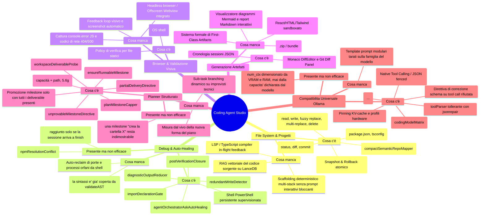

# Architettura & Blueprint Evolutivo: Coding Agent Studio — OnlyRag V2

Stato corrente, gap, librerie, flusso end-to-end e standard di compatibilità universale con i modelli Ollama (SLM e Frontier).

Per riprendere il lavoro senza contesto delle sessioni precedenti, parti da §6. Il debito aperto e ordinato sta in `PROJECT_STATUS.json`, non qui.

---

## 1. Analisi di Sistema: "C'è" / "Presente ma non efficace" / "Manca"



La mappa sopra è l'indice. Qui sotto solo ciò che la mappa non può dire: **perché** una voce è "non efficace", e dove sta.

### 1.1. File System & Progetto

Toolchain atomica completa (`read_file` con line slicing, `write_file`, `replace_file_content` fuzzy su `fast-levenshtein`, `multi_replace_file_content`, `create_directory`, `copy_file`, `move_file`, `delete_file`, `list_dir`, `list_files_recursive`, `grep_search`, `get_file_info`), [`AtomicWorkspaceJournal`](../electron/core/infrastructure/filesystem/atomicWorkspaceJournal.ts) con `rollbackAll()`, [`compactSemanticRepoMapper`](../electron/core/domain/agent/compactSemanticRepoMapper.ts), [`dependencyScanner`](../electron/core/infrastructure/filesystem/dependencyScanner.ts) + [`dependencyIntegrityGate`](../electron/core/domain/agent/dependencyIntegrityGate.ts), git integrato.

**Manca**: RAG vettoriale del codice su LanceDB (chunking per funzione/classe); scaffolding deterministico multi-stack che non invochi CLI interattive soggette a freeze; refactoring AST programmatico (`ts-morph` / `@babel/parser` / tree-sitter).

### 1.2. Debug & Auto-Healing

Shell PowerShell persistente non-interattiva con `CI=true` e blocco comandi distruttivi ([`commandSecurity.ts`](../electron/core/domain/agent/commandSecurity.ts)); [`diagnosticOutputReducer`](../electron/core/domain/agent/diagnosticOutputReducer.ts) e [`autoHealingLogCapper`](../electron/core/domain/agent/autoHealingLogCapper.ts) che iniettano `[TERMINAL AUTO-HEALING DIAGNOSTICS LOG]` nel turno successivo; [`agentOrchestratorAskAutoHealing.ts`](../electron/core/application/agentOrchestratorAskAutoHealing.ts) contro lo stallo passivo in modalità AGENT; [`AgentActionLoopDetector`](../electron/core/domain/agent/loopDetector.ts) con hashing SHA-256 e [`loopEscapePolicy.ts`](../electron/core/domain/agent/loopEscapePolicy.ts).

**Presente ma non efficace** (sessione `session-1787562597025-q8a5`):

* **Definition of Done Gate** ([`verificationGatePolicy.ts`](../electron/core/domain/agent/verificationGatePolicy.ts), `TransactionalExecutionGuard`) si attiva **solo quando il modello chiama `finish`**. Quella sessione è morta al passo 45 sul circuit breaker: il gate — e con lui `dependencyIntegrityGate`, che gira dentro [`agentOrchestratorVerificationRunner.ts`](../electron/core/application/agentOrchestratorVerificationRunner.ts) — non è mai stato raggiunto, e tre import verso pacchetti inesistenti sono rimasti su disco. §6 mostra la stessa condizione chiusa in cerchio.
* **Rilevatore di loop**: identifica la ripetizione ma risponde in gran parte con un divieto. 12 passi su 45 bloccati senza produrre avanzamento. Un solo ramo ha ora un'uscita reale (§5.4).

> **Rettifica**: la stesura precedente diceva che le direttive saturano il prompt, leggendo *fisso a 22.237 caratteri* come *al soffitto*. Misura del 2026-08-24: con `num_ctx` 16.384 il budget è ~44.236 caratteri e il prompt ne occupava 22.192, **il 50%**. Il compattatore non è mai scattato, e correttamente. Il difetto vero è in §5.4.

**Manca**: feedback LSP/typecheck istantaneo post-`write_file` (gli import inventati erano visibili al passo 11 ed emersi trenta passi dopo); auto-reclaim di processi orfani sulle porte di sviluppo.

### 1.3. Browser & Validazione Visiva

`open_in_browser` delega all'OS (`shell.openExternal`/`openPath`); [`browserPreviewVerification.ts`](../electron/core/domain/agent/browserPreviewVerification.ts) limita la prova via browser ai soli file statici renderizzabili (`.html`, `.svg`, `.pdf`).

**Manca (gap critico)**: l'agente è cieco all'esito visivo — nessuno screenshot, nessun `console.error`, nessun codice 404/500 sugli asset. Serve un runner headless (Electron Offscreen `WebContents` o `playwright-core`) che carichi la pagina in background, catturi screenshot, intercetti gli errori JS e produca un report leggibile anche da modelli Vision (`llama3.2-vision`, `qwen2.5-vl`).

### 1.4. Artefatti

Presenti solo Monaco DiffEditor, Git Diff Panel e cronologia in `.onlyrag/sessions/session_history.json`.

**Manca (gap critico)**: modello dati formale per artefatti (UI Component, web app interattiva, diagramma Mermaid, documento, walkthrough) e pannello Live Preview con iframe sandboxato, rendering Mermaid/Markdown ed export 1-click.

### 1.5. Planner Strutturato

[`GoalDecompositionPlanner`](../electron/core/domain/agent/planAndSolveGraph.ts) con microtask atomici `- [ ] m-N: … — verify: <cmd>`, normalizzatore di falsificabilità, capping a 15 milestone ([`planMilestoneCapper.ts`](../electron/core/domain/agent/planMilestoneCapper.ts)), probe su disco ([`workspaceDeliverableProbe.ts`](../electron/core/infrastructure/filesystem/workspaceDeliverableProbe.ts)) che esclude i placeholder, filtro di falsificabilità sui comandi ([`verificationCommandSafety.ts`](../electron/core/domain/agent/verificationCommandSafety.ts), sei famiglie di rifiuto: mutating, vacuous, existence-only, interactive, gui-mode, non-exiting).

**Presente ma non efficace**:

* **Deliverable di directory non riconosciuti**: `extractDeliverablePaths` richiede `stem.ext`, quindi una milestone *"Create `src/services` folder"* non nomina alcun artefatto e resta `not_applicable`. Costò sette passi su cinquanta in un run (§5.4); la strada per chiuderla è stata valutata e scartata, con il motivo, in §5.4. È l'unica voce di questa sezione ancora aperta.

> **Applicato in §5.6g, e non ancora misurato dal vivo**: i **microtask orientati ai file** — dieci milestone su quindici dicevano "crea il file X" e nessuna esprimeva un comportamento, così il piano poteva chiudersi al 100% su un'applicazione che non parte. Il formato ora dichiara la capacità e nomina il path nello stesso titolo. Perché non basta togliere il path, e perché tre delle quattro macro-fasi qui sotto non potevano essere milestone, sta in §5.6g.

> **Chiuso, e la stesura precedente lo dava ancora per aperto**: la *promozione parziale* di [`agentOrchestratorPlanTool.ts`](../electron/core/application/agentOrchestratorPlanTool.ts) — `update_plan` promuoveva sull'exit code del `verificationCommand` **senza controllare i deliverable**, così `m-2` ("crea `vite.config.ts` e `tsconfig.json`") passava senza `tsconfig.json`. Verificato il 2026-08-25: quel percorso instrada ora ogni aggiornamento in `resolveMilestoneUpdate` ([`milestoneUpdateAuthority.ts`](../electron/core/domain/agent/milestoneUpdateAuthority.ts)) **dopo** l'esecuzione del comando, quindi un comando verde non basta più a promuovere una milestone a cui manca un file (§5.2).

**Manca**: sub-task branching dinamico su imprevisti tecnici. La pianificazione gerarchica a 4 macro-fasi (`Research & Workspace Inventory` → `Core Architecture & Scaffolding` → `Implementation & Component Logic` → `Build Verification, Visual Validation & Artifact Delivery`) è stata affrontata in §5.6g e **solo in parte adottata**: tre delle quattro fasi non potevano diventare milestone, e la lettura del perché sta lì.

### 1.6. Compatibilità Universale Ollama

[`toolParser.ts`](../electron/core/domain/agent/toolParser.ts) con pre-stripping CoT e `jsonrepair`; dual-mode Native Tool Calling (`POST /api/chat`) e JSON fenced; hardware ladder con pinning KV-cache e freeze di `num_ctx`; `buildToolSchemaCorrectionDirective` ([`ollamaToolSchemaCatalog.ts`](../electron/core/domain/agent/ollamaToolSchemaCatalog.ts)) che su una tool call rifiutata rimanda parametri obbligatori, opzionali ed envelope JSON esatto; matrice modelli verificati ([`codingModelMatrix.ts`](../src/services/codingModelMatrix.ts), §5.5).

**Presente ma non efficace**: `resolveMaxContextTokens` dimensiona `num_ctx` da tier VRAM e RAM di sistema e non consulta **mai** la `context_length` dichiarata da Ollama. Coincide con la capacità reale solo per caso — misure e conseguenze in §5.5b.

**Manca**: prompt adapter per famiglia di modello (Qwen, Llama, DeepSeek-R1, Mistral).

---

## 2. Direttiva Anti-Hardcoding: Librerie Universali

La colonna **Stato** distingue ciò che è dichiarato in `package.json` da ciò che questa sezione si limita a proporre: la versione precedente elencava otto pacchetti non installati sotto l'intestazione "Libreria Adottata", e un lettore — umano o agente che riceve il documento come contesto — ne concludeva che quelle capacità esistessero già.

| Ambito | Libreria | Stato | Funzione & Motivazione |
| :--- | :--- | :--- | :--- |
| **Parsing & Riparazione JSON** | `jsonrepair` | ✅ in uso | Ripara JSON corrotti/incompleti generati da SLM quantizzati. |
| **Validazione Schemi a Runtime** | `ollamaToolSchemaCatalog.ts` (interno) | ✅ in uso | Contratto dei parametri dichiarato una volta sola, usato sia per il native tool calling sia per la direttiva di correzione. **`zod` non è stato adottato**: duplicherebbe il catalogo con una seconda fonte divergente. La coercizione degli alias resta in `toolSchemaValidator.ts`. |
| **Fuzzy Matching & Diffing** | `fast-levenshtein` + `diff` | ✅ in uso | Distanze di modifica deterministiche per il patching. |
| **Validazione AST** | `typescript` | ✅ in uso (solo build) | Compiler API disponibile ma non ancora invocata come check post-write. |
| **Web Scraping & Markdown** | `cheerio` + `turndown` | ✅ in uso | Parsing DOM resiliente e conversione HTML→Markdown. |
| **Esecuzione Processi & Shell** | `node:child_process` | ✅ in uso | `persistentPowerShellSession.ts`, sessione persistente non-interattiva. |
| **Rendering Diff Visivi** | `diff2html` | ⬜ da adottare | Oggi la UI usa Monaco DiffEditor. |
| **Parsing AST alternativo** | `@babel/parser` | ⬜ da adottare | Necessario solo per stack non-TypeScript. |
| **Percorsi & Globbing** | `fast-glob` + `pathe` | ⬜ da adottare | Oggi la scansione usa `node:fs` e `node:path` diretti. |
| **Validazione Visiva** | Electron Offscreen `WebContents` | ⬜ da adottare | Runtime già presente, modulo di cattura non scritto. |
| **Browser headless alternativo** | `playwright-core` | ⬜ da adottare | Alternativa a Offscreen `WebContents`; sceglierne **una sola**. |
| **Esecuzione Processi (ergonomia)** | `execa` | ⬜ da adottare | Opzionale: la sessione persistente copre già timeout e streaming. |

---

## 3. Flusso End-to-End

```mermaid
sequenceDiagram
    autonumber
    actor User as Utente
    participant UI as Studio UI (React 19)
    participant Orchestrator as Agent Orchestrator (App Service)
    participant Planner as GoalDecompositionPlanner (Domain)
    participant LLM as Ollama Runtime / Model
    participant Parser as ToolParser & Schema Validator
    participant Journal as Atomic Workspace Journal
    participant Tools as Tool Handlers (FS, Browser, Artifacts, Shell)
    participant Gate as Verification & DoD Gate

    User->>UI: Inserimento prompt ("Crea dashboard React con grafici e visual preview")
    UI->>Orchestrator: startAgentSession(prompt, mode, workspace)
    Orchestrator->>Orchestrator: Risoluzione profilo hardware & Context Budgeting
    Orchestrator->>Planner: Genera piano a 4 Fasi con comandi di verifica falsificabili
    Planner-->>Orchestrator: PlanMilestones[] (max 15 microtask)
    Orchestrator->>UI: Emissione stato iniziale piano (Plan Checklist)

    loop Multi-Turn Autonomous Tool Loop (Fino a completamento o maxSteps)
        Orchestrator->>LLM: Invia prompt assemblato (Repo Map + Skills + History + Active Milestone)
        LLM-->>Orchestrator: Generazione in streaming (CoT <think> + Tool Call)
        Orchestrator->>Parser: Isola CoT, ripara JSON con jsonrepair e valida contro il catalogo dei tool

        alt Tool Call Valida
            Orchestrator->>Journal: createSnapshot(targetFiles)
            Orchestrator->>Tools: Esegui tool (write_file, run_command, visual_inspect, create_artifact)
            Tools-->>Orchestrator: ToolExecutionResult (stdout, screenshot, diff, status)

            alt Errore di Esecuzione / Test Fallito
                Orchestrator->>Orchestrator: diagnosticOutputReducer: estrai stack trace
                Orchestrator->>LLM: Inietta blocco diagnostico per auto-healing immediato
            else Esecuzione Riuscita
                Orchestrator->>Planner: workspaceDeliverableProbe: valida presenza deliverable reale
                Planner-->>Orchestrator: Avanzamento milestone (verified / in_progress)
            end
        else JSON non valido / Loop Rilevato
            Orchestrator->>Orchestrator: loopEscapePolicy o direttiva di correzione schema; force advance se necessario
        end
    end

    Orchestrator->>Gate: validateTaskCompletion (Verifica finale: build/test reali)
    alt Build Passata con Successo
        Gate-->>Orchestrator: All checks passed
        Orchestrator->>Journal: commit() (Consolida modifiche su disco)
        Orchestrator->>UI: Consegna sessione, Walkthrough, Artefatti e Diff completi
    else Build Fallita
        Gate-->>Orchestrator: Error trace
        Orchestrator->>LLM: Auto-healing cycle finale (max 3 tentativi)
    end
```

---

## 4. Architettura dei Tool Refattorizzata (SRP)

Scomposizione prevista del monolite [`agentToolExecutorService.ts`](../electron/core/application/agentToolExecutorService.ts) sotto `electron/core/domain/agent/tools/`:

```
tools/
├── fs/          readFileTool · writeFileTool (AST pre-validation) · fuzzyPatchTool
│                fileExplorerTools (list_dir, list_files_recursive, glob) · codeSymbolExtractorTool
├── execution/   runCommandTool (PowerShell, timeout policy, CI env) · runTestsTool (vitest/jest/pytest/cargo)
│                devToolchainTools (inspect_os_env, ensure_tool)
├── browser/     visualValidationTool (Offscreen/Playwright screenshot & DOM) · consoleLogsExtractorTool
├── artifacts/   artifactCreationTool (React, HTML, MD, SVG) · artifactExportTool (zip bundle, render)
├── web/         webSearchTool (SSRF-safe) · fetchWebContentTool (cheerio + turndown)
├── git/         gitStatusTool · gitCommitDiffTools
└── diagnostics/ askClarificationTool · finishTaskTool (trigger del DoD gate)
```

---

## 5. Prossimi Passi di Sviluppo

L'ordine è vincolato: le funzionalità nuove poggiano su cicli di feedback che devono prima chiudersi. Un modulo di validazione visiva non serve a un progetto che non compila, e un motore di artefatti non serve a una sessione che muore al passo 45.

### 5.1. Completato — cicli di feedback riaperti

* **L'agente riceve di nuovo gli errori.** `run_command`, `run_tests`, `ensure_tool` e la verifica delle milestone univano i flussi con `res.stdout || res.stderr`: siccome `npm` scrive sempre un banner su stdout, lo stderr veniva scartato e il modello riceveva "exit code 1" con blocco diagnostico vuoto, sotto una direttiva che gli chiedeva di ispezionare uno stack trace mai mostrato. Sostituito da `DiagnosticOutputReducer.composeCommandOutput`.
* **Il guard delle installazioni non annulla più l'install che serve.** Controllava solo `package.json`: in un workspace generato dall'agente ogni dipendenza risulta "già installata" mentre `node_modules` non esiste. Ora richiede anche la presenza su disco (`agentToolFileRepository.missingFromNodeModules`).
* **Le verifiche non falsificabili sono rifiutate.** Due famiglie nuove in [`verificationCommandSafety.ts`](../electron/core/domain/agent/verificationCommandSafety.ts): *existence-only* (`cat`, `Get-Content`, `ls`, `Test-Path` — passano per qualunque file esista, incluso quello appena scritto) e *gui-mode* (`cypress open`, `--ui`, `--headed`, opener di sistema). Le ricerche di contenuto (`grep`, `findstr`, `Select-String`) restano ammesse: falliscono quando il file esiste ma è sbagliato.
* **Le direttive anti-loop non mentono più sulla propria durata.** Dicevano "You are FORBIDDEN from calling run_command on 'npm run build'" — il comando che il DoD Gate esige — mentre la finestra reale del rilevatore è di 5 passi. Ora dichiarano l'ambito vero e indicano l'uscita: leggere l'errore, correggerlo, rieseguire.

### 5.2. Completato — i controlli anticipati

* **Import allucinati intercettati alla scrittura.** [`importDeclarationGate.ts`](../electron/core/domain/agent/importDeclarationGate.ts) confronta i package importati dal file appena scritto con `package.json` (alias `tsconfig.paths` inclusi). Il file viene comunque salvato — buttarlo costerebbe il turno che lo ha prodotto — ma il risultato del tool porta l'elenco dei non dichiarati. Verificato live su `@vitejs/plugin-react`, `@tailwindcss/react`, `react-router-dom`, `tailwindcss-react-components`.
* **Milestone verificabili solo con i deliverable presenti.** [`milestoneUpdateAuthority.ts`](../electron/core/domain/agent/milestoneUpdateAuthority.ts) rifiuta `verified` finché un file dichiarato dal titolo manca, è vuoto o è un placeholder, nominandolo. Le milestone senza artefatto (`not_applicable`) restano chiudibili dal loro comando.
* **`write_file` distingue file e directory.** Un path che termina con separatore va a `create_directory` (rifiutato se porta contenuto). Verificato live su `src/services/`, che nella sessione originale produceva un file da 0 byte.
* **Blocchi di fallimento deduplicati per tool+target sull'intero buffer**, non solo sull'ultimo elemento: l'alternanza A,B,A,B non si accumula più.
* **Report di chiusura reale**: `compileSessionStopSummary` sostituisce la stringa interna del circuit breaker con motivo, milestone completate e aperte, file toccati. `SESSION_TRACKER.md` non dichiara più "all verified" con milestone aperte.
* **Rifiuto di una tool call con il contratto del tool**: `buildToolSchemaCorrectionDirective` al posto della frase generica precedente.

### 5.3. Completato — recupero dai conflitti di versione

* **`npm ERESOLVE` diventa un'istruzione eseguibile.** [`npmResolutionConflict.ts`](../electron/core/domain/agent/npmResolutionConflict.ts) legge dal report di npm la versione installata e quella richiesta e produce il comando esatto, con l'intervallo copiato **verbatim** da npm, mai sintetizzato. Prima sopra quell'output c'era "locate the failing file, syntax, or command parameter", che mandava il modello a riscrivere file che non erano il problema.
* **Il guard distingue una versione da un nome.** `npm install vite@^8.0.0` non è una reinstallazione: confrontando solo i nomi, il guard rispondeva "vite è già installato" e annullava il comando che risolve.
* **Nomi di tool inventati vengono rifiutati.** `normalizeToolName` restituiva qualunque stringa come tool valido: in un run il passo 1 è stato `npm_install`, dispacciato a un executor senza handler. Ora decide il catalogo, e il rifiuto porta l'elenco dei tool reali.
* **Verificato live**: da `vite@4.5.14` installato e un `npm install @vitejs/plugin-react@6.1.0` irrisolvibile, il modello ha eseguito il comando indicato (`npm install vite@^8.0.0`) e poi ha ripetuto l'installazione con successo. Nessun `--force`, nessun `--legacy-peer-deps`. Nel run precedente si era fermato a chiedere all'utente.

> **Nota sul tono.** La prima stesura elencava due opzioni e diceva "Pick ONE and run it now". Il modello le ha capite e ha girato la scelta all'utente con `ask` — in modalità AGENT, dove non risponde nessuno. **Una direttiva che offre una decisione a un modello lo invita a delegarla.** Ora c'è una sola istruzione imperativa e un ripiego, non un menu.

### 5.4. Completato — il churn e la strada per chiudere

I due sintomi erano **un solo meccanismo**, e nessuno stava dove il documento lo cercava.

* Sintomo A: rilancia un comando **passato** — quattro `npm run build` già verdi invece di chiudere.
* Sintomo B: riscrive lo stesso file — 21-31 `write_file` per ~14 file in cinquanta passi.

**Causa.** `write_file` rispondeva `Successfully wrote file X` anche a contenuto identico sul disco, frase indistinguibile da una modifica vera; e l'orchestratore classifica la mutazione **per nome del tool** (`isMutating` in [`agentOrchestratorToolResultProcessor.ts`](../electron/core/application/agentOrchestratorToolResultProcessor.ts)), quindi una riscrittura a zero byte di differenza azzerava `flags.hasVerifiedBuild`. Ciclo: build verde → riscrittura identica → la prova viene buttata → build di nuovo. **Il sintomo B produceva il sintomo A.**

**Seconda causa, indipendente.** Anche con build verde il modello non poteva chiudere: la direttiva 4 del blocco piano vieta `finish` finché tutte le milestone non sono `verified`, e una milestone che non nomina file (`not_applicable`: "ensure buttons have a 44x44 touch target") non può raggiungere `verified` per nessuna via — `selectMilestonesProvenByVerification` la esclude apposta, perché promuoverla sarebbe fabbricare una verifica. Build verde, milestone inchiodabile, divieto di finire: l'unica azione permessa era rieseguire la build.

**Applicato:**

* **La scrittura a vuoto è riconosciuta.** [`redundantWriteDetector.ts`](../electron/core/domain/agent/redundantWriteDetector.ts) confronta il contenuto proposto con quello su disco normalizzando i soli due scarti che non sono modifiche di codice: CRLF/LF (fonte dominante di riscritture fantasma su Windows) e newline finale. Indentazione, righe vuote e riformattazioni restano modifiche vere. Il file non viene toccato — nemmeno l'mtime, su cui `scanCommandTouchedFiles` attribuisce i file.
* **Un no-op non è una mutazione.** `ToolExecutionResult.noOpMutation` lo esclude da `isMutating`: `hasVerifiedBuild` sopravvive, nessuna milestone avanza su prove immutate, il pannello non annuncia file "Created" da nessuno.
* **La chiusura diventa uno stato dichiarabile.** [`postVerificationClosure.ts`](../electron/core/domain/agent/postVerificationClosure.ts) combina segnali che esistevano già: se `hasVerifiedBuild` è vero e ogni milestone aperta è `not_applicable`, non resta lavoro che un comando possa dimostrare. Una sola milestone `unsatisfied` riporta a `not_closable`.
* **La direttiva sostituisce il divieto, non ci si affianca.** `compileProgressPrompt` rimpiazza **l'intero** blocco della milestone attiva con la direttiva di chiusura, che nomina le milestone inchiodabili e ordina la sequenza: `update_plan` su quelle, poi `finish`. La checklist resta stampata, perché è da lì che il modello legge gli id.
* **Lo stesso testo sostituisce anche nel loop guard**, in entrambi i rami. `REDUNDANT_SUCCESS_ADVISORY_ATTEMPTS` e l'abort a `LOOP_ESCAPE_ABORT_STREAK` restano intatti: la garanzia di terminazione non è toccata. Sospeso, e solo in stato di chiusura, è l'escape strutturale — marcare `failed` proprio le milestone che la direttiva chiede di chiudere metterebbe "fallita" nel report per lavoro fatto.

Il DoD Gate non è indebolito: continua a eseguire la verifica reale prima di onorare `finish`.

**Verifica live, e qui la prima stesura ha sbagliato.** Nel run `live-eresolve` la direttiva è comparsa al passo giusto — passo 11, dopo un `npm run build` verde al passo 10 — con il contenuto giusto, ed è stata **ignorata**: era **terza**, in un messaggio i cui primi due blocchi dicevano *"move to the NEXT unfinished step"* e *"Advance to the next unfinished step instead"*. Nel blocco piano avevo sostituito il testo in conflitto; nel loop guard l'avevo accodato. Corretto. **Un messaggio porta una sola istruzione.**

Secondo run, stessa sonda: la sessione **arriva a `finish`** (`Status: COMPLETED`, 16 passi). Per intero, però: il modello ha ripetuto la build altre quattro volte (passi 12-15) prima di obbedire, e `finish` è caduto sull'ultimo passo disponibile. Miglioramento misurato, non risoluzione pulita — e prevedibile, perché in quella sonda la direttiva arriva **solo** dentro un intervento del loop guard, cioè quando il modello gira già a vuoto. Il canale forte, il blocco piano ripetuto a ogni turno, lì non esiste (`eresolveRecovery.live.ts` non semina un piano).

**Run con piano seminato** (`fullTaskRun.live.ts`, 50 passi): il canale forte funziona come progettato — la direttiva di chiusura ha sostituito il focus block nominando le quattro milestone indimostrabili e lasciando la checklist. Il modello ha obbedito alla direttiva 1 (`update_plan {m-13, verified}`) ma **diciannove passi dopo**, sprecandone due su una milestone già abbandonata; la sessione è finita sul tetto dei 50 passi, non su `finish`.

> **Contraddizione sanata, per quanto l'evidenza lo consente (2026-08-24).** La stesura precedente collocava quel momento *"al passo 31, subito dopo un `npm run build` verde"*, mentre §6 affermava che **nessuno dei tre run** aveva mai avuto una build verde. Le due cose non possono essere entrambe vere: la direttiva di chiusura si costruisce solo con `hasVerifiedBuild`.
>
> Cosa regge davvero, controllato:
>
> * **Non è il run superstite.** L'unico stato di sessione rimasto (il terzo) porta `write_file` × 63 e `update_plan` × 1, zero comandi: lì `hasVerifiedBuild` non può mai essere stato vero, quindi nessuna direttiva di chiusura è comparsa. E le milestone non tornano — il paragrafo parla di `update_plan {m-13, verified}`, mentre in quello stato m-13 è `failed`. **Il paragrafo descrive un run diverso, il cui log è stato cancellato.**
> * **`hasVerifiedBuild` non significa solo "build verde".** Lo alzano anche `run_tests` e un `open_in_browser` su un file renderizzabile. Se in quel run la direttiva è davvero comparsa, la causa può non essere stata un `npm run build`: l'affermazione *"subito dopo un `npm run build` verde"* è la parte non sostenuta, non la comparsa della direttiva.
> * **Anche l'affermazione di §6 era più larga dell'evidenza.** "Nessuno dei tre run" è dimostrato solo per il terzo. Per i primi due non esiste più nulla da leggere.
>
> Entrambe le affermazioni sono quindi state ridotte a ciò che si può controllare. Nulla di questo tocca la diagnosi del deadlock, che poggia sul codice (§6) e sul run superstite, né la correzione, che è stata misurata dal vivo. Cosa la settlerebbe: rieseguire la sonda con piano seminato **conservando il log**, e leggere quale tool alza `hasVerifiedBuild` al passo in cui la direttiva compare — la ragione per cui la conservazione del log è ora una voce del tracker e un paragrafo di §6.

**La seconda forma del churn, diagnosticata dal run.** Il tracker ipotizzava "riscrive lo stesso file con contenuto diverso". Il log smentisce: i tre write su `src/services/index.tsx` (passi 22-24) erano tre **placeholder diversi** — `fetchData` stub, poi `getTasks`/`addTask` stub, poi `export default {}`. Non correzioni: tentativi diversi di soddisfare la milestone m-10, *"Create `src/services` folder"*, che nessuna scrittura poteva soddisfare. `extractDeliverablePaths` non trova nulla (una directory non ha estensione), quindi la milestone risolve `not_applicable`; nel frattempo la direttiva 2 prometteva che creare i file l'avrebbe chiusa. **Un'istruzione che non può essere eseguita** — sette passi su cinquanta.

* [`unprovableMilestoneDirective.ts`](../electron/core/domain/agent/unprovableMilestoneDirective.ts) sostituisce **la sola direttiva 2** quando la milestone attiva è `not_applicable`: dichiara che nessun file e nessun comando possono dimostrarla, che creare un file nuovo verrà bloccato come loop, e nomina `update_plan` con l'id esatto. Il resto del focus block resta intatto.
* La direttiva **non** dice di saltare il lavoro. *"Ensure buttons have a 44x44 touch target"* descrive lavoro vero in file esistenti: manca solo la prova. "Chiudila e basta" trasformerebbe ogni milestone inchiodabile in un timbro.
* Quando anche la chiusura di sessione è legittima, vince quella.
* **Correzione dal run**: la direttiva è finita su m-5 *"Install Tailwind CSS"*, che porta `Verify with: npm install …`, affermando *"No write and **no command** can prove it"*. Falso — `update_plan` **esegue** il `verificationCommand` e promuove sull'exit code. `shouldDirectUnprovableClosure` ora richiede anche l'assenza di un `verificationCommand`, così l'affermazione centrale è letteralmente vera.
* Nello stesso run il no-op detector ha lavorato: sette `[NO-OP WRITE]` su `globals.css` dal passo 39, build verde preservata. Il modello ha ripetuto comunque: il rilevatore rende osservabile il fatto e protegge la prova, non convince un 7B a smettere.

> **Strada scartata**: rendere `src/services` estraibile come *deliverable di directory*. Una milestone `not_applicable` è **chiudibile** dal giudizio del modello, una `unsatisfied` **blocca** la chiusura di sessione. Un'estrazione sbagliata — "Move `src/old` to the `src/new` folder" — convertirebbe una milestone chiudibile in una bloccante permanente. Non vale il rischio finché non esiste una regola sintattica che distingua creazione da spostamento.

**La terza forma: consegna parziale.** Milestone m-6, *"Configure Tailwind CSS in `postcss.config.js` and `tailwind.config.js`"*. Il modello ha scritto `postcss.config.js` al passo 19 e lo ha riscritto ai passi 20-29, byte-identico, sempre bloccato. **`tailwind.config.js` non è mai stato scritto in cinquanta passi.** Non era confuso su cosa avesse fatto: non gli è mai stato detto cosa mancava. `advanceActiveMilestoneOnMutation` risolve lo stato del deliverable a ogni scrittura e parlava solo nel ramo `satisfied`; nel ramo `unsatisfied` taceva, pur avendo l'elenco esatto da `findUnsatisfiedDeliverables`.

* [`partialDeliveryDirective`](../electron/core/domain/agent/milestoneVerificationPromotion.ts) nomina i file mancanti, dichiara che la milestone non può essere verificata finché non esistono, e dice esplicitamente di **non** riscrivere quello appena consegnato — che viene accreditato, non trattato come errore.
* Il file appena scritto è escluso dall'elenco confrontando path **normalizzati**: le scansioni dei comandi riportano path assoluti, i deliverable escono dal titolo in forma relativa, e un confronto letterale rilancerebbe come "mancante" ciò che è appena atterrato.
* Se l'unico deliverable insoddisfatto è proprio quello appena scritto (corpo placeholder), la direttiva tace: contraddirebbe il "Successfully wrote file" appena letto, e di quel caso parlano le regole sui placeholder.
* Viaggia come episodio `BLOCKED`, l'unico stato che la instrada nel buffer dei fallimenti dove sopravvive al trimming FIFO. La scrittura però **non** è stata bloccata, e la traiettoria stampa il sommario accanto a quella parola: il sommario apre perciò con "Write accepted".

**Prima obbedienza immediata di tutta la serie:**

| | senza direttiva | con direttiva |
| :--- | :--- | :--- |
| m-1 (`package.json` + `index.html`) | — | passo 1 scrive `package.json`, direttiva nomina `index.html`, **passo 2** lo scrive |
| m-2 (`vite.config.ts` + `tsconfig.json`) | passo 3 scrive `vite.config.ts`, `tsconfig.json` arriva ai passi 8, 9 e 12 (uno rifiutato dall'AST) | passo 3 scrive `vite.config.ts`, direttiva nomina `tsconfig.json`, **passo 4** lo scrive |

Nove passi contro uno, sulla stessa milestone. Due sole milestone hanno attivato la direttiva in tutto il run: la deduplicazione su tool+target regge, il costo di prompt è quello previsto.

**La finestra su cosa è appena successo era occupata dal proprio avviso.** Misurato al passo 48. `### RECENT DETAILED TOOL OUTPUTS` occupava 4.780 caratteri, e quattro dei sei slot erano copie dello stesso `[CRITICAL FILE EDIT LOOP: N EDITS ON src/pages/TasksPage.tsx]`, diverse solo per N: **3.988 su 4.780, l'83%**. Al modello restavano 792 caratteri per ricordare cosa aveva fatto. La causa: `failureLogs` deduplica su tool+target dalla §5.2 — e il suo commento spiega già che il confronto byte a byte non basta, *"loop interventions embed an escalating 'Attempt N' counter"* — mentre `recentFullLogs` era rimasta una FIFO pura. La stessa intuizione applicata a metà.

* Un episodio di fallimento con lo stesso tool+target già in finestra **sostituisce** il precedente invece di aggiungere uno slot.
* Solo i fallimenti collassano: due scritture riuscite sullo stesso file portano corpi diversi (ai passi 42 e 43 erano 80 e 712 caratteri) e servono entrambe.
* L'intestazione diceva "Last N Steps" e non era più vera: ora dichiara *N most recent distinct actions*.

| | prima | dopo |
| :--- | ---: | ---: |
| dimensione della sezione | 4.780 char | 2.758 char |
| avvisi ripetuti | 3.988 (83%) | 1.465 (53%) |
| contenuto reale | 792 (16%) | **1.293 (46%)** |
| passi coperti | 42-47 | 40-47 |

> **Nota sul metodo**: la prima misura diceva 7.603 caratteri e 89% perché il parsing non delimitava la fine della sezione. I numeri sopra hanno i confini corretti: la direzione non cambia, la grandezza sì.

**Esito complessivo, per intero.** La sessione ha di nuovo esaurito i cinquanta passi a 0/15, come la precedente. Il churn tardivo resta su milestone da **un solo file** (`globals.css` passi 35-40, `TasksPage.tsx` passi 42-47), dove la consegna parziale non ha nulla da dire. **Resta aperto**: typecheck incrementale post-write (`validateAST` copre già la sintassi in pre-commit).

### 5.5. Completato — quali modelli l'app ha davvero provato

Non tocca il loop dell'agente: riguarda **cosa l'utente può sapere prima di scegliere**.

Il pannello Impostazioni mostrava solo il tag del modello, quindi scegliere fra `qwen2.5-coder:7b` e `deepseek-coder:6.7b` presupponeva di conoscere già la differenza. Il catalogo esistente ([`hardwareModelCatalog.ts`](../src/services/hardwareModelCatalog.ts)) risponde a una domanda sola — *entra nella VRAM?* — che è dimensionamento, non funzionamento: un 3B entra in una scheda da 4 GB e non regge un piano da quindici milestone; un modello senza tool calling entra ovunque e fallisce al passo 1.

**Le metriche c'erano già e venivano buttate.** `/api/tags` riporta `details.context_length`, `parameter_size`, `quantization_level` e `capabilities`; `getModelCapabilities` leggeva la risposta e **teneva solo le capabilities**. Ora c'è `getModelMetrics` con canale IPC dedicato ([`ollamaHttpClient.ts`](../electron/core/infrastructure/http/ollamaHttpClient.ts)) e i badge mostrano numeri letti. Un campo che Ollama non riporta **non viene disegnato**: su un valore inventato l'utente agirebbe.

**`verified` significa una cosa sola**: *una sonda live è stata eseguita end to end contro questo modello e il log è stato letto*. Non "è un modello da coding", non "dichiara i tool". Per questo `VERIFIED_MODELS` ha **una sola voce**, `qwen2.5-coder:7b`. È corta perché è vera. L'evidenza sta nel badge, non nel commento: il tooltip riporta data, sonde e **cosa il run ha fallito**, verbatim — *"scaffolds a project but has not yet produced a green build"*.

**Il set 1-click** (`selectWizardCodingSet`) filtra per tier hardware e mette davanti i verificati. L'idoneità hardware viene **prima**: meglio un modello non testato che uno che non entra in VRAM. Restituisce una lista vuota, mai un ripiego.

> **Conseguenza verificata nella UI**: su profilo `entry` il set proposto è `qwen2.5-coder:3b` + `qwen2.5-coder:1.5b`, **nessuno dei due verificato**, perché il 7b non rientra in quel tier. È corretto e si risolve verificando i modelli piccoli, non cambiando l'ordinamento. Sta nel tracker.

**La sonda live esegue ora il flusso vero.** `seedGeneratedPlan` chiamava solo `generatePlanText`, saltando `agent:plan-interview` e `agent:plan-enrich-prompt`: ogni run misurava un flusso che nessun utente esegue. Ora sono quattro passi, e il prompt arricchito è passato anche a `runAgentOrchestratorLoop`.

> **Onestà sul risultato**: su quel prompt l'intervista **non produce domande** — verificato chiamando il modello direttamente, risponde `hasQuestions: false` con JSON valido. Non è un fallimento di parsing: la richiesta è già prescrittiva. L'ipotesi che i loop nascessero da scelte che l'intervista avrebbe fissato **non è supportata**. Per esercitare quel ramo serve un prompt vago.

### 5.5b. Misurato — come Ollama tratta davvero il contesto

Tre misure contro l'Ollama locale del 2026-08-24, qui perché **contraddicono ciò che il codice assume**.

| chiesto | dichiarato dal modello | allocato |
| :--- | ---: | ---: |
| `num_ctx` 32768 a `deepseek-coder:6.7b` | 16.384 | **16.384** |
| `num_ctx` 65536 a `qwen2.5-coder:7b` | 32.768 | **32.768** |

**Ollama tronca al valore dichiarato dal modello, in silenzio**, senza errore. Il valore realmente allocato è leggibile da `/api/ps` (`context_length`) dopo il primo caricamento.

**La terza misura è quella che conta.** Prompt da ~10.000 token con `num_ctx=2048`: la chiamata **non fallisce**, `prompt_eval_count` risulta 1026, e la risposta ignora un marcatore piazzato all'inizio del prompt. **Ollama scarta la TESTA e tiene la coda.** Per questo agente la testa è il system prompt, il catalogo dei tool e il blocco piano.

Il rischio quindi non è chiedere troppo: è che `deriveMaxContextChars` derivi il budget dal `num_ctx` che l'app ha **scelto** invece che da quello allocato. Se divergono, `HeuristicContextCompactor` non scatta e il prompt perde le istruzioni senza che nulla lo segnali. Oggi non morde (~6k token contro 16.384 reali) ma scala con skill, repo map e storia.

> **Rettifica collegata**: la capacità dichiarata dal modello **non viene mai letta** dal runtime. `resolveMaxContextTokens` ([`hardwareProfileTiers.ts`](../src/services/hardwareProfileTiers.ts), chiamata da `hardwareProfileResolver.ts`) guarda solo tier VRAM e RAM. I due `contextLength` che esistono nel codice sono entrambi di sola presentazione: `hardwareRecommendationEngine.ts` e il `getModelMetrics` di `ollamaHttpClient.ts` (§5.5), che legge `details.context_length` **per disegnare il badge** e non per dimensionare la richiesta. Su una macchina da 32 GB tetto hardware e capacità del modello coincidono a 32.768 **per coincidenza**.

### 5.6. Applicato — l'arbitro delle direttive e la build irraggiungibile

Due difetti che erano lo stesso difetto: **nessuno decideva cosa il modello dovesse leggere ORA**, e in mancanza di quel qualcuno nessuna direttiva ha mai nominato la build.

**La diagnosi.** Vedi §6 per l'evidenza completa; in breve: `hasVerifiedBuild` si alza solo con `run_command`/`run_tests` o dentro il finish gate, il finish gate è vietato finché le milestone non sono verificate, e le milestone si verificano solo con una build passata. Cerchio chiuso. In tre run da cinquanta passi il modello non ha emesso **un solo comando**: `write_file` era l'unica mossa che qualcuno gli avesse mai indicato.

**L'arbitro.** [`planDirectiveArbiter.ts`](../electron/core/domain/agent/planDirectiveArbiter.ts) è il punto unico che sceglie la sola direttiva che il blocco piano porta questo turno. La priorità è dichiarata una volta, lì:

| # | stato | quando | cosa ordina |
| :--- | :--- | :--- | :--- |
| 1 | `session_closure` | verifica passata, nulla scritto dopo | chiudi la sessione |
| 2 | `dependencies_undeclared` | il codice importa pacchetti che il manifest non dichiara | `npm install <pkg>` |
| 3 | `dependencies_missing` | il manifest dichiara pacchetti assenti da `node_modules` | `npm install` |
| 4 | `verification_due` | nessuna milestone aperta è `unsatisfied`, nulla è ancora verificato | il comando che il progetto stesso dichiara |
| 5 | `unprovable_milestone` | la milestone attiva non nomina artefatti | `update_plan` su quella milestone |
| 6 | `focus` | tutto il resto | il blocco piano ordinario |

I primi quattro sostituiscono **l'intero** focus block; il quinto sostituisce **la sola direttiva 2**, come già faceva. Le due forme di sostituzione esistevano sparse: ora sono i due campi di una decisione unica, e `compileProgressPrompt` ne riceve una sola invece di due stringhe indipendenti che nessuno confrontava.

**`verification_due` è la leva che mancava.** Il canale forte — il blocco piano, l'unico che raggiunge il modello a ogni turno — non aveva nulla che portasse a `run_command`. L'unico testo che nominava un comando viveva dentro un intervento del loop guard, cioè arrivava solo a modello già in stallo: sette volte, ignorato sette volte. Ora la direttiva compare **prima**, nel momento in cui scrivere non può più dimostrare nulla, e nomina il comando letto da `resolvePrimaryVerificationCommand` — mai inventato dal modello, per la ragione già stabilita in `projectVerificationResolver.ts`.

**`dependencies_missing` sta prima di proposito.** `npm run build` su un workspace senza `node_modules` fallisce con "vite: not found", un errore che non dice niente sul codice e a cui un modello piccolo risponde riscrivendo `package.json`. Mandarlo contro un comando che non può riuscire è il modo più rapido di far perdere credito a una direttiva. La direttiva vieta esplicitamente quella scorciatoia.

**Il loop guard consuma la stessa decisione** e la **sostituisce** al testo consultivo, in entrambi i rami — non solo per la chiusura, come prima. Il preambolo cambia con lo stato: su progetto verificato "nulla di ciò che esegui può aggiungere altro", altrimenti "ripetere non muove il piano, l'unica azione che lo muove è qui sotto". L'escape strutturale resta sospeso **solo** in stato di chiusura: abbandonare una milestone come `failed` mentre la direttiva chiede di eseguire la build non toglierebbe nulla alla terminazione (lo streak sale comunque, l'abort a `LOOP_ESCAPE_ABORT_STREAK` è intatto) e metterebbe "fallita" nel report per lavoro fatto solo nel caso della chiusura.

**`dependencies_undeclared`, aggiunto dopo il primo run.** Il run che ha rotto il deadlock ha fatto girare la build e l'ha vista fallire su `Cannot find module '@vitejs/plugin-react'` — importato da `vite.config.ts`, dichiarato da nessuno. L'informazione esisteva in due posti e in nessuno dei due era azionabile: il gate per-file la dice al passo che scrive il file, dentro un risultato che porta anche l'esito della scrittura (44 volte in quel run, mai seguita), e `scanWorkspaceDependencies` la dice bene ma gira solo dentro `runProjectVerification`, cioè al `finish`, che quelle sessioni non raggiungono.

Il nuovo [`undeclaredImportScanner.ts`](../electron/core/infrastructure/filesystem/undeclaredImportScanner.ts) è la metà economica: un cammino AST limitato — 150 file, profondità 5, gli stessi `DEFAULT_IGNORED_DIRS` — dello stesso ordine di costo della repo map che ogni turno già costruisce, e riusa `extractBareImportSpecifiers` e `readDeclaredPackages` **verbatim**, così "non dichiarato" significa qui esattamente ciò che significa alla scrittura, con la stessa strettezza voluta. `depcheck` non è stato messo nel giro per turno: è asincrono e porta un timeout da 60 secondi, e pagarlo su cinquanta passi non è uno scambio che questo loop può fare — resta dov'è, come controllo accurato prima della chiusura.

Ordinato **prima** di `dependencies_missing` perché `npm install <pkg>` dichiara e installa insieme. La direttiva nomina il file che importa: a un modello piccolo a cui si dice "manca un pacchetto" tocca indovinare quale, e l'ipotesi osservata in questo progetto è stata riscrivere un file che stava bene. Porta anche il secondo ramo per il caso del pacchetto inventato — `@tailwindcss/react`, trovato su disco e inesistente su npm: se l'install fallisce, riscrivere il file che lo importa.

**Cosa NON è stato toccato, e perché.** La direttiva 5 del focus block (*"If any CLI scaffolding command fails or hangs, construct the required project files directly using write_file"*) resta invariata: è condizionata a un fallimento reale, cambiarla è un'ipotesi separata e non misurata, e nello stato `verification_due` il blocco viene comunque sostituito per intero. Aggiungerla alla lista delle modifiche di quest'onda renderebbe illeggibile quale delle due ha prodotto l'effetto.

**Verifica live — il deadlock è rotto, misurato.** Run del 2026-08-24 sulla sonda `fullTask` con l'arbitro attivo:

| | tre run precedenti | run con arbitro |
| :--- | ---: | ---: |
| `run_command` emessi | **0** su 50 passi | **13** su 35 passi |
| `npm install` | mai | passo 2 |
| `npm run build` eseguito | mai | passi 15, 16, 28, 30, 34 |
| `node_modules` | assente | presente |

Le due misure che §5.4 ha insegnato a tenere separate — **comparsa** e **obbedienza** — coincidono per la prima volta nella serie:

* `dependencies_missing` compare nel prompt del passo 2; il modello esegue `npm install` **al passo 2**.
* `verification_due` compare nel prompt del passo 28; il modello esegue `npm run build` **al passo 28**.

Latenza zero in entrambi i casi, contro i diciannove passi della direttiva di chiusura e le sette volte su sette in cui l'intervento del loop guard era stato ignorato.

Da osservare e non concludere: il modello aveva già eseguito `npm run build` di propria iniziativa ai passi 15-16, dopo un intervento del loop guard al passo 13 — lo stesso testo che nei run precedenti non aveva mai funzionato. Che l'abbia seguito *perché* al passo 2 aveva visto un comando riuscire è un'ipotesi plausibile e non misurata.

**Il run ha anche prodotto una regressione, ed è di quest'onda.** Ai passi 17-18 il modello ripete un `npm run build` che fallisce, e l'escape strutturale marca `FAILED` la milestone m-1 *"Create `package.json`"* — file scritto correttamente al passo 1 e su disco per tutta la sessione — con la nota *"Abandoned after 2 consecutive blocked attempts on 'npm run build'"*. Stessa sorte per m-8. Il caso era irraggiungibile finché il modello non eseguiva comandi: `forceMilestoneAdvance` assume che il loop riguardi il lavoro della milestone attiva, e su un loop di comando l'assunzione è falsa. Il danno è quello che la sospensione dell'escape in stato di chiusura esisteva già per evitare — "fallita" nel report per lavoro fatto.

Corretto con `isActiveMilestoneDelivered`: l'escape non abbandona una milestone quando il target del loop è un comando **e** tutti i file che la milestone nomina sono su disco con contenuto reale. Volutamente stretto — una milestone che deve ancora un file, o che non ne nomina nessuno, può davvero bloccare il piano e lì l'escape conserva tutto il suo potere. La terminazione non è toccata: lo `stagnationStreak` sale comunque e l'abort a `LOOP_ESCAPE_ABORT_STREAK` resta.

**Il collo di bottiglia successivo è già visibile, ed è lo stesso di sempre con la build finalmente in esecuzione.** `npm run build` fallisce su `Cannot find module '@vitejs/plugin-react'`: `vite.config.ts` lo importa e `package.json` non lo dichiara. L'`importDeclarationGate` lo segnala — 44 occorrenze di `UNDECLARED IMPORT` nel log del run — e il modello non agisce mai. `dependencies_missing` non lo copre di proposito: confronta i pacchetti *dichiarati* con `node_modules`, e questo non è dichiarato. Il dato per coprirlo esiste già (`scanWorkspaceDependencies` + `evaluateDependencyIntegrity`) ma gira solo dentro `runProjectVerification`, cioè al `finish`, che la sessione non raggiunge — di nuovo informazione che il sistema possiede e non consegna come azione singola. Sta nel tracker come candidato a uno stato `dependencies_undeclared` dell'arbitro.

**Secondo run live, e il progetto consegnato compila.** Con `dependencies_undeclared` attivo, sonda `fullTask`, 50 passi:

* passo 4 scrive `vite.config.ts`, che importa `@vitejs/plugin-react`;
* **passo 6** il modello esegue `npm install @vitejs/plugin-react` — il primo passo di comando disponibile dopo la direttiva;
* l'install fallisce con `ERESOLVE`, e al **passo 7** il modello esegue `npm install vite@^8.0.0`, cioè esattamente il comando che la direttiva di §5.3 gli indica;
* **passo 10** ripete l'install del plugin, e riesce.

Tre direttive diverse che cooperano invece di contraddirsi, che è ciò per cui l'arbitro esiste. Nel `package.json` finale `@vitejs/plugin-react` **è dichiarato**: il blocco che aveva ucciso il run precedente non c'è più. Verificato a mano nel workspace prodotto: **`npx vite build` esce verde** (`built in 394ms`) — la prima volta in tutta la serie che il progetto consegnato compila.

`verification_due` non è scattato in questo run, e correttamente: qualche milestone è rimasta sempre `unsatisfied`, quindi la sua precondizione non si è mai avverata. L'agente non ha eseguito la build da sé — ha esaurito i cinquanta passi altrove, vedi sotto.

**Quello che il run consuma adesso è churn, non dipendenze.** `globals.css` riscritto ai passi 18-24 e 35-43, `main.tsx` ai passi 27-34: circa venti passi su cinquanta in ripetizioni su milestone da **un solo file**, dove la consegna parziale non ha nulla da dire. È il difetto già descritto in questa sezione, ora primo in ordine di costo.

**E un difetto che il run ha reso visibile: una scrittura rifiutata contava come riuscita.** Ai passi 46, 47, 49 e 50 quattro `write_file` sono stati respinti dalla validazione AST pre-commit — nessuno è arrivato su disco — e tutti e quattro registrati `SUCCESS`. `isFailureOutput` (estratto in [`agentOrchestratorToolResultProcessor.ts`](../electron/core/application/agentOrchestratorToolResultProcessor.ts) proprio per essere verificabile) non elencava il marcatore `[PRE-COMMIT AST VALIDATION ERROR IN`. L'etichetta viene letta tre volte: `recordOutcome` la passa al loop detector, che ha quindi classificato la ripetizione come *riuscita* e ha mandato al modello la direttiva di ridondanza — il cui testo dice *"this is NOT a failure and it is NOT counted against you"* — a proposito di un file che non esiste; solo i fallimenti entrano nel buffer che sopravvive al trimming FIFO, quindi l'errore di sintassi poteva uscire dal contesto; e la tabella di traiettoria dichiarava `SUCCESS` a chi legge il run. Corretto, con test sul predicato.

**Stato dei test:** typecheck pulito, 1349 test su 142 file verdi, catena `npm run lint` completa verde.

### 5.6b. Applicato — le due metà del churn

L'ipotesi a tracker era "il modello riscrive lo stesso file". Vera come sintomo e inutile come causa: il log dice altro, ed è la quarta volta che questo progetto trova la stessa forma — **un'istruzione che non può essere eseguita**.

Milestone m-9 del run del 2026-08-24: *"Add Tailwind directives to `globals.css`"*.

1. Passo 8 — il modello scrive `src/styles/globals.css` con esattamente quelle direttive.
2. Passo 17 — chiama `update_plan {m-9, verified}`. **Rifiutato**: *"Still missing, empty or placeholder: globals.css. Directives: 1. Write the missing file(s) with write_file, with real content."*
3. Passi 18, 19, 35, 36, 43 — il modello fa ciò che la direttiva dice: riscrive `globals.css`. Sempre gli stessi 58 byte, sempre un no-op, sempre bloccato come loop.

La causa sta in [`workspaceDeliverableProbe.ts`](../electron/core/infrastructure/filesystem/workspaceDeliverableProbe.ts): il titolo nomina `globals.css` senza directory, il probe lo risolveva **solo contro la radice**, e il file è in `src/styles/`. La milestone era quindi insoddisfacibile per costruzione, e la direttiva che ne discende ordinava l'unica azione che non poteva cambiare nulla.

Verificato leggendo il log, non ipotizzando: i contenuti scritti a ogni passo sono byte-identici (58 caratteri, `@tailwind base/components/utilities`), e il rifiuto di `update_plan` al passo 17 nomina il file per esteso.

* **Un deliverable senza directory è un nome, non una posizione.** Il probe indicizza i basename del workspace (walk limitato, 400 file, profondità 6, stessi ignore) solo quando un nome nudo non risolve alla radice, e una volta sola per probe. Il percorso più corto vince, così una copia alla radice batte sempre una annidata.
* **Un deliverable che nomina una directory conserva la semantica esatta.** `src/pages/Tasks.tsx` non è soddisfatto da un `Tasks.tsx` altrove: lì il titolo una posizione l'ha dichiarata.
* **Cosa questo NON risponde**: se il file sia nel posto giusto. Un `tailwind.config.js` sotto `src/styles/` soddisfa una milestone che non nominava directory e non raggiungerà mai il bundler. È un controllo diverso, ancora aperto a tracker; fra i due, la milestone insoddisfacibile è il fallimento peggiore ed è quello misurato.

**L'altra metà: la riconsegna di una milestone già completa.** Stesso run, `src/main.tsx` scritto al passo 25 (milestone m-5 completa) e riscritto ai passi 27, 28, 34 e 37 con contenuto **ogni volta diverso** — 617, 379, 368, 262 e 529 caratteri, e il più corto era un letterale `// TODO: Implement main application logic` sopra codice funzionante. Non identico, quindi il no-op detector taceva correttamente; non parziale, quindi la consegna parziale non aveva nulla da dire. Il focus block indicava m-7 (`tailwind.config.js`, `postcss.config.js`), mai scritti in tutto il run.

Estratto dal log, la cosa che il modello leggeva a ogni riscrittura era una sola riga: `Successfully wrote file src/main.tsx`. Indistinguibile da un avanzamento. Il sistema sapeva: `advanceActiveMilestoneOnMutation` calcola `status === 'satisfied'` a ogni mutazione — e in quel ramo parlava **all'utente** (`emitLog`) e non al modello. È la terza biforcazione dello stesso punto, e l'ultima che taceva.

* [`redeliveredMilestoneDirective`](../electron/core/domain/agent/milestoneVerificationPromotion.ts) dice due cose e basta: questa milestone era già completa **prima** di questa scrittura, quindi la riscrittura non ha mosso il piano; e nomina il file che la milestone attiva sta effettivamente aspettando. Una sola azione concreta — la proprietà che accomuna tutte le direttive obbedite in fretta.
* Scatta **solo** su una ri-consegna: la milestone porta già la propria nota di attesa-verifica. Una prima consegna legittima resta silenziosa, e una riscrittura byte-identica non arriva neanche qui, perché `redundantWriteDetector` risponde prima.
* Non accusa: la scrittura è riuscita davvero. E lascia un'uscita invece di un divieto secco — se il modello ritiene il file sbagliato, deve dire cosa c'è che non va nella propria `explanation` prima di cambiarlo.
* Ripulito nel passaggio: la frase `Awaiting a passing verification command` era un letterale copiato in tre moduli che la leggono. Ora è `AWAITING_VERIFICATION_MARKER` in `milestoneDeliverableResolver.ts`, l'unico che tutti e tre possono importare senza chiudere un ciclo.

### 5.6c. Misurato — cosa hanno prodotto le due correzioni del churn, e cosa hanno scoperto

Run live del 2026-08-24 con entrambe attive, sonda `fullTask`.

| | run precedente | run con le correzioni |
| :--- | ---: | ---: |
| riscritture di `globals.css` | 6 (passi 8, 18, 19, 35, 36, 43) | **1** (passo 9) |
| riscritture di `main.tsx` | 5 (passi 25-37) | **2** (passi 8, 24) |
| `npm run build` eseguito **dentro la sessione** | mai | **passo 21, esce 0** |
| milestone verificate | 1/15 | **13/15** |
| passi usati | 50/50 | 31/50 |

I meccanismi nuovi si vedono lavorare nella traiettoria: `Write accepted — milestone m-9 was already complete before it` al passo 15 e su m-1 ai passi 18-19 (la direttiva di ri-consegna), e i rifiuti AST ai passi 5, 13, 27 e 28 ora registrati `FAILURE` invece che `SUCCESS`.

**E adesso la parte che il numero 13/15 nasconde, che è il vero risultato del run.** Quella build è verde ed è quasi vuota:

```
transforming... ✓ 2 modules transformed.
dist/index.html  0.26 kB
```

Nessun bundle JavaScript. L'`index.html` alla radice non contiene né `<div id="root">` né `<script type="module" src="/src/main.tsx">`, quindi Vite non raggiunge nulla dentro `src/` e compila il solo HTML. Le tredici milestone promosse includono `App.tsx`, `Navbar.tsx`, `DashboardPage.tsx`, `TasksPage.tsx` e `TaskCard.tsx`: **nessuno di questi file è mai stato compilato**.

[`milestoneVerificationPromotion.ts`](../electron/core/domain/agent/milestoneVerificationPromotion.ts) poggia, dichiaratamente, su una premessa precisa: *"una build verde è diversa: ha compilato i file che sono su disco adesso, quindi li attesta tutti insieme"*. La premessa è falsa quando l'entrypoint non li referenzia, e in quel caso il canale di promozione ridiventa esattamente il timbro che quel modulo è stato scritto per togliere. È il difetto più grave aperto: rende di nuovo illeggibile la metrica di completamento, un gradino più in là della PRIORITÀ 1 di questa stessa giornata.

Le correzioni del churn funzionano — quello lo dicono i conteggi. Il 13/15 no, e va detto prima che qualcuno lo legga come un progresso di completamento.

### 5.6d. Misurato e applicato — il churn è chiuso, e la terminazione aveva un buco

**Le tre correzioni di §5.6b e §5.6c sono confermate dal vivo** (run del 2026-08-24, sonda `fullTask`):

| | prima | dopo |
| :--- | ---: | ---: |
| riscritture di `globals.css` | 6 | **1** |
| riscritture di `Sidebar.tsx` | 10+ | **1** |
| riscritture di `main.tsx` | 5 | **1** |
| riordini dell'install di un pacchetto inesistente | 13 | **2** |

Ogni file scritto esattamente una volta. Il recupero ERESOLVE funziona di nuovo — passo 5 l'install di `@vitejs/plugin-react` fallisce, passo 6 `npm install vite@^8.0.0`, passo 8 l'install riesce — e `@tailwindcss/react`, che su npm non esiste, viene riconosciuto al secondo fallimento e mai più ordinato.

> **Due run intermedi sono stati invalidati da regressioni di queste stesse onde**, non dai difetti che dovevano misurare. La peggiore: `dependencies_uninstallable` contava UN fallimento come prova che un pacchetto non esistesse, e ha passato quarantacinque passi a ordinare la rimozione di `@vitejs/plugin-react` — pacchetto reale — sotto una frase che affermava che il nome non risolve sul registro. Falso, e uccideva il recupero di §5.3. Corretto con la soglia a due fallimenti; la distinzione si legge nei run e non è assunta.

**Il difetto che ha divorato il run pulito, ed è preesistente.** Dai passi 18 a 50, **trentatré turni consecutivi** di `replace_file_content` rifiutata per un `replacementContent` mancante. Il log contiene **zero** `LOOP INTERVENTION PREVENTED`: una chiamata respinta dalla validazione dei parametri non arriva mai a `handleLoopDetection`, perché viene rifiutata prima. E il ramo che la gestisce — `handleMissingToolCall`, caso `hasToolCallAttempt` — registrava l'episodio, mandava il contratto del tool e faceva `return continue` **senza incrementare alcun contatore**. Il guard che esiste su quella funzione, `noToolStreak`, copre solo l'altro ramo, la risposta puramente conversazionale.

Quindi su quel percorso **non esisteva alcuna garanzia di terminazione**: la sessione finiva solo esaurendo i passi. La stessa forma di tutto il resto di questa sezione — un controllo che c'è, messo dove non può scattare.

La direttiva di correzione non è il problema e non è ciò che cambia: è corretta, nomina tool, parametri obbligatori ed envelope JSON esatto, ed è stata mandata **97 volte**. Mandarla la novantottesima non è la risposta — che è la lezione già scritta in `loopEscapePolicy.ts` per la propria scala.

* [`toolRejectionEscalation.ts`](../electron/core/domain/agent/toolRejectionEscalation.ts) porta la stessa scala su questo percorso: contratto per i primi due rifiuti, poi **sostituzione** con una direttiva diversa, poi stop.
* La sostituzione nomina un'azione **diversa**, non una versione più severa della stessa: `write_file` con il corpo completo del file. È la mutazione più semplice del catalogo, è sempre disponibile, e non richiede il parametro a corrispondenza esatta — che è precisamente la parte che il modello non riesce a produrre. Dice anche perché, perché a un modello a cui si dice solo "fai altro" sceglie qualsiasi cosa.
* A `REJECTION_ABORT_STREAK` la sessione si chiude come FALLITA con un motivo reale, e dice che i file scritti prima restano sul disco.
* L'episodio porta ora il nome del tool come `target`, così il buffer episodico collassa i ripetuti su uno slot invece di spendere l'intera finestra recente su di essi — lo stesso rimedio di §5.4.

**Non ancora misurato**: la copertura `whole-project` della verifica di §5.6. Nessuno dei run l'ha esercitata, perché nessuno è arrivato a eseguire una build.

### 5.6e. Misurato — la verifica guarda tutti i file, e il ciclo di correzione non si chiudeva

**La copertura `whole-project` di §5.6 è confermata dal vivo.** Run del 2026-08-24, passo 21: il progetto dichiara solo `vite build` (entry-reachable) e possiede un `tsconfig.json`, quindi `resolvePrimaryVerificationCommand` sceglie il typecheck sintetizzato, e il modello esegue `npx tsc --noEmit`. Il controllo trova **tre errori veri**, tutti in file che una build su entrypoint scollegato non avrebbe mai aperto:

```
src/main.tsx(4,8): error TS1192: Module 'src/App' has no default export.
src/routes/index.tsx(8,15): error TS2304: Cannot find name 'DashboardPage'.
src/routes/index.tsx(12,15): error TS2304: Cannot find name 'TasksPage'.
```

Milestone verificate: **0/15**. È il numero onesto, e l'attesa era stata dichiarata prima della misura: lo stesso tipo di progetto prendeva 13/15 da una build che non compilava nulla. La promozione ha smesso di essere un timbro.

**Il difetto successivo, e ancora la stessa forma.** Il modello riceve quei tre errori — file, riga, codice, messaggio — e **riesegue il comando ai passi 22-31 senza toccare un file**; al passo 22 risponde a un errore di tipo con `npm install vite@^8.0.0`. Il testo che riceveva diceva, in una frase: *"apply the necessary fix using replace_file_content or write_file, **and re-run the command autonomously**"*. Due imperativi nello stesso messaggio, e il modello ha eseguito il secondo — che è anche il più economico. Con un'aggravante: proponeva per primo `replace_file_content`, il tool che lo stesso run ha mostrato che questo modello non riesce a emettere valido (§5.6d).

* [`compilerDiagnosticDirective.ts`](../electron/core/domain/agent/compilerDiagnosticDirective.ts) legge dall'output del compilatore file, riga, colonna e codice — informazione che era già lì — e produce **una** istruzione: `write_file` su quel file. Il re-run è dichiarato come conseguenza della correzione, mai come seconda cosa da fare adesso, ed è esplicitamente vietato finché nulla è cambiato, con il motivo scritto.
* Parser stretto come tutti gli altri di questo progetto: una riga è una diagnostica solo se porta file, numero di riga e la parola `error`. I warning non contano, e ciò che non si localizza con certezza non produce direttiva — una diagnostica falsa manda il modello a modificare un file che non era il problema.
* **Quando una direttiva più specifica è già scattata** (ERESOLVE, dipendenza mancante, nome npm non valido, prompt interattivo), la coda smette di dare un'istruzione propria e si limita a rimandare a quella. Prima ne aggiungeva una seconda, in concorrenza: la stessa competizione che §5.4 aveva già dovuto togliere altrove.
* Il ripiego generico, quando nulla si localizza, non dice più "riesegui": dice di non rieseguire immutato e di correggere con `write_file`.

### 5.6f. Misurato — l'entrypoint, il modello grande, e la forma del piano

**Il controllo sull'entrypoint chiude l'ultimo difetto noto della catena.** Una pagina HTML valida che non referenzia nulla è invisibile a ogni compilatore: il codice è corretto e non viene mai caricato. Il 2026-08-25 `tsc` passava su tutti i file e il piano leggeva **14/15** mentre `vite build` emetteva `2 modules transformed` e zero JavaScript. [`entrypointIntegrity.ts`](../electron/core/domain/agent/entrypointIntegrity.ts) segnala solo quando entrambe le metà sono certe — esiste un entry convenzionale su disco **e** la pagina non carica alcuno script locale — e la direttiva dà il tag esatto invece di dire "collega l'entrypoint". Verificato sul prodotto del run successivo: **14 moduli compilati invece di 2**.

**Il modello più grande non è la leva.** Giro con `qwen2.5-coder:14b` (9 GB) a sistema pulito: 0/13 verificate, cinque build fallite, `TaskCard.tsx` riscritto sette volte. Le direttive hanno lavorato — `THE COMPILER NAMED` 61 volte, `ALREADY RAN AND FAILED` 34, `WAS ALREADY COMPLETE` 116 — e l'esito non è migliorato. Un giro per modello non sostiene una classifica, e `agent-live-testing.md` lo dice per questa sonda; ciò che regge è la **somiglianza del profilo di fallimento** su un modello tre volte più grande. Se il limite fosse la capacità, ci si aspetterebbe un fallimento diverso.

**Resta la forma del piano, che questo documento denuncia da §1.5 e nessuno ha mai affrontato.** Dieci milestone su quindici dicono "crea il file X"; nessuna dice "la navigazione fra Dashboard e Tasks funziona". Un piano così si completa al 100% consegnando un'applicazione morta — ed è esattamente il 14/15 di sopra.

* Applicato, deterministico: `ensureRunnableMilestone` in [`planCompilation.ts`](../electron/core/domain/agent/planCompilation.ts) aggiunge come quarto passo della compilazione una milestone che il piano fatto di soli file non può contenere — *"Verify the application builds and runs end to end"* — citando il comando del progetto **verbatim**. Non nomina file, quindi nessuna scrittura la chiude. Se il progetto non dichiara un comando non viene aggiunto nulla: inventarne uno sarebbe la verifica fabbricata che questo codice continua a togliere.
* **Non applicato**: la riprogettazione a quattro macro-fasi. Il pezzo sopra impedisce al piano di dichiarare 100% su un progetto morto, ma non cambia la forma dei microtask.

### 5.6g. Applicato — la forma del piano, e perché tre delle quattro macro-fasi non sono milestone

La PRIORITÀ 1 del tracker, denunciata da §1.5 da prima che iniziasse tutto il resto: dieci milestone su quindici dicono *"crea il file X"*, nessuna dice *"la navigazione fra Dashboard e Tasks funziona"*. Il pezzo deterministico era già stato applicato (`ensureRunnableMilestone`, §5.6f); questa è la riprogettazione della **generazione**.

**La correzione NON è togliere il path, ed è il punto che va letto prima di toccare [`planGenerationAppService.ts`](../electron/core/application/planGenerationAppService.ts).** Il path è ciò che rende la milestone falsificabile: il probe lo controlla su disco, `milestoneUpdateAuthority` rifiuta `verified` finché manca, e soprattutto `normalizePlanFalsifiability` **cancella** ogni voce che non nomina né un path né un comando, foldandola come criterio nella precedente. Una milestone scritta come pura funzionalità — *"la navigazione fra Dashboard e Tasks funziona"* — sparisce dal piano **prima che l'agente la veda**. Il titolo porta quindi entrambi: la capacità davanti, così il piano dichiara cosa significa "fatto", e il path in coda, così il sistema può ancora controllarlo.

Formato applicato: `- [ ] m-7: The Tasks page lists the tasks and marks one complete — \`src/pages/TasksPage.tsx\``, contro il precedente `- [ ] m-7: Create \`src/pages/TasksPage.tsx\``. La granularità non cambia — *1 file = 1 milestone* resta, ed è la regola anti-churn misurata in §5.4 — cambia cosa il titolo afferma.

**Delle quattro macro-fasi proposte da §1.5, una sola poteva essere lavoro e nessuna poteva essere una milestone in più.** Verificato leggendo i moduli, non assunto:

* *Research & Workspace Inventory* **non può essere una milestone**: non nomina niente su disco, quindi il normalizzatore la folda via. È diventata un'istruzione al planner ("non scrivere microtask di analisi: fai quella lettura mentre scrivi il piano"), che è ciò che era davvero.
* *Core Architecture & Scaffolding* e *Implementation & Component Logic* sono **ordinamento**, non granularità: le fasi A e C del prompt.
* *Build Verification* esisteva già come `ensureRunnableMilestone`, che la appende con il comando del progetto verbatim. Il prompt ora dice esplicitamente di **non** scriverne una a mano quando il progetto non dichiara comandi — inventarla sarebbe la verifica fabbricata che questo codice continua a togliere.
* *Visual Validation & Artifact Delivery* non è nel prompt: quel tooling non esiste (§5.7). Chiedere al modello di pianificare una fase che nessun tool può eseguire è la classe di difetto già trovata quattro volte — **un'istruzione che non può essere eseguita**.

È stata aggiunta una fase che la proposta non aveva, e la aggiunge una misura: **fase B, il wiring dell'entrypoint**. Il 2026-08-25 un progetto con `index.html` valido che non referenziava alcuno script compilava zero JavaScript con 14/15 milestone verificate (§5.6c, §5.6f). `entrypointIntegrity` lo ripara a valle; il piano ora lo dichiara a monte.

**Due difetti latenti resi raggiungibili dal nuovo formato, trovati e chiusi qui:**

* **`isCompletionMilestoneTitle` leggeva una sottostringa.** *"The user can mark a task finished — `src/pages/TasksPage.tsx`"* veniva riconosciuto come **milestone di chiusura**: esente dalla falsificabilità, saltato da `getActiveMilestone`, e affidato al finish tool che quel file non scriverà mai. In italiano la collisione è ancora più facile (`riepilogo` è anche un nome di componente). Ora il keyword non basta: una milestone che nomina un artefatto è lavoro, qualunque parola usi. Il dubbio si risolve verso "questo è lavoro", perché scambiare lavoro per la chiusura lo nasconde del tutto, mentre l'errore opposto lascia solo una voce in più in checklist.
* **Un criterio poteva essere assorbito dalla milestone di chiusura.** `normalizePlanFalsifiability` lo vieta esplicitamente in un ramo e lo faceva nell'altro: quando non esiste lavoro reale a cui attaccarlo, il criterio finiva dentro *"scrivi il report finale e fermati"* — che è come il finish tool smette di riconoscerla. Ora in quel caso resta una milestone propria, coerente con la regola che il modulo dichiara già per sé: nel dubbio si tiene la voce.

**Piani di fallback riscritti nella stessa forma.** Sono il template che l'utente legge nella dialog di approvazione, e portavano tre delle trappole misurate: un deliverable di directory nuda (`src/`, che `extractDeliverablePaths` non estrae — sette passi persi in §5.4), un comando di verifica inventato (`npm run build` su un workspace che non lo dichiara), e un microtask di analisi che nessun disco può dimostrare. Nessuna delle tre è più lì.

**Stato dei test:** typecheck pulito, **1357 test su 142 file** verdi (erano 1349), catena `npm run lint` completa verde.

### 5.6h. Misurato — cinque giri sulla stessa sonda, e cosa ha retto

Il 2026-08-25 la forma nuova è stata misurata dal vivo cinque volte di seguito sulla sonda `fullTask`, `qwen2.5-coder:7b`, workspace azzerato ogni volta. Le uniche cifre affidabili sono le righe `TOOL EXECUTION INITIATED`: il log contiene il prompt intero a ogni passo, quindi contare le occorrenze di un marcatore lo gonfia di un fattore pari al numero di turni — errore commesso e corretto durante questa stessa analisi.

| | run 1 | run 2 | run 3 | run 4 | run 5 |
| :--- | ---: | ---: | ---: | ---: | ---: |
| `write_file` | 24 | 24 | 24 | 18 | 17 |
| `run_command` | 4 | 5 | **0** | **12** | 6 |
| `update_plan` | 5 | 4 | 0 | 2 | 0 |
| `index.html` su disco | no | no | sì | sì | solo `public/` |
| milestone verificate | 2/9 | 4/7 | 0/11 | 2/13 | 0/8 |

**Il formato è stato adottato dal modello al primo colpo.** Otto milestone su otto nella forma capacità + path, e fra queste *"Navigation between Dashboard and Tasks pages is working — `src/App.tsx`"*, che è testualmente la frase che §1.5 dichiarava non essere mai comparsa in un piano. Due avvertenze che il log impone: `m-2` e `m-4` del primo run sono **copiate verbatim dagli esempi del prompt**, quindi parte dell'aderenza è imitazione e non generalizzazione; e titoli come *"The Dashboard page is created"* mostrano che il linguaggio da deliverable rientra dalla finestra.

**La prima ondata era una regressione, ed era mia.** Riscrivendo il prompt avevo degradato un imperativo in un rimando — *"the first microtasks MUST establish the buildable project skeleton (`package.json`, `index.html`, …)"* era diventato *"start at phase A"*. Nei run 1 e 2 il piano partiva dalle pagine: nessun entrypoint su disco, zero build in cento passi complessivi, e `entrypointIntegrity` che non può nemmeno scattare perché pretende una pagina HTML da ispezionare. Rimesso l'imperativo con l'elenco dei file, il run 2 ha prodotto **lo stesso identico piano**: la leva del prompt è stata provata due volte e ha fallito due volte. Il motivo si legge nei piani stessi — il task dell'utente prescrive una struttura a cartelle, e vince l'istruzione più vicina e concreta.

**Da lì il rimedio ha cambiato natura**, ed è la mossa che questo codice già conosce: la conoscenza sta nell'app, non nel modello. [`ensureEntrypointMilestone`s in `planCompilation.ts`](../electron/core/domain/agent/planCompilation.ts) antepone deterministicamente le milestone di ingresso, come `ensureRunnableMilestone` appende la prova — quinto passo della compilazione, con la stessa forma capacità + path, e stretto per costruzione: non fa nulla se il workspace ha già manifest o pagina d'ingresso, e **non fa nulla se il piano non nomina file web**, così un piano Python non riceve mai uno scheletro Vite.

**Cosa contiene la lista, e la regola arrivata sbagliando due volte.** Non "uno scaffold", non "il minimo che serve a Vite": **esattamente i file senza i quali il controllo che il progetto stesso dichiara non può passare.**

* `package.json` era stato escluso assumendo che `npm install` lo creasse. Il run 3 ha emesso **zero comandi in cinquanta passi**, e senza manifest nessuna direttiva può nominarne uno: `dependencies_missing` non ha nulla da confrontare, `verification_due` non trova comandi dichiarati, `ensureRunnableMilestone` non appende niente. Un workspace senza manifest non ha percorso verso alcun comando.
* `tsconfig.json` era stato escluso perché una build Vite non lo richiede — vero di Vite, falso del progetto: il run 4 ha scritto `"build": "tsc && vite build"` nel proprio manifest, e `tsc` senza config esce stampando l'usage.

**Il run 4 è il migliore della serie e il primo con un'applicazione vera.** Piano aperto dalle tre milestone antemesse, 12 comandi contro gli 0 del run precedente, tutti i file pianificati su disco. Build a mano nel workspace consegnato: **38 moduli e 180 kB di JavaScript** (`npx vite build`), contro i 2 moduli e zero JS di §5.6c e i 14 di §5.6f. `npm run build` però falliva, per il `tsconfig.json` assente di cui sopra.

**Il run 5 ha esposto un difetto della guardia**, non del meccanismo: il piano nominava `public/index.html` e un controllo unico *"il piano cita dell'HTML"* spegneva il passo **per intero**, perdendo anche `tsconfig.json` e `src/main.tsx` per via di un solo file fuori posto — che per giunta una build Vite di default non usa come entry. Ogni voce è ora giudicata per conto proprio, e solo un `index.html` alla radice conta come entry già coperto.

**Il run 6, con le voci giudicate indipendentemente, porta la catena dove non era mai arrivata.** Tutte e quattro le milestone di ingresso antemesse e tutte e quattro su disco; 26 `write_file`, 12 `run_command`, dieci file sorgente consegnati. E soprattutto `npm run build` — il comando che il progetto stesso dichiara — **viene eseguito e riporta quattro errori veri**, con file, riga e codice:

```
src/App.tsx(3,56): error TS2792: Cannot find module 'react-router-dom'.
src/components/Button.tsx(3,25): error TS2792: Cannot find module 'tailwind-merge'.
src/components/HamburgerMenu.tsx(3,24): error TS2792: Cannot find module 'react-icons/fa'.
src/pages/TasksPage.tsx(3,8): error TS1192: Module '…/src/components/TaskCard' has no default export.
```

Due giri prima quello stesso comando usciva stampando l'usage di `tsc`, e prima ancora non esisteva alcun comando da eseguire. È lo stato che §5.6e descrive come quello voluto: **il controllo raggiunge tutti i file e dice la verità**. Il progetto non compila ancora — 2/14 milestone — ma adesso fallisce dicendo perché.

**E qui il run 6 promuove un'ipotesi del tracker a osservazione.** Quelle quattro diagnostiche sono arrivate al modello (`[TERMINAL AUTO-HEALING DIAGNOSTICS LOG]` le contiene per intero) e la direttiva `THE COMPILER NAMED THE FILE AND THE LINE` **non è comparsa**. È il comportamento progettato in §5.6e — quando una direttiva più specifica è già scattata, la coda diagnostica rimanda invece di aggiungere una seconda istruzione — e tre errori su quattro sono `Cannot find module`, cioè forma-dipendenza. Il costo però ora è visibile: nello stesso output c'era **`TS1192`, che non è una dipendenza** ed è esattamente il caso che la direttiva file+riga esiste per servire, e il ramo dipendenze l'ha soppressa insieme alle altre. Un output misto fa perdere l'errore di codice.

**Il run 7 chiude la milestone-cartella e scopre il collo di bottiglia successivo.** L'asticella di falsificabilità accettava **qualunque** token fra backtick, quindi `` `src/services/` `` passava: nessuna estensione, `extractDeliverablePaths` non trova nulla, la milestone resta `not_applicable` — e `not_applicable` è chiudibile dal giudizio del modello. Quattro piani su sei aprivano così e in un run il timbro è arrivato al passo 2. Il commento che giustificava l'asticella bassa (*"nothing downstream will close it without evidence any more"*) era falso, e la misura lo dimostra. Ora un token fra backtick vale come prova solo se ha la forma di un comando (spazio fra programma e argomenti) o di un file (estensione); una cartella diventa un **criterio** sulla milestone reale accanto, quindi il requisito resta letto e il timbro sparisce. Questo evita la strada scartata in §5.4 — non converte una milestone chiudibile in una bloccante, la converte in un criterio. Risultato al run 7: **quattordici milestone su quattordici nominano un file vero**, per la prima volta in sette giri, e 23 comandi eseguiti (il massimo della serie).

**E il collo di bottiglia adesso è uno solo, identico nei run 6 e 7: un errore di configurazione che si presenta come un errore di dipendenza.** Il `tsconfig.json` che il modello scrive porta `"module": "ESNext"` e **nessun `moduleResolution`**; con quella combinazione TypeScript ripiega su `classic`, che in `node_modules` non guarda, e `tsc` emette `TS2792 Cannot find module` per pacchetti **realmente installati**. L'agente risponde reinstallandoli — al run 7 `@mui/material` cinque volte e `react-router-dom @mui/material` quattro — e brucia lì la sessione. Il dato per distinguere i due casi esiste già (`missingFromNodeModules` dice se il pacchetto è su disco), e `TS2792` stampa da sé il rimedio, che è una modifica a `tsconfig.json`: cioè il ramo `THE COMPILER NAMED THE FIX` che già esiste. È la stessa forma di tutto §5: **il sistema possiede l'informazione giusta e ne consegna una sbagliata.** Sta nel tracker come PRIORITÀ 1 BIS.

**Il run 8 abbatte il muro delle dipendenze, e la direttiva è obbedita.** [`moduleResolutionDiagnostic.ts`](../electron/core/domain/agent/moduleResolutionDiagnostic.ts) distingue le due cause guardando il disco invece del testo: se ogni pacchetto nominato è già in `node_modules` non è una dipendenza mancante, e la direttiva ordina una sola cosa — `write_file` su `tsconfig.json` con `"moduleResolution"` — vietando l'install. Basta un pacchetto davvero assente perché torni a vincere il ramo install: il dubbio si risolve verso la mossa economica e reversibile. Comparsa in 13 turni, **obbedita**: il `tsconfig.json` consegnato porta `"moduleResolution": "bundler"`, e il progetto non riporta più un solo `Cannot find module`. Restano solo errori di codice veri:

```
src/components/Button.tsx(6,19): error TS7031: Binding element 'children' implicitly has an 'any' type.
src/components/HamburgerMenu.tsx(8,6): error TS2741: Property 'open' is missing in type ...
src/main.tsx(6,8): error TS1192: Module '.../src/App' has no default export.
```

**E il difetto dell'output misto resta, con un attore diverso.** `TS7031`, `TS1192` e `TS2741` sono arrivati al modello, e `THE COMPILER NAMED THE FILE AND THE LINE` non è comparso **nemmeno una volta**: negli stessi output sopravviveva qualche `TS2792`, quindi scattava la direttiva di risoluzione, che è `specificDirectiveFired` e sopprime la coda diagnostica. La correzione ha cambiato **quale** direttiva maschera gli errori di codice, non il fatto che vengano mascherati — 0/14 milestone. È la voce già a tracker dopo il run 6, ora confermata da un secondo meccanismo: finché un output porta insieme diagnostiche di modulo ed errori di codice localizzabili, i secondi non ricevono istruzione.

**Il run 9 è il primo che finisce.** `buildDeferredDiagnosticNote` **nomina** gli errori di codice che la direttiva vincente non corregge — file, riga, codice — e li rinvia esplicitamente: nessun imperativo, nessun nome di tool, così il messaggio continua a portare una sola istruzione per adesso, che è la regola di §5.6. Sbloccata la coda diagnostica, `THE COMPILER NAMED THE FILE AND THE LINE` compare per la prima volta nella serie (26 turni), la nota di rinvio in 7.

| | run 8 | **run 9** |
| :--- | ---: | ---: |
| milestone verificate | 0/14 | **12/13 (92%)** |
| `finish` raggiunto | no | **sì** |
| `npm run build` del progetto | fallisce (5 errori) | **esce 0** |
| moduli compilati | — | **43, 180 kB** |
| `write_file` | 23 | 22 |

Per la prima volta le tre cose coincidono: la sessione chiude da sé, il piano dichiara 12/13, e il comando che il progetto stesso dichiara passa davvero — il contrario del 14/15 di §5.6c, dove la percentuale era alta e l'applicazione morta. La catena che va da §5.6g a qui è quindi: il piano dice cosa deve funzionare e nomina i file, la compilazione garantisce manifest ed entrypoint, la verifica del progetto diventa eseguibile, e ogni errore che il compilatore localizza arriva al modello con un'istruzione sola.

### 5.6i. Misurato — il tetto di conoscenza del modello, e cosa il registro può sostituirgli

Dieci giri ulteriori (10-19) sulla stessa sonda. Il tema è quello che nessuna direttiva aveva mai toccato: **ogni versione che un 7B scrive viene dalla sua memoria di training**, e il training ha una data.

Misurato: `typescript@^4.7.3` che non parsa il `@types/node` appena installato (run 10, 0/12); `vite@^4.0.0`, `react@^18.2.0`, `tailwindcss@^3.3.3` vecchie di anni; `@tailwindcss/react` e `react-tailwindcss@^0.0.1` **inesistenti su npm**, ordinate tredici volte nella serie; e `@types/react@^19.3.5`, numero inventato per analogia, che npm rifiuta con `ETARGET`.

**La leva non è la ricerca web — è il registro.** `web_search` e `fetch_web_content` esistono e sono cablati da tempo, e in diciannove giri il modello non li ha chiamati **una sola volta**; ma anche se lo facesse, restituirebbero prosa da interpretare dove il registro npm dà il numero esatto in una GET. [`npmRegistryClient.ts`](../electron/core/infrastructure/http/npmRegistryClient.ts) risponde a due domande — *esiste?* e *qual è la versione corrente?* — e [`dependencyVersionReality.ts`](../electron/core/domain/agent/dependencyVersionReality.ts) le trasforma in una direttiva sola, consegnata al passo che scrive `package.json` invece che come `Cannot find module` venti passi dopo. Un install di un pacchetto inesistente viene ora **rifiutato prima di girare**, e `ETARGET` ha finalmente il fratello di `ERESOLVE` che gli mancava ([`npmVersionNotFound.ts`](../electron/core/domain/agent/npmVersionNotFound.ts)): il registro nomina la versione vera, e se è irraggiungibile la direttiva non inventa un numero — dice di installare senza pin, perché npm non può sbagliare su ciò che npm pubblica.

**Tre difetti in questa onda erano miei, e li ha trovati il log, non il ragionamento:**

* la direttiva portava **due imperativi** (`write_file` e *"then install again"*) — il modello ha eseguito il secondo, `npm install` ripetuto fino all'abort al passo 21 (run 14). È la regola che il tracker chiama "quella che è costata di più", violata scrivendola;
* ri-scattava a **ogni** scrittura di `package.json`, quindi un range che il modello sceglieva di non cambiare la riproduceva a ogni turno (run 15, abort al 19). Ora ogni pacchetto è segnalato una volta sola, la scala che `loopEscapePolicy` applica da sempre;
* offriva `"node"` come alternativa a `"bundler"` per `moduleResolution`, e `node10` è stato **rimosso in TypeScript 7** — la versione a cui la direttiva stessa porta (`TS5108`, run 12).

**E un limite che va scritto perché è il confine di ciò che questa direttiva può fare.** Portare `typescript` alla major corrente ha ucciso due giri: il modello scrive il `tsconfig.json` che ha imparato, che precede il compilatore che gli è appena stato fatto installare (`TS5108`, `TS5102`, run 18 con diciassette riscritture e 1/14). Una major si segnala quindi **solo dove la correzione è davvero il numero**: `typescript`, `tailwindcss` ed `eslint` sono esclusi, perché le loro major riscrivono la configurazione. È un problema di tetto di conoscenza, non di versioni, e nessuna GET lo risolve.

**Dove si è fermata la serie.** Il run 19 usa i cinquanta passi senza abortire, senza cicli su `tsconfig`, con la toolchain sana; restano errori di codice puro che il compilatore localizza e per cui stampa lui la correzione — `TS2613`/`TS2614`, export default contro export nominati nei file scritti dal modello stesso. Il collo di bottiglia non è più l'ambiente: è la coerenza del codice che il modello genera.

**Stato dei test:** typecheck pulito, **1406 test su 145 file** verdi, catena `npm run lint` completa verde.

> **Cosa resta non misurato, dopo diciannove giri.** `IS EMPTY AND STAYS EMPTY` e `STOP USING` non sono mai comparsi. **`ensureRunnableMilestone` è irraggiungibile per costruzione su questa sonda**: su workspace vuoto il progetto non dichiara comandi quando il piano viene generato, quindi non c'è nulla da appendere — servirebbe una sonda pre-seminata con un manifest che dichiari uno script. La direttiva file+riga invece **è stata vista** (run 9, 26 turni), dopo che la nota di rinvio ha smesso di farla sopprimere. La riga del tracker che prometteva "un solo giro live le misura tutte" era falsa, ed è corretta.

### 5.7. Poi — le funzionalità del blueprint

1. **Modulo Visual Validation** (`visualValidationTool.ts` su Electron Offscreen `WebContents`): screenshot automatici e cattura `console.error`. Non affrontato perché richiede il runtime Electron, che il banco headless `npm run test:live` non può esercitare: va sviluppato lanciando l'app vera, altrimenti si consegna codice mai visto funzionare.
2. **First-Class Artifacts Engine**: repository e canali IPC `artifacts:*` per registrare e mostrare anteprime live.
3. **Refactoring Modulare dei Tool**: scomposizione di `agentToolExecutorService.ts` nella struttura di §4.

---

## 6. Come riprendere questo lavoro

Punto di ingresso per una sessione nuova, senza contesto delle precedenti.

| sezione | cosa | stato |
| :--- | :--- | :--- |
| 5.1 – 5.3 | cicli di feedback, controlli anticipati, conflitti di versione | applicate, testate, verificate su sessioni reali |
| 5.4 | churn: scritture a vuoto, chiusura, milestone indimostrabili, consegna parziale, finestra recente | applicate e testate; **meccanismi verificati dal vivo, esito complessivo no** |
| 5.5 / 5.5b | matrice modelli verificati, misure sul contesto Ollama | applicate; la matrice ha una sola voce, ed è il punto |
| 5.6 | arbitro delle direttive, dipendenze non dichiarate, build irraggiungibile | applicate e **verificate dal vivo**: 13 comandi contro 0, `npm install` al passo 2, `npm run build` al passo 28, progetto consegnato che compila |
| 5.6b – 5.6c | le due metà del churn (nome nudo del deliverable, ri-consegna) | applicate e **verificate dal vivo**: da 11 riscritture a 3; il run scopre che una build verde può non aver compilato nulla |
| 5.6d | terminazione sul percorso dei rifiuti di schema | applicata e **verificata dal vivo**: una scrittura per file, escalation a tre livelli sui rifiuti |
| 5.6e | copertura `whole-project` della verifica, direttiva diagnostica | copertura **confermata dal vivo** (`npx tsc --noEmit`, tre errori veri, 0/15 onesto); la direttiva file+riga **applicata e non ancora vista dal vivo** |
| 5.6f | entrypoint scollegato, modello grande, forma del piano | entrypoint **verificato dal vivo** (14 moduli invece di 2); `ensureRunnableMilestone` **applicato e non ancora visto dal vivo** |
| 5.6g | forma del piano: microtask capacità + path, ordine di fasi, due difetti latenti | applicata e testata; **il formato è stato adottato dal modello al primo giro** (§5.6h) |
| 5.6h | cinque giri live: la regressione dello scheletro e il passo di entrypoint deterministico | **misurata**: dal piano senza entrypoint a un'applicazione che compila (38 moduli, 180 kB) |
| 5.6i | dieci giri live: registro npm, ETARGET, e il tetto di conoscenza del modello | **misurata**: miglior risultato della serie 12/13 con `finish` e build verde; resta la coerenza del codice generato |
| 5.7 | funzionalità originali del blueprint | non iniziate |

### Il deadlock, che è chiuso — la diagnosi in breve, isolata il 2026-08-24

Conservato perché è il caso di scuola della classe di difetto che ha prodotto quasi tutte le correzioni di §5: **il sistema possiede l'informazione giusta e non la consegna come azione**. Risolto e misurato in §5.6; non è più lo stato corrente.

**In tre run live da cinquanta passi nessuna sessione ottenne un `npm run build` verde** — dimostrato per il terzo, l'unico di cui sopravviva lo stato di sessione (`~/Desktop/onlyrag_live_fulltask/.onlyrag/sessions/.agent_state_live-full-task.json`, 50/50 passi, niente tagliato); per i primi due il log fu cancellato e l'affermazione resta non ricontrollabile (nota in §5.4). Delle tre spiegazioni — la build fallisce, gira su progetto incompleto, non viene mai invocata — vale **la terza**: i 64 episodi di quel run sono `write_file` × 63 e `update_plan` × 1, **zero `run_command`, zero `run_tests`**, e `node_modules` non esiste nel workspace.

**Causa: un deadlock fra promozione e chiusura**, tutto in codice già scritto. `flags.hasVerifiedBuild` si alza **solo** da `run_command` / `run_tests` ([`agentOrchestratorCircuitBreakerAndVerification.ts`](../electron/core/application/agentOrchestratorCircuitBreakerAndVerification.ts):478, 501, 522) o dentro il finish gate ([`agentOrchestratorFinishAndLoopGuards.ts`](../electron/core/application/agentOrchestratorFinishAndLoopGuards.ts):54-93); `promoteMilestonesProvenBy` gira solo lì; e la direttiva 4 del focus block ([`planAndSolveGraph.ts`](../electron/core/domain/agent/planAndSolveGraph.ts):322) vieta `finish` finché ogni milestone non è `verified`. La build automatica si raggiunge **solo passando da `finish`**, vietato finché la build non ha promosso: al modello resta `write_file`, e brucia i cinquanta passi.

**E nessuna direttiva permanente gli diceva di eseguire la build.** Il focus block nominava solo azioni su file, e la sua direttiva 5 spinge nell'altra direzione (*"If any CLI scaffolding command fails or hangs, construct the required project files directly using write_file"*); la regola 11b di [`promptPresets.ts`](../electron/core/domain/agent/promptPresets.ts) (*"before finishing you MUST run a build"*) è condizionata a un `finish` che non arriva; l'unico testo che nominava un comando era l'intervento del loop detector ([`loopDetector.ts`](../electron/core/domain/agent/loopDetector.ts):238), arrivato **sette volte e ignorato sette volte**, cioè solo a modello già in stallo. E se fosse partita sarebbe fallita comunque: `vite.config.ts` importava `@vitejs/plugin-react` non dichiarato, `src/App.tsx` `react-router-dom` non dichiarato, `src/components/Sidebar.tsx` `@tailwindcss/react`, che su npm non esiste — tutti e tre rilevati dal gate di §5.2 al passo che li scriveva, e mai agiti.

**Risolto in §5.6, e misurato**: lo stato `verification_due` dell'arbitro porta a `run_command` prima dello stallo — 13 comandi contro zero, `npm install` al passo 2, `npm run build` al passo 28, entrambi al primo prompt che portava la direttiva.

### Il fatto che conta adesso

**I difetti di sistema noti sono chiusi; quello che resta è la forma del piano.**

Al 2026-08-25 la catena regge end to end: le dipendenze si risolvono, i pacchetti inventati vengono riconosciuti, il churn è a una scrittura per file, ogni percorso termina invece di bruciare i passi, la verifica legge tutti i file e dice la verità, l'entrypoint viene collegato, e nessuna direttiva contraddice più un'altra. Dodici difetti trovati e corretti in un giorno, tutti della stessa famiglia: **il sistema possedeva l'informazione giusta e ne consegnava una sbagliata, o due in conflitto**.

Escluso anche il modello: un `qwen2.5-coder:14b` fallisce con lo stesso profilo del 7b.

Quello che nessuna di quelle correzioni toccava era **cosa il piano considera "fatto"**, ed è stato affrontato e poi misurato in diciannove giri live (§5.6g, §5.6h, §5.6i). Esito: dal 0/15 con build impossibile a **12/13 con `finish` e un progetto che compila** — 43 moduli e 180 kB di JavaScript, contro i 2 moduli e zero JS del punto di partenza.

### Il fatto che conta per la sessione seguente

**La direzione è cambiata, ed è una decisione dell'utente del 2026-08-25: costruire la struttura sotto, invece di continuare a impartire direttive che forzano il modello a metodi che non conosce.**

Il criterio che ne discende — e che spiega, a posteriori, quali correzioni hanno retto e quali no: **quando il sistema sa una cosa che il modello non può sapere** — il workspace è vuoto, il pacchetto non esiste, la versione pubblicata, l'entrypoint manca — **il sistema la fa o la fornisce come dato, non la chiede con una direttiva.** Le direttive restano per ciò che solo il modello può decidere.

Le misure lo sostengono. Ciò che ha retto è struttura: entrypoint antemesso alla compilazione del piano, manifest garantito, install di pacchetti inesistenti rifiutato prima di girare, versione presa dal registro. Ciò che ha prodotto abort erano direttive che chiedevano al modello di fare qualcosa che non sa fare, e il caso peggiore è stato spingerlo verso TypeScript 7 chiedendogli un `tsconfig.json` che il suo training non contiene. Da qui il corollario, già applicato in `dependencyVersionReality.ts`: **un aggiornamento che richiede conoscenza fuori dal training va dato dalla struttura o non dato affatto.**

**Il collo di bottiglia attuale non è più l'ambiente.** Il run 19 usa i cinquanta passi senza abortire, senza cicli, con la toolchain sana, e si ferma su `TS2613`/`TS2614` — export default contro export nominati fra file scritti dal modello stesso. Il compilatore stampa lui la correzione (*"Did you mean `import TaskCard from ...`"*), e citarla verbatim è il candidato scritto nel tracker, sulla falsariga di come `npmResolutionConflict` copia gli intervalli di npm.

Regola invariata, e in questa serie ha pagato sei volte: **leggi il log prima di progettare.** Ha smentito l'attribuzione delle build alla sonda sbagliata, due esclusioni di file decise per assunzione (`package.json` e `tsconfig.json`, entrambe rimesse da un run), e tre difetti introdotti dalle direttive scritte in questa stessa sessione — fra cui, ancora una volta, due imperativi nello stesso messaggio.

### Prima di toccare qualsiasi cosa

```bash
npm run lint
```

Catena seriale completa: typecheck, test, build Electron, smoke test.

### Poi osserva l'agente davvero

```bash
npm run test:live
```

I difetti che restano sono **comportamentali**: i test unitari li vedono solo dopo che qualcuno li ha capiti leggendo un log. Vedi [agent-live-testing.md](./agent-live-testing.md) per prerequisiti, le trappole che rendono un run inutile senza che sembri, e come si progetta una sonda che il modello non possa aggirare.

**Conserva il log prima di pulire.** `logs/coding_agent_audit.log` viene **appeso** fra un run e l'altro, non sovrascritto: cercando l'ultimo run si trova per primo quello vecchio, quindi segna la lunghezza del file prima di lanciare. Attenzione a una seconda trappola, incontrata il 2026-08-25: a 10 MB il file **ruota** in `coding_agent_audit.1.log`, e da quel momento ogni estrazione basata sull'offset di byte restituisce zero — il segmento di un run è finito vuoto proprio così. Chi confronta due run concateni `.1.log` e `.log`, o copi il file prima di lanciare. E `logs/` è in `.gitignore` e viene cancellata da `clean_workspace.ps1` nei modi `Logs`, `Repo` e `Full`: la diagnosi qui sopra ha dovuto ricostruire un run intero dallo stato di sessione perché il log dei tre run non esisteva più. Copialo via prima di ogni `npm run clean*`.

### Tre principi, e il secondo è costato più del primo

**1. Il sistema accumulava sorveglianza invece di chiudere cicli.** Ogni guard nuovo aggiungeva testo al prompt e un'altra azione vietata, e nessuno poteva *fare* qualcosa. Le correzioni applicate non hanno aggiunto guard: hanno reso **osservabile** ciò che già accadeva, **falsificabile** ciò che era una formalità, **azionabile** ciò che era solo un divieto. Prima di aggiungere un controllo, verifica che non ne esista già uno posizionato dove non può scattare — quattro volte su cinque il difetto era informazione che il sistema **possedeva e non consegnava**.

**2. Misura prima di progettare, e aspettati che la tua ipotesi sia sbagliata.** Nella sessione che ha prodotto §5.4 l'ipotesi scritta nel tracker era errata **tre volte su quattro**, e ogni volta l'ha corretta il log, non il ragionamento:

* "riscrive lo stesso file con contenuto diverso" → erano tre *placeholder* diversi per una milestone che nessuna scrittura poteva chiudere;
* "il prompt satura" → occupava il **50%** del budget; il difetto vero era una finestra da sei slot con quattro copie dello stesso avviso;
* "i loop nascono da scelte che l'intervista avrebbe fissato" → l'intervista risponde `hasQuestions: false`, correttamente.

Corollario: **un messaggio porta una sola istruzione.** Tre volte in una sessione due testi di sistema si sono contraddetti nello stesso prompt, e il modello ha seguito il primo. Quando una direttiva nuova entra in conflitto con una esistente, **sostituiscila, non accodarla**.

**3. Non affermare ciò che non hai verificato.** Vale per le direttive che il sistema manda al modello e per i badge che l'app mostra all'utente. `VERIFIED_MODELS` ha una voce sola perché un solo modello è stato eseguito, e il tooltip riporta anche ciò che quel run ha fallito. Un segno di spunta che nessuno può controllare è lo stesso difetto delle milestone marcate `verified` senza prove — cambia solo chi legge.
