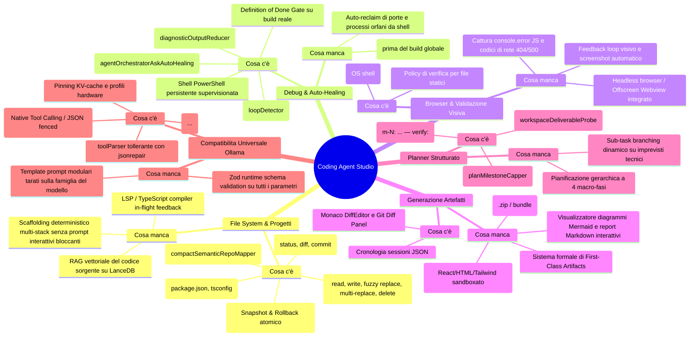
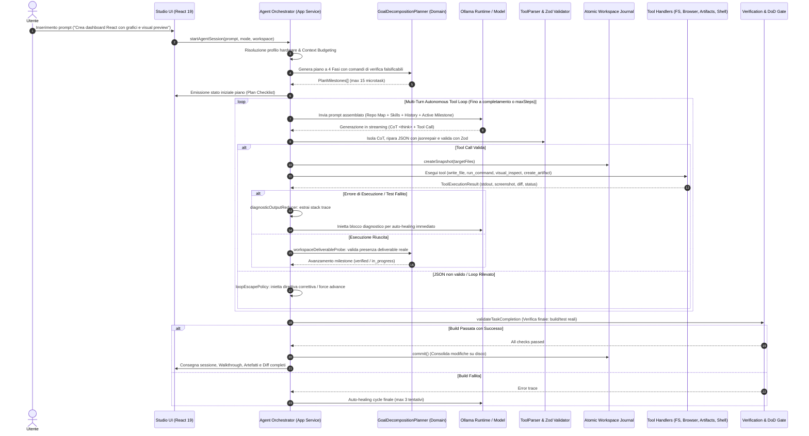

# Architettura & Blueprint Evolutivo: Coding Agent Studio — OnlyRag V2

Documento architetturale e piano operativo per l'evoluzione di **Coding Agent Studio** in OnlyRag V2: analisi dello stato corrente, identificazione dei gap, selezione delle librerie universali, progettazione del flusso end-to-end e standard per la compatibilità universale con modelli Ollama (SLM e Frontier).

---

## 1. Analisi di Sistema: Stato Attuale ("Cosa c'è") vs Gap ("Cosa manca")



---

### 1.1. Gestione File System Locale & di Progetto
* **Presente**:
  * Toolchain atomica per manipolazione file: `read_file` (con line slicing), `write_file`, `replace_file_content` (con fuzzy matching basato su `fast-levenshtein`), `multi_replace_file_content`, `create_directory`, `copy_file`, `move_file`, `delete_file`, `list_dir`, `list_files_recursive`, `grep_search`, `get_file_info`.
  * [`AtomicWorkspaceJournal`](../electron/core/infrastructure/filesystem/atomicWorkspaceJournal.ts): snapshot preventivo in memoria di ogni file modificato e `rollbackAll()` immediato su abort o fallimento.
  * [`compactSemanticRepoMapper`](../electron/core/domain/agent/compactSemanticRepoMapper.ts): albero compatto dei simboli esportati (`class`, `function`, `interface`, `type`) per orientare l'agente senza saturare il context budget.
  * [`dependencyScanner`](../electron/core/infrastructure/filesystem/dependencyScanner.ts) e [`dependencyIntegrityGate`](../electron/core/domain/agent/dependencyIntegrityGate.ts): rilevamento proattivo di pacchetti importati ma assenti da `package.json`.
  * Versionamento Git integrato (`git_status`, `git_diff`, `git_commit`).
* **Mancante**:
  * **RAG Vettoriale Locale per il Codice Sorgente**: Indicizzazione incrementale dei file di codice su LanceDB con chunking semantico per funzioni/classi, per navigare codebase complesse.
  * **Scaffolding Deterministico Multi-Stack**: Modelli di generazione sicuri per stack moderni (React+Vite, FastAPI, Cargo, Next.js) senza invocare comandi CLI interattivi soggetti a freeze.
  * **Refactoring AST Programmatico**: Trasformazioni di codice guidate da parser AST (`@babel/parser`, `ts-morph` o `tree-sitter`) per modifiche strutturali complesse.

---

### 1.2. Gestione Debug Errori & Autocorrezione (Auto-Healing)
* **Presente**:
  * Terminale PowerShell persistente non-interattivo con `CI=true` e blocco comandi distruttivi ([`commandSecurity.ts`](../electron/core/domain/agent/commandSecurity.ts)).
  * [`diagnosticOutputReducer`](../electron/core/domain/agent/diagnosticOutputReducer.ts) e [`autoHealingLogCapper`](../electron/core/domain/agent/autoHealingLogCapper.ts): estrazione compatta degli stack trace di errore con iniezione nel turno successivo (`[TERMINAL AUTO-HEALING DIAGNOSTICS LOG]`).
  * [`agentOrchestratorAskAutoHealing.ts`](../electron/core/application/agentOrchestratorAskAutoHealing.ts): intercettazione di richieste di permesso o stallo passivo in modalità AGENT con redirezione automatica all'implementazione.
  * [`AgentActionLoopDetector`](../electron/core/domain/agent/loopDetector.ts) con hashing SHA-256 e [`loopEscapePolicy.ts`](../electron/core/domain/agent/loopEscapePolicy.ts) per spezzare cicli e avanzare milestone stagnanti.
  * [`TransactionalExecutionGuard`](../electron/core/application/agentOrchestratorFinishAndLoopGuards.ts) e [`verificationGatePolicy.ts`](../electron/core/domain/agent/verificationGatePolicy.ts): blocco del comando `finish` in assenza di build/test passati con successo.
* **Mancante**:
  * **Feedback Sintattico/LSP Istantaneo**: Notifica di errori di tipo TypeScript / sintassi subito dopo `write_file`, prima della compilazione globale.
  * **Auto-Reclaim Processi Orfani**: Identificazione e chiusura automatica di processi che occupano porte locali di sviluppo.

---

### 1.3. Browser per Test di Validazione Visiva
* **Presente**:
  * `open_in_browser`: delega l'apertura all'OS (`shell.openExternal`/`shell.openPath`).
  * [`browserPreviewVerification.ts`](../electron/core/domain/agent/browserPreviewVerification.ts): regola che limita la prova di verifica tramite browser ai soli file statici renderizzabili (`.html`, `.svg`, `.pdf`).
* **Mancante (Gap Critico)**:
  * **Feedback Loop Visivo**: L'agente è attualmente cieco all'esito visivo. Non riceve screenshot, né log di errori runtime (`console.error`), né codici di errore HTTP 404/500 per gli asset.
  * **Headless Browser Runner Integrato**: Modulo di validazione visiva (via Electron Offscreen `WebContents` o `playwright-core`) capace di caricare la pagina in background, catturare screenshot ad alta fedeltà, intercettare errori JavaScript e produrre un report di layout leggibile dall'agente (e interpretabile da modelli Vision come `llama3.2-vision` / `qwen2.5-vl`).

---

### 1.4. Generazione Artefatti (Artifacts System)
* **Presente**:
  * Visualizzazione modifiche tramite Monaco DiffEditor e Git Diff Panel.
  * Cronologia delle sessioni salvata in `.onlyrag/sessions/session_history.json`.
* **Mancante (Gap Critico)**:
  * **Sistema di Artefatti di Prima Classe (First-Class Artifacts Engine)**: Modello dati formale per artefatti generati (UI Component, Web App interattiva, Diagramma Mermaid, Documento Tecnico, Walkthrough).
  * **Pannello UI Live Artifacts Preview**: Scheda dedicata nell'interfaccia con iframe sandboxato per il rendering live di componenti React/HTML/Tailwind, rendering SVG di diagrammi Mermaid e visualizzazione Markdown avanzata con export 1-click (`.zip` o bundle).

---

### 1.5. Planner Strutturato
* **Presente**:
  * [`GoalDecompositionPlanner`](../electron/core/domain/agent/planAndSolveGraph.ts) con microtask sequenziali atomici (`- [ ] m-N: ... — verify: <cmd>`).
  * Normalizzatore di falsificabilità, capping deterministico a 15 milestone ([`planMilestoneCapper.ts`](../electron/core/domain/agent/planMilestoneCapper.ts)) e parser canonico unificato.
  * Probe su disco ([`workspaceDeliverableProbe.ts`](../electron/core/infrastructure/filesystem/workspaceDeliverableProbe.ts)) per escludere file placeholder con soli TODO.
* **Mancante**:
  * **Pianificazione Gerarchica a Fasi (4 Macro-Fasi Standard)**:
    1. `Phase 1: Research & Workspace Inventory`
    2. `Phase 2: Core Architecture & Scaffolding`
    3. `Phase 3: Implementation & Component Logic`
    4. `Phase 4: Build Verification, Visual Validation & Artifact Delivery`
  * **Sub-Task Branching Dinamico**: Possibilità di decomporre una milestone in sotto-task operativi quando l'agente rileva complessità impreviste senza corrompere l'avanzamento globale.

---

### 1.6. Compatibilità Universale Modelli Ollama (SLM & Frontier)
* **Presente**:
  * [`toolParser.ts`](../electron/core/domain/agent/toolParser.ts) con pre-stripping tag CoT (`<think>...</think>`), pulizia stringhe e riparazione JSON con `jsonrepair`.
  * Supporto sia per Ollama Native Tool Calling (`POST /api/chat`) che per prompt JSON fenced delimitati.
  * Hardware Ladder unificato con pinning della KV-cache (`keep_alive`, freeze di `num_ctx`).
* **Mancante**:
  * **Zod Runtime Schema Validation**: Validazione preventiva di ogni parametro prima del dispatch, con istruzioni di correzione schema guidate per gli SLM più piccoli.
  * **Prompt Adapters per Famiglia di Modello**: Ottimizzazione del formato dei messaggi in base alla famiglia del modello (Qwen, Llama, DeepSeek-R1, Mistral).

---

## 2. Direttiva Anti-Hardcoding: Librerie Universali Standard

In conformità con `AGENTS.md`, le logiche di sistema sono delegate a librerie mature e testate:

| Ambito | Libreria Adottata | Funzione & Motivazione Tecnica |
| :--- | :--- | :--- |
| **Parsing & Riparazione JSON** | `jsonrepair` + `zod` | Ripara JSON corrotti/incompleti generati da SLM quantizzati e valida rigorosamente i tipi a runtime con Zod schemas. |
| **Fuzzy Matching & Diffing** | `fast-levenshtein` + `diff` + `diff2html` | Calcolo deterministico delle distanze di modifica per il patching del codice e rendering dei diff visivi. |
| **Validazione & Manipolazione AST** | `typescript` + `@babel/parser` | Analisi sintattica in-flight del codice sorgente prima del commit sul filesystem per bloccare errori sintattici a monte. |
| **Risoluzione Percorsi & Globbing** | `fast-glob` + `pathe` | Scansione sicura dei file e normalizzazione cross-platform dei percorsi Windows/POSIX. |
| **Browser & Validazione Visiva** | Electron Offscreen `WebContents` / `playwright-core` | Esecuzione headless, cattura screenshot, intercettazione di `console.error` e verifica del layout. |
| **Web Scraping & Markdown** | `cheerio` + `turndown` | Parsing DOM resiliente, rimozione script/pubblicità e conversione HTML in Markdown compatto per context budgeting. |
| **Esecuzione Processi & Shell** | `node:child_process` / `execa` | Gestione di processi non-interattivi con timeout granulare, buffer streaming e prevenzione deadlock. |

---

## 3. Flusso End-to-End Robusto: Dal Prompt all'Esecuzione



---

## 4. Architettura dei Tool Refattorizzata (Single Responsibility Principle)

Per eliminare il monolite [`agentToolExecutorService.ts`](../electron/core/application/agentToolExecutorService.ts), l'architettura dei tool viene scomposta in moduli a responsabilità singola sotto `electron/core/domain/agent/tools/`:

```
electron/core/domain/agent/tools/
├── fs/
│   ├── readFileTool.ts              # Line slicing, bounds check, path safety
│   ├── writeFileTool.ts              # AST pre-validation, atomic file writer
│   ├── fuzzyPatchTool.ts             # fast-levenshtein fuzzy replace & multi-replace
│   ├── fileExplorerTools.ts          # list_dir, list_files_recursive, glob
│   └── codeSymbolExtractorTool.ts    # TypeScript Compiler API AST extractor
├── execution/
│   ├── runCommandTool.ts             # PowerShell session, timeout policy, CI env
│   ├── runTestsTool.ts               # Test result parser (vitest, jest, pytest, cargo)
│   └── devToolchainTools.ts          # inspect_os_env, ensure_tool (winget)
├── browser/
│   ├── visualValidationTool.ts       # Offscreen Webview/Playwright screenshot & DOM inspect
│   └── consoleLogsExtractorTool.ts   # Intercettazione console.error, 404 assets
├── artifacts/
│   ├── artifactCreationTool.ts       # Registrazione formale artefatti (React, HTML, MD, SVG)
│   └── artifactExportTool.ts         # Zip bundle e render export
├── web/
│   ├── webSearchTool.ts              # DuckDuckGo SSRF-safe web search
│   └── fetchWebContentTool.ts        # Cheerio scraping + Turndown markdown converter
├── git/
│   ├── gitStatusTool.ts              # Git working tree status
│   └── gitCommitDiffTools.ts         # Git diff compute & atomic commit
└── diagnostics/
    ├── askClarificationTool.ts       # Clarification & permission interceptor
    └── finishTaskTool.ts             # Definition of Done gate trigger
```

---

## 5. Prossimi Passi di Sviluppo

1. **Modulo Visual Validation**: Implementazione di `visualValidationTool.ts` basato su Electron Offscreen `WebContents` per screenshot automatici e cattura `console.error`.
2. **First-Class Artifacts Engine**: Creazione del repository e dei canali IPC `artifacts:*` per registrare e mostrare anteprime live di componenti UI e documenti.
3. **Refactoring Modulare dei Tool**: Scomposizione di `agentToolExecutorService.ts` nella struttura modulare a singoli handler.
4. **Validazione Schemi Zod**: Integrazione sistematica degli schemi Zod per ogni tool call.
