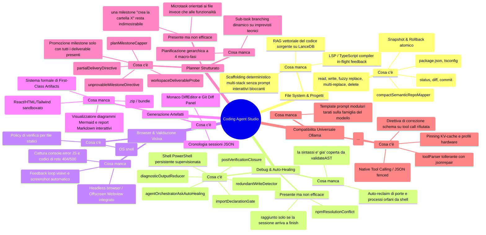

# Architettura & Blueprint Evolutivo: Coding Agent Studio — OnlyRag V2

Documento architetturale e piano operativo per l'evoluzione di **Coding Agent Studio** in OnlyRag V2: analisi dello stato corrente, identificazione dei gap, selezione delle librerie universali, progettazione del flusso end-to-end e standard per la compatibilità universale con modelli Ollama (SLM e Frontier).

---

## 1. Analisi di Sistema: "Cosa c'è" vs "Presente ma non efficace" vs "Cosa manca"



---

### 1.1. Gestione File System Locale & di Progetto
* **Presente**:
  * Toolchain atomica per manipolazione file: `read_file` (con line slicing), `write_file`, `replace_file_content` (con fuzzy matching basato su `fast-levenshtein`), `multi_replace_file_content`, `create_directory`, `copy_file`, `move_file`, `delete_file`, `list_dir`, `list_files_recursive`, `grep_search`, `get_file_info`.
  * [`AtomicWorkspaceJournal`](../electron/core/infrastructure/filesystem/atomicWorkspaceJournal.ts): snapshot preventivo in memoria di ogni file modificato e `rollbackAll()` immediato su abort o fallimento.
  * [`compactSemanticRepoMapper`](../electron/core/domain/agent/compactSemanticRepoMapper.ts): albero compatto dei simboli esportati (`class`, `function`, `interface`, `type`) per orientare l'agente senza saturare il context budget.
  * [`dependencyScanner`](../electron/core/infrastructure/filesystem/dependencyScanner.ts) e [`dependencyIntegrityGate`](../electron/core/domain/agent/dependencyIntegrityGate.ts): rilevamento proattivo di pacchetti importati ma assenti da `package.json`.
  * Versionamento Git integrato (`git_status`, `git_diff`, `git_commit`).
* **Mancante**:
  * **RAG Vettoriale Locale per il Codice Sorgente**: Indicizzazione incrementale dei file di codice su LanceDB con chunking semantico per funzioni/classi, per navigare codebase complesse.
  * **Scaffolding Deterministico Multi-Stack**: Modelli di generazione sicuri per stack moderni (React+Vite, FastAPI, Cargo, Next.js) senza invocare comandi CLI interattivi soggetti a freeze.
  * **Refactoring AST Programmatico**: Trasformazioni di codice guidate da parser AST (`@babel/parser`, `ts-morph` o `tree-sitter`) per modifiche strutturali complesse.

---

### 1.2. Gestione Debug Errori & Autocorrezione (Auto-Healing)
* **Presente**:
  * Terminale PowerShell persistente non-interattivo con `CI=true` e blocco comandi distruttivi ([`commandSecurity.ts`](../electron/core/domain/agent/commandSecurity.ts)).
  * [`diagnosticOutputReducer`](../electron/core/domain/agent/diagnosticOutputReducer.ts) e [`autoHealingLogCapper`](../electron/core/domain/agent/autoHealingLogCapper.ts): estrazione compatta degli stack trace di errore con iniezione nel turno successivo (`[TERMINAL AUTO-HEALING DIAGNOSTICS LOG]`).
  * [`agentOrchestratorAskAutoHealing.ts`](../electron/core/application/agentOrchestratorAskAutoHealing.ts): intercettazione di richieste di permesso o stallo passivo in modalità AGENT con redirezione automatica all'implementazione.
  * [`AgentActionLoopDetector`](../electron/core/domain/agent/loopDetector.ts) con hashing SHA-256 e [`loopEscapePolicy.ts`](../electron/core/domain/agent/loopEscapePolicy.ts) per spezzare cicli e avanzare milestone stagnanti.
* **Presente ma non efficace** (rilevato in `coding_agent_audit.log`, sessione `session-1787562597025-q8a5`):
  * **Definition of Done Gate** ([`verificationGatePolicy.ts`](../electron/core/domain/agent/verificationGatePolicy.ts), [`TransactionalExecutionGuard`](../electron/core/application/agentOrchestratorFinishAndLoopGuards.ts)): blocca `finish` senza build passata, ma si attiva **solo quando il modello chiama `finish`**. La sessione osservata è morta al passo 45 sul circuit breaker, quindi il gate — e con lui [`dependencyIntegrityGate`](../electron/core/domain/agent/dependencyIntegrityGate.ts), che gira dentro [`agentOrchestratorVerificationRunner.ts`](../electron/core/application/agentOrchestratorVerificationRunner.ts) — non è mai stato raggiunto. Tre import verso pacchetti inesistenti sono rimasti su disco.
  * **Rilevatore di loop**: identifica correttamente la ripetizione, ma la sua risposta resta in gran parte testo che vieta un'azione. In 12 dei 45 passi ha bloccato senza produrre avanzamento, e le direttive iniettate si accumulano nel prompt fino a saturarlo (dagli step 35–45 il prompt resta fisso a 22.237 caratteri, in gran parte blocchi `[FAILURE at Step N]` quasi identici). Un caso ha ora un'uscita reale invece di un divieto — la ripetizione a progetto già verificato, vedi §5.4 — ma è uno solo dei rami.
* **Mancante**:
  * **Feedback Sintattico/LSP Istantaneo**: Notifica di errori di tipo TypeScript / sintassi subito dopo `write_file`, prima della compilazione globale. **Priorità alta**: nella sessione osservata gli import inventati erano visibili al passo 11 e sono emersi solo trenta passi dopo.
  * **Auto-Reclaim Processi Orfani**: Identificazione e chiusura automatica di processi che occupano porte locali di sviluppo.

---

### 1.3. Browser per Test di Validazione Visiva
* **Presente**:
  * `open_in_browser`: delega l'apertura all'OS (`shell.openExternal`/`shell.openPath`).
  * [`browserPreviewVerification.ts`](../electron/core/domain/agent/browserPreviewVerification.ts): regola che limita la prova di verifica tramite browser ai soli file statici renderizzabili (`.html`, `.svg`, `.pdf`).
* **Mancante (Gap Critico)**:
  * **Feedback Loop Visivo**: L'agente è attualmente cieco all'esito visivo. Non riceve screenshot, né log di errori runtime (`console.error`), né codici di errore HTTP 404/500 per gli asset.
  * **Headless Browser Runner Integrato**: Modulo di validazione visiva (via Electron Offscreen `WebContents` o `playwright-core`) capace di caricare la pagina in background, catturare screenshot ad alta fedeltà, intercettare errori JavaScript e produrre un report di layout leggibile dall'agente (e interpretabile da modelli Vision come `llama3.2-vision` / `qwen2.5-vl`).

---

### 1.4. Generazione Artefatti (Artifacts System)
* **Presente**:
  * Visualizzazione modifiche tramite Monaco DiffEditor e Git Diff Panel.
  * Cronologia delle sessioni salvata in `.onlyrag/sessions/session_history.json`.
* **Mancante (Gap Critico)**:
  * **Sistema di Artefatti di Prima Classe (First-Class Artifacts Engine)**: Modello dati formale per artefatti generati (UI Component, Web App interattiva, Diagramma Mermaid, Documento Tecnico, Walkthrough).
  * **Pannello UI Live Artifacts Preview**: Scheda dedicata nell'interfaccia con iframe sandboxato per il rendering live di componenti React/HTML/Tailwind, rendering SVG di diagrammi Mermaid e visualizzazione Markdown avanzata con export 1-click (`.zip` o bundle).

---

### 1.5. Planner Strutturato
* **Presente**:
  * [`GoalDecompositionPlanner`](../electron/core/domain/agent/planAndSolveGraph.ts) con microtask sequenziali atomici (`- [ ] m-N: ... — verify: <cmd>`).
  * Normalizzatore di falsificabilità, capping deterministico a 15 milestone ([`planMilestoneCapper.ts`](../electron/core/domain/agent/planMilestoneCapper.ts)) e parser canonico unificato.
  * Probe su disco ([`workspaceDeliverableProbe.ts`](../electron/core/infrastructure/filesystem/workspaceDeliverableProbe.ts)) per escludere file placeholder con soli TODO.
  * Filtro di falsificabilità sui comandi di verifica ([`verificationCommandSafety.ts`](../electron/core/domain/agent/verificationCommandSafety.ts)): sei famiglie di rifiuto (mutating, vacuous, existence-only, interactive, gui-mode, non-exiting).
* **Presente ma non efficace**:
  * **Microtask orientati ai file**: dieci milestone su quindici della sessione osservata dicevano "crea il file X"; nessuna esprimeva un comportamento verificabile ("la navigazione fra Dashboard e Tasks funziona"). Un piano di questa forma si può completare al 100% consegnando un'applicazione che non parte.
  * **Promozione milestone parziale** ([`agentOrchestratorPlanTool.ts`](../electron/core/application/agentOrchestratorPlanTool.ts)): quando `update_plan` esegue il `verificationCommand` della milestone e questo esce 0, la milestone è promossa a `verified` **senza alcun controllo sui deliverable** — a differenza della promozione post-build, che passa da [`milestoneVerificationPromotion.ts`](../electron/core/domain/agent/milestoneVerificationPromotion.ts) e richiede tutti i file presenti. `m-2` ("crea `vite.config.ts` e `tsconfig.json`") è stata verificata senza `tsconfig.json`, rendendo impossibile lo `tsc && vite build` dichiarato dal progetto stesso.
* **Mancante**:
  * **Pianificazione Gerarchica a Fasi (4 Macro-Fasi Standard)**:
    1. `Phase 1: Research & Workspace Inventory`
    2. `Phase 2: Core Architecture & Scaffolding`
    3. `Phase 3: Implementation & Component Logic`
    4. `Phase 4: Build Verification, Visual Validation & Artifact Delivery`
  * **Sub-Task Branching Dinamico**: Possibilità di decomporre una milestone in sotto-task operativi quando l'agente rileva complessità impreviste senza corrompere l'avanzamento globale.

---

### 1.6. Compatibilità Universale Modelli Ollama (SLM & Frontier)
* **Presente**:
  * [`toolParser.ts`](../electron/core/domain/agent/toolParser.ts) con pre-stripping tag CoT (`<think>...</think>`), pulizia stringhe e riparazione JSON con `jsonrepair`.
  * Supporto sia per Ollama Native Tool Calling (`POST /api/chat`) che per prompt JSON fenced delimitati.
  * Hardware Ladder unificato con pinning della KV-cache (`keep_alive`, freeze di `num_ctx`).
  * **Correzione schema guidata sugli SLM**: quando una tool call viene rifiutata dalla validazione dei parametri, `buildToolSchemaCorrectionDirective` ([`ollamaToolSchemaCatalog.ts`](../electron/core/domain/agent/ollamaToolSchemaCatalog.ts)) rimanda al modello i parametri obbligatori, quelli opzionali e l'envelope JSON esatto da emettere. Il feedback precedente era una singola frase che non nominava ne' il tool ne' il parametro. `zod` non e' stato adottato: il contratto dei parametri e' gia' dichiarato una volta in questo catalogo e una seconda fonte divergerebbe.
* **Mancante**:
  * **Prompt Adapters per Famiglia di Modello**: Ottimizzazione del formato dei messaggi in base alla famiglia del modello (Qwen, Llama, DeepSeek-R1, Mistral).

---

## 2. Direttiva Anti-Hardcoding: Librerie Universali Standard

In conformità con `AGENTS.md`, le logiche di sistema sono delegate a librerie mature e testate.

La colonna **Stato** distingue ciò che è già dichiarato in `package.json` da ciò che questa sezione si limita a proporre: la versione precedente del documento elencava otto pacchetti non installati sotto l'intestazione "Libreria Adottata", e un lettore — umano o agente che riceve il documento come contesto — ne concludeva che quelle capacità esistessero già.

| Ambito | Libreria | Stato | Funzione & Motivazione Tecnica |
| :--- | :--- | :--- | :--- |
| **Parsing & Riparazione JSON** | `jsonrepair` | ✅ in uso | Ripara JSON corrotti/incompleti generati da SLM quantizzati. |
| **Validazione Schemi a Runtime** | `ollamaToolSchemaCatalog.ts` (interno) | ✅ in uso | Contratto dei parametri di ogni tool dichiarato una volta sola e usato sia per il native tool calling sia per generare la direttiva di correzione quando una chiamata viene rifiutata. **`zod` non e' stato adottato**: duplicherebbe questo catalogo con una seconda fonte di verita' divergente. La coercizione degli alias resta in `toolSchemaValidator.ts`. |
| **Fuzzy Matching & Diffing** | `fast-levenshtein` + `diff` | ✅ in uso | Distanze di modifica deterministiche per il patching del codice. |
| **Rendering Diff Visivi** | `diff2html` | ⬜ da adottare | Rendering HTML dei diff. Oggi la UI usa Monaco DiffEditor. |
| **Validazione AST** | `typescript` | ✅ in uso (solo build) | Compiler API disponibile ma non ancora invocata come check post-write. |
| **Parsing AST alternativo** | `@babel/parser` | ⬜ da adottare | Necessario solo per stack non-TypeScript. |
| **Risoluzione Percorsi & Globbing** | `fast-glob` + `pathe` | ⬜ da adottare | Oggi la scansione usa `node:fs` diretto e `node:path`. |
| **Browser & Validazione Visiva** | Electron Offscreen `WebContents` | ⬜ da adottare | Runtime già presente (Electron), modulo di cattura non ancora scritto. |
| **Browser headless alternativo** | `playwright-core` | ⬜ da adottare | Alternativa a Offscreen `WebContents`; sceglierne una sola. |
| **Web Scraping & Markdown** | `cheerio` + `turndown` | ✅ in uso | Parsing DOM resiliente e conversione HTML→Markdown compatto. |
| **Esecuzione Processi & Shell** | `node:child_process` | ✅ in uso | `persistentPowerShellSession.ts`, sessione persistente non-interattiva. |
| **Esecuzione Processi (ergonomia)** | `execa` | ⬜ da adottare | Sostituto opzionale; la sessione persistente attuale copre già timeout e streaming. |

---

## 3. Flusso End-to-End Robusto: Dal Prompt all'Esecuzione

```mermaid
sequenceDiagram
    autonumber
    actor User as Utente
    participant UI as Studio UI (React 19)
    participant Orchestrator as Agent Orchestrator (App Service)
    participant Planner as GoalDecompositionPlanner (Domain)
    participant LLM as Ollama Runtime / Model
    participant Parser as ToolParser & Schema Validator
    participant Journal as Atomic Workspace Journal
    participant Tools as Tool Handlers (FS, Browser, Artifacts, Shell)
    participant Gate as Verification & DoD Gate

    User->>UI: Inserimento prompt ("Crea dashboard React con grafici e visual preview")
    UI->>Orchestrator: startAgentSession(prompt, mode, workspace)
    Orchestrator->>Orchestrator: Risoluzione profilo hardware & Context Budgeting
    Orchestrator->>Planner: Genera piano a 4 Fasi con comandi di verifica falsificabili
    Planner-->>Orchestrator: PlanMilestones[] (max 15 microtask)
    Orchestrator->>UI: Emissione stato iniziale piano (Plan Checklist)

    loop Multi-Turn Autonomous Tool Loop (Fino a completamento o maxSteps)
        Orchestrator->>LLM: Invia prompt assemblato (Repo Map + Skills + History + Active Milestone)
        LLM-->>Orchestrator: Generazione in streaming (CoT <think> + Tool Call)
        Orchestrator->>Parser: Isola CoT, ripara JSON con jsonrepair e valida contro il catalogo dei tool
        
        alt Tool Call Valida
            Orchestrator->>Journal: createSnapshot(targetFiles)
            Orchestrator->>Tools: Esegui tool (write_file, run_command, visual_inspect, create_artifact)
            Tools-->>Orchestrator: ToolExecutionResult (stdout, screenshot, diff, status)
            
            alt Errore di Esecuzione / Test Fallito
                Orchestrator->>Orchestrator: diagnosticOutputReducer: estrai stack trace
                Orchestrator->>LLM: Inietta blocco diagnostico per auto-healing immediato
            else Esecuzione Riuscita
                Orchestrator->>Planner: workspaceDeliverableProbe: valida presenza deliverable reale
                Planner-->>Orchestrator: Avanzamento milestone (verified / in_progress)
            end
        else JSON non valido / Loop Rilevato
            Orchestrator->>Orchestrator: loopEscapePolicy o direttiva di correzione schema; force advance se necessario
        end
    end

    Orchestrator->>Gate: validateTaskCompletion (Verifica finale: build/test reali)
    alt Build Passata con Successo
        Gate-->>Orchestrator: All checks passed
        Orchestrator->>Journal: commit() (Consolida modifiche su disco)
        Orchestrator->>UI: Consegna sessione, Walkthrough, Artefatti e Diff completi
    else Build Fallita
        Gate-->>Orchestrator: Error trace
        Orchestrator->>LLM: Auto-healing cycle finale (max 3 tentativi)
    end
```

---

## 4. Architettura dei Tool Refattorizzata (Single Responsibility Principle)

Per eliminare il monolite [`agentToolExecutorService.ts`](../electron/core/application/agentToolExecutorService.ts), l'architettura dei tool viene scomposta in moduli a responsabilità singola sotto `electron/core/domain/agent/tools/`:

```
electron/core/domain/agent/tools/
├── fs/
│   ├── readFileTool.ts              # Line slicing, bounds check, path safety
│   ├── writeFileTool.ts              # AST pre-validation, atomic file writer
│   ├── fuzzyPatchTool.ts             # fast-levenshtein fuzzy replace & multi-replace
│   ├── fileExplorerTools.ts          # list_dir, list_files_recursive, glob
│   └── codeSymbolExtractorTool.ts    # TypeScript Compiler API AST extractor
├── execution/
│   ├── runCommandTool.ts             # PowerShell session, timeout policy, CI env
│   ├── runTestsTool.ts               # Test result parser (vitest, jest, pytest, cargo)
│   └── devToolchainTools.ts          # inspect_os_env, ensure_tool (winget)
├── browser/
│   ├── visualValidationTool.ts       # Offscreen Webview/Playwright screenshot & DOM inspect
│   └── consoleLogsExtractorTool.ts   # Intercettazione console.error, 404 assets
├── artifacts/
│   ├── artifactCreationTool.ts       # Registrazione formale artefatti (React, HTML, MD, SVG)
│   └── artifactExportTool.ts         # Zip bundle e render export
├── web/
│   ├── webSearchTool.ts              # DuckDuckGo SSRF-safe web search
│   └── fetchWebContentTool.ts        # Cheerio scraping + Turndown markdown converter
├── git/
│   ├── gitStatusTool.ts              # Git working tree status
│   └── gitCommitDiffTools.ts         # Git diff compute & atomic commit
└── diagnostics/
    ├── askClarificationTool.ts       # Clarification & permission interceptor
    └── finishTaskTool.ts             # Definition of Done gate trigger
```

---

## 5. Prossimi Passi di Sviluppo

L'ordine è vincolato: le funzionalità nuove poggiano su cicli di feedback che devono prima chiudersi. Un modulo di validazione visiva non serve a un progetto che non compila, e un motore di artefatti non serve a una sessione che muore al passo 45.

### 5.1. Completato — cicli di feedback riaperti

* **L'agente riceve di nuovo gli errori.** `run_command`, `run_tests`, `ensure_tool` e la verifica delle milestone univano i due flussi con `res.stdout || res.stderr`: siccome `npm` scrive sempre un banner su stdout, lo stderr veniva scartato ogni volta e il modello riceveva "exit code 1" con un blocco diagnostico vuoto, sotto una direttiva che gli chiedeva di ispezionare uno stack trace mai mostrato. Sostituito da `DiagnosticOutputReducer.composeCommandOutput`.
* **Il guard delle installazioni non annulla più l'install che serve.** Controllava solo `package.json`: in un workspace generato dall'agente ogni dipendenza risulta "già installata" mentre `node_modules` non esiste. Ora richiede anche la presenza su disco (`agentToolFileRepository.missingFromNodeModules`).
* **Le verifiche non falsificabili sono rifiutate.** [`verificationCommandSafety.ts`](../electron/core/domain/agent/verificationCommandSafety.ts) ha due famiglie nuove: *existence-only* (`cat`, `Get-Content`, `ls`, `Test-Path` — passano per qualunque file esista, incluso quello appena scritto) e *gui-mode* (`cypress open`, `--ui`, `--headed`, più gli opener di sistema). Le ricerche di contenuto (`grep`, `findstr`, `Select-String`) restano ammesse: falliscono quando il file esiste ma è sbagliato, che è una vera affermazione sul codice.
* **Le direttive anti-loop non mentono più sulla propria durata.** Dicevano "You are FORBIDDEN from calling run_command on 'npm run build'" — il comando che il Definition of Done Gate esige — mentre il rilevatore ha in realtà una finestra di 5 passi. Ora dichiarano l'ambito reale (la chiamata identica, finché nulla cambia) e indicano l'uscita: leggere l'errore, correggerlo, rieseguire.

### 5.2. Completato — i controlli anticipati

* **Import allucinati intercettati alla scrittura.** [`importDeclarationGate.ts`](../electron/core/domain/agent/importDeclarationGate.ts) estrae i package importati dal file appena scritto e li confronta con `package.json` (alias `tsconfig.paths` inclusi). Il file viene comunque salvato — buttarlo costerebbe il turno che lo ha prodotto — ma il risultato del tool porta la lista dei pacchetti non dichiarati. Verificato live: `@vitejs/plugin-react`, `@tailwindcss/react`, `react-router-dom` e `tailwindcss-react-components` segnalati al passo in cui sono stati scritti, invece che mai.
* **Milestone verificabili solo con i deliverable presenti.** [`milestoneUpdateAuthority.ts`](../electron/core/domain/agent/milestoneUpdateAuthority.ts) rifiuta `verified` finche' un file dichiarato dal titolo manca, e' vuoto o e' un placeholder, nominando i file mancanti. Le milestone senza artefatto (`not_applicable`) restano chiudibili dal loro comando.
* **`write_file` distingue file e directory.** Un path che termina con separatore viene instradato a `create_directory` (o rifiutato se porta contenuto). Verificato live su `src/services/`, che nella sessione originale aveva prodotto un file da 0 byte.
* **Blocchi di fallimento deduplicati per tool+target sull'intero buffer**, non solo sull'ultimo elemento: l'alternanza A,B,A,B che riempiva il prompt non si accumula piu'.
* **Report di chiusura reale**: `compileSessionStopSummary` sostituisce la stringa interna del circuit breaker con motivo, milestone completate e aperte, e file toccati. Il `SESSION_TRACKER.md` non dichiara piu' "all verified" quando restano milestone aperte.
* **Rifiuto di una tool call con il contratto del tool**: `buildToolSchemaCorrectionDirective` rende i parametri obbligatori, quelli opzionali e l'esempio JSON esatto, al posto della frase generica precedente.

### 5.3. Completato — recupero dai conflitti di versione

* **`npm ERESOLVE` diventa un'istruzione eseguibile.** [`npmResolutionConflict.ts`](../electron/core/domain/agent/npmResolutionConflict.ts) legge dal report di npm quale versione e' installata e quale viene richiesta, e produce il comando esatto che risolve — con l'intervallo copiato verbatim da npm, mai sintetizzato. Prima, sopra quell'output c'era la direttiva generica "locate the failing file, syntax, or command parameter", che mandava il modello a riscrivere file che non erano il problema.
* **Il guard delle installazioni distingue una versione da un nome.** `npm install vite@^8.0.0` non e' una reinstallazione: chiede un cambio di versione. Confrontando solo i nomi, il guard rispondeva "vite e' gia' installato" e annullava proprio il comando che risolve il conflitto.
* **Nomi di tool inventati vengono rifiutati.** `normalizeToolName` restituiva qualunque stringa come se fosse un tool valido: in un run il passo 1 e' stato `npm_install`, dispacciato a un executor che non ha un handler per quel nome. Ora il catalogo dei tool decide, e il rifiuto porta con se' l'elenco dei tool reali.
* **Verificato live**: partendo da `vite@4.5.14` installato e da un `npm install @vitejs/plugin-react@6.1.0` che non puo' risolvere, il modello ha eseguito il comando indicato dalla direttiva (`npm install vite@^8.0.0`), poi ha ripetuto l'installazione del plugin con successo. Nessun ricorso a `--force` o `--legacy-peer-deps`. Nel run precedente, con la stessa situazione, si era fermato a chiedere all'utente quale opzione preferisse.

> Nota sul tono delle direttive: la prima stesura elencava due opzioni e diceva "Pick ONE and run it now". Il modello le ha lette, capite, e ha girato la scelta all'utente con `ask` — in modalita' AGENT, dove non c'e' nessuno che risponda. Una direttiva che offre una decisione a un modello lo invita a delegarla. Ora c'e' una sola istruzione imperativa e un ripiego, non un menu.

### 5.4. Completato — il churn e la strada per chiudere

I due sintomi erano **un solo meccanismo**, e nessuno dei due stava dove il documento li cercava.

* Sintomo A: rilancia un comando **passato**. Nel probe ERESOLVE aveva rieseguito quattro volte un `npm run build` gia' verde, invece di chiudere.
* Sintomo B: riscrive lo stesso file. 21-31 `write_file` per ~14 file in una sessione da 50 passi.

**La causa.** `write_file` rispondeva `Successfully wrote file X` anche quando il contenuto sul disco era gia' identico — una frase indistinguibile da quella di una modifica vera. E l'orchestratore classifica la mutazione **per nome del tool** (`isMutating` in [`agentOrchestratorToolResultProcessor.ts`](../electron/core/application/agentOrchestratorToolResultProcessor.ts)), quindi una riscrittura che non cambiava un byte azzerava comunque `flags.hasVerifiedBuild`. Da qui il ciclo: build verde → riscrittura identica → la prova viene buttata via → build di nuovo. Il sintomo B *produceva* il sintomo A.

**La seconda causa, indipendente.** Anche con la build verde il modello non poteva chiudere: la direttiva 4 del blocco piano dice *"Do NOT invoke finish until all operational checklist milestones are completed and verified"*, e una milestone che non nomina nessun file (`not_applicable`: "ensure buttons have a 44x44 touch target", "run the application") non puo' raggiungere `verified` tramite nessun comando — `selectMilestonesProvenByVerification` la esclude apposta, perche' promuoverla sarebbe fabbricare una verifica. Il modello si trovava con una build verde, una milestone inchiodabile e un divieto di finire: l'unica azione ancora permessa era rieseguire la build. E' esattamente la forma che l'intestazione di `loopEscapePolicy.ts` gia' descriveva — un divieto senza uscita — e nessuna quantita' di scoraggiamento in piu' poteva risolverla.

**Cosa e' stato applicato:**

* **La scrittura a vuoto e' riconosciuta come tale.** [`redundantWriteDetector.ts`](../electron/core/domain/agent/redundantWriteDetector.ts) confronta il contenuto proposto con quello su disco, normalizzando i soli due scarti che non sono modifiche di codice: fine riga CRLF/LF (la fonte dominante di riscritture fantasma su Windows) e newline finale. Indentazione, righe vuote interne e riformattazioni restano modifiche vere. Il file non viene toccato — nemmeno l'mtime, che e' cio' su cui `scanCommandTouchedFiles` attribuisce i file — e il risultato del tool dichiara il no-op e afferma esplicitamente che la build gia' eseguita resta valida.
* **Un no-op non e' una mutazione.** `ToolExecutionResult.noOpMutation` esclude la chiamata da `isMutating`: `hasVerifiedBuild` sopravvive, nessuna milestone avanza su prove che non sono cambiate, e il pannello non annuncia un file "Created" che nessuno ha scritto.
* **La chiusura diventa uno stato dichiarabile.** [`postVerificationClosure.ts`](../electron/core/domain/agent/postVerificationClosure.ts) combina i segnali che esistevano gia' e non erano mai stati messi insieme: se `hasVerifiedBuild` e' vero (verifica passata, nulla scritto dopo) e ogni milestone ancora aperta e' `not_applicable`, allora non resta lavoro che un comando possa dimostrare. Una sola milestone `unsatisfied` — file mancante o placeholder — riporta lo stato a `not_closable` senza guardare il resto.
* **La direttiva sostituisce il divieto, non ci si affianca.** Quando la chiusura e' legittima, `compileProgressPrompt` rimpiazza **l'intero** blocco della milestone attiva con la direttiva di chiusura, che nomina le milestone inchiodabili e ordina la sequenza esatta: `update_plan` su quelle (via che `milestoneUpdateAuthority` gia' consente per chi non nomina artefatti), poi `finish`. La checklist resta stampata, perche' e' da li' che il modello legge gli id. Stampare entrambi i blocchi sarebbe la contraddizione che ha generato il loop.
* **Lo stesso testo raggiunge il loop guard, e li' pure sostituisce.** `handleLoopDetection` usa la direttiva di chiusura **al posto** del testo consultivo, in entrambi i rami (ridondanza e stagnazione). Il tetto di `REDUNDANT_SUCCESS_ADVISORY_ATTEMPTS` e l'abort a `LOOP_ESCAPE_ABORT_STREAK` restano intatti: la garanzia di terminazione non e' toccata. Quello che viene sospeso, e solo in stato di chiusura, e' l'escape strutturale — marcare `failed` proprio le milestone che la direttiva sta chiedendo di chiudere metterebbe "fallita" nel report finale per lavoro che era stato fatto.

Il Definition of Done Gate non e' stato indebolito: continua a eseguire la verifica reale del progetto prima di onorare `finish`.

**Verifica live, ed e' qui che la prima stesura ha sbagliato.** Nel run `live-eresolve` del 2026-08-24 la direttiva e' comparsa al passo esatto giusto — passo 11, dopo un `npm run build` verde al passo 10 — con il contenuto giusto. Il modello l'ha ignorata e ha eseguito un altro comando; la sessione ha esaurito i 16 passi senza chiudere. Il motivo si legge nel log: la direttiva era **terza**, in un messaggio i cui primi due blocchi dicevano *"move to the NEXT unfinished step of your active milestone"* e *"Advance to the next unfinished step instead"*. Il modello ha fatto quello che diceva la prima meta' del messaggio. Nel blocco piano avevo sostituito il testo in conflitto; nel loop guard l'avevo accodato. Corretto: ora sostituisce anche li'. **Un messaggio porta una sola istruzione** — la stessa lezione della nota sul tono in §5.3, in un punto diverso.

Secondo run, stessa sonda, dopo la correzione: la sessione **arriva a `finish`** con un report reale (`Status: COMPLETED`, 16 passi). Va detto per intero, pero': il modello ha ripetuto la build altre quattro volte (passi 12-15) prima di obbedire, e il `finish` e' caduto sull'ultimo passo disponibile. E' un miglioramento misurato, non una risoluzione pulita — e non sorprende, perche' in questa sonda la direttiva raggiunge il modello **solo dentro un intervento del loop guard**, cioe' quando sta gia' girando a vuoto. Il canale forte, il blocco piano ripetuto a ogni turno, qui non esiste affatto.

Il secondo run ha anche corretto un'imprecisione del testo: la preambola diceva *"it succeeded every time"*, ma sostituisce **entrambi** i rami, e quello di stagnazione lo raggiungono ripetizioni che falliscono — nel log e' finita sopra un `update_plan` rifiutato due volte per assenza di piano. Ora la preambola non si pronuncia sull'esito.

> Nota sulla sonda: `eresolveRecovery.live.ts` non semina un piano (`update_plan` viene rifiutato con "no active execution plan"), quindi esercita solo la meta' loop-guard della modifica. La meta' che conta di piu' — la direttiva come istruzione **permanente** nel blocco piano — richiede una sonda con piano seminato.

**Run con piano seminato** (`fullTaskRun.live.ts`, 50 passi, stessa data). Il canale forte funziona come progettato: al **passo 31**, subito dopo un `npm run build` verde, il blocco piano ha sostituito il focus della milestone attiva con la direttiva di chiusura, nominando le quattro milestone che nessun comando puo' dimostrare (m-11..m-14, nessun path nel titolo) e lasciando stampata la checklist da cui il modello legge gli id. Da li' in poi la direttiva e' tornata a ogni turno.

Cio' che il modello ha fatto, per intero: ha obbedito alla direttiva 1 — al passo 50 ha emesso `update_plan {m-13, verified}` — ma ci ha messo diciannove passi, e prima ha sprecato i passi 32-33 su `update_plan m-10`, milestone gia' abbandonata e correttamente rifiutata. La sessione e' finita sul tetto dei 50 passi, non su `finish`.

**Il budget era gia' bruciato prima.** Ai passi 22-28 il modello ha riscritto `src/services/index.tsx` sei volte **con contenuto ogni volta diverso** — quindi `redundantWriteDetector` non e' intervenuto, e correttamente: quelle erano scritture vere. E' il sintomo B in una forma che questa onda non copre. Il fix chiude la riscrittura *identica*, che era quella che invalidava la build verde; la riscrittura *variata* dello stesso file resta un problema aperto, gestito solo dal controllo di thrashing esistente (4 edit in 6 azioni), che infatti e' scattato al passo 25 e ha portato all'abbandono di m-10.

In sintesi: il meccanismo di chiusura e' verificato end-to-end su entrambi i canali, con il contenuto e il momento giusti. Quello che non e' risolto e' la *velocita'* di obbedienza di un 7B e la seconda forma del churn. Le due cose vanno misurate separatamente dalla prossima onda.

**La seconda forma del churn, diagnosticata dal run stesso.** Il tracker riportava "riscrittura dello stesso file con contenuto ogni volta diverso" come ipotesi da valutare. Il log la smentisce: i tre write su `src/services/index.tsx` (passi 22, 23, 24) erano tre **placeholder diversi** — `fetchData` stub, poi `getTasks`/`addTask` stub, poi `export default {}`. Non correzioni, non amnesia: tentativi diversi di soddisfare una milestone che nessuna scrittura poteva soddisfare.

La milestone era m-10, *"Create `src/services` folder"*. `extractDeliverablePaths` non trova nulla — una directory non ha estensione, e il pattern richiede `stem.ext` — quindi la milestone risolve `not_applicable` e nessuna verifica potra' mai promuoverla. Nel frattempo la direttiva 2 del focus block prometteva: *"Once the required files for this milestone are created or updated, invoke `update_plan` to mark it verified"*. Per quella milestone non esistono file da creare. Il modello ha fatto l'unica cosa che la direttiva suggeriva, tre volte, con contenuto diverso ogni volta perche' ogni tentativo lasciava il mondo identico. Poi il controllo di thrashing lo ha bloccato e il loop guard ha abbandonato m-10: sette passi su cinquanta.

E' la stessa forma degli altri difetti di questa sezione — **un'istruzione che non puo' essere eseguita** — e l'uscita esisteva gia' senza essere nominata: `milestoneUpdateAuthority` lascia deliberatamente chiudibile via `update_plan` una milestone che non nomina artefatti, proprio perche' non c'e' nulla su disco che possa contraddire il giudizio del modello.

* [`unprovableMilestoneDirective.ts`](../electron/core/domain/agent/unprovableMilestoneDirective.ts) sostituisce **la sola direttiva 2** quando la milestone attiva e' `not_applicable`: dichiara che nessun file e nessun comando possono dimostrarla, che creare un file nuovo non la soddisfa e verra' bloccato come loop, e nomina `update_plan` con l'id esatto. Il resto del focus block resta intatto — la milestone e' ancora quella attiva e la sessione non e' finita.
* La direttiva **non** dice di saltare il lavoro. *"Ensure buttons have a 44x44 touch target"* descrive lavoro vero in file che gia' esistono: manca solo la prova. Dire "chiudila e basta" trasformerebbe ogni milestone inchiodabile in un timbro, che e' esattamente cio' che `milestoneVerificationPromotion` e' stato scritto per finire.
* Quando anche la chiusura di sessione e' legittima, vince quella: a progetto verificato non c'e' piu' una milestone attiva su cui lavorare, e stampare direttive di focus rimetterebbe il modello al lavoro.

> Nota su una strada scartata: rendere estraibile `src/services` come *deliverable di directory*, cosi' che m-10 diventi verificabile. E' allettante e ha un rischio concreto: una milestone oggi `not_applicable` e' **chiudibile** dal giudizio del modello, mentre una `unsatisfied` **blocca** la chiusura di sessione (vedi `assessPostVerificationClosure`). Un'estrazione sbagliata — "Move `src/old` to the `src/new` folder" — convertirebbe una milestone chiudibile in una bloccante permanente. Il guadagno non vale quel rischio finche' non c'e' una regola sintattica che distingua l'intento di creazione da quello di spostamento.

**Verifica live, e di nuovo il run ha corretto la stesura.** La direttiva compare al posto giusto e sostituisce la sola direttiva 2, lasciando intatto il resto del focus block. Ma nel run del 2026-08-24 e' finita su m-5 *"Install Tailwind CSS"*, che porta `Verify with: npm install tailwindcss postcss autoprefixer` — e affermava *"No write and **no command** can prove it"*. Falso: `update_plan` **esegue** il `verificationCommand` dichiarato e promuove sull'exit code. La direttiva stava spingendo il modello a ripiegare sul proprio giudizio mentre un controllo reale era disponibile — il timbro che questo codice continua a dover rimuovere. `shouldDirectUnprovableClosure` ora richiede anche l'assenza di un `verificationCommand`, cosi' che l'affermazione centrale sia letteralmente vera.

Nello stesso run il no-op detector della prima onda ha lavorato per davvero: sette `[NO-OP WRITE]` su `src/styles/globals.css` dal passo 39, con la build verde preservata. Va detto anche il resto: il modello ha ripetuto comunque. Il rilevatore rende osservabile il fatto e protegge la prova, non convince un 7B a smettere.

**La terza forma: consegna parziale.** Nello stesso run, milestone m-6 *"Configure Tailwind CSS in `postcss.config.js` and `tailwind.config.js`"*. Il modello ha scritto `postcss.config.js` al passo 19 e lo ha riscritto ai passi 20, 21, 22, 23, 25, 27, 28 e 29 — byte-identico ogni volta, ognuno bloccato. **`tailwind.config.js` non e' mai stato scritto in tutto il run da cinquanta passi.**

Il modello non era confuso su cosa avesse fatto: non gli e' mai stato detto cosa mancava ancora, e ha continuato a riconsegnare la meta' che ricordava. Il punto in cui l'informazione si perdeva e' preciso — `advanceActiveMilestoneOnMutation` risolve lo stato del deliverable a **ogni** scrittura, e quando risulta `satisfied` emette un messaggio ("tutti i file richiesti sono presenti"). Quando risulta `unsatisfied` non emetteva nulla, pur avendo in mano l'elenco esatto tramite `findUnsatisfiedDeliverables`.

* [`partialDeliveryDirective`](../electron/core/domain/agent/milestoneVerificationPromotion.ts) e' il gemello di `awaitingVerificationNote` per il ramo che taceva: nomina i file mancanti, dichiara che la milestone non puo' essere verificata finche' non esistono, e dice esplicitamente di **non** riscrivere quello appena consegnato. Il file che e' atterrato viene accreditato, non trattato come un errore: e' stato scritto ed e' accettato.
* Il file appena scritto viene escluso dall'elenco confrontando i path normalizzati e non alla lettera — le scansioni dei comandi riportano path assoluti mentre i deliverable escono dal titolo in forma relativa, e un confronto letterale avrebbe rilanciato al modello come "mancante" il file che aveva appena consegnato.
* Se l'unico deliverable insoddisfatto e' proprio quello appena scritto — un corpo placeholder, per esempio — la direttiva tace: dirgli che deve ancora consegnarlo contraddirebbe il "Successfully wrote file" che ha appena letto, e di quel caso parlano gia' le regole sui placeholder.
* La direttiva viaggia come episodio `BLOCKED`, che e' l'unico stato che la instrada nel buffer dei fallimenti dove sopravvive al trimming FIFO. La scrittura pero' **non** e' stata bloccata, e la tabella della traiettoria stampa il sommario accanto a quella parola: il sommario apre percio' con "Write accepted", altrimenti il modello rilegge la propria scrittura riuscita come un rifiuto.

**Verifica live — la prima obbedienza immediata di tutta la serie.** Run del 2026-08-24 con piano seminato:

| | senza direttiva | con direttiva |
| :--- | :--- | :--- |
| m-1 (`package.json` + `index.html`) | — | passo 1 scrive `package.json`, direttiva nomina `index.html`, **passo 2** lo scrive |
| m-2 (`vite.config.ts` + `tsconfig.json`) | passo 3 scrive `vite.config.ts`, `tsconfig.json` arriva ai passi 8, 9 e 12 (uno rifiutato dall'AST) | passo 3 scrive `vite.config.ts`, direttiva nomina `tsconfig.json`, **passo 4** lo scrive |

Nove passi contro uno, sulla stessa milestone. Due sole milestone hanno attivato la direttiva in tutto il run — la deduplicazione su tool+target regge, il costo di prompt e' quello previsto.

**E il resto del run, per intero.** La sessione ha comunque esaurito i cinquanta passi, a **0/15 milestone verificate** contro 2/15 del run precedente. Prima di attribuirlo alla modifica: in **nessuno dei due run** un `npm run build` e' mai andato a buon fine, quindi il canale di promozione per verifica non e' mai stato esercitato in nessuno dei due — le 2/15 precedenti venivano da `update_plan`. I piani sono inoltre rigenerati a ogni run e diversi fra loro. `agent-live-testing.md` classifica questa sonda come *osservazione, non asserzione* proprio per questo: su un 7B una singola coppia di run non sostiene un confronto su quella metrica. Cio' che regge e' la catena causale sopra, che si legge passo per passo.

Il churn tardivo resta, su milestone da **un solo file** (`globals.css` ai passi 35-40, `TasksPage.tsx` ai passi 42-47), dove la consegna parziale non ha nulla da dire. Il prompt satura in entrambi i run — 20.914 e 22.192 caratteri, entrambi al soffitto — che e' il problema di §1.2 e resta aperto.

**Resta aperto — feedback sintattico esteso**: `validateAST` copre gia' la sintassi in pre-commit; manca il typecheck incrementale.

### 5.5. Poi — le funzionalità del blueprint

1. **Modulo Visual Validation**: Implementazione di `visualValidationTool.ts` basato su Electron Offscreen `WebContents` per screenshot automatici e cattura `console.error`. Non affrontato finora per una ragione precisa: richiede il runtime Electron, che il banco di prova headless (`npm run test:live`) non puo' esercitare. Va sviluppato lanciando l'app vera, altrimenti si consegna codice mai visto funzionare.
2. **First-Class Artifacts Engine**: Creazione del repository e dei canali IPC `artifacts:*` per registrare e mostrare anteprime live di componenti UI e documenti.
3. **Refactoring Modulare dei Tool**: Scomposizione di `agentToolExecutorService.ts` nella struttura modulare a singoli handler.

---

## 6. Come riprendere questo lavoro

Punto di ingresso per una sessione nuova, che non ha il contesto di quella in cui le tre onde sono state applicate.

**Stato.** Le sezioni 5.1, 5.2, 5.3 e 5.4 sono applicate e coperte da test. Le prime tre sono verificate su sessioni reali; la 5.4 e' verificata solo a meta' — vedi la nota sulla sonda in fondo a quella sezione — e la prima cosa da fare qui e' osservarla su un run con piano seminato. La 5.5 e' il blueprint originale, che resta valido ma poggia su queste fondamenta.

**Verifica che la base sia sana** prima di toccare qualsiasi cosa:

```bash
npm run lint     # catena seriale completa: typecheck, test, build Electron, smoke test
```

**Osserva l'agente davvero**, perche' i difetti che restano sono comportamentali e i test unitari non li vedono:

```bash
npm run test:live
```

Vedi [agent-live-testing.md](./agent-live-testing.md) per i prerequisiti, le tre trappole che rendono un run live inutile senza che sembri, e come si progetta una sonda che il modello non possa aggirare.

**Il debito aperto** e' in `PROJECT_STATUS.json`, non in questo documento: qui c'e' il piano, li' c'e' la lista di cosa manca.

**Il principio che tiene insieme le tre onde**, e che vale per il lavoro che resta: il sistema accumulava sorveglianza invece di chiudere cicli. Ogni guard nuovo aggiungeva testo al prompt e un'altra azione vietata, e nessuno di loro poteva *fare* qualcosa. Le correzioni applicate non hanno aggiunto guard: hanno reso osservabile cio' che gia' accadeva (l'errore vero), falsificabile cio' che era una formalita' (la verifica delle milestone), e azionabile cio' che era solo un divieto (le direttive). Prima di aggiungere un controllo, verifica che non ne esista gia' uno posizionato dove non puo' scattare.
