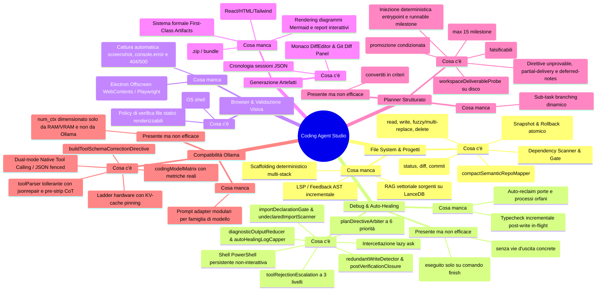
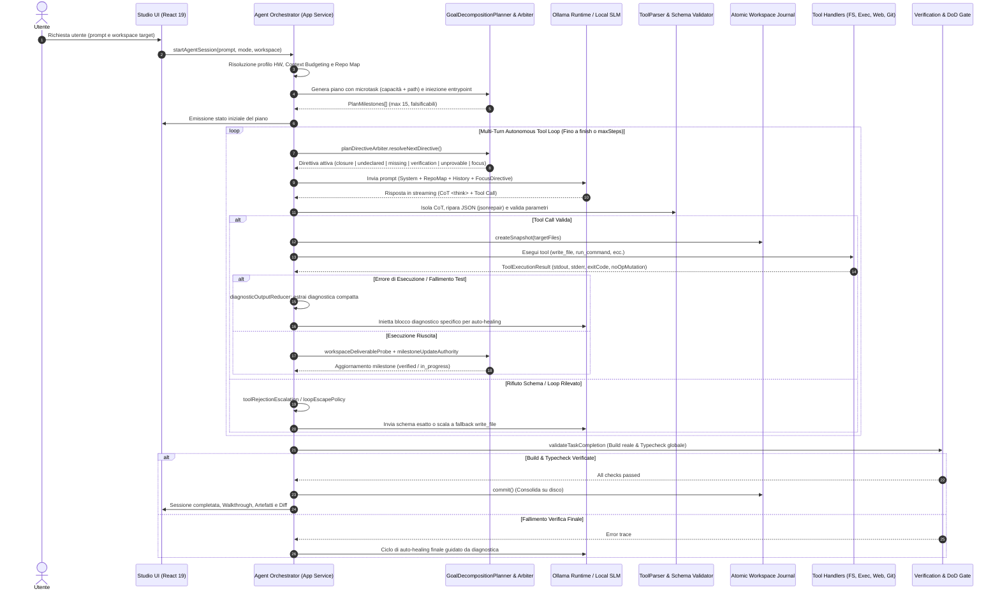

# Architettura & Blueprint Evolutivo: Coding Agent Studio — OnlyRag V2

Documento architetturale e operativo di riferimento per il sottosistema Coding Agent Studio. Descrive lo stato dei componenti, le policy anti-hardcoding, il flusso end-to-end, i meccanismi di auto-healing e le evidenze empiriche misurate con modelli locali Ollama.

> Per riprendere lo sviluppo da una nuova sessione, consultare [§6. Guida Operativa & Principi](#6-guida-operativa--principi). Il debito tecnico aperto è tracciato in `PROJECT_STATUS.json`.

---

## 1. Analisi di Sistema



### 1.1. File System & Progetto
* **Presente**: Toolchain atomica I/O ([`atomicWorkspaceJournal.ts`](../electron/core/infrastructure/filesystem/atomicWorkspaceJournal.ts) con `rollbackAll()`, fuzzy patch via `fast-levenshtein`, multi-replace, tree walk); [`compactSemanticRepoMapper.ts`](../electron/core/domain/agent/compactSemanticRepoMapper.ts); [`dependencyScanner.ts`](../electron/core/infrastructure/filesystem/dependencyScanner.ts) e [`dependencyIntegrityGate.ts`](../electron/core/domain/agent/dependencyIntegrityGate.ts); integrazione Git nativa.
* **Manca**: RAG vettoriale del codice su LanceDB (chunking per classe/funzione); scaffolding deterministico multi-stack non interattivo; refactoring programmatico AST (`ts-morph` / `@babel/parser`).

### 1.2. Debug & Auto-Healing
* **Presente**: PowerShell persistente supervisionata (`CI=true`, blocco comandi distruttivi in [`commandSecurity.ts`](../electron/core/domain/agent/commandSecurity.ts)); [`diagnosticOutputReducer.ts`](../electron/core/domain/agent/diagnosticOutputReducer.ts) e [`autoHealingLogCapper.ts`](../electron/core/domain/agent/autoHealingLogCapper.ts); [`agentOrchestratorAskAutoHealing.ts`](../electron/core/application/agentOrchestratorAskAutoHealing.ts) anti-stallo; [`loopDetector.ts`](../electron/core/domain/agent/loopDetector.ts) e [`loopEscapePolicy.ts`](../electron/core/domain/agent/loopEscapePolicy.ts).
* **Presente ma non efficace**: Il **Definition of Done Gate** ([`verificationGatePolicy.ts`](../electron/core/domain/agent/verificationGatePolicy.ts)) interviene solo alla chiamata di `finish`: se la sessione non raggiunge il finish, il gate non gira; il loop detector tradizionale impone divieti senza offrire un'azione risolutiva.
* **Manca**: Feedback LSP/typecheck istantaneo post-`write_file`; auto-reclaim dei processi orfani sulle porte di sviluppo.

### 1.3. Browser & Validazione Visiva
* **Presente**: `open_in_browser` su shell OS; [`browserPreviewVerification.ts`](../electron/core/domain/agent/browserPreviewVerification.ts) limitato a file statici (`.html`, `.svg`, `.pdf`).
* **Manca (gap critico)**: Headless runner (Electron Offscreen `WebContents` o `playwright-core`) per screenshot automatici, intercettazione `console.error` e log HTTP 404/500, fruibili anche da modelli Vision (`llama3.2-vision`, `qwen2.5-vl`).

### 1.4. Artefatti
* **Presente**: Monaco DiffEditor, Git Diff Panel, log JSON in `.onlyrag/sessions/session_history.json`.
* **Manca (gap critico)**: Modello formale First-Class Artifacts (UI Component, webapp interattiva, diagrammi Mermaid, walkthrough) con pannello Live Preview sandboxato ed export 1-click in archivio `.zip`.

### 1.5. Planner Strutturato
* **Presente**: [`planAndSolveGraph.ts`](../electron/core/domain/agent/planAndSolveGraph.ts) con normalizzazione falsificabilità; [`planMilestoneCapper.ts`](../electron/core/domain/agent/planMilestoneCapper.ts) (max 15); [`workspaceDeliverableProbe.ts`](../electron/core/infrastructure/filesystem/workspaceDeliverableProbe.ts) anti-placeholder; filtri di sicurezza comando in [`verificationCommandSafety.ts`](../electron/core/domain/agent/verificationCommandSafety.ts) (6 famiglie di rifiuto); [`milestoneUpdateAuthority.ts`](../electron/core/domain/agent/milestoneUpdateAuthority.ts) che subordina la promozione alla presenza effettiva dei deliverable.
* **Presente ma non efficace**: Le milestone che nominano cartelle nude (`src/services/`) non sono dimostrabili direttamente come deliverable e vengono normalizzate in criteri di milestone reali.
* **Manca**: Sub-task branching dinamico su errori complessi.

### 1.6. Compatibilità Universale Ollama
* **Presente**: [`toolParser.ts`](../electron/core/domain/agent/toolParser.ts) con pre-stripping CoT (`<think>`) e riparazione via `jsonrepair`; dual-mode Native Tool Calling (`POST /api/chat`) e JSON fenced; hardware ladder con pinning KV-cache; [`ollamaToolSchemaCatalog.ts`](../electron/core/domain/agent/ollamaToolSchemaCatalog.ts) per contratti schema e direttive di correzione; [`codingModelMatrix.ts`](../src/services/codingModelMatrix.ts).
* **Presente ma non efficace**: `resolveMaxContextTokens` dimensiona `num_ctx` in base all'hardware e non consulta `context_length` restituito da Ollama, con rischio di troncamento silencioso del prompt.
* **Manca**: Prompt adapter specifici per famiglia (Qwen, Llama, DeepSeek, Mistral).

---

## 2. Direttiva Anti-Hardcoding: Librerie Universali

| Ambito | Libreria / Modulo | Stato | Funzione & Motivazione |
| :--- | :--- | :--- | :--- |
| **Parsing & Riparazione JSON** | `jsonrepair` | ✅ in uso | Ripara payload JSON corrotti o troncati generati da SLM locali. |
| **Validazione Schemi Runtime** | `ollamaToolSchemaCatalog.ts` | ✅ in uso | Fonte unica di verità per Native Tool Calling e direttive di correzione. |
| **Fuzzy Matching & Diffing** | `fast-levenshtein` + `diff` | ✅ in uso | Patching deterministico tollerante e calcolo diff. |
| **Validazione AST** | `typescript` | ✅ in uso (build/pre-commit) | Compiler API per validazione sintattica pre-commit e typecheck. |
| **Web Scraping & Markdown** | `cheerio` + `turndown` | ✅ in uso | Parsing DOM sicuro e conversione HTML→Markdown per tool web. |
| **Esecuzione Shell** | `node:child_process` | ✅ in uso | Sessione PowerShell persistente non-interattiva (`persistentPowerShellSession.ts`). |
| **Rendering Diff Visivi** | `diff2html` | ⬜ da adottare | Rendering visuale diff in sostituzione o affiancamento a Monaco. |
| **Parsing AST non-TS** | `@babel/parser` | ⬜ da adottare | Supporto per file JSX/JS/Vue/Svelte non tipizzati. |
| **File Globbing** | `fast-glob` + `pathe` | ⬜ da adottare | Scansione FS universale multipiattaforma. |
| **Validazione Visiva Headless** | Electron Offscreen `WebContents` | ⬜ da adottare | Validazione visiva e cattura errori DOM/console senza dipendenze esterne. |
| **Browser Headless alternativo** | `playwright-core` | ⬜ da adottare | Alternativa ad Offscreen WebContents (selezionare una sola soluzione). |
| **Process Runner ergonomico** | `execa` | ⬜ da adottare | Alternativa per comandi one-shot con timeout/cancellazione integrati. |

---

## 3. Flusso End-to-End



---

## 4. Architettura dei Tool Refattorizzata (SRP)

Scomposizione prevista del servizio monolitico [`agentToolExecutorService.ts`](../electron/core/application/agentToolExecutorService.ts) sotto `electron/core/domain/agent/tools/`:

```
tools/
├── fs/          readFileTool · writeFileTool (pre-validazione AST) · fuzzyPatchTool
│                fileExplorerTools (list_dir, list_files_recursive, glob) · codeSymbolExtractorTool
├── execution/   runCommandTool (PowerShell non-interattiva, timeout, CI) · runTestsTool (vitest/jest/pytest)
│                devToolchainTools (inspect_os_env, ensure_tool)
├── browser/     visualValidationTool (Offscreen/Playwright screenshot & DOM) · consoleLogsExtractorTool
├── artifacts/   artifactCreationTool (React, HTML, MD, SVG) · artifactExportTool (zip bundle, preview)
├── web/         webSearchTool (SSRF-safe) · fetchWebContentTool (cheerio + turndown)
├── git/         gitStatusTool · gitCommitDiffTools
└── diagnostics/ askClarificationTool · finishTaskTool (DoD Gate trigger)
```

---

## 5. Meccanismi Implementati, Validazione e Risultati Empirici

Tutte le ottimizzazioni sono state guidate da metriche e sonde reali (`scripts/live/fullTaskRun.live.ts`, `qwen2.5-coder:7b`).

### 5.1. Cicli di Feedback e Sicurezza Esecuzione
* **Composizione Output Diagnostico**: `DiagnosticOutputReducer.composeCommandOutput` unifica `stdout` e `stderr` senza scartare lo stderr in presenza di banner stdout (es. banner iniziale di `npm`).
* **Verifica Dipendenze su Disco**: `missingFromNodeModules` verifica l'effettiva presenza in `node_modules` oltre a `package.json`, evitando falsi positivi nei workspace generati.
* **Sicurezza Comandi di Verifica**: [`verificationCommandSafety.ts`](../electron/core/domain/agent/verificationCommandSafety.ts) rifiuta comandi *existence-only* (`cat`, `Test-Path`, `ls`) e *gui-mode* (`cypress open`, `--ui`), ammettendo solo test falsificabili.
* **Scope Reale Anti-Loop**: Le direttive anti-loop dichiarano la finestra reale di blocco (5 passi) e indicano la via d'uscita corretta (analizzare l'errore, modificare il codice, rieseguire).

### 5.2. Controlli Anticipati e Integrità
* **Intercettazione Import Non Dichiarati**: [`importDeclarationGate.ts`](../electron/core/domain/agent/importDeclarationGate.ts) valida i pacchetti importati contro `package.json` e `tsconfig.paths` al momento di `write_file`, restituendo l'elenco dei non dichiarati senza annullare la scrittura.
* **Autorità Aggiornamento Milestone**: [`milestoneUpdateAuthority.ts`](../electron/core/domain/agent/milestoneUpdateAuthority.ts) blocca la promozione a `verified` finché i deliverable del titolo non sono presenti e non vuoti su disco.
* **Prevenzione Directory come File**: `write_file` con trailing slash delega a `create_directory`.
* **Deduplicazione Fallimenti**: Collasso dei log falliti per coppia `tool + target` sull'intero buffer per evitare la saturazione della finestra contestuale.

### 5.3. Risoluzione Deterministica Conflitti Dipendenze
* **Risoluzione Automatica `npm ERESOLVE`**: [`npmResolutionConflict.ts`](../electron/core/domain/agent/npmResolutionConflict.ts) estrae le versioni in conflitto dal log npm e genera il comando esatto con range copiato **verbatim** (es. `npm install vite@^8.0.0`), senza delegare la scelta o usare `--force`.
* **Validazione Nome vs Versione**: Il guard riconosce comandi con versione esplicita (`pkg@version`) evitando blocchi errati di "già installato".
* **Validazione Nomi Tool**: `normalizeToolName` valida i comandi contro [`ollamaToolSchemaCatalog.ts`](../electron/core/domain/agent/ollamaToolSchemaCatalog.ts) rifiutando nomi allucinati (es. `npm_install`).

### 5.4. Riduzione Churn e Criteri di Chiusura
* **Rilevamento Scritture a Vuoto (No-Op)**: [`redundantWriteDetector.ts`](../electron/core/domain/agent/redundantWriteDetector.ts) normalizza CRLF/LF e newline finale. Se il contenuto è identico, non tocca il file e imposta `noOpMutation: true`, preservando `flags.hasVerifiedBuild`.
* **Stato di Chiusura Dichiarabile**: [`postVerificationClosure.ts`](../electron/core/domain/agent/postVerificationClosure.ts) rileva quando la build è verificata e le sole milestone aperte sono non falsificabili (`not_applicable`), ordinando la chiusura della sessione.
* **Direttiva Milestone Indimostrabili**: [`unprovableMilestoneDirective.ts`](../electron/core/domain/agent/unprovableMilestoneDirective.ts) guida il modello a chiudere via `update_plan` compiti che non producono file o comandi (es. requisiti di accessibilità o stile diffuso).
* **Direttiva Consegna Parziale**: [`milestoneVerificationPromotion.ts`](../electron/core/domain/agent/milestoneVerificationPromotion.ts) nomina i file ancora mancanti di una milestone composita, vietando la riscrittura del file già accettato (risolto in 1 passo vs 9 passi precedenti).
* **Compattazione Output Recenti**: [`recentFullLogs`](../electron/core/domain/agent/diagnosticOutputReducer.ts) collassa i fallimenti ripetuti per `tool + target`, liberando oltre il 46% di spazio utile nel prompt.

### 5.5. Matrice Modelli e Context Budgeting Ollama
* **Metriche Reali Modelli**: [`getModelMetrics`](../electron/core/infrastructure/http/ollamaHttpClient.ts) legge `context_length`, `parameter_size` e quantizzazione reale da `/api/tags`.
* **Matrice Modelli Verificati**: [`codingModelMatrix.ts`](../src/services/codingModelMatrix.ts) badge `verified` assegnato esclusivamente a modelli testati end-to-end su sonde live (`qwen2.5-coder:7b`).
* **Truncamento Ollama Silenzioso**: Ollama tronca `num_ctx` al massimo dichiarato dal modello scartando la **testa** del prompt (system prompt e blocco piano). Il calcolo del budget in `deriveMaxContextChars` deve basarsi sul contesto effettivamente allocato (da `/api/ps`).

### 5.6. Arbitro delle Direttive e Risoluzione Deadlock
[`planDirectiveArbiter.ts`](../electron/core/domain/agent/planDirectiveArbiter.ts) stabilisce la singola direttiva attiva per turno secondo una priorità deterministica:

| Priorità | Stato | Condizione di Attivazione | Azione Prescritta |
| :---: | :--- | :--- | :--- |
| **1** | `session_closure` | Build verificata e zero scritture successive | Chiudere la sessione con `finish` |
| **2** | `dependencies_undeclared` | Il codice importa package non dichiarati nel manifest | `npm install <pkg>` (via `undeclaredImportScanner.ts`) |
| **3** | `dependencies_missing` | Manifest dichiara package assenti da `node_modules` | `npm install` |
| **4** | `verification_due` | Nessuna milestone unsatisfied e verifica non ancora eseguita | Eseguire il comando di verifica primaria del progetto |
| **5** | `unprovable_milestone` | Milestone attiva priva di deliverable su disco | `update_plan` con ID milestone |
| **6** | `focus` | Avanzamento ordinario | Microtask della milestone attiva |

* **Impatto misurato**: Risolto il deadlock storico (da 0 comandi eseguiti in 50 passi a **13 comandi**, con `npm install` al passo 2 e `npm run build` al passo 28).
* **Protezione Escape Milestone Consegnate**: `isActiveMilestoneDelivered` impedisce a `loopEscapePolicy` di marcare fallita una milestone i cui file sono già presenti su disco.

### 5.6b – 5.6c. Risoluzione Deliverable e Gestione Riconsegne
* **Risoluzione Basename nel Workspace**: [`workspaceDeliverableProbe.ts`](../electron/core/infrastructure/filesystem/workspaceDeliverableProbe.ts) risolve i file con nome nudo (es. `globals.css`) cercando nell'albero del workspace (es. `src/styles/globals.css`), eliminando i loop di riscrittura (da 6 riscritture a 1).
* **Direttiva Riconsegna**: [`redeliveredMilestoneDirective`](../electron/core/domain/agent/milestoneVerificationPromotion.ts) avverte quando un file appartiene a una milestone già completata, indicando il deliverable atteso.

### 5.6d. Escalation Rifiuti di Schema Tool
* **Escalation a 3 Livelli**: [`toolRejectionEscalation.ts`](../electron/core/domain/agent/toolRejectionEscalation.ts) invia il contratto schema nei primi 2 rifiuti (es. `replace_file_content` malformato), scala a `write_file` integrale al 3° tentativo e interrompe a `REJECTION_ABORT_STREAK` evitando loop infiniti.

### 5.6e – 5.6f. Whole-Project Verification & Integrità Entrypoint
* **Typecheck Globale Sintetizzato**: In assenza di script dedicato, [`resolvePrimaryVerificationCommand`](../electron/core/domain/agent/projectVerificationResolver.ts) sintetizza `npx tsc --noEmit`, intercettando errori in tutti i file e non solo nell'albero importato.
* **Direttiva Diagnostica Compilatore**: [`compilerDiagnosticDirective.ts`](../electron/core/domain/agent/compilerDiagnosticDirective.ts) estrae file, riga e codice errore, prescrivendo un **singolo imperativo** di correzione (`write_file`), con rinvio esplicito degli errori secondari tramite [`buildDeferredDiagnosticNote`](../electron/core/domain/agent/compilerDiagnosticDirective.ts).
* **Controllo Entrypoint HTML/JS**: [`entrypointIntegrity.ts`](../electron/core/domain/agent/entrypointIntegrity.ts) rileva file `index.html` privi di script verso `src/main.tsx` o root component, iniettando il tag esatto (compilazione passata da 2 moduli a 43 moduli / 180 kB).

### 5.6g – 5.6h. Generazione Piano & Iniezione Strutturale
* **Formato Microtask (Capacità + Path)**: [`planGenerationAppService.ts`](../electron/core/application/planGenerationAppService.ts) genera milestone nella forma: `- [ ] m-N: <Funzionalità/Capacità> — <path/del/file.ext>`.
* **Iniezione Deterministica Entrypoint**: [`ensureEntrypointMilestones`](../electron/core/domain/agent/planCompilation.ts) antepone nello scheletro `package.json`, `index.html`, `tsconfig.json` e `src/main.tsx` se non presenti.
* **Iniezione Milestone di Verifica**: [`ensureRunnableMilestone`](../electron/core/domain/agent/planCompilation.ts) appende la milestone di verifica end-to-end con il comando reale del progetto.
* **Risultato Misurato (Run 9)**: **12/13 milestone verificate (92%)**, `finish` raggiunto autonomamente, `npm run build` con exit code 0 e 43 moduli compilati.

### 5.6i. Registro npm vs Limiti di Training
* **Consultazione Registro npm**: [`npmRegistryClient.ts`](../electron/core/infrastructure/http/npmRegistryClient.ts) valida l'esistenza dei pacchetti e recupera la versione stabile reale prima dell'installazione.
* **Normalizzazione Versioni & `ETARGET`**: [`dependencyVersionReality.ts`](../electron/core/domain/agent/dependencyVersionReality.ts) e [`npmVersionNotFound.ts`](../electron/core/domain/agent/npmVersionNotFound.ts) correggono pacchetti inesistenti (es. `@tailwindcss/react`) e versioni allucinate.
* **Preservazione Configurazioni Major**: Esclusione automatica di major breaking (`typescript`, `tailwindcss`, `eslint`) che richiederebbero modifiche di configurazione estranee al training del modello.
* **Bottleneck Attuale**: Coerenza tra export default ed export nominati generati dal modello (`TS2613`/`TS2614`).

### 5.7. Roadmap Funzionalità Future
1. **Modulo Validazione Visiva**: `visualValidationTool.ts` su Electron Offscreen `WebContents` con cattura screenshot, DOM e `console.error`.
2. **First-Class Artifacts Engine**: Canali IPC `artifacts:*`, repository artefatti e Live Preview sandboxata.
3. **Refactoring Modulare Tool**: Scomposizione di `agentToolExecutorService.ts` secondo la struttura SRP (§4).

---

## 6. Guida Operativa & Principi

### 6.1. Tabella di Sintesi Componenti & Stato

| Modulo / Area | Responsabilità | Stato |
| :--- | :--- | :---: |
| [`planDirectiveArbiter.ts`](../electron/core/domain/agent/planDirectiveArbiter.ts) | Selezione della singola direttiva prioritaria di turno | ✅ Verificato Live |
| [`npmResolutionConflict.ts`](../electron/core/domain/agent/npmResolutionConflict.ts) | Risoluzione deterministica conflitti `ERESOLVE` npm | ✅ Verificato Live |
| [`redundantWriteDetector.ts`](../electron/core/domain/agent/redundantWriteDetector.ts) | Riconoscimento no-op writes e preservazione build verde | ✅ Verificato Live |
| [`postVerificationClosure.ts`](../electron/core/domain/agent/postVerificationClosure.ts) | Sblocco chiusura sessione su milestone residue non dimostrabili | ✅ Verificato Live |
| [`importDeclarationGate.ts`](../electron/core/domain/agent/importDeclarationGate.ts) / [`undeclaredImportScanner.ts`](../electron/core/infrastructure/filesystem/undeclaredImportScanner.ts) | Intercettazione e installazione automatica import mancanti | ✅ Verificato Live |
| [`workspaceDeliverableProbe.ts`](../electron/core/infrastructure/filesystem/workspaceDeliverableProbe.ts) | Risoluzione deliverable con fallback basename su workspace | ✅ Verificato Live |
| [`entrypointIntegrity.ts`](../electron/core/domain/agent/entrypointIntegrity.ts) / [`planCompilation.ts`](../electron/core/domain/agent/planCompilation.ts) | Iniezione deterministica entrypoint web e runnable milestone | ✅ Verificato Live |
| [`compilerDiagnosticDirective.ts`](../electron/core/domain/agent/compilerDiagnosticDirective.ts) | Estrazione diagnostiche compilatore e direttiva file+riga singola | ✅ Verificato Live |
| [`npmRegistryClient.ts`](../electron/core/infrastructure/http/npmRegistryClient.ts) / [`dependencyVersionReality.ts`](../electron/core/domain/agent/dependencyVersionReality.ts) | Validazione real-time esistenza pacchetti e versioni su registro npm | ✅ Verificato Live |
| `visualValidationTool` & `artifactsEngine` | Validazione visiva headless e motore anteprime artefatti | ⬜ Roadmap (§5.7) |

### 6.2. I Tre Principi Architetturali Fondamentali

1. **Struttura prima di Direttive**: Quando il sistema conosce un dato oggettivo che il modello non può dedurre (workspace vuoto, pacchetto inesistente, entrypoint mancante, versione npm), il sistema lo inietta deterministicamente o lo fornisce come dato. Non forzare il modello con direttive su concetti estranei al suo training.
2. **Singola Istruzione Imperativa per Turno**: Un messaggio non deve mai contenere due imperativi concorrenti (es. "modifica il file E riesegui la build"). Il modello sceglie l'azione più economica o quella del canale più frequente. In caso di conflitti, **sostituire la direttiva, mai accodarla**.
3. **Falsificabilità e Verità dei Controlli**: Una milestone è `verified` solo se supportata da deliverable reali su disco e comandi con exit code 0. I controlli non devono mai assumere conformità senza prove effettive.

### 6.3. Comandi di Verifica & Testing

Esecuzione obbligatoria sequenziale prima di ogni rilascio:

```powershell
# 1. Catena di verifica statica e test unitari
npm run lint

# 2. Esecuzione sonda live end-to-end (richiede Ollama locale attivo)
npm run test:live
```

### 6.4. Gestione Audit Log e Rotazione

* **Append Mode**: `logs/coding_agent_audit.log` viene aggiornato in modalità append. Prima di avviare una sonda live, registrare l'offset iniziale per isolare il run.
* **Rotazione a 10 MB**: Al raggiungimento di 10 MB il log ruota in `coding_agent_audit.1.log`. L'estrazione deve considerare entrambi i file.
* **Preservazione Pulizia**: La directory `logs/` è ignorata da Git e rimossa dagli script `clean_workspace.ps1`. Salvare gli snapshot dei log rilevanti prima di eseguire pulizie complete.
